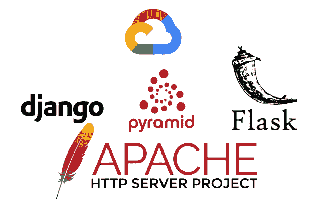

# 使用 Apache2 + mod_wsgi 在 Google 云计算引擎实例上部署 pyramid、flask 或 django 应用程序

> 原文：<https://medium.com/analytics-vidhya/deploy-pyramid-flask-or-django-application-on-google-cloud-compute-engine-instance-using-apache2-a7c6e277670e?source=collection_archive---------17----------------------->



在本教程中，我们将学习如何使用 Apache2 和 mod_wsgi 在 Google 云计算引擎实例上部署 WSGI 应用程序。

WSGI 代表 web 服务器网关接口，它是 web 服务器和 web 应用程序或框架之间的一个与实现无关的接口，以促进可移植 Web 应用程序开发的共同点。

这一类别中值得注意的 python web 框架是 Flask、Django 和 Pyramid。

在本教程中，我们将使用 pyramid 作为示例应用程序，但是我们将介绍如何从这三个框架部署应用程序。

要开始，注册谷歌云服务。如果这是你的第一次，谷歌会给你 300 美元的免费积分在这个平台上使用。

**注意，在本教程中，我们不打算使用 docker 或 bash 启动脚本。我们将手动完成所有工作。**

# 设置计算引擎实例

在谷歌云和[创建项目](https://cloud.google.com/apis/docs/getting-started#creating_a_google_project)后，导航到 API 服务和[启用计算引擎 API](https://console.cloud.google.com/apis/library/compute.googleapis.com) 。返回计算引擎，按照这些步骤创建一个实例。

在实例创建表单上，在**引导盘**部分，点击更改并选择 **ubuntu** 作为操作系统，然后选择 **ubuntu 18.04 LTS** 作为版本。

如果您的网站是一个小型网站，您可能希望为**机器类型**选择 **g1-small** 。使用 g1-small 将为您节省一些钱。

还要确保勾选允许 HTTP & HTTPS 流量。

以上是本教程中使用的实例的配置。你可以改变它，重要的是了解整个事情是如何运作的。

# **为部署准备已创建的映像实例**

在创建的实例上，单击 SSH 以连接到该实例。一旦您的控制台准备就绪，我们就必须安装并准备部署环境。

首先，我们将创建一个新用户来运行我们的应用程序。与我们登录时使用的用户(我们的电子邮件)不同的用户。这是一个很好的安全措施。

使用以下命令切换到 root

```
sudo -i
```

在根目录下，使用此命令创建一个新用户。

```
adduser pythonapp
```

回答下面的问题，您的新用户就创建好了，在本例中， *pythonapp* 是新用户。我们的新用户需要是一个*苏多尔*。使用此命令将用户添加到 *sudo* 组，并更改为用户

```
usermod -aG sudo pythonappsu - pythonapp
```

现在我们准备开始安装。

```
sudo apt update && sudo apt upgradesudo apt install apache2 sudo apt install apache2-dev python3-dev python3-pip python3-venv
```

完成上述安装后，我们需要安装 mod_wsgi。我们将手动安装，而不是从 *apt* 包管理器安装。这是为了将其配置为与 python 3 一起工作。你可以在库[这里](https://github.com/GrahamDumpleton/mod_wsgi/releases)获得 mod_wsgi 最新发布版本的链接。对于本教程，我们正在安装版本 4.7.1。输入以下命令

```
wget [https://github.com/GrahamDumpleton/mod_wsgi/archive/4.7.1.tar.gz](https://github.com/GrahamDumpleton/mod_wsgi/archive/4.7.1.tar.gz)
```

然后

```
tar xvfz 4.7.1.tar.gzcd mod_wsgi-4.7.1sudo ./configure --with-python=/usr/bin/python3sudo makesudo make install
```

我们需要将 *mod_wsgi.so* 模块加载到 Apache 中。在我们这里的例子中， *make* 将这个模块复制到*/usr/lib/Apache 2/modules/*。您可能需要检查它在您的案例中是从哪里复制的。你可能应该先检查一下*/usr/lib/Apache 2/modules/*。

使用 vim 或 nano 打开/etc/Apache 2/*Apache 2 . conf*，并在 *Include ports.conf* 后添加以下几行

```
# Load mod_wsgi
LoadModule wsgi_module /usr/lib/apache2/modules/mod_wsgi.so
```

重启 Apache

```
sudo apachectl restart
```

如果一切正常，您应该会看到表单中的一行

```
Apache/2.4.29 (Ubuntu) mod_wsgi/4.7.1 Python/3.6 configured -- resuming normal operations
```

在位于 */var/log/apache/error.log 的 Apache 错误日志中。用命令打开它*

```
sudo nano /var/log/apache/error.log# If all is Ok, clean the build with this command:
sudo make clean
```

转到您的计算引擎实例，复制外部 IP。现在访问[*http://YOUR _ IP*](http://YOUR_IP)*查看默认的 ubuntu 网站。如果看不到，首先确定一下，你是在 *http* 而不是 *https 上访问的。*如果还是看不出来，不妨从头再来一遍教程。删除该实例并重新开始。*

## *上传您的应用程序并创建一个虚拟环境*

*我们将在[*https://github.com/ephraimbuddy/wsgi-tutorial*](https://github.com/ephraimbuddy/wsgi-tutorial)*使用金字塔应用。然而，你可以使用 django 或 flask 应用程序。**

*让我们将我们的应用程序上传到服务器中的 *pythonapp* 主文件夹。记得登录到我们之前创建的 pythonapp 用户。*

```
*git clone [https://github.com/ephraimbuddy/wsgi-tutorial.git](https://github.com/ephraimbuddy/pythonappp.git)cd wsgi-tutorial#Now create a virtual environment here:
python3 -m venv env#Activate it:
source env/bin/activate# Install your application:
pip install -e .# for django, install from your requirement file
pip install -r requirements.txt*
```

# *创造。MOD_wsgi 和 APACHE 的 WSGI 模块，用于加载应用程序*

*Django 已经有了 wsgi.py 文件。但是，如果您在服务器上托管多个应用程序，您需要更改此行*

```
*os.environ.setdefault('DJANGO_SETTINGS_MODULE', 'wsgi-tutorial.settings')*
```

*到*

```
*os.environ['DJANGO_SETTINGS_MODULE']= 'wsgi-tutorial.settings'*
```

*金字塔应用用途*。ini* 设置，因此，我们将创建一个名为 *wsgi-tutorial.wsgi* 的模块，并将其放在/var/www/wsgi-scripts/。*

```
*# change working directory to /var/www
cd /var/www# create wsgi-scripts directory
sudo mkdir wsgi-scripts# create the module:
sudo vim wsgi-scripts/wsgi-tutorial.wsgi*
```

*上面的最后一个命令应该会打开 *wsgi-tutorial.wsgi。*打开时，按键盘键 *i* 进入插入模式。将以下内容粘贴到打开的文件中*

```
*from pyramid.paster import get_app, setup_logging
ini_path = '/home/pythonapp/wsgi-tutorial/production.ini'
setup_logging(ini_path)
application = get_app(ini_path, 'main')*
```

*按下 *esc* 键，然后按下命令，关闭文件*

```
*:wq*
```

*烧瓶很简单。Mod_wsgi 需要将*应用*实例命名为*应用*而不仅仅是 *app。*然而，如果您使用一个名为 *create_app* 的工厂函数创建了您的应用程序，那么您应该创建一个*。wsgi* 文件，就像我们为 pyramid 做的那样，但是这次，内容应该是*

```
*from yourapplication import create_app
application = create_app()*
```

# *创建 APACHE 配置文件来服务您的应用程序*

*导航到站点-可用目录*

```
*cd /etc/apache2/sites-available*
```

*创建一个名为 *wsgi-tutorial.conf* 的配置文件*

```
*sudo vim wsgi-tutorial.conf*
```

*将以下内容粘贴到打开的文件**(金字塔)***

```
*<VirtualHost *:80>
    ServerName example.com
    ServerAlias [www.example.com](http://www.example.com)
    ServerAdmin webmaster@example.com

    DocumentRoot /var/www/wsgi-tutorial/

    Alias /static/ /var/www/wsgi-tutorial/static/

    <Directory /var/www/wsgi-tutorial>
    Require all granted
    </Directory> WSGIDaemonProcess example.com display-name=%{GROUP} python-path=/home/pythonapp/wsgi-tutorial/env/lib/python3.6/site-packages WSGIProcessGroup %{GLOBAL}
    WSGIPassAuthorization On WSGIScriptAlias / /var/www/wsgi-scripts/wsgi-tutorial.wsgi <Directory /var/www/wsgi-scripts>
    WSGIProcessGroup example.com
    </Directory></VirtualHost>*
```

*照常保存并关闭它。如果你看，我们将 *DocumentRoot* 设置为 *wsgi-tutorial* 还不存在。让我们创建它*

```
*sudo mkdir /var/www/wsgi-tutorial*
```

*类似的配置应该可以用于 flask app。建议不要将您的主目录设置为 DocumentRoot。*

*对于 Django，WSGIScriptAlias 应该指向项目的 wsgi.py 文件。WSGIScriptAlias 之后的目录应该从 */var/www/wsgi-scripts* 更改为*/home/python app/project _ name/project _ name/*。它应该指向 wsgi.py 文件所在的模块*

*完成后，检查您的配置中是否有错误，如果有，就修复它*

```
*sudo apachectl configtest*
```

*如果没有错误，停用默认的 apache 站点并激活您的站点*

```
*# to deactivate enter command below
sudo a2dissite 000-default.conf#Activate your site 
sudo a2ensite wsgi-tutorial.conf*
```

# *提供静态文件*

*静态文件设置应该是从 DocumentRoot 到静态文件位置的符号链接。在我们的例子中，静态文件目录位于*/home/python app/wsgi-tutorial/wsgi _ tutorial/static。*创建符号链接，如下所示*

```
*#navigate to DocumentRoot
cd /var/www/wsgi-tutorial# Add the symlink
sudo ln -s /home/pythonapp/wsgi-tutorial/wsgi_tutorial/static static*
```

## *文件权限*

*建议使用以下文件权限*

```
*# Give Apache group ownership and pythonapp user ownership
sudo chown -R pythonapp:www-data /home/pythonapp/wsgi-tutorial# Change permission to 750
sudo chmod 750 -R /home/pythonapp/wsgi-tutorial# Cascade the permissions for new files
sudo chmod g+s -R /home/pythonapp/wsgi-tutorial# if you have an upload field give www-data write permission
sudo chmod g+w -R /home/pythonapp/wsgi-tutorial/upload*
```

# *重新加载 Apache*

```
*sudo systemctl reload apache2# check status
sudo systemctl status apache2*
```

*转到计算引擎，并点击您的实例外部 IP，您的网站应该了。确保它是 *http* 而不是 *https**

***#结束。***