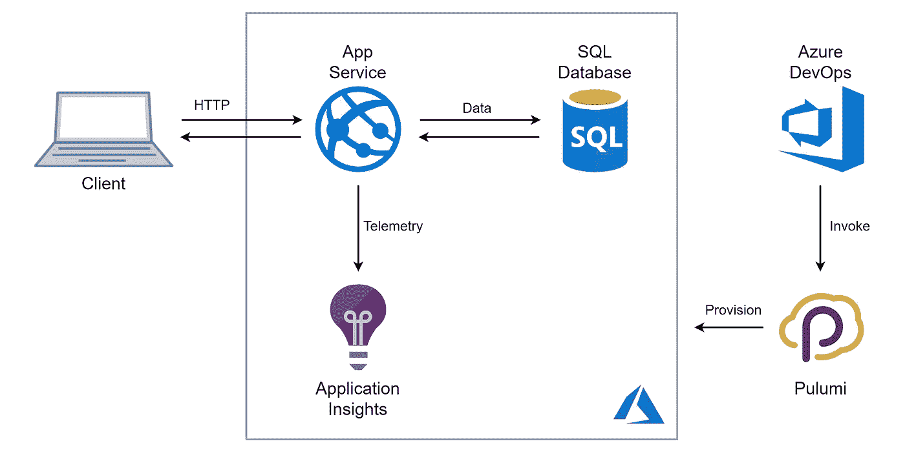
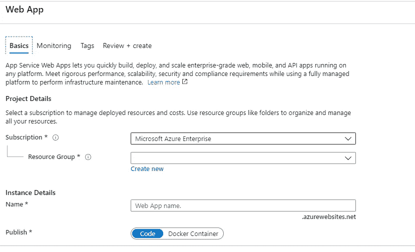
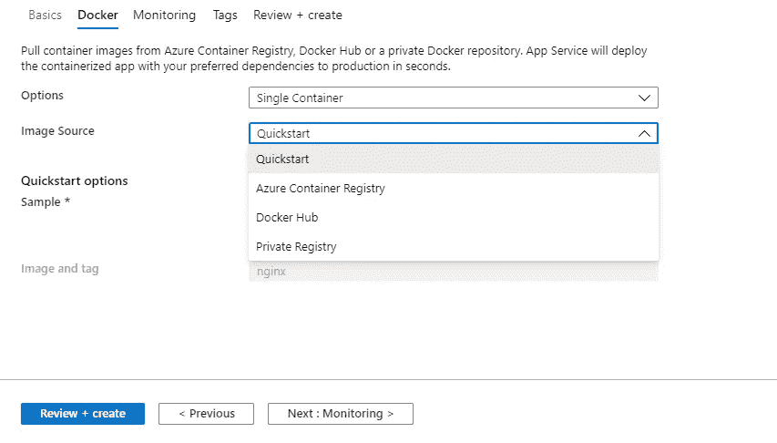
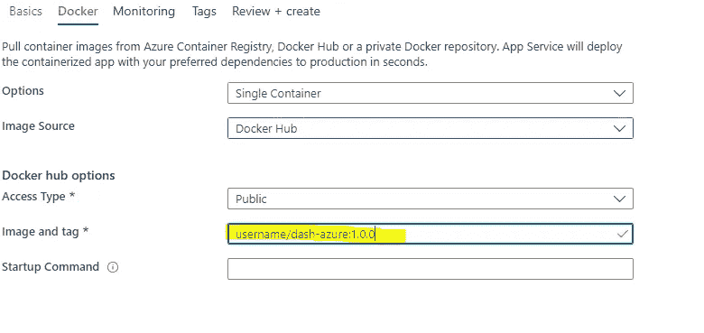

# 在 Azure Cloud Web App for Windows 上部署 Python Dash 应用程序

> 原文：<https://medium.com/analytics-vidhya/deploy-python-dash-application-on-azure-cloud-web-app-for-windows-a68f77cff8fc?source=collection_archive---------7----------------------->

我们将在 windows 和 docker 容器上的 Azure web 上部署本地托管的 python dash 应用程序。在这篇文章中，我使用了一个 dash 应用程序的例子，它很常见，可以从 dash 网站上获得，但是，它可以很容易地扩展到任何复杂的应用程序，并且很容易定制。

Azure 应用部署

## 目录:

1.  先决条件
2.  本地托管小型 python 应用程序
3.  在 docker 上创建本地虚拟环境的副本
4.  通过 docker 推送内容进行部署
5.  启用/启动 Azure webapp 以使用更新的 docker 内容

## 1.先决条件

在开始之前，我们必须考虑一些先决条件，以便成功地开发和部署解决方案，它们如下:
a. Docker 最新版本已安装
b . Git CMD
c . Python 3.8+
d . Azure 订阅

## 2.本地托管小型 python 应用程序

因为我们需要在 azure 上部署之前在本地准备我们的 python 应用程序，所以我们将在 C 驱动器上的合适位置创建一个工作目录。现在，在这个特定位置，我们将安装虚拟环境并激活它供我们使用。请在下面找到为此要遵循的步骤(需要在设置工作目录后执行):

> --> pip 3 install-U pip virtualenv ***-->>***virtualenv—系统—站点—包—p python。/venv
> ->\ venv \ Scripts \ activate
> 
> 现在它应该为你启动虚拟环境。一旦 venv 启动，运行以下步骤设置文件夹:
> a . mkdir dash-azure&&CD。
> b .为我们的代码创建两个空白文件，application.py 和 docker file:
> touch application . py
> touch docker file

一旦这些文件启动，让我们运行一些安装，这些安装将成为我们对该应用程序的依赖，并成为需求文件的一部分:

> pip 安装仪表板—升级

由于这是一个小的应用程序，我们试图在这里建立，我们有很少的标准要求，所以我们将冻结所有这些要求

> pip 冻结> requirements.txt

在这一步中，我们将设置我们启动的应用程序代码，它应该如下所示:

> 导入 dash
> 将 dash_core_components 作为 dcc 导入
> 将 dash_html_components 作为 html 导入
> 
> app = dash。dash()application = app . server
> 
> app.layout = html。Div(children=[html。H1(children='Hello Dash ')，
> 
> html。Div(children='''这是运行在 Azure 应用服务上的 Dash''),
> 
> dcc。Graph(
> id='example-graph '，
> figure = {' Data ':[{ ' x ':[1，2，3]，' y': [4，1，2]，' type': 'bar '，' name': 'SF'}，{'x': [1，2，3]，' y': [2，4，5]，' type': 'bar '，' name': 'USA'}，【T4]，，【布局':{【T6]'

请注意，我们正在特定端口 3000 上启动应用程序，这是部署的最关键步骤，如果没有这一点，当我们在 Azure 中启动它时，由于端口 80 访问限制，一些用户可能会面临连接问题。但是，如果您没有任何限制，可以随意使用您喜欢的任何端口。

> 要检查 python 代码是否正常工作以及 dash 是否被正确托管，让我们运行一个查询并对其进行分析:
> python application.py这将为您提供一个访问正在运行的应用程序的 URL (http://127.0.0.1:3000 ),如果您能够访问本地托管的应用程序，则可以对其进行验证。

## 3.在 docker 上创建本地虚拟环境的副本

由于我们已经测试，应用程序正在本地运行，在这一步中，我们将在 docker 上创建图像，我希望 docker 已经启动并在后台运行。如果没有，docker 可以从[https://www.docker.com/products/docker-desktop](https://www.docker.com/products/docker-desktop)
安装注意:您需要在 docker 上创建一个帐户，所以在我们安装之前，让我们创建一个帐户并登录。

让我们首先更新我们之前创建的 docker 文件，并将这些代码粘贴如下:
Dockerfile

> 来自 python:3.8-slim
> 
> 曝光 3000
> 
> 运行 mkdir /app
> WORKDIR /app
> 添加需求. txt /app/
> 运行 pip install -r 需求. txt
> 添加。/app/
> 
> 入口点[" python "]
> CMD[" application . py "]

一旦文件被更新和保存，让我们运行以下步骤在 docker 上构建我们的代码映像。

> docker 建筑-t dash-azure。docker run-it-RM-p 3000 dash-azure
> 
> 你可以在 windows 上的 127.0.0.1:3000 和 mac 上的 0.0.0.0:3000 上检查这个应用程序

成功验证后，我们将用简单的 3 行代码将所有这些更改发布到 docker，并使我们的容器能够包含所有最新的代码和部署需求。

## 4.通过 docker 推送内容进行部署

让我们登录 docker 并按如下所述将更改推送到图像，请注意用户名是您在 docker 应用程序上创建 id 时获得的用户名:

> docker 登录
> 
> docker 标签 dash-azure (docker 用户名)/dash-azure:1.0.0
> 
> docker 推送用户名/dash-azure:1.0.0

一旦这些步骤成功完成，我们的应用程序就被正确地复制到 docker，并准备好通过任何支持 docker 映像的云门户进行部署。

## 5.启用/启动 Azure webapp 以使用更新的 docker 内容

由于我们一直在为 azure web app 工作，所以我们今天将重点关注 Azure cloud。让我们登录云并启动一个新的 web 应用程序服务，如下所示:

Webapp 创建页面

选择您选择的订阅和资源组，我们可以为我们的 web 应用程序命名任何我们喜欢的名称，但需要按照 Azure 是唯一的。

选择 Linux 作为操作系统，并进入下一页进行 docker 设置。从发布选项中，我们选择 Docker 容器并转到下一页:

Docker 配置

在该页面中，我们需要选择 Docker Hub 作为单个容器选项中的图像来源。

选择 Docker hub 后，我们需要放置我们的图像和标签名称，如本例所示。

现在，让我们点击创建应用程序，并等待此应用程序部署在 Azure 上。

一旦应用程序部署，可以尝试使用公共网址访问它。然而，一些用户可能会面临问题，应用程序可能无法按时启动，因为我们需要更新一些默认设置，以绕过一些网络挑战。

要做到这一点，如果你还记得，我们将端口 3000 设置为我们的应用程序和 docker 的一部分，这样当我们从 azure 启动时，我们可以在这个端口上访问相同的内容。因此，要实现这一点，我们需要在应用程序配置页面中添加一些设置，如下所述:
使用 EXPOSE 并在 docker 文件 post 连接到 python 时放置值 3000

> 使用值为 3000 的 WEBSITES_PORT 应用程序设置暴露于该端口
> 
> 使用 WEBSITES _ CONTAINER _ START _ TIME _ LIMIT 并将值增加到 400
> 
> 保存设置，重新将图像推送到 docker，重启应用程序，web 应用程序将恢复到本地运行时的状态。对于日志，请检查应用程序的容器日志。

一旦上述步骤完成，应用程序已重新启动，尝试启动应用程序再次与公共网址和万岁！！你的申请准备好了。

我希望这些信息是有用的！！您能够根据自己的需求部署应用程序。

如果有任何反馈或问题，请给我留言。

## 阿吉特·库马尔
数据科学家

[领英](https://www.linkedin.com/in/ajeet-kumar-53a97880)

此处表达的观点是我个人的，并不代表我的雇主或任何其他第三方的观点。