# 在 AWS 上使用 flask 部署 RESTful API

> 原文：<https://medium.com/analytics-vidhya/deploy-restful-api-with-flask-on-aws-12575c808b4?source=collection_archive---------5----------------------->

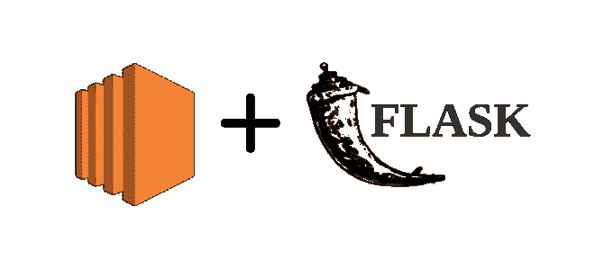

如果您看到了这篇文章，这可能意味着您可能已经有了一些实现 flask app 的想法，现在想要在 AWS 上部署它。本教程从一开始就给出了如何在 AWS EC2 上部署 flask 应用程序的分步指南。
[**可以在 Github**](https://github.com/meghamodi/CRUD_flask) **上获取完整代码。**

# API 简介

API 代表应用程序可编程接口。API 充当客户端和服务器之间的中间人。我将使用一个非常普通的类比来尝试解释它。

让我们创建一个我们正在参观的受欢迎的餐馆的场景。我们看菜单，当我们决定好食物时，我们叫服务员来点菜。然后服务员记下我们要求的所有项目，并将项目交给厨房准备。准备好食物后，厨房里的服务员会被叫来把食物拿下来给我们，然后端上来。

这里，我们是向服务员/API 下订单/请求商品/查询的顾客/客户。厨房/服务员通过 API/服务员响应顾客，准备菜肴并通过服务员/API 发送。

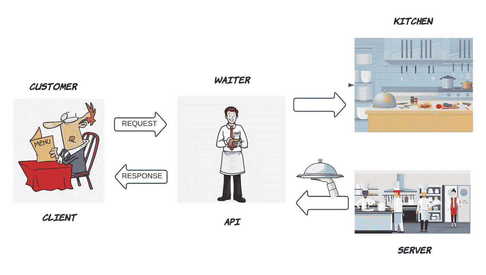

# RESTful API 简介

Roy Fielding 在 2000 年定义了 REST(表述性无状态转移),它要简单得多。使用 REST 架构设计的 web API 就是 REST API。REST 架构设计使用简单的 HTTP 来执行服务。假设您的服务器有 REST API，向这个 API 发出客户端请求会使您的客户端是 RESTFUL 的。

## HTTP 动词

HTTP 提供了一组处理资源的方法。这些方法在 REST 中被称为 HTTP 动词。一些方法是

GET 用于检索项目。

PUT —用于创建新项目或更新已存在的项目。

发布-用于创建项目。

删除—用于删除项目

# JSON 是什么

JSON(Javascript Object Notation)是一组键值对，就像用于从一个应用程序向另一个应用程序发送数据的字典。它不是一本字典，而是一个 javascript 使用的长文本。

```
{
'name': 'Aaron',
'age': 26,
'occupation': 'worker',
'gender': 'M'
}
```

让我们深入了解 REST API 的工作原理

***一条建议-** 创建一个虚拟环境，通过创建一个隔离的环境来帮助将其他依赖项与该项目分开。虚拟环境的安装和使用可以在 [**这里找到**](https://docs.python-guide.org/dev/virtualenvs/#lower-level-virtualenv) 。

上面的文件是 app.py，它是我们的应用程序的入口和出口点。

确保已经为数据库安装了 **Flask** 和 **Flask-SQLAlchemy** 。第一步是创建一个 flask 实例。类“Task”将存储在 SQLAlchemy 实例中。在这里，我们使用了 3 列- **id、标题、**和**日期 _ 创建**。使用“index”方法创建一个简单的主页，并使用@ app . route(“/”)decorator 重定向使用 POST 方法创建新任务的路径。然后将它提交到数据库。

您可以使用@app.route('/delete/ <id>')
和@ app . route('/update/<int:id>')删除和更新任务</id>

您可以在 app.run(debug=True，port=80)中添加端口，以便在特定端口上运行它。参数“debug=True”用于在请求过程中出现未处理的错误时，调试应用程序中的错误和浏览器中的交互式回溯。

要进入 python shell，请在终端的工作目录中输入以下内容:-

```
python3
```

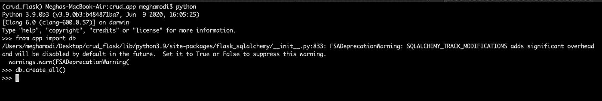

**创建数据库的步骤:-**

进入 python3 shell 后，输入以下命令:-

```
>>> from app import db
>>> db.create_all()
```

默认情况下，Flask 使用 GET 方法。为了通过最安全的路径传递数据，请使用 POST 方法，该方法可以包含在 route() decorator 的参数中。

创建一个名为 **'base.html'** 的文件，该文件将用作其他网页的模板。它使用 Jinja 模板。index.html 是进行 CRUD 操作的 HTML 页面。

要了解更多关于 Jinja 模板的信息，请点击 [**这里**](https://jinja.palletsprojects.com/en/2.11.x/templates/) 。

使用以下命令在本地系统的工作目录中运行 app.py

```
python3 app.py
```

网页将看起来像这样:-

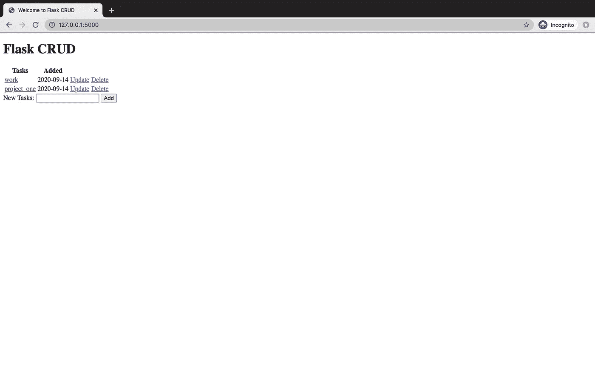

index.html

# 在 Ubuntu AWS EC2 上部署它

*   创建一个 AWS 帐户。在服务部分，点击 **EC2** 。点击**启动实例**。

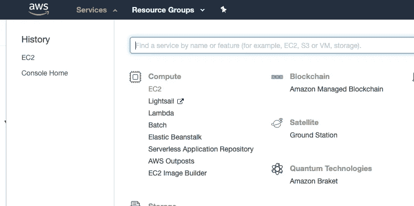

*   你将能够看到几个免费层图像以及付费的。选择 **Ubuntu Server 18.04LTS** 并移至实例类型。

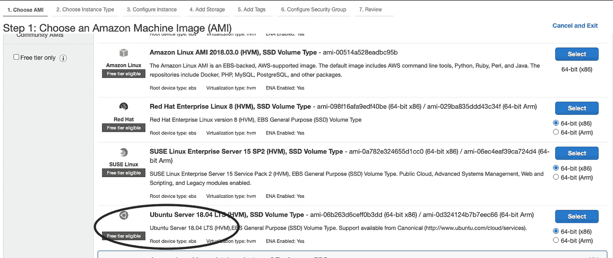

*   在实例类型中，选择 **t2.micro(符合自由层条件)**。

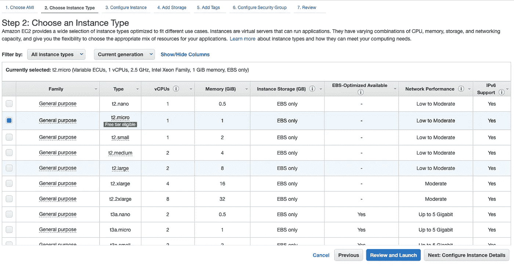

*   **配置实例**细节将保持原样。因此，我们可以转移到存储。

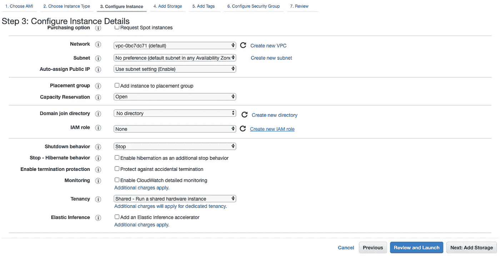

*   在**存储**中，AWS 在空闲层为您提供高达 30GB 的存储，因此您可以根据需求进行更改。

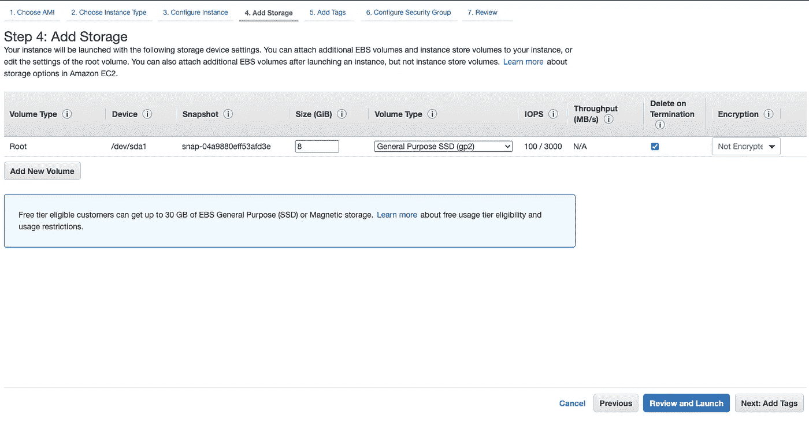

*   在标签部分，没有必要添加标签，标签主要用于对 AWS 资源进行分类或跟踪。

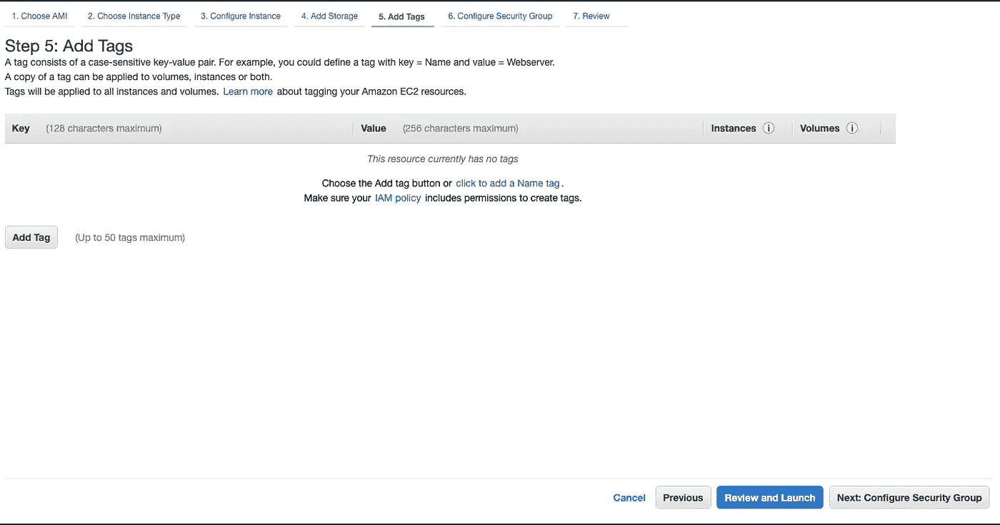

*   转到安全组，通过单击“添加规则”添加以下规则。为每条规则添加描述以便理解。
    **确保在安全组中的入站规则中添加 HTTP、HTTPS 规则。**

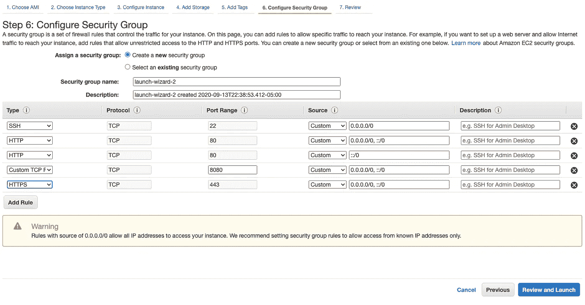

*   点击**‘审查并启动’**后，启动并创建密钥对。单击 Launch 后，将提示您选择现有的或新的密钥对。

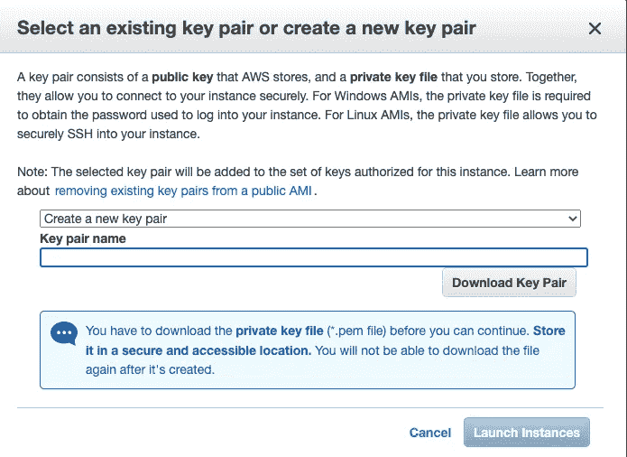

*   单击下拉菜单并选择新的密钥对。给新的密钥对命名并下载它。这将生成一个. pem 文件。把这个放在安全的地方。如果您丢失此密钥，您将无法访问 web 应用程序。
*   检查并启动实例，并等待它启动。可能需要几秒钟才能启动。您将看到 IPV4 公共 IP。IPV4 地址用于访问虚拟机，复制该地址以将其用于 SSH。

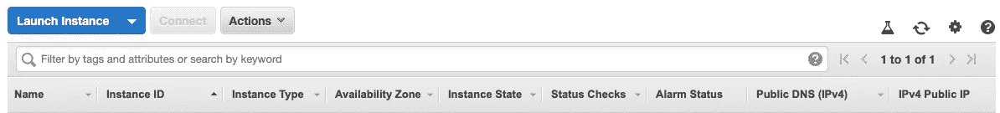

*   使用 AWS SSH 到您的实例中。使用终端，出于
    安全目的，使用命令更改文件读/写权限。

```
chmod 600 <PEM FILE>.pem
```

*   使用终端连接到实例，并键入以下内容:-

```
ssh -i /path/my-key-pair.pem my-instance-user-name@<IPv4_address>
```

连接时会弹出
如下问题‘确定要继续连接吗(是/否/[指纹])’

输入 *Yes* ，你将连接到你的虚拟 ubuntu 机器

确保您已经将文件夹从本地主机导入到您的实例中。要在本地主机和您的实例之间复制文件，您可以使用命令`scp`。“scp”表示“*安全复制*”，使用实例的公共 DNS 名称或 IPv4_address 将文件传输到您的实例。。尝试以下命令:-

```
sudo scp -r -i /path/to/.pem */path/Folder* ubuntu@IPV4_address:/path/to/copy
```

*   对于新实例，使用以下命令从所有已配置的源下载软件包:-

```
sudo apt update
sudo apt install python3 python3-pip
sudo apt-get install python3-venv
```

**在 tmux 中运行 app . py**

> 根据 wiki **的说法，tmux** 是一个终端复用器。它可以让你在一个终端上轻松地切换几个程序。

1.  使用以下命令安装 tmux

```
sudo apt-get install tmux
```

2.要在 tmux 中启动新的会话:-

```
tmux new -s <name>
```

3.使用 **cd** 导航至您的工作目录

创建虚拟环境:-

```
python3 -m venv <name>
```

4.激活您的虚拟环境并安装应用程序的 [**需求**](https://github.com/meghamodi/CRUD_flask/blob/master/requirements.txt):-

```
source <name>/bin/activate
```

5.运行以下命令:-

```
python app.py
```

6.要从 tmux 分离，让一切在后台运行:-

```
ctrl-b, d
```

要查看它的工作情况，请在 web 浏览器中键入以下内容:-
**http://<IP v4 address>:8080**

# 结论

Flask 是一个轻量级的简单框架，可以帮助你创建一个应用程序。使用 AWS 部署 flask 看起来很棘手，但实际上很简单。

我希望你喜欢这篇文章，并期待听到你的经历！