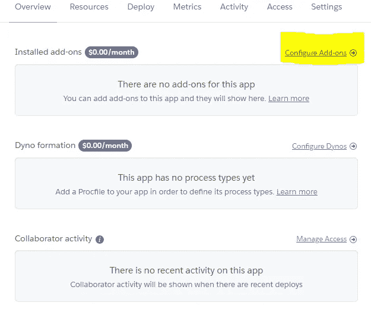
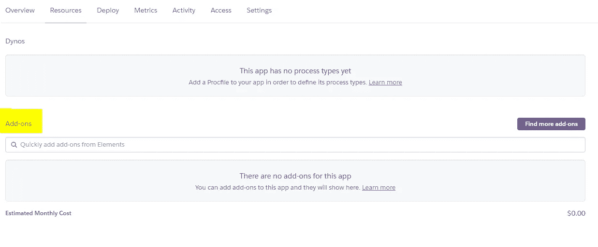
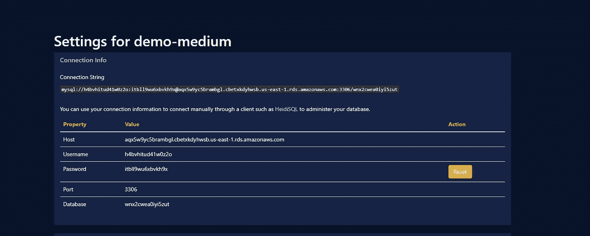
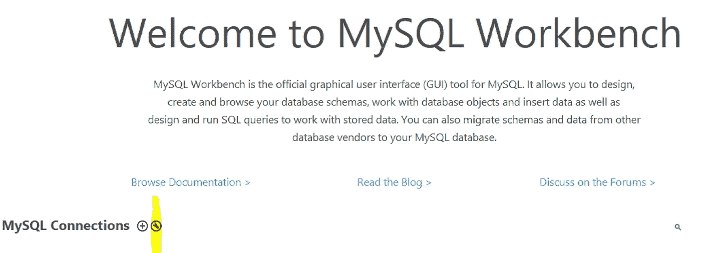
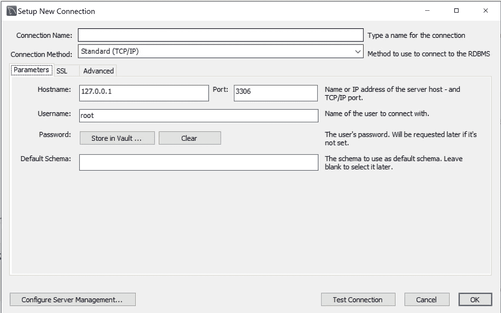

# 使用 JawsDB MySQL 部署到 Heroku

> 原文：<https://medium.com/analytics-vidhya/deploy-to-heroku-with-jawsdb-mysql-cbe255de73f3?source=collection_archive---------5----------------------->

本文面向希望从本地 DB-MySQL Workbench 向 Heroku 部署项目的开发人员。我假设您已经知道如何在本地机器上使用 MySQL Workbench，并且已经在 Heroku 上部署了一两个项目。

我希望通过几个步骤，您就可以将您的本地项目连接到 JawsDB MySQL。

第一步:

我想你已经在 Heroku 开了一个新项目。



第一步

*   单击显示“配置加载项”的位置(图片中的黄色)。
*   将弹出的下一个窗口:



第二步

*   您将看到输入字段，只需查找 **JawsDB MySQL。**
*   选择免费版本(但是你可以选择你需要的)，如果是一个小项目，我推荐使用免费版本——它足够好了。
*   点击提交订单。
*   在下一个窗口中点击**。**



第三步

上一步您已经完成了 Heroku，现在您需要打开 MySQL 工作台。

在本地机器上打开 MySQL 工作台后，点击:



第四步

*   点击黄色标志。



第五步

*   现在，您可以将图片(步骤 3)中的信息复制并粘贴到您的 MySQL 工作台(图片步骤 5)。
*   完成后，点击测试连接，看看你的连接是否良好。

好，现在我们将去你的项目。你可能使用了 sequelize，如果是这样的话，在你的项目中你应该得到一个名为 config 的文件夹。打开配置文件夹->你应该看到一个名为 config 的文件。复制并粘贴下一段代码。

```
"production": {
    "use_env_variable": "JAWSDB_URL",
    "dialect": "mysql"
  }
```

最后一步是再次打开 MySQL Workbench，您应该会看到一个我们在文章开始时设置的新数据库。

在数据库中，下一个代码:

```
DROP DATABASE IF EXISTS ________;
CREATE DATABASE __________;

SELECT * FROM Users;
```

我希望你喜欢这个教程😎🙏。