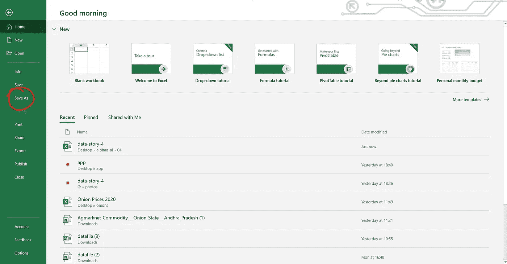
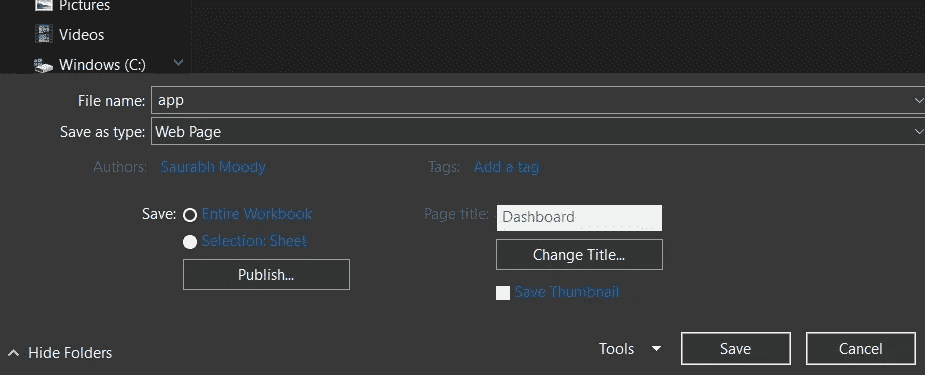

# 在 Heroku 上部署您的 excel 仪表板

> 原文：<https://medium.com/analytics-vidhya/deploy-your-excel-dashboard-on-heroku-b0dc878b2c2b?source=collection_archive---------8----------------------->

您知道吗，您可以在 web 上部署您的 excel 仪表板，任何人都可以通过它的 URL 查看它。酷吧！！如果你想试试这个，就去看看这篇文章吧。

卢克·切瑟在 [Unsplash](https://unsplash.com?utm_source=medium&utm_medium=referral) 上的照片

# F 首先:

您需要具备:

1.  *Microsoft Excel 2016 或更高版本中的仪表板*
2.  Git bash 或 Github 帐户
3.  Heroku 帐户
4.  Heroku CLI

假设你有 excel，git，Heroku 和 Github 的知识

Excel 起始页面

# 第一步:

假设您的仪表板已在 excel 2016 或更高版本中准备好，现在导航到左上角，在那里您可以找到文件选项，单击它，现在您将导航到 excel starter 页面，在那里您可以找到另存为选项。如果你选择了它。您将被要求选择一个目标文件夹和文件格式，如下所示。

# 第二步:

选择网页作为文件格式，你也可以添加标题。添加后，点击保存。如果出现一个弹出窗口，提示您是否要继续使用这种格式，请选择继续！

现在你可以在目标文件夹中看到一个 HTML 文件及其关联的文件在一个文件夹中，其名称包含后缀(_files)。不要更改文件的名称，因为它们是相互连接的。更改它们可能会导致功能不正常。您现在可以看到 excel 文件现在变成了(。htm)网页。

# 第三步:

现在创建一个新文件夹，并将这些文件移动到新文件夹中，将文件夹重命名为 project，并在该文件夹上启动 git bash(或者您可以在 git bash 中导航到该文件夹)。目录的层次结构应该如下所示:

> *项目> app，app_files*

注意:您可以使用 git bash 或 terminal(如果它被添加到您的变量 path 中)

在 git bash 中，使用以下命令初始化 Proj 文件夹中的存储库:

> git 初始化

在 git bash 中，使用以下命令添加所有文件:

> git 添加。

现在，使用命令提交所有文件:

> git commit -m“初始提交”

# 第四步:

现在您有两种方法，一种是直接将此回购推送到 Heroku 进行部署，另一种是将此回购推送到 Github，然后链接 Heroku 和 GitHub，然后进行部署。无论哪种方式，都会有效！

我选择直接推到 Heroku。

由于 Heroku 不接受只有静态网页的文件，我们需要创建一个假的 PHP 后端。您也可以创建 flask-server 后端。但是我选择 PHP，因为它很容易用最少的步骤完成。

我们需要使用一个技巧，告诉 Heroku 我们的网站是一个 PHP 应用程序。为此，只需在 git bash 中复制并粘贴以下命令。composer.json 已经包含在 Heroku 上，为 PHP 应用程序提供支持。如果应用程序没有 composer 依赖项，我们必须包含空的 composer.json 来识别 PHP 应用程序。

> 回声报> index.php

注意:我的 HTML 源文件被命名为一个应用程序，替换为你命名的任何东西，并请确保在命令中它是 htm 而不是 HTML

使用以下命令创建一个 composer 文件

> echo '{}' > composer.json

现在再次运行以下命令:

> git 添加。
> 
> git 提交-m“秒”

现在初始化 Heroku CLI，假设你已经安装了 Heroku 帐户和 Heroku CLI，如果没有，你可以在下面的链接中找到

 [## Heroku CLI

### Heroku 命令行界面(CLI)使得直接从终端创建和管理您的 Heroku 应用程序变得非常容易…

devcenter.heroku.com](https://devcenter.heroku.com/articles/heroku-cli)  [## Heroku |注册

### 免费创建应用程序、连接数据库和附加服务，并在应用程序上进行协作。一个应用程序平台，包含…

signup.heroku.com](https://signup.heroku.com/) 

请注意，Heroku 在某种程度上是免费使用的，对于我们的项目来说，这已经足够了

现在复制并粘贴命令，然后运行

> heroku 登录

您将被要求输入任何登录密钥。如果您输入任何密钥，将弹出一个浏览器窗口进行用户验证。使用它进行身份验证后，使用 git bash 或终端检查您应该登录的位置。

# 第五步:

现在我们需要在 Heroku 上创建一个应用程序。这个[链接](https://dashboard.heroku.com/apps)会带你去那里。

要创建应用程序，您只需点击右上角的“新建”,然后系统会询问您是创建应用程序还是选择应用程序管道。

现在，您将被要求选择一个全球唯一的名称和地区，然后单击创建应用程序。将创建您的应用。

假设我的应用程序名称是:美国超市销售

现在，在 terminal/git bash 中输入以下命令，替换您的应用程序名称。

> heroku git:远程美国超市销售

现在，添加远程位置后，您需要推送存储库。要推送和部署它，请使用以下命令:

> 饭桶推 heroku 主人

这需要一些时间，最后，终端输出将是

# 您的应用程序已上线！

照片由[斯科特·沃曼](https://unsplash.com/@scottiewarman?utm_source=medium&utm_medium=referral)在 [Unsplash](https://unsplash.com?utm_source=medium&utm_medium=referral)

# Tadaaaa！！！

现在，您的 excel 仪表板已经部署在 Heroku 上，并且可以看到了。

赫罗库。要查看你的应用程序，点击出现在上一步末尾的链接，看起来像**https://us-superstore-sales.herokuapp.com/**