# 使用 Python、Keras、Flask 和 Docker 在 Kubernetes 上部署您的第一个深度学习模型

> 原文：<https://medium.com/analytics-vidhya/deploy-your-first-deep-learning-model-on-kubernetes-with-python-keras-flask-and-docker-575dc07d9e76?source=collection_archive---------0----------------------->

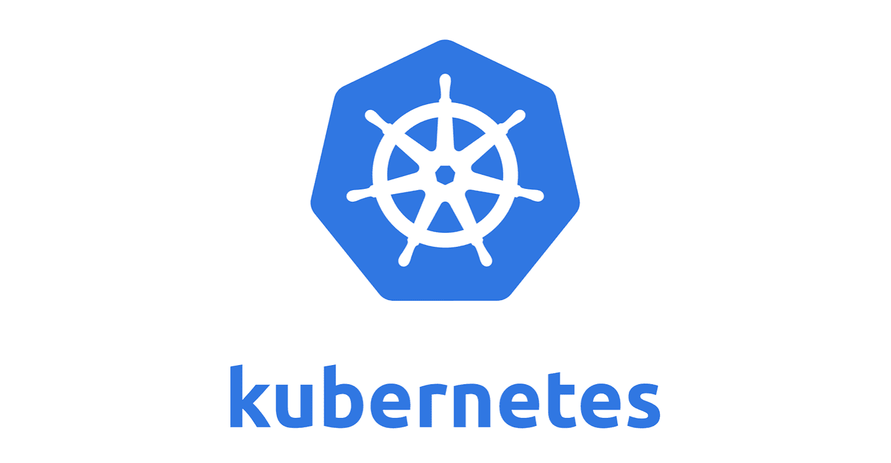

# 如此简单，连你的老板都能做到！

这篇文章展示了一个 **basic** 的例子，展示了如何使用 Keras 构建深度学习模型，使用 Flask 将其作为 REST API，并使用 Docker 和 Kubernetes 进行部署。

这不是一个健壮的生产实例。对于那些听说过 Kubernetes 但还没有尝试过的人来说，这是一个快速指南。

为此，我在这个过程的每一步都使用谷歌云。原因很简单——我不想在我的 Windows 10 家用笔记本电脑上安装 Docker 和 Kubernetes。谷歌云非常好用。

对你们所有人的额外好处是复制我的步骤应该容易得多，因为你们可以使用我所使用的精确规范来运行一切。

此外，如果你担心成本，不要。谷歌为新账户提供了数百美元的免费信用额度，对于我将要向你展示的一切，我甚至还没有触及它的表面。

# 为什么 Kubernetes 支持 ML 和数据科学

Kubernetes 及其更广泛的新流行语“原生云”正在席卷全球。别担心——你有理由怀疑。我们都看到科技炒作泡沫变成了名副其实的术语海啸，其中有*人工智能*、*大数据*，以及*云*。Kubernetes 是否会出现同样的情况，还有待观察。

但是在你的数据科学外行今天指导你的情况下，我对使用 Kubernetes 的变革性原因既没有理解也没有兴趣。我的动机很简单。我想部署、扩展和管理一个提供预测服务的 REST API。正如您将看到的，Kubernetes 使这变得非常容易。

让我们开始吧

# 快速大纲

1.  使用谷歌云创建您的环境
2.  使用 Keras、Flask 和 Docker 将深度学习模型作为 API
3.  使用 Kubernetes 部署所述模型
4.  沉浸在你新发现的知识的荣耀中

# 步骤 1—使用谷歌云创建环境

我使用 Google Compute Engine 上的一个小 VM 来构建、服务和对接一个深度学习模型。不要求您也这样做。我尝试在我的 Windows 10 笔记本电脑上安装最新版本的 Docker CE(社区版)。失败了。我认为，比起弄清楚如何安装 Docker，花钱(只是使用免费的谷歌云信用)是对我时间的更好利用。选择权在你。

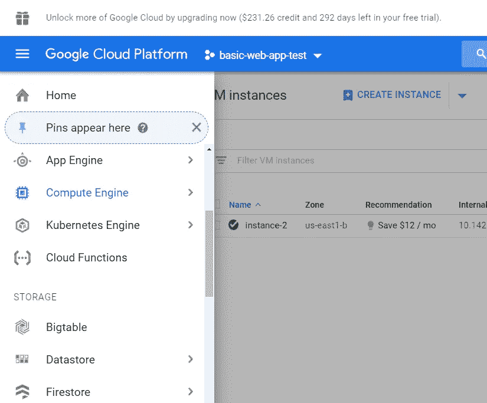

要启动 Google Cloud VM，请打开屏幕左侧的功能区。选择计算引擎。

然后选择“创建实例”。您可以在下面的照片中看到，我已经运行了一个实例。

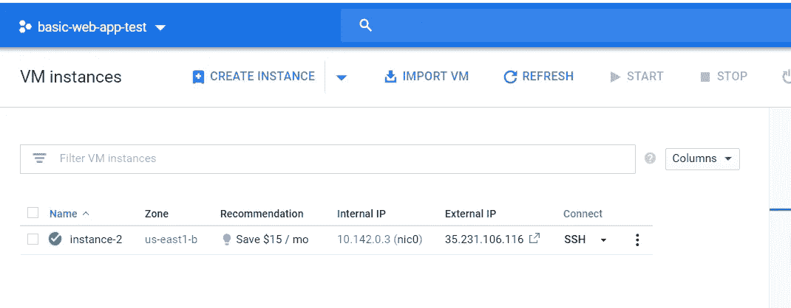

下一步是选择我们想要使用的计算大小。默认(读:最便宜的)设置应该工作得很好，但是考虑到我们最多只需要这个虚拟机 1 个小时，我选择了 4 个 15GBs 内存的 4vCPUs。

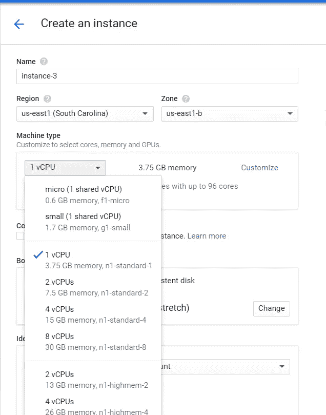

接下来，我选择我想要使用的操作系统和磁盘空间。选择“引导磁盘”来编辑默认值。我选择 Centos 7 作为我的操作系统，并将磁盘容量从 10GB 增加到 100GB。我选择的操作系统(Centos)不是必需的。然而，我建议将磁盘大小增加到 10GBs 以上，因为我们创建的 Docker 容器每个大约 1GB。

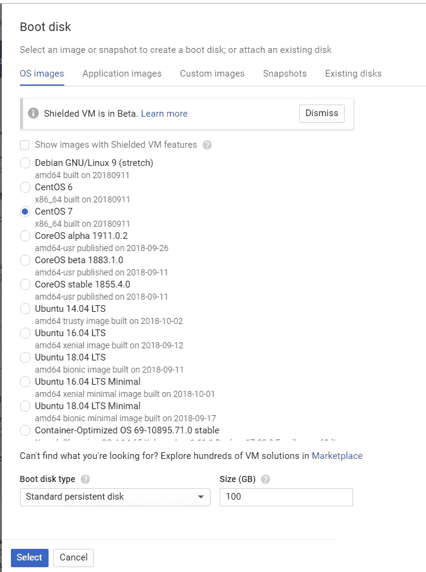

创建虚拟机之前的最后一步是设置防火墙规则以允许 HTTP/S。完全透明，我不确定是否需要这一步。我将向您展示在我们将 API 部署到 Kubernetes 之前，如何编辑防火墙设置来测试我们在 VM 上的 API。因此，勾选这些复选框是不够的，还有更多的工作要做。我只是没有回去再次尝试这个教程没有检查他们。

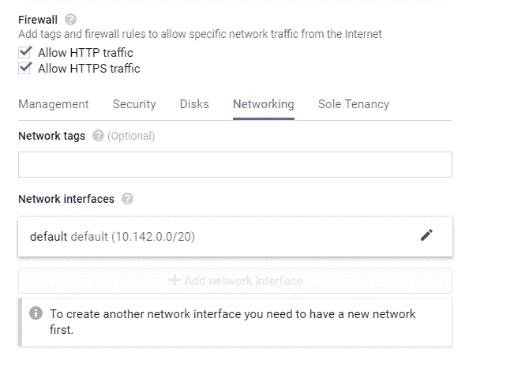

不确定是否需要此步骤

现在点击“创建”。太棒了。难的部分基本完成了！

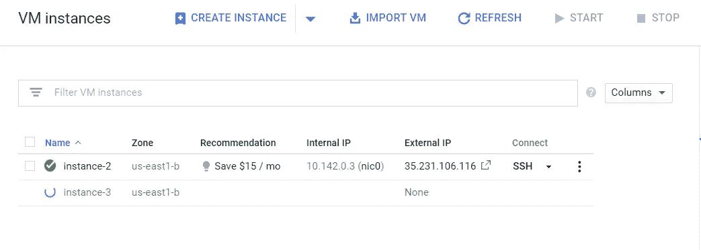

# 步骤 2-使用 Keras 建立深度学习模型

现在，让我们 SSH 到我们的虚拟机，并开始构建我们的模型。最简单的方法就是点击你的虚拟机旁边的 SSH 图标(如下)。这将在您的浏览器中打开一个终端。

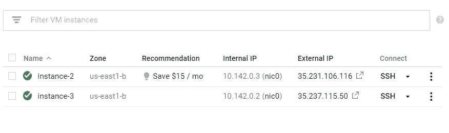

1.  **删除现有版本的 Docker**

```
sudo yum remove docker docker-client docker-client-latest docker-common docker-latest docker-latest-logrotate docker-logrotate docker-selinux docker-engine-selinux docker-engine
```

请注意，如果您选择 Centos 7 以外的操作系统，这些命令会有所不同。

2.**安装最新版本的 Docker**

```
sudo yum install -y yum-utils device-mapper-persistent-data lvm2sudo yum-config-manager — add-repo https://download.docker.com/linux/centos/docker-ce.reposudo yum install docker-ce
```

3.**启动 Docker 并运行测试脚本**

```
sudo systemctl start docker
sudo docker run hello-world
```

如果您看到类似以下消息的输出，那么您就一切就绪了。

```
Hello from Docker!
This message shows that your installation appears to be working correctly.To generate this message, Docker took the following steps: 1\. The Docker client contacted the Docker daemon. 2\. The Docker daemon pulled the "hello-world" image from the Docker Hub.    (amd64) 3\. The Docker daemon created a new container from that image which runs the    executable that produces the output you are currently reading. 4\. The Docker daemon streamed that output to the Docker client, which sent it    to your terminal.
```

4.**创建我们的深度学习模型**

我们要复制阿德里安·罗斯布鲁克写的剧本。Adrian 创建了一个优秀的简短教程，介绍如何使用 Keras 构建深度学习模型，并使用 Flask 提供服务。你可以在这里深入阅读教程[。](https://blog.keras.io/building-a-simple-keras-deep-learning-rest-api.html)

我不得不对艾利安的剧本做了两处关键的修改来让它运行。如果你不关心 Docker 和 Tensorflow 的细节，可以跳过下面两段。

我改变的第一件事与 Docker 有关。在本地运行应用程序时，默认 flask 行为是在本地主机(127.0.0…)上提供应用程序。这在 Docker 容器内部运行时会导致问题。解决办法很简单。调用`app.run()`时，像`app.run(host='0.0.0.0')`一样指定 url 为 0.0.0.0。现在，我们的应用程序在本地主机和外部 IP 上都可用。

下一个问题与张量流有关。当我运行 Adrian 的原始脚本时，我无法成功调用该模型。我阅读了这个 [Github 问题](https://github.com/tensorflow/tensorflow/issues/14356)，并对代码进行了后续修改。

```
global graph
graph = tf.get_default_graph()
...
with graph.as_default():
    preds = model.predict(image)
```

老实说，我不知道为什么会这样。但确实如此。所以让我们开始吧。

首先，让我们创建一个名为 keras-app 的新目录，并移入该目录

```
mkdir keras-app
cd keras-app
```

现在让我们创建一个名为 app.py 的文件。您可以使用您选择的文本编辑器。我更喜欢使用 vim。要创建并打开 app.py，请键入:

```
vim app.py
```

从你的文件内部，点击“I”键进入插入模式。现在，您已经准备好粘贴以下代码。

一旦你复制了上面的代码，你可以点击“Esc”键退出编辑模式。

然后通过键入`:x`保存并关闭文件

5.**创建一个 requirements.txt 文件**

现在回到正题。我们将在 Docker 容器中运行这段代码。因此，为了做到这一点，我们需要首先创建一个 requirements.txt 文件。这个文件将包含我们的代码需要运行的包，例如，keras、flask 等。这样，无论我们将 Docker 容器发布到哪里，底层服务器都能够安装我们代码所需的依赖项。

和前面一样，通过键入`vim requirements.txt`用 vim 创建并打开一个名为 requirements.txt 的文件

将以下内容复制到 requirements.txt 中，并像之前一样保存和关闭

```
keras
tensorflow
flask
gevent
pillow
requests
```

6.**创建一个 Dockerfile**

太好了！现在让我们创建 docker 文件。这是 Docker 将读取的文件，用于构建和运行我们的项目

```
FROM python:3.6
WORKDIR /appCOPY requirements.txt /app
RUN pip install -r ./requirements.txtCOPY app.py /app
CMD ["python", "app.py"]~
```

事情是这样的。我们正在指导 Docker 下载 Python 3 的基础映像。一旦完成，我们要求 Docker 使用 Python 包管理器`pip`来安装`requirements.txt`中详述的包

之后，我们告诉 Docker 通过`python app.py`运行我们的脚本

7.**构建 Docker 容器**

我们一直在前进。现在让我们构建并测试我们的应用程序。

要构建我们的 Docker 容器，运行:

```
sudo docker build -t keras-app:latest .
```

这指示 Docker 为位于我们当前工作的 director `keras-app`中的代码构建一个容器

该命令需要一两分钟才能完成。幕后发生的事情是 Docker 正在拉下 Python 3.6 的映像并安装 requirements.txt 中列出的包。

8.**运行 Docker 容器**

现在让我们运行 Docker 容器来测试我们的应用程序:

```
sudo docker run -d -p 5000:5000 keras-app
```

关于数字的一个快速注释，`5000:5000` —这里我们告诉 Docker 让端口 5000 对外可用，并将我们的本地应用转发到那个端口(它也在本地端口 5000 上运行)

通过运行`sudo docker ps -a`来检查容器的状态。您应该会看到如下所示的内容

```
[gustafcavanaugh@instance-3 ~]$ sudo docker ps -a
CONTAINER ID        IMAGE               COMMAND             CREATED             STATUS                    PORTS                    NAMES
d82f65802166        keras-app           "python app.py"     About an hour ago   Up About an hour          0.0.0.0:5000->5000/tcp   nervous_northcutt 
```

**9。测试我们的模型**

随着我们的模型运行，现在是测试它的时候了。这个模型接受一张狗的照片作为输入，并返回狗的品种。在 Adrian 的回购中，他提供了一个[示例图像](https://github.com/jrosebr1/simple-keras-rest-api/blob/master/dog.jpg)，我们将使用相同的图像。

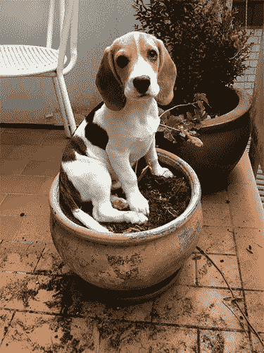

从终端运行:

```
curl -X POST -F image=@dog.jpg 'http://localhost:5000/predict'
```

确保“dog.jpg”在您的当前目录中(或者提供该文件的适当路径)

您应该会看到如下结果:

```
{"predictions":[{"label":"beagle","probability":0.987775444984436},{"label":"pot","probability":0.0020967808086425066},{"label":"Cardigan","probability":0.001351703773252666},{"label":"Walker_hound","probability":0.0012711131712421775},{"label":"Brittany_spaniel","probability":0.0010085132671520114}],"success":true}
```

我们可以看到，我们的模型正确地将狗归类为小猎犬。太棒了。你已经成功地用 Keras 运行了一个训练好的深度学习模型，用 Flask 服务了它，用 Docker 包装了它。最困难的部分已经过去了。现在让我们用 Kubernetes 部署这个容器

# 步骤 3 —使用 Kubernetes 部署模型

下一部分进展很快。

1.  **创建一个 Docker Hub 账户(如果你没有)**

我们做的第一件事是将我们的模型上传到 Docker Hub。(如果您没有 Docker Hub 帐户，现在就创建一个，不要担心，它是免费的)。我们这样做的原因是，我们不会将我们的容器物理地移动到我们的 Kubernetes 集群。相反，我们将指示 Kubernetes 从一个集中托管的服务器(即 Docker Hub)安装我们的容器。

**2。登录您的 Docker Hub 账户**

一旦你创建了你的 Docker Hub 账户，通过`sudo docker login`从命令行登录。您需要提供您的用户名和密码，就像您登录网站一样。

如果您看到这样的消息:

```
Login Succeeded
```

然后你就可以成功登录了。现在让我们进入下一步。

**3。给你的容器贴上标签**

在上传之前，我们需要标记我们的容器。把这一步想象成给我们的容器命名。

首先，运行`sudo docker images`并定位我们的 keras-app 容器的*图像 id* 。

输出应该如下所示:

```
REPOSITORY          TAG                 IMAGE ID            CREATED             SIZE keras-app           latest              ddb507b8a017        About an hour ago   1.61GB
```

现在让我们标记我们的 keras-app。确保遵循我的格式，并用您的特定值替换图像 id 和 docker hub id 的值。

```
#Format
sudo docker tag <your image id> <your docker hub id>/<app name>
#My Exact Command - Make Sure To Use Your Inputs
sudo docker tag ddb507b8a017 gcav66/keras-app
```

**4。将我们的集装箱推到码头中心**

现在我们可以推动我们的容器。从 shell 运行:

```
#Format
sudo docker push <your docker hub name>/<app-name>#My exact command
sudo docker push gcav66/keras-app
```

现在，如果您导航回 Docker Hub 的网站，您应该会看到您的 keras-app 存储库。干得好！我们准备好最后的冲刺了。

5.创建一个 Kubernetes 集群

从 Google Cloud 主页屏幕中，选择 Kubernetes 引擎

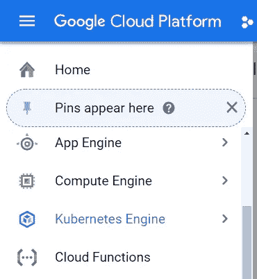

然后创建一个新的 Kubernetes 集群

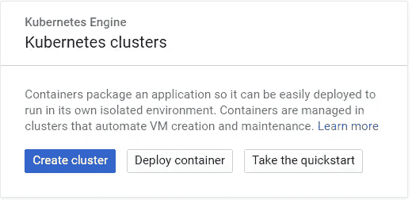

接下来，我们将定制集群中节点的大小。我将选择 4 个 15 GBs 内存的 4vCPUs。您可以尝试使用较小的集群。请记住，默认设置会启动 3 个节点，因此您的集群将拥有 3 倍于您所提供的资源，例如，在我的例子中，45gb 的 Ram。我有点懒，选择了一个更大的尺寸，因为我们不会让我们的 kubernetes 集群运行很长时间。

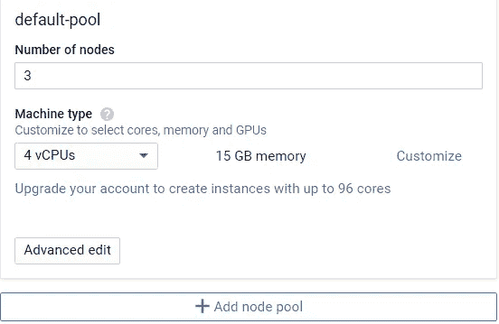

之后点击**创建**即可。您的群集将需要一两分钟的时间来加速旋转。

现在，让我们连接到集群。点击 **Run in Cloud Shell** 调出 Kubernetes 集群的控制台。请注意，这是一个独立于 VM 的 shell 环境，在这里您创建并测试了 Docker 容器。我们可以在虚拟机上安装 Kubernetes，但谷歌的 Kubernetes 服务为我们实现了自动化。

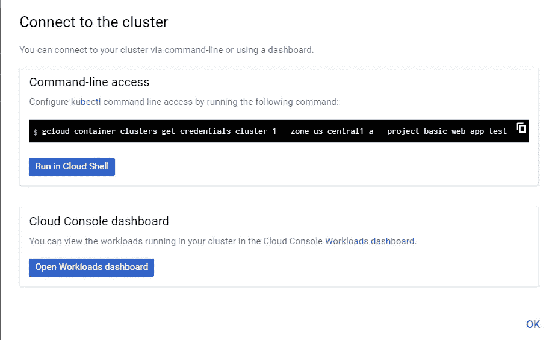

现在我们在 Kubernetes 运行 docker 容器。注意，图像标签只是指向 docker Hub 上托管的 Docker 图像。此外，我们将使用`--port`指定我们希望在端口 5000 上运行我们的应用程序。

```
kubectl run keras-app --image=gcav66/keras-app --port 5000
```

在 Kubernetes，容器都在豆荚里运行。我们可以通过键入`kubectl get pods`来验证我们的 pod 正在运行。如果你看到下面这样的东西，你就万事俱备了。

```
gustafcavanaugh@cloudshell:~ (basic-web-app-test)$ kubectl get pods
NAME                         READY     STATUS    RESTARTS   AGE
keras-app-79568b5f57-5qxqk   1/1       Running   0          1m
```

现在我们的 pod 已经激活并运行，我们需要将端口 80 上的 pod 暴露给外界。这意味着任何访问我们部署的 IP 地址的人都可以访问我们的 API。这也意味着我们不必像以前那样在 url 后面指定一个讨厌的端口号(告别`:5000`)。

```
kubectl expose deployment keras-app --type=LoadBalancer --port 80 --target-port 5000
```

我们快到了！现在，我们通过运行`kubectl get service`来确定部署的状态(以及调用 API 所需的 URL)。同样，如果该命令的输出如下所示，那么您做得很好。

```
gustafcavanaugh@cloudshell:~ (basic-web-app-test)$ kubectl get service
NAME         TYPE           CLUSTER-IP     EXTERNAL-IP     PORT(S)        AGE
keras-app    LoadBalancer   10.11.250.71   35.225.226.94   80:30271/TCP   4m
kubernetes   ClusterIP      10.11.240.1    <none>          443/TCP        18m
```

为您的 keras 应用程序获取集群 ip，因为现在是关键时刻。打开您的本地终端(或者您手边有狗狗照片的任何地方)并运行以下命令来调用 API `curl -X POST -F image=@dog.jpg 'http://<your service IP>/predict'`。

尽情享受结果吧！

如下图所示，API 正确地返回了图片的 beagle 标签。

```
$ curl -X POST -F image=@dog.jpg 'http://35.225.226.94/predict'
{"predictions":[{"label":"beagle","probability":0.987775444984436},{"label":"pot","probability":0.0020967808086425066},{"label":"Cardigan","probability":0.001351703773252666},{"label":"Walker_hound","probability":0.0012711131712421775},{"label":"Brittany_spaniel","probability":0.0010085132671520114}],"success":true}
```

# 第四步——总结

在本教程中，我们使用 Keras 和 Flask 将深度学习模型作为 REST API。然后，我们将该应用程序放入 Docker 容器中，将容器上传到 Docker Hub，并使用 Kubernetes 部署它。

只需两个命令，Kubernetes 就可以部署我们的应用，并向世界展示它。拍拍自己的背，你应该感到自豪。

现在，我们可以对这个项目做很多改进。首先，我们应该将运行 flask 应用程序的 python web 服务器从本地 python 服务器改为生产级服务器，如 gunicorn。我们还应该探索 Kubernetes 的伸缩和管理特性，这一点我们几乎没有涉及到。最后，我们可以尝试从头构建一个 kubernetes 环境。

**如何联系**

如果这篇教程有用，你想了解更多，请给我在 hello@guscav.com 写封短信。此外，请继续关注上述所有内容的视频演示。但最重要的是…

保持美丽