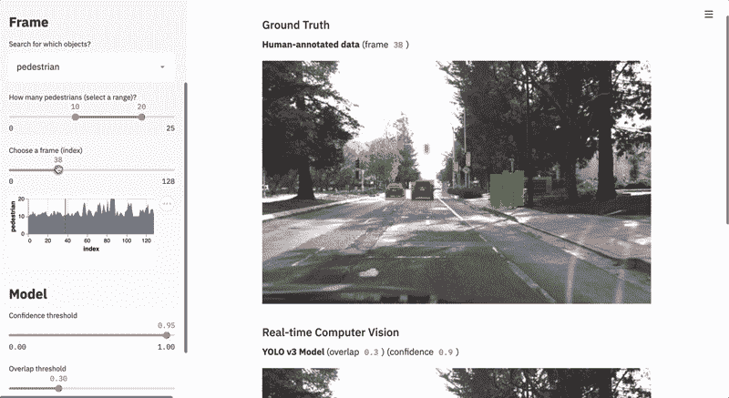
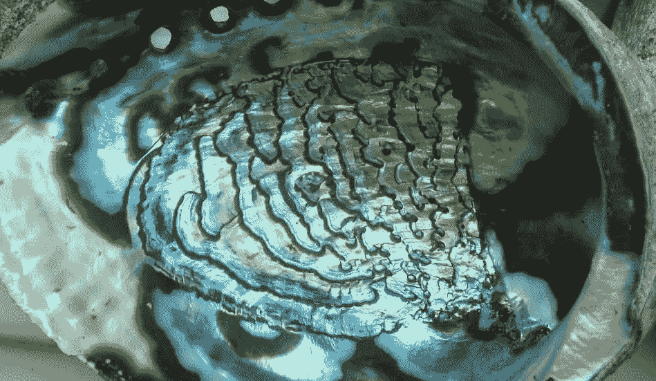

# 使用 Streamlit 部署您的第一个端到端 ML 模型

> 原文：<https://medium.com/analytics-vidhya/deploy-your-first-end-to-end-ml-model-using-streamlit-51cc486e84d7?source=collection_archive---------8----------------------->



想象一下，建立一个有监督的机器学习 ML 模型来决定信用卡交易是否检测到欺诈。有了成功应用的模型置信度，我们就可以评估无风险的信用卡交易。所以你已经建立了模型，可以检测信用卡欺诈，现在呢？部署这样的 ML 模型是这个项目的主要目标。

部署 ML 模型仅仅意味着将模型集成到现有的生产环境中，该环境可以接收输入并返回可用于制定实际业务决策的输出。这就是 Streamlit 发挥作用的地方！

> Streamlit 是一个开源应用框架是数据科学家和机器学习工程师在几个小时内创建漂亮、高性能应用的最简单方式！全是纯 Python。全部免费。

在本教程的第一部分，我将部署一个监督机器学习模型来预测鲍鱼的年龄，在本教程的下一部分，我们将在 Heroku 上托管这个 web 应用程序。鲍鱼是一种软体动物，有一个奇特的耳朵形状的壳，里面衬着珍珠母。鲍鱼的年龄可以通过身体测量得到。让我们部署模型。



为模型创建 pickle 文件，机器学习模型参见[我的 kaggle 笔记本](https://www.kaggle.com/apurvasharma866/abalone)。在本教程中，我们将重点关注部署。导入必要的包。导入 streamlit 和 pickle，以取消 pickle 文件。

```
import streamlit as st
import pickle
import numpy as npmodel = pickle.load(open('final_model.pkl','rb'))
```

创建一个函数来使用酸洗模型。将所有输入值转换为一个 Numpy 数组，并将输入数组的数据类型更改为 float。使用 model.predict(input)创建预测值。返回预测值。

创建主函数。

```
def main()
```

现在，让我们构建主函数的组件。

1.  为你的页面创建一个标题。使用 [st.markdown](https://docs.streamlit.io/en/stable/api.html?highlight=st.markdown#display-text) 创建 html 标题文本。

主函数的分量

2.为了获取用户输入，Streamlit 提供了一个 API 来直接创建 HTML 表单组件，如输入字段，使用 [st.text_input()](https://docs.streamlit.io/en/stable/api.html?highlight=text_input#streamlit.text_input) 为应用程序获取输入值。

3.定义输出字段。创建想要在输出中显示的 html 文本，如 safe_html，类似地定义 warn_html 和 danger_html。使用 [st.button()](https://docs.streamlit.io/en/stable/api.html#streamlit.button) 构建按钮小部件，使用 [st.success()](https://docs.streamlit.io/en/stable/api.html?highlight=st%20success#streamlit.success) 在模型成功预测值时显示消息。

Python 中的每个模块都有一个特殊的属性叫做`__name__`。当模块作为主程序运行时，`__name__`属性的值被设置为`'__main__'`。因此，调用 main()函数 if `__name__ = '__main__'`。

现在让我们开始部署。

I)在您的本地计算机上安装 streamlit。

```
pip install Flask
pip install streamlit 
```

ii)将文件另存为 filename.py，并将 final_model.pkl 文件添加到同一目录中。或者简单地在您的机器上克隆 GitHub 库。

```
git clone [https://github.com/Apurva-tech/abalone-age-app.git](https://github.com/Apurva-tech/abalone-age-app.git)
```

[](https://github.com/Apurva-tech/abalone-age-app.git) [## apurva-tech/鲍鱼-age-app

### 使用 streamlit web 应用程序预测鲍鱼的年龄

github.com](https://github.com/Apurva-tech/abalone-age-app.git) 

iii)打开命令提示符/终端，导航到文件目录。并运行以下命令。这将启动`localhost:8501`上的网络应用

`streamlit run filename.py`

输入数值，然后点击预测 aaaannndd 瞧！

至此，我们已经结束了本教程的第一部分。请继续关注下一部分，我们将在 Heroku 上托管这个 web 应用程序，链接到 web 应用程序-[https://abalone-age-app.herokuapp.com/](https://abalone-age-app.herokuapp.com/)。

那里见！

快乐学习😄