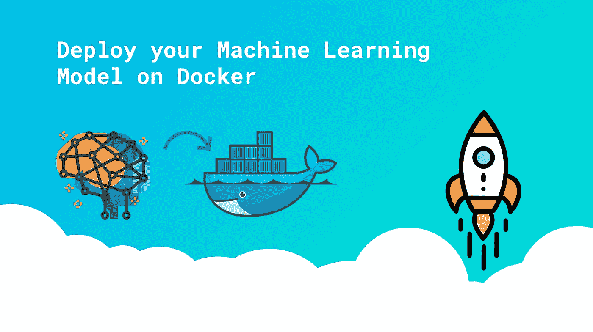

# 在 Docker 上部署您的机器学习模型—第 2 部分

> 原文：<https://medium.com/analytics-vidhya/deploy-your-machine-learning-model-on-docker-part-2-d9795fca6795?source=collection_archive---------1----------------------->

## 存储您的机器学习模型，将您的模型公开为 API，为 API 测试构建一个简单的接口，将您的 ML 模型容器化。

在本教程的第一部分中，我们已经成功地将你的分类模型保存在本地目录中，并完成了所有与 Jupyter 相关的工作…