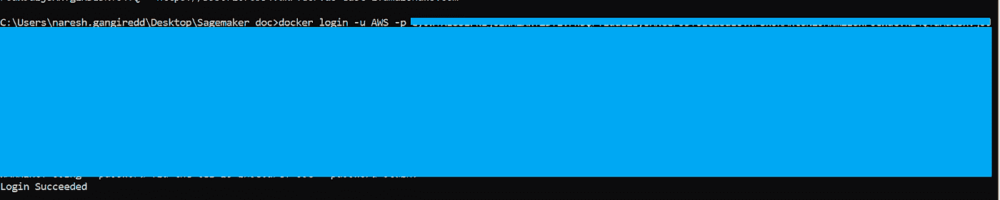
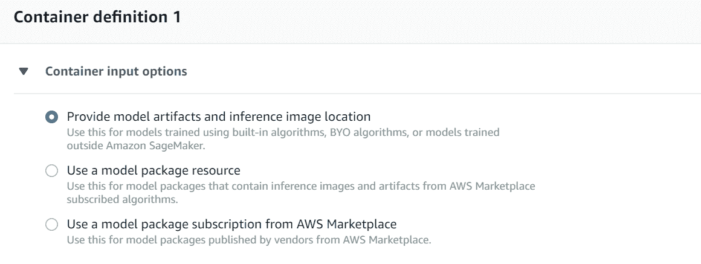
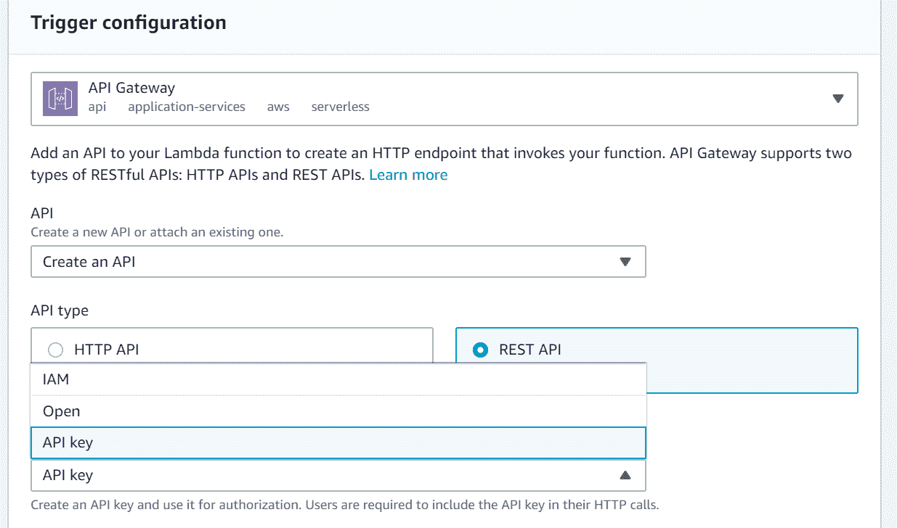

# 使用 AWS Sagemaker 部署自定义机器学习模型

> 原文：<https://medium.com/analytics-vidhya/deploy-your-own-model-with-aws-sagemaker-55b4234be4a?source=collection_archive---------3----------------------->

Sagemaker 是一个完全托管的机器学习服务，它为您提供使用内置算法构建模型的支持，并对自带算法和 ML 框架(如 Apache MXNet、PyTorch、SparkML、Tensorflow 和 Scikit-Learn)提供本机支持。

在这篇文章中，我将介绍如何部署一个机器学习模型，它是使用自定义算法在本地构建和训练的，作为一个使用 Sagemaker、lambda 和 docker 的 REST API。

我将把这个过程分成 5 个步骤

*   步骤 1:构建模型并保存工件。
*   步骤 2:定义服务器和推理代码。
*   步骤 3:构建一个 Sagemaker 容器。
*   步骤 4:创建模型、端点配置和端点。
*   步骤 5:使用带有 API 网关触发器的 lambda 调用模型。

第一步:建立模型并保存工件。

构建模型并序列化用于预测的对象。在这篇文章中，我使用简单的线性回归，一个独立变量。

将 python 对象序列化为 pickle 文件后，以 tar.gz 格式保存工件(pickle 文件),并上传到 S3 桶中。

**第二步:定义服务器和推理代码。**

当端点被调用时，Sagemaker 与 Docker 容器交互，后者运行托管服务的推理代码，处理请求并返回响应。容器需要实现一个 web 服务器来响应端口 8080 上的/invocations 和/ping。

容器中的推理代码将接收来自基础设施的 GET 请求，它应该用一个 HTTP 200 状态代码和一个空主体来响应 Sagemaker，这表明容器准备好在调用端点接受推理请求。

和调用是接收 POST 请求并根据算法中指定的格式进行响应的端点

要制作 model REST API，你需要 **Flask** ，它是 WSGI(Web 服务器网关接口)应用框架，**guni corn**WSGI 服务器， **nginx** 反向代理和负载平衡器。

编码:[https://github . com/NareshReddyy/Sagemaker _ deploy _ own _ model . git](https://github.com/NareshReddyy/Sagemaker_deploy_own_model.git)

**第三步:Sagemaker 容器。**

Sagemaker 广泛使用 docker 容器。您可以将模型的脚本、算法和推理代码放在容器中，其中包括运行时、系统工具、库和其他用于部署模型的代码，这为运行您自己的模型提供了灵活性。

您从存储库中保存的*图像*创建 Docker 容器。您可以根据 Dockerfile 文件中提供的脚本指令构建映像。

Dockerfile 文件描述了您想要构建的映像，其中包含您想要运行的系统的完整操作系统安装。使用标准的 Ubuntu 安装作为基础映像，运行普通的工具来安装推理代码所需的东西。你需要

将 nginx.conf、predictor.py、serve 和 wsgi.py 所在的文件夹(Linear_regx)复制到/opt/code，并将其作为工作目录。

Amazon Sagemaker 容器库将容器将要运行的脚本放在/opt/ml/code/目录中

要构建本地映像，请使用以下命令。

码头建造<image-name></image-name>

在 AWS ECR 中创建一个存储库，并将本地映像标记到该存储库中。

存储库具有以下结构:

<account number="">. dkr . ECR .<region>. Amazon AWS . com/:<tag></tag></region></account>

docker 标签 <image-name><repository-name>:<image-tag></image-tag></repository-name></image-name>

在推送存储库之前，您需要配置 AWS CLI 并登录

一旦您执行了上面的命令，您将会看到类似于

docker login -u AWS -p xxxxx，使用此命令登录 ECR。

对接按钮 <repository name="">:</repository> 

**步骤 4:创建模型、端点配置和端点。**

创建模型可以通过 API 或 AWS 管理控制台来完成。提供模型名称和 IAM 角色。

在容器定义中，选择提供工件和推断图像的位置并提供工件和图像 URI 的 S3 位置。

创建模型后，创建端点配置并添加已经创建的模型。

当您有多个模型要托管时，您可以选择多个模型选项在单个端点下托管多个模型，而不是创建多个端点，这在托管多个模型时是有成本效益的。

您可以更改实例类型和实例数量，并根据您的要求启用弹性接口(EI)。

您还可以启用数据捕获，将预测请求和响应保存在 S3 存储桶中，该存储桶提供了在模型质量出现偏差(如数据漂移)时设置警报的选项。

使用现有配置创建端点

**步骤 5:使用带有 API 网关触发器的 lambda 调用模型。**

使用 API 网关触发器创建 Lambda。

在 API 网关触发器配置中，向 Lambda 函数添加一个 REST API，以创建一个调用 Sagemaker 端点的 HTTP 端点。

在函数代码中，读取从 API 网关接收的请求，并将输入传递给 invoke_endpoint，并捕获和返回响应给 API 网关。

现在打开 API 网关可以看到 lambda 函数创建的 API，并创建所需的方法(POST)和集成 lambda 函数。通过在请求体中提供输入并检查输出来进行测试。

您可以使用 Sagemaker 笔记本或 lambda 来测试您的端点。

