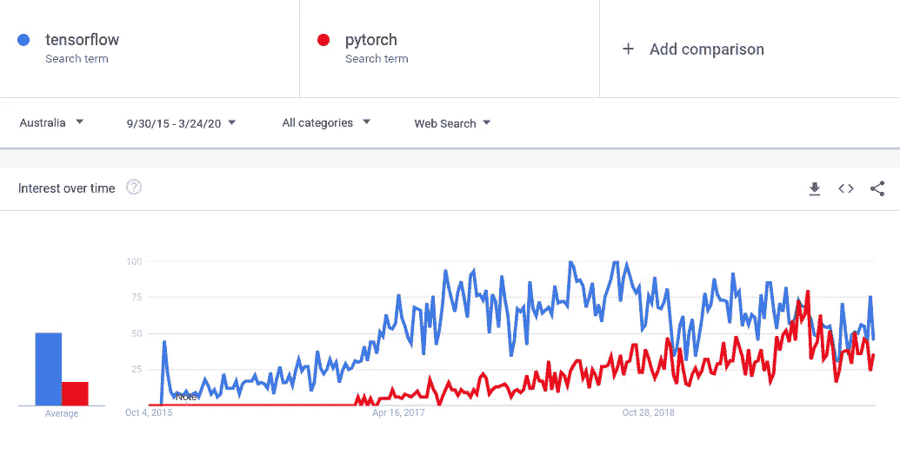
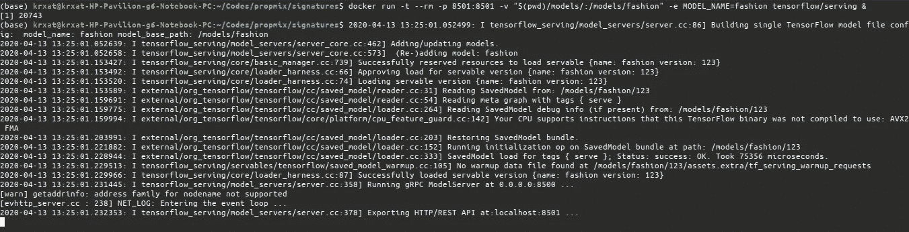

# 使用分类签名部署您的生产就绪 TensorFlow v2.x 模型。

> 原文：<https://medium.com/analytics-vidhya/deploy-your-production-ready-tensorflow-v2-x-models-with-classify-signature-71d58316570c?source=collection_archive---------13----------------------->

如果一个中型博客在开始时没有一张无关的图片，仅仅是为了给事情增加一点活力，那它还有什么意义呢？(:


由 [Unsplash](https://unsplash.com?utm_source=medium&utm_medium=referral) 上的[克里斯托佛罗拉](https://unsplash.com/@krisroller?utm_source=medium&utm_medium=referral)拍摄的照片

既然我们已经解决了这个问题，让我们继续讨论重要的问题。

# 介绍

对于具有 TensorFlow 基础知识以及如何使用 TensorFlow 2.x 构建模型的基础知识的中级人员来说，这是更好的读物。创建分类模型的最佳参考是[此处](https://www.tensorflow.org/tutorials/keras/classification)。

所以，你们都知道，TensorFlow v1.x 非常糟糕，我从心底里讨厌它，但有了 TensorFlow v2.x，它并没有完全改变，但他们通过让初学者和像我们这样经验有限的人更容易编码和创建模型，改进了很多。对于那些不知道 Tensorflow v1.x 的人来说，抽象数据结构需要用一种叫做图形的东西来定义。实际上，要执行代码，必须使用会话。这个系统有一个陡峭的学习曲线，因为它与 Python 编程的正常方式如此不同。调试这样的程序也非常困难，因为当打印一个图形节点时，我们不会得到一个具体的值，而只会看到一个引用。

在版本 2.0 中，Tensorflow 从图形/会话架构中移出，并包含了急切执行。急切执行是一种必不可少的编程方法，它们会立即评估操作，而无需构建图形。随着 Keras 集成到 TF 本身中，而不是作为一个单独的包，我们有幸减少了 TF 错误和兼容性问题，这是任何人都无法理解的。(不像 TF 团队会帮助解决问题)

无论如何，即使有可怕的支持和不太好的文档，TF 仍然是最受欢迎的选择，因为它在 2015 年推出，主要是因为它支持的平台，如分别使用 tflite 和 tf.js 的手机和网页，以及使用其 [SavedModel](https://www.tensorflow.org/guide/saved_model) 格式的生产就绪 TFServing。



我在这里要解释的是如何为分类模型创建一个“分类”签名，并将其保存为 [SavedModel](https://www.tensorflow.org/guide/saved_model) 格式，以便在 [TFServing](https://www.tensorflow.org/tfx/guide/serving) 中使用。

# TFServing 是什么？

TensorFlow Serving 实现了一个运行机器学习模型的服务器，并提供对它们的远程访问。常见任务是对提供的数据进行预测和分类。如果你是一个使用 TF 进行开发和部署的人，我会建议你去看看，因为这是一种非常优化的部署模型的方式，而且非常棒。

## 为什么我们需要分类签名

因此，TF 提供了三种现成的签名类型，在部署 TFServing 时可以利用这三种签名。点击此[链接](https://www.tensorflow.org/tfx/serving/signature_defs)了解更多信息。

但长话短说，基本上如果你处于分类问题中，你有两个选择:

1.  使用“预测”签名，该签名返回模型的 softmax 输出，然后您必须编写一个包装器代码来转换该输出，并在客户端获取标签。
2.  使用“分类”签名，该签名返回标签及其来自模型本身的分数，可以由客户端应用程序直接解释，而无需编写包装器代码。

所以你通常会想为什么我们不用“分类”呢，对吗？是的，也许 TF 不希望你这么做，因为没有任何文档说明如何创建这个签名。间接的，有一些例子展示了如何使用“分类”来创建一个，就像这个 mnist [例子](https://github.com/tensorflow/serving/blob/master/tensorflow_serving/example/mnist_saved_model.py)。但仅此而已，没有更多关于如何创建一个细节。甚至这个例子也被埋在很多其他链接下，几乎不可能找到。

# 让我们进入代码。

## 要求

所以基本上你需要用 TensorFlow 2.x 版本来设置你的系统，这个版本可以在[这里](https://www.tensorflow.org/install)找到。

## 密码

所以首先我们需要找到一个数据集和一个模型来解释整个过程。由于这不是一篇关于设计模型的文章，我不打算详细介绍如何创建模型。

在这里，我将使用 fashion-mnist 数据集，它在`tf.keras.datasets`中提供，以方便使用，但我可以向你保证，所有类型的分类数据都可以直接通过。我们将使用一个非常简单的两层 CNN。

## 进口

除了 tf 库本身，我们不需要任何东西

```
import tensorflow as tf
from tensorflow.python.ops import lookup_ops
from tensorflow.python.ops import array_ops
from tensorflow.python.framework import dtypes
from tensorflow.python.saved_model.signature_def_utils_impl import build_signature_def
from tensorflow.python.saved_model.signature_def_utils_impl import is_valid_signature
from tensorflow.compat.v1.saved_model.utils import build_tensor_info
from tensorflow.python.saved_model import tag_constants, signature_constants
from tensorflow.python.saved_model import builder as saved_builder
from tensorflow.compat.v1.keras.backend import get_session
```

此外，我们将需要关闭 TF2 中的急切执行，以使用 TF1 中的一些方法。所以，

```
tf.compat.v1.disable_eager_execution()
```

## 获取数据集

这是准备 fashion-mnist 数据集的标准代码。这里没什么有趣的。

```
fashion_mnist = tf.keras.datasets.fashion_mnist
(train_images, train_labels), (test_images, test_labels) = fashion_mnist.load_data()# scale the values to 0.0 to 1.0
train_images = train_images / 255.0
test_images = test_images / 255.0# reshape for feeding into the model
train_images = train_images.reshape(train_images.shape[0], 28, 28, 1)
test_images = test_images.reshape(test_images.shape[0], 28, 28, 1)class_names = ['T-shirt/top', 'Trouser', 'Pullover', 'Dress', 'Coat',
               'Sandal', 'Shirt', 'Sneaker', 'Bag', 'Ankle boot']print('\ntrain_images.shape: {}, of {}'.format(train_images.shape, train_images.dtype))
print('test_images.shape: {}, of {}'.format(test_images.shape, test_images.dtype))
```

## 定义您的模型

具有密集输出的标准 2 层 CNN。

```
model = tf.keras.Sequential([
  tf.keras.layers.Conv2D(input_shape=(28,28,1), filters=8, kernel_size=3, 
                      strides=2, activation='relu', name='Conv1'),
  tf.keras.layers.Flatten(),
  tf.keras.layers.Dense(10, activation=tf.nn.softmax, name='Softmax')
])
model.summary()
```

## 签名部分

这是没有文档的部分。这对于保存模型以供 TF 使用**分类 API 动作**是必要的。我们将使用这些来正确地生成签名定义。TF 服给点文档[这里](https://www.tensorflow.org/serving/signature_defs)。

所以有多种方法可以做到。我将在这里解释我认为最有效的添加签名的方法。我将在 GitHub repo 中添加其他方法。

```
def preprocess_image(image_buffer):
    image = tf.image.decode_jpeg(image_buffer, channels=1)
    image = tf.image.resize(image, (28, 28))
    image = tf.image.convert_image_dtype(image, dtype=tf.float32)return image / 255
```

因此，按照 TensorFlow 的定义，将提供给 classify API 的输入是字符串缓冲区。因此，上面的这个函数将帮助我们把图像缓冲区转换成一个浮点张量。

```
NUM_CLASSES = len(class_names)serialized_tf_example = array_ops.placeholder(tf.string,
                                              name='tf_example')
feature_configs = {'x': tf.io.FixedLenFeature([], tf.string), }
tf_example = tf.io.parse_example(serialized_tf_example,
                                 feature_configs)jpegs = tf_example['x']
x = tf.map_fn(preprocess_image, jpegs, dtype=tf.float32)
y = model(x)# Create Signature
values, indices = tf.nn.top_k(y, NUM_CLASSES)
table = lookup_ops.index_to_string_table_from_tensor(
    vocabulary_list=tf.constant(class_names),
    default_value="UNK",
    name=None
    )
prediction_classes = table.lookup(tf.cast(indices, dtype=dtypes.int64))classification_inputs = build_tensor_info(serialized_tf_example)
classification_outputs_classes = build_tensor_info(prediction_classes)
classification_outputs_scores = build_tensor_info(values)classification_signature = build_signature_def(
  inputs={
      tf.compat.v1.saved_model.signature_constants.CLASSIFY_INPUTS:
          classification_inputs
  },
  outputs={
      tf.compat.v1.saved_model.signature_constants
      .CLASSIFY_OUTPUT_CLASSES:
          classification_outputs_classes,
      tf.compat.v1.saved_model.signature_constants
      .CLASSIFY_OUTPUT_SCORES:
          classification_outputs_scores
  },
  method_name=tf.compat.v1.saved_model.signature_constants
  .CLASSIFY_METHOD_NAME)# Checking validation
valid_signature = is_valid_signature(classification_signature)
if not valid_signature:
    raise ValueError("Error: Classification signature not valid!")
```

所以，这里所发生的一切:

*   首先，我们定义一些在 TFServer 中运行它所需的输入。
*   输入将是一串图像缓冲区，如这里定义的。因此，我们需要将其转换为 float32，从而使用`tf.map_fn.`向图形添加预处理功能
*   然后传递占位张量并得到输出。因为我们已经禁用了急切执行，所以它不会被执行，但是我们会得到一个占位符张量。
*   然后，我们为包含所有类名的类创建一个表或散列表，然后根据它们的分数进行排序。
*   最后，我们构建要添加到图中的张量，并传递给它一个由 tf 提供的`build_signature_def`,以根据我们的需要创建签名定义。
*   然后，我们可以用另一个内置函数`is_valid_signature.`来验证我们刚刚创建的签名

但是我们还没有将此图添加到我们的模型图中，该部分将在稍后保存模型时出现。

## 训练模型。

现在我们已经完成了所有这些，我们可以编译和训练模型了。

```
epochs = 1
model.compile(optimizer=tf.optimizers.Adam(), 
              loss='sparse_categorical_crossentropy',
              metrics=['accuracy'])model.fit(train_images, train_labels, epochs=epochs)
```

## 保存模型

现在，为了保存模型，我们必须将它保存为上面指定的 SavedModel 格式，以便用于 TFServing。我们还将创建的签名添加到模型中。

```
export_path = 'models/123'
session = get_session()
builder = saved_builder.SavedModelBuilder(export_path)# Add the meta_graph and the variables to the builder
serv_key = signature_constants.DEFAULT_SERVING_SIGNATURE_DEF_KEY
builder.add_meta_graph_and_variables(
      session, [tag_constants.SERVING],
      signature_def_map={
           serv_key: classification_signature,
      },
      main_op=tf.compat.v1.tables_initializer(),
      strip_default_attrs=True)
# save the graph
builder.save()
```

`get_session`函数将为我们提供现有的图表，我们必须添加我们的签名。这是用一种叫做`saved_builder`的东西完成的，更多信息[在这里](https://www.tensorflow.org/api_docs/python/tf/compat/v1/saved_model)。我们将我们的签名添加到现有的图中，在这种情况下是我们的模型并保存它。

现在，模型将保存在指定的文件夹中，其中包含文件夹资产和变量以及 saved_model.pb 文件。如果是这样，我们已经准备好部署模型了。

# 在 TFServing 中部署模型

因此，有多种方式部署这个可用的可服务模型[这里是](https://www.tensorflow.org/tfx/guide/serving)。这里我们将使用最简单的方法，即使用 TFServing docker。更多文档请点击[这里](https://www.tensorflow.org/tfx/serving/docker)。要遵循的步骤是:

*   你需要安装 Docker。查看[此处](https://docs.docker.com/get-docker/)了解更多信息。
*   通过以下方式提取 TensorFlow docker 服务器映像

```
sudo docker pull tensorflow/serving
```

*   然后在保存模型的目录中打开终端，用下面给出的命令运行 docker 映像

```
docker run -t --rm -p 8501:8501 -v "$(pwd)/models/:/models/fashion" -e MODEL_NAME=fashion tensorflow/serving &
```

这将创建一个 docker 容器，其中运行 TensorFlow 服务器，并将我们的模型作为输入。确保位于包含 saved_model.pb 的文件夹所在的文件夹中。我将很快写另一篇博客来解释部署部分。

*   现在模型正在运行，您应该会看到类似这样的内容



现在，如果您看到一条消息“正在进入事件循环”，这意味着您的模型当前正在运行并准备接受请求。

*   发送请求并获得输出。

为此你需要一些图书馆。

```
import requests
import base64
import json
```

我们需要将我们的图像以指定的格式发送到 TensorFlow 服务器创建的 URL。

```
headers = {"content-type": "application/json"}
SERVER_URL = '[http://localhost:8501/v1/models/fashion:classify'](http://localhost:8501/v1/models/fashion:classify')loaded_image = open('test_image.jpg', 'rb').read()
jpeg_bytes = base64.b64encode(loaded_image).decode('utf-8')body = {
    "signature_name": "serving_default",
    "examples" : [{
        "x": { "b64": jpeg_bytes},  
     }]
}
r = requests.post(SERVER_URL, data=json.dumps(body), headers = headers)
```

我们以字节的形式读取图像，将其编码为 base64，包装成 JSON 格式，然后向该格式的 URL 发送 post 请求。如果成功，你将获得一个`<Response [200]>`。现在要获得输出，我们需要做的只是读取输出的内容。

```
json.loads(r.text)
```

# 完成的

啊，瞧，Donee…！！！你将得到你的输出，包括班级和他们各自的分数。您的输出可能如下所示。

```
{'results': [[['Bag', 0.999858618],
   ['Shirt', 6.90536544e-05],
   ['T-shirt/top', 4.54395085e-05],
   ['Trouser', 2.42908627e-05],
   ['Dress', 2.16052649e-06],
   ['Ankle boot', 3.70926585e-07],
   ['Pullover', 3.7451251e-08],
   ['Coat', 1.59411251e-09],
   ['Sneaker', 9.65969305e-10],
   ['Sandal', 1.49970661e-11]]]}
```

现在，您已经有了一个可供生产的模型。当我说生产就绪模型时，这不是部署模型的最佳方式。虽然，这就是如何用分类签名 API 正确保存分类模型。

这是我发布的笔记本的[链接](https://github.com/cypherix/Deploy-TensorFlow-v2.x-models/blob/master/tfmodel_with_classify.ipynb)。如果您有任何疑问，请在 GitHub repo 中创建一个问题或发表评论。