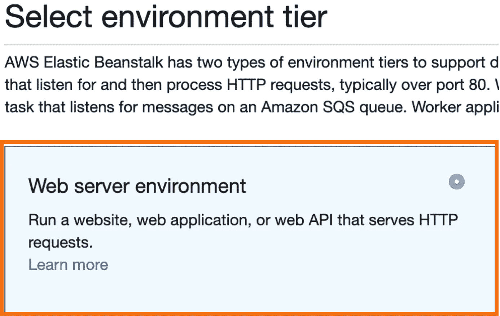

# 将 Flask 应用程序部署到 AWS 弹性豆茎

> 原文：<https://medium.com/analytics-vidhya/deploying-a-flask-app-to-aws-elastic-beanstalk-f320033fda3c?source=collection_archive---------0----------------------->

*AWS 初学者的简单教程(使用 Python 和 MAC OS)*


由 [NASA](https://unsplash.com/@nasa?utm_source=medium&utm_medium=referral) 在 [Unsplash](https://unsplash.com?utm_source=medium&utm_medium=referral) 上拍摄的照片

如果您刚刚开始使用 AWS 服务，希望您会发现这很有帮助！当我开始使用 AWS 时，我遇到的错误很少。我为每个错误提供解决方案。现在不用纠结浪费时间了。

## **什么是烧瓶？**

[Flask](https://pymbook.readthedocs.io/en/latest/flask.html) 是用 python 写的 web 框架。它为您提供了工具、库和技术，允许您构建 web 应用程序。这个 web 应用程序可以是一些网页、一个博客、一个 wiki，也可以是一个基于 web 的日历应用程序或一个商业网站。

## 什么是 AWS 弹性豆茎？

[AWS Elastic Beanstalk](https://docs.aws.amazon.com/elasticbeanstalk/latest/dg/Welcome.html) 是一种用于部署执行各种 AWS 服务的应用程序的服务，包括 EC2、S3、简单通知服务、CloudWatch、自动伸缩和弹性负载平衡器。

使用 Elastic Beanstalk，您可以在 AWS 云中快速部署和管理应用程序，而无需担心运行这些应用程序的基础设施。它降低了管理的复杂性，而不限制选择或控制。您只需上传您的应用程序，Elastic Beanstalk 就会自动处理容量供应、负载平衡、伸缩和应用程序健康监控等细节。

**本文涵盖的内容:**

*   如何创建一个 AWS 弹性豆茎环境
*   如何创建一个简单的烧瓶应用程序
*   如何在 AWS 弹性豆茎上上传您的 Flask 应用程序
*   如何调试错误

## 创建应用程序

转到 [AWS 弹性豆茎](https://console.aws.amazon.com/elasticbeanstalk/home?region=us-east-1#/welcome)并点击右上角的**创建新应用**。


在给你的应用程序一个**名字**和简短的**描述**之后点击创建。该名称可以是任何名称。

## 创造环境

点击**立即创建一个**在您的教程应用程序中创建环境。


现在，您必须选择一个环境层。在本教程中，我们将使用一个 **web 服务器环境**。



## **环境信息**

*   给你的**环境**一个**名字**
*   为**域**选择一个唯一的名称
*   写一个简短的**描述**


## **基本配置**

*   在本教程中，我们使用 **python** 作为我们的**预配置平台**
*   我们稍后将上传 flask 应用程序。对于**应用代码**，保持**样本应用**被选中。

> 单击创建环境。它应该需要几分钟直到它准备好。

## 创建一个简单的烧瓶应用程序

> 如果你想跳过这一部分，你可以下载这个 [Flask Zip 文件](https://github.com/Cryptolytic-app/cryptolytic/blob/master/medium_articles/flask_app.zip)，它包含了 flask app 需要的所有文件，你可以直接进入**上传 Flask App** 部分:)

创建一个名为`application.py`的新文件，并将下面的代码粘贴到其中。

```
from flask import Flaskapplication = Flask(__name__)

@application.route("/")
def index():
    return "Your Flask App Works!"

@application.route("/hello")
def hello():
    return "Hello World!"

if __name__ == "__main__":
    application.run(port=5000, debug=True)
```

创建一个名为`requirements.txt`的新文件，并将下面的应用程序依赖项粘贴到其中。

```
Click==7.0
Flask==1.1.1
itsdangerous==1.1.0
Jinja2==2.10.3
MarkupSafe==1.1.1
Werkzeug==0.16.0
```

创建一个名为`.ebextensions`的文件夹**。复制下面的代码，在`.ebextensions`文件夹中保存为一个名为`app.config`的新文件。**

```
files:
  "/etc/httpd/conf.d/wsgi_custom.conf":
    mode: "000644"
    owner: root
    group: root
    content: WSGIApplicationGroup %{GLOBAL}
```

**注意:** *上面的代码块被用在我的项目中，因为我在 Elastic Beanstalk 上有一个* [*超时*](https://stackoverflow.com/questions/41812497/aws-elastic-beanstalk-script-timed-out-before-returning-headers-application-p) *错误。您可能不需要在您的部署中使用这个解决方案，但是如果您遇到类似的错误，这可能会有所帮助。这里有一些关于*[*WSGIApplicationGroup*](https://modwsgi.readthedocs.io/en/develop/configuration-directives/WSGIApplicationGroup.html)*的文档。*


现在你需要将所有的文件压缩在一起(*包括隐藏的文件夹*)来上传 flask 在 Elastic Beanstalk 上的应用。要在 finder 中查看隐藏文件，请按`cmd+shift+.`。将 zip 文件命名为`flask_app.zip`或任何您想要的名称。

## 上传一个烧瓶应用到弹性豆茎

现在，您应该将 flask 应用程序放在一个 zip 文件中，其文件夹结构如下:

```
- application.py
- requirements.txt
- /.ebextensions
     - app.config
```

有时当你创建 zip 文件时，它会包含一些不需要的隐藏文件。这通常会在你试图上传到 Elastic Beanstalk 时导致错误。为了解决这个问题，请遵循以下步骤。

打开“终端”并转到 zip 文件所在的位置。
**注意:** *这个可能不在你保存 zip 文件的同一个位置。您可以找到您的 zip 文件，并将其拖到您的 Documents 文件夹中。*
**例如:**

```
cd Documents
```

**运行下面这一行:** *如果需要，用您的 zip 文件的名称替换* `*flask_app.zip*`

```
*zip -d flask_app.zip __MACOSX/\**
```

***注:**此图为我的 project flask app [zip 文件](https://github.com/Cryptolytic-app/cryptolytic/blob/master/api_source_code/Flask_App.zip)。它看起来像什么的一个例子。如果你按照这个教程去做，你应该不会得到同样的结果。*

**

*这将清除任何额外的隐藏文件，包括在您的压缩文件。它们不需要上传到 Elastic Beanstalk 上，这可能会导致部署失败。有时候你不会有任何隐藏文件。*

***注意:**我再次运行该行代码，它返回一个 zip 错误。那就好！*

**

*现在我们已经准备好将我们的 zip 文件上传到 Elastic Beanstalk。返回到您的 elastic beanstalk 环境仪表板，并单击 **Upload and Deploy。***

**

*选择您的 zip 文件并点击 **deploy。然后等到你的健康标志变成绿色勾号，点击健康标志上方的网站链接。***

*如果您成功地完成了所有这些步骤，您的网站链接应该会将您带到一个显示有`Your Flask App Works!`:)的页面*

## *如何在您的环境中查看错误日志？*

*对于本教程，在部署简单的 flask 应用程序时，您应该不会得到任何错误，但是知道如何调试是有好处的。*

***按照以下步骤查看错误日志***

*在您的 Elastic Beanstalk 环境仪表板的左侧，单击**日志***

**

*然后点击**请求日志**并选择**最后 100 行**查看最近的错误。*

**

*点击**下载**，它会带你到一个页面，在那里你可以看到最后 100 行。*

**

*下面是一个错误日志页面示例。确保您看到的是应用程序执行的最近时间。*

**

*现在，您可以访问您的错误日志，并能够找到解决方案。*

*教程结束！现在你的 flask app 可以设置在 **AWS 弹性豆茎**上了。如果我能看到这篇文章，它会为我在做项目时节省很多时间。*

*这篇文章最终将成为我和我的团队在从事一个名为 Cryptolytic 的项目时所学到的经验的系列文章的一部分(文章将很快写出来并链接到这里)。这是我们在进行项目时希望拥有的指南。*

**

***包含本文中使用的所有代码的笔记本可以在这里**[](https://github.com/Cryptolytic-app/cryptolytic/tree/master/medium_articles)****找到，这是我们的密码破解项目的回购文件中的内容——所以如果你很好奇，可以去看看！*****

*****在 Twitter [@malexmad](https://twitter.com/malexmad) ， [Github](https://github.com/malexmad) 上找我，或者在 [LinkedIn](https://www.linkedin.com/in/marvin-davila/) 上联系我！*****

*****来源:*****

*****[](https://docs.aws.amazon.com/elasticbeanstalk/latest/dg/Welcome.html) [## 什么是 AWS 弹性豆茎？

### Amazon Web Services (AWS)包含 100 多个服务，每个服务都公开了一个功能领域。当……

docs.aws.amazon.com](https://docs.aws.amazon.com/elasticbeanstalk/latest/dg/Welcome.html)  [## 快速启动烧瓶文档(1.1.x)

### 一个最小的 Flask 应用程序看起来像这样:那么代码做了什么？首先，我们导入了这个类。安…

flask.palletsprojects.com](http://flask.palletsprojects.com/en/1.1.x/quickstart/#) [](https://github.com/Cryptolytic-app/cryptolytic) [## 密码破解-app/密码破解

### 你可以在 Cryptolytic 找到这个项目。Trello 板产品 Canvas Cryptolytic 是一个为初学者修修补补的平台…

github.com](https://github.com/Cryptolytic-app/cryptolytic)*****