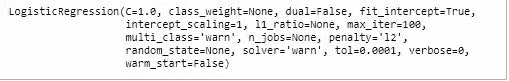

# 在 Heroku 上部署机器学习模型作为 Flask 应用程序-第 1 部分

> 原文：<https://medium.com/analytics-vidhya/deploying-a-machine-learning-model-as-a-flask-app-on-heroku-part-1-b5e194fed16d?source=collection_archive---------10----------------------->


照片由[戴维斯科](https://unsplash.com/@codytdavis?utm_source=medium&utm_medium=referral)在 [Unsplash](https://unsplash.com?utm_source=medium&utm_medium=referral) 拍摄

作为一名数据科学家，我确信你一定在某个时候想过将你的模型的结果传达给其他人。好吧，如果还没有，你就在正确的地方，因为本教程会给你关于这样做的知识。作为一名数据科学家，向您的主管或技术人员传达您的结果以进行评估可能不成问题，因为这非常简单——您只需将模型保存到磁盘或与他人共享您的 Jupyter 笔记本。

如果你不得不把你的成果分享给一个很少或没有专业技能的人，也许是一个你认为可能会对你的工作印象深刻的朋友或同事。你如何着手做这件事？。当然，考虑到这一点，我们需要某种接口在它们和你的工作或某种网络应用之间进行交流。这个听起来还不错吧:)？

**本教程将分为两部分:**

1.  开发一个可以部署的简单模型，用户可以使用 Flask(python 中的一个微 web 框架)创建 web 应用程序，与它进行交互以获得预测。
2.  在 Heroku 平台上部署我们最终的 web 应用程序。

网上有一些教程也是为了同样的目的，为了让学习者尽可能的直接，我会尽量把你需要知道的每一个重要细节都写得简短。

我们将部署的模型基于 sci-kit 的学习葡萄酒质量数据集。我们的模型将根据每种葡萄酒的给定化学指标来预测葡萄酒的质量。然而，您可以部署任何您喜欢的模型。

# **要求**

安装以下软件。简单地安装它们

*   Python 3.6
*   瓶
*   熊猫
*   Sklearn

最终 web 应用程序的源代码可以在 https://github.com/oluakintoye/wine-qual.git 的 Github 上找到

# 创建部署模型

在您首选的 IDE 上:

我们将从 sci-kit 学习库中加载葡萄酒数据

在[1]中:

```
**import** pandas **as** pd
**import** numpy **as** np
**from** sklearn.datasets **import** load_wine

wine = load_wine()

data = pd.DataFrame(data= np.c_[wine[**'data'**], wine[**'target'**]],
                     columns= wine[**'feature_names'**] + [**'target'**])
data.head()
```

Out[1]:


## **数据统计和预处理:**

我们将观察数据的细节，并对其进行检查，以了解预处理数据的正确步骤。我们想要预测的变量是目标(葡萄酒质量),我们将使用这些特征来实现。

在[2]中:

```
data.info()
```

Out[2]:


在[3]中:

```
data.describe()
```

Out[3]:


如果我们观察上面输出中显示的各种统计数据，这些数据没有足够数据类型的空值，并且足够规范化以执行我们的预测。

## **训练模型:**

在[4]中:

```
**from** sklearn.linear_model **import** LogisticRegression
**from** sklearn.model_selection **import** train_test_split

X = data.iloc[:, :-1]
y = data.iloc[:, -1]

X_train, X_test, y_train, y_test = train_test_split(X, y, test_size=0.25, random_state=0)

clf = LogisticRegression()
clf = clf.fit(X_train,y_train)

clf
```

Out[4]:



我们将通过查看准确性来快速评估训练好的模型

在[5]中:

```
**from** sklearn.metrics **import** accuracy_score

y_pred = clf.predict(X_test)

print(**"accuracy_score: %.2f"** % accuracy_score(y_test, y_pred))
```

Out[5]:


## **设置我们的模型准备部署**

我们将使用 Pickle 保存我们的模型，以便在以后需要进行预测时重新加载。点击阅读更多关于泡菜[的信息。](https://docs.python.org/3/library/pickle.html)

在[6]中:

```
import picklepath=**'./lib/models/LogisticRegression.pkl'

with** open(path, **'wb'**) **as** file:
    pickle.dump(clf, file)
```

# 用 Flask 创建 web 应用程序

Flask 是一个用 python 编写的 microweb 框架，它允许你非常快速和容易地构建 web 应用程序和网站。它是轻量级的，因为它不需要太多的样板代码来设置它。如果你是 flask 的新手，你可以上 tutorialspoint [这里](https://www.tutorialspoint.com/flask/index.htm)上的快速 flask 教程。我们将需要以下内容来设置 web 应用程序，例如:

*   flask 将呈现的 HTML 或 web 模板。这允许用户输入他们自己的数据并显示结果
*   python 脚本将加载我们的模型，并从 web 表单获取用户输入，进行预测并返回结果。

应用程序目录的结构如下:


## app.py

这是我们 web 应用程序的核心。这里的代码包含用于捕获和处理用户输入、运行 flask development web 服务器、渲染模板的信息，也是在 Heroku 服务器上运行的内容。

```
**from** flask **import** Flask, render_template

app = Flask(__name__)

@app.route(**'/'**)
**def** main():
    **return**(render_template(**'main.html'**))

**if** __name__ == **'__main__'**:
    app.run()
```

在 flask 中，根据您定义的路由，URL 被路由到不同的函数。

如果我们运行这个脚本，我们将看到转到我们的基本 URL( http://127.0.0.1:5000/)将触发 main 函数，我们的 main.html 页面将会显示出来。现在我们的 main.html 页面是空的，所以让我们尝试用一些东西填充主体，然后再次运行我们的 app.py 脚本来看看结果。

## **main.html**

我们将在 html 文件的主体中添加一个标签来显示欢迎消息

```
<!DOCTYPE **html**>
<**html lang="en"**>
<**head**>
    <**meta charset="UTF-8"**>
    <**title**></**title**>
</**head**>
<**body**>
    <**h1**>Welcome!!!</**h1**>
</**body**>
</**html**>
```


现在我们的模板正在渲染，让我们做以下事情:

1.  编辑我们的 app.py 脚本来加载模型、捕获和处理输入以给出预测
2.  编辑 main.html 有一个表单，获得我们需要的用户输入，并提交显示适当的预测

值得注意的是，对 flask web 框架的良好了解对于理解代码非常重要，如果需要，请参考 [flask 文档](https://flask.palletsprojects.com/en/1.1.x/)。

## 编辑 app.py

```
**from** flask **import** Flask, render_template, request
**import** pandas **as** pd
**import** pickle

app = Flask(__name__)# Loading the Pre-trained model using Pickle
**with** open(**'./lib/models/LogisticRegression.pkl'**, **'rb'**) **as** file:
    model = pickle.load(file)

@app.route(**'/'**, methods=[**'GET'**, **'POST'**])
**def** main():
    **if** request.method == **'GET'**:
        **return**(render_template(**'main.html'**)) #Getting Form Input
    **if** request.method == **'POST'**:
        alcohol =  request.form[**'alcohol'**]
        malic_acid =  request.form[**'malic_acid'**]
        ash =  request.form[**'ash'**]
        alcalinity_of_ash = request.form[**'alcalinity_of_ash'**]
        magnesium =  request.form[**'magnesium'**]
        total_phenols   =  request.form[**'total_phenols'**]
        flavanoids      =  request.form[**'flavanoids'**]
        nonflavanoid_phenols =  request.form[**'nonflavanoid_phenols'**]
        proanthocyanins      =  request.form[**'proanthocyanins'**]
        color_intensity     =  request.form[**'color_intensity'**]
        hue                  =  request.form[**'hue'**]
        od280_od315_of_diluted_wines   =  request.form[**'od280_od315_of_diluted_wines'**]
        proline  =  request.form[**'proline'**] #Putting Form input in a data frame        input_variables = pd.DataFrame([[alcohol, malic_acid, ash,                alcalinity_of_ash, magnesium, total_phenols,flavanoids, nonflavanoid_phenols,proanthocyanins, color_intensity, hue,
od280_od315_of_diluted_wines, proline]],
columns=[**'alcohol'**, **'malic_acid'**, **'ash'**, **'alcalinity_of_ash'**, **'magnesium'**,**'total_phenols'**, **'flavanoids'**, **'nonflavanoid_phenols'**,
 **'proanthocyanins'**, **'color_intensity'**, **'hue'**,                                 **'od280/od315_of_diluted_wines'**, **'proline'**], dtype=float)

        # Predicting the Wine Quality using the loaded model
        prediction = model.predict(input_variables)[0]
        **if** prediction == 0.0:
            prediction = **"Poor Wine Quality"
        elif** prediction == 1.0:
            prediction = **"Good Wine Quality"
        else**:
            prediction = **"Fine Wine Quality"

        return** render_template(**'main.html'**, result=prediction)

**if** __name__ == **'__main__'**:
    app.run()
```

## 编辑 main.html

```
<!DOCTYPE **html**>
<**html lang="en"**>
<**head**>
    <**meta charset="UTF-8"**>
    <**title**></**title**>
</**head**>
<**body**>
    <**form action="{{ url_for('main') }}" method="POST"**>
    <**fieldset**>
        <**legend**>Input values:</**legend**>
        Alcohol:
        <**input name="alcohol" type="float" value="14.23" required**>
        <**br**>
        <**br**> Malic Acid:
        <**input name="malic_acid" type="float" value="1.71" required**>
        <**br**>
        <**br**> Ash:
        <**input name="ash" type="float" value="2.43" required**>
        <**br**>
        <**br**>
        Alcalinity of ash:
        <**input name="alcalinity_of_ash" type="float" value="15.6" required**>
        <**br**>
        <**br**> Magnesium:
        <**input name="magnesium" type="float" value="127.0" required**>
        <**br**>
        <**br**> Total Phenols:
        <**input name="total_phenols" type="float" value="2.80" required**>
        <**br**>
        <**br**>
        Flavanoids:
        <**input name="flavanoids" type="float" value="3.06" required**>
        <**br**>
        <**br**> Non-Flavanoid Phenols:
        <**input name="nonflavanoid_phenols" type="float" value="0.28" required**>
        <**br**>
        <**br**> Proanthocyanis:
        <**input name="proanthocyanins" type="float" value="2.29" required**>
        <**br**>
        <**br**>
        Color Intensity:
        <**input name="color_intensity" type="float"  value="5.64" required**>
        <**br**>
        <**br**> Hue:
        <**input name="hue" type="float" value="1.04" required**>
        <**br**>
        <**br**> Diluted wines:
        <**input name="od280_od315_of_diluted_wines" type="float" value="3.92" required**>
        <**br**>
        <**br**> Proline:
        <**input name="proline" type="float" value="1065.0" required**>
        <**br**>
        <**br**>
        <**input type="submit"**>
    </**fieldset**>
</**form**>
<**br**>
<**div class="result" align="center"**>
    
        <**br**> Predicted Quality of Wine:
           <**p style="**font-size:50px**"**>{{ result }}</**p**>
    
</**div**>
</**body**>
</**html**>
```

在编辑了我们的 app.py 和 main.html 脚本之后，重新运行 app.py 并访问您的本地主机(http://127.0.0.1:5000/)来呈现 html 模板。填写适当的输入，并提交您应该有这样的东西:


在这种情况下，根据我们对葡萄酒化学物质的输入，我们对葡萄酒质量的预测是“一款好酒”。尝试您的输入并获得您的预测:)。应该注意的是，这里构建的模型并不完美，但旨在演示如何将模型部署到 web 应用程序中。您可以微调模型或构建任何您选择的模型。

此外，我们将了解如何在云服务 Heroku 上部署我们的应用程序。

请务必查看本教程的第[部分第 2](/@oluakintoye/deploying-a-machine-learning-model-as-a-flask-app-on-heroku-part-2-9d8366eb784c) 部分，了解如何将 web 应用程序部署到云中。

如果你有任何反馈，请与我分享。也可以在 [LinkedIn](https://www.linkedin.com/in/oluakintoye/) 上关注我或与我联系。感谢阅读。