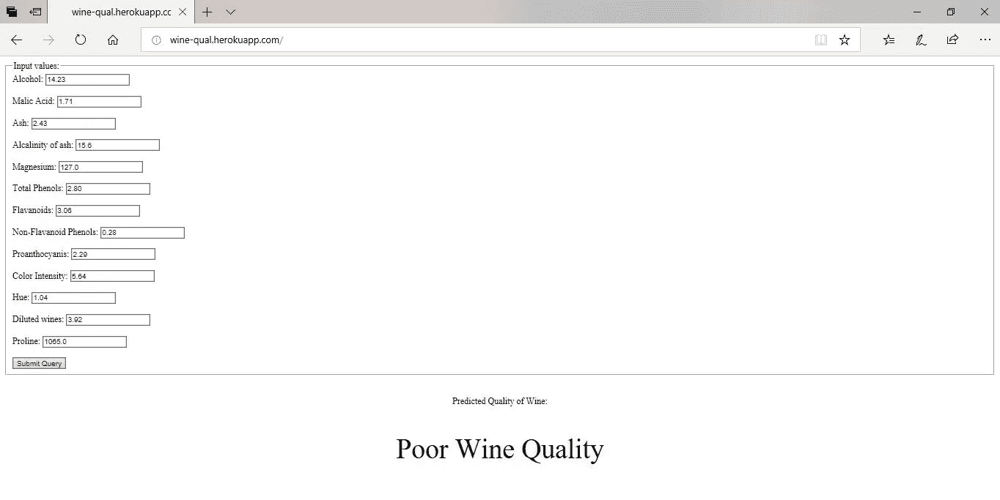

# 在 Heroku 上部署机器学习模型作为 Flask 应用程序-第 2 部分

> 原文：<https://medium.com/analytics-vidhya/deploying-a-machine-learning-model-as-a-flask-app-on-heroku-part-2-9d8366eb784c?source=collection_archive---------11----------------------->

*本教程是* [*第一部分*](/@oluakintoye/deploying-a-machine-learning-model-as-a-flask-app-on-heroku-part-1-b5e194fed16d) *中关于在 Heroku 上部署机器学习模型作为 flask app 的文章的延续。在这一部分，我们将在 Heroku 的平台上部署 web 应用程序。*


照片由 [pha tran](https://unsplash.com/@alanka?utm_source=medium&utm_medium=referral) 在 [Unsplash](https://unsplash.com?utm_source=medium&utm_medium=referral) 上拍摄

## **Heroku-用于应用部署**


Heroku 是一个云平台，允许开发者完整地构建、运行和操作他们的应用程序。作为一个平台即服务(PaaS)，Heroku 支持多种编程语言，这些语言被用作 web 应用程序开发模型。

至此，我们已经有了一个在本地运行的 web 应用程序。然而，这很难分享，但将我们的 flask 应用程序部署到 Heroku 将使人们更容易访问您的应用程序。为此，您需要执行以下操作:

1.  注册一个[免费 Heroku 账户](https://signup.heroku.com/signup/dc)
2.  安装 [Git](https://git-scm.com/downloads)
3.  安装 [Heroku CLI 工具](https://devcenter.heroku.com/articles/heroku-cli#download-and-install)。

# 部署

在部署应用程序之前，我们必须在 webapp 文件夹中创建几个文件:

1.  requirements.txt:这是一个文本文件，向 Heroku 指明构建应用程序时使用的依赖项或包。即 flask、sklearn、gunicorn

```
flask
pandas
numpy
sklearn
gunicorn
```

2.Procfile:这是一个没有扩展名的文件，是我们的主机平台 Heroku 固有的，应该表明我们正在使用一个 web 服务，给出了它的配置细节。Procfile 帮助 heroku 检测应用程序应该从哪里开始。

```
web: gunicorn -b :$PORT app:app
```

## 生产 Web 堆栈

将 flask 应用程序部署到生产环境中时，有一些重要事项需要注意:

Flask 内置的开发 web 服务器非常适合测试，但不应该用于生产。它不适合，因为它不能很好地伸缩，并且默认情况下一次只能服务一个请求。

通过在生产环境中运行 web 应用程序，我们希望它能够处理多个用户请求，而不必在获得响应之前等待很长时间。为此，应使用生产堆栈。

生产设置由多个组件组成，这些组件专为某一特定事物而构建和设计。生产堆栈中的通信类似于 flask 的内置 web 服务器；通过 HTTP。

总之，在生产中运行 flask 时，请确保:

1.  使用生产就绪的网络服务器，如 **Nginx**
2.  让 T2 的 WSGI T3 应用服务器来处理你的应用，比如 T4 的 guni corn T5

还要注意，当在 Heroku 上运行时，已经隐式地提供了一个 web 服务器，您应该在 Procfile 中指定一个命令来运行应用服务器(在我们的例子中是 Gunicorn)。

在创建了上述必需的文件之后，它们应该放在我们的 app.py 所在的目录中。下一步是使用您的终端来定位您的 web 应用程序文件夹，然后运行以下命令。

## 为 web 应用程序创建一个 git 存储库:

```
git init
```

## 使用 Heroku 登录:

注册 heroku 帐户后，您可以使用 CLI 登录

```
heroku login
```

系统会提示您按下任何键来打开默认的网络浏览器，然后您就可以登录了

## 创建新的 Heroku 应用程序:

```
heroku create [web app name]
```

这里，我们正在创建一个 heroku 应用程序，其中[web 应用程序名称]将是您首选的 web 应用程序名称。例如， *" heroku create wine-qual"* ，其中 wine-qual 是我们首选的 web 应用程序名称。

## 将文件添加到存储库:

```
git add .
git commit -m "First"
```

## 设置远程存储库:

这个命令设置远程 repo，以便使用 git 从我们的本地 web 应用程序推送到 Heroku。

```
heroku git:remote -a [web app name]
```

## 将您的应用推向网络:

这个命令将上传你的文件，安装它需要的软件包，并让应用程序在线运行！。

```
git push heroku master
```

如果一切正常，请转到您的[app-name].herokuapp.com，当然是用您选择的应用程序名称替换[app-name]。如果这样做之后，你看到了某种服务器错误，请确保检查你的应用程序，登录 heroku 并寻找你的 heroku 错误代码[以正确调试。](https://devcenter.heroku.com/articles/error-codes)



瞧啊。，您已经成功地部署了一个功能性的 web 应用程序，它可以将您的模型的结果与其他人进行交流。

一定要分享给别人看。如果你有任何反馈，请与我分享。请随时通过 [Linkedln](https://www.linkedin.com/in/oluakintoye/) 与我联系。感谢阅读。