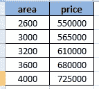
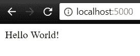
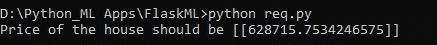

# 使用 Flask 和 Python 在 Web 上部署机器学习模型。

> 原文：<https://medium.com/analytics-vidhya/deploying-a-machine-learning-model-on-web-using-flask-and-python-54b86c44e14a?source=collection_archive---------3----------------------->

创建一个机器学习模型并对现实世界的问题进行预测听起来很酷。但是，这对于除了模型创建者之外的任何人来说都不是很有用，因为它只在他们的机器上可用。

在这篇文章中，我们将讨论如何使用 [**Flask**](http://flask.pocoo.org/) (一个用 Python 构建网站和 API 的微框架)来构建我们的 Web API


让我们通过用 Python 构建一个简单的**线性回归模型来开始这个过程**

**第一步**。使用 Scikit Learn 导入构建线性回归模型所需的所有必要库

在这里，我使用 homeprices.csv 文件来训练我们的模型，该模型有两个特征，面积和房价。



**第二步**。使用 pandas 读取数据并定义我们的训练变量

**第三步**。训练我们的模型

**第四步**。计算分数和系数，并对面积变量的某个值进行预测。

现在我们简单的线性回归模型已经准备好了，让我们转向模型持久化，并将上面的内容保存为**。pkl 文件**


现在我们的模型被保存了，并且可以通过在任何时候再次加载相同的模型而被重用。

让我们使用 Flask 构建一个 Web API，并理解以简单的方式实现它的过程。

# 对 Flask 的简单介绍

如果您下载了 Anaconda 发行版，那么您已经安装了 Flask，否则，您将不得不用— `pip install flask`自己安装它。

Flask 是非常小的，因为你只在需要的时候把零件带进来。为了演示这一点，下面是创建一个非常简单的 web 服务器的 Flask 代码。

```
from flask import Flaskapp = Flask(__name__) @app.route("/")
def hello():
    return "Hello World!" if __name__ == '__main__':
    app.run(debug=True)
```

一旦执行，您就可以导航到显示在终端上的网址，并观察预期的结果。



让我们回顾一下执行的代码在做什么。

导入后，我们创建 Flask 类的一个实例，并传入 Python 为我们填充的`[__name__](https://docs.python.org/3/library/__main__.html)`变量。如果这个文件作为脚本直接通过 Python 运行，这个变量将是`"__main__"`。如果我们导入文件，`__name__`的值将是我们导入的文件的名称。例如，如果我们有`test.py`和`run.py`，并且我们将`test.py`导入到`run.py`中，`test.py`的`__name__`值将是`test`。

在我们的`hello`方法定义之上，是`@app.route("/")`行。`@`表示一个[装饰器](https://jeffknupp.com/blog/2013/11/29/improve-your-python-decorators-explained/)，它允许它前面的函数、属性或类被动态改变。

`hello`方法是我们放置代码的地方，每当我们的应用程序或 API 的路由遇到顶级路由:`/`。

如果我们的`__name__`变量是`__main__,`,表明我们直接运行文件而不是导入它，那么它将启动 Flask 应用程序，它将运行并等待 web 请求，直到过程结束。

# 创建 API

## 预测 API

预测 API 非常简单。我们给它我们的数据，房子的面积，并把它传递给我们模型的`predict`方法。

这里发生了不少事情，我们来分解一下。

类似于上面介绍 Flask 的代码，我们称之为`@app.route`装饰器。

> 在我们的路由方法定义中，我们将请求方法限制为 GET/POST，如果是这样，我们[获取请求体](http://flask.pocoo.org/docs/0.12/api/#flask.Request.get_json)的 JSON，这样我们就可以访问它的数据。有了这个变量，我们就可以访问我们想要的数据的键— `area`并把它解析成一个浮点数。我们还将模型从持久文件加载到内存中。

如果解析数据没有错误，那么我们将解析后的变量传递给线性回归模型的`predict`方法；当我们在启动时加载 Flask 应用程序时，该变量被拉入内存。接下来，我们必须将`predict`方法的输出改为一个列表，因为没有它，我们会得到一个错误:`Object of type 'ndarray' is not JSON serializable`。然后我们调用 Flask 的`[jsonify]([http://flask.pocoo.org/docs/0.12/api/#flask.json.jsonify](http://flask.pocoo.org/docs/0.12/api/#flask.json.jsonify))`方法以 JSON 的形式发送响应数据。

> 现在我们可以运行我们的 API 了(在 PyCharm 中，您只需右键单击脚本中的任意位置，然后单击“run”)。随着 API 的运行，我们可以执行代码来调用它。

最后，我们可以在终端上看到输出。



***在这篇文章中，我们学习了 Flask 是什么，如何使用它来创建 API，最重要的是如何应用这些知识来创建与机器学习模型交互的 API。***

我希望你觉得这个教程有用，谢谢你读到这里。我很好奇你是怎么想的，所以给我一些建议吧。你也可以通过[邮箱](mailto:soumyansh@gmail.com)直接和我联系。