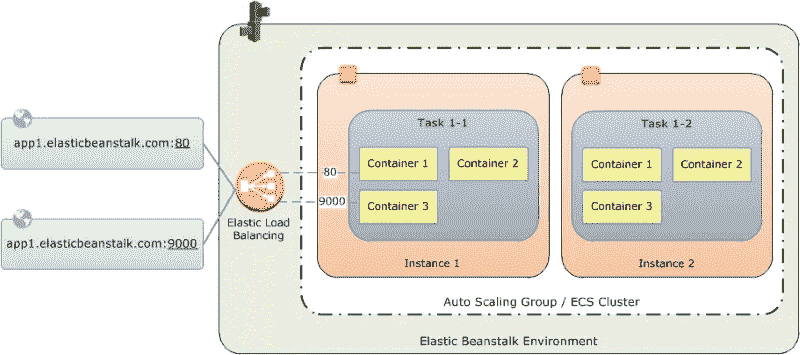

# 部署多容器 Web 应用程序— AWS Elastic Beanstalk

> 原文：<https://medium.com/analytics-vidhya/deploying-a-multi-container-web-application-aws-elastic-beanstalk-c5f95d266842?source=collection_archive---------0----------------------->

虽然有很多关于在 [AWS Elastic Beanstalk](https://docs.aws.amazon.com/elasticbeanstalk/latest/dg/GettingStarted.html) 上构建和部署容器化 web 应用程序的资源，但在为基于微服务架构的应用程序构建端到端工作流方面仍然存在一些差距——从本地开发设置到最终在 AWS 上构建和部署。

[https://docs . AWS . Amazon . com/elastic beanstalk/latest/DG/images/aeb-multi container-docker-example . png](https://docs.aws.amazon.com/elasticbeanstalk/latest/dg/images/aeb-multicontainer-docker-example.png)