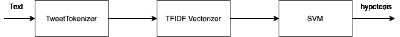
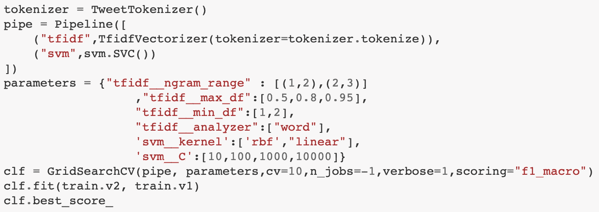
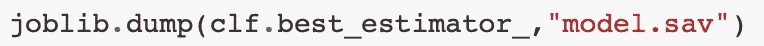
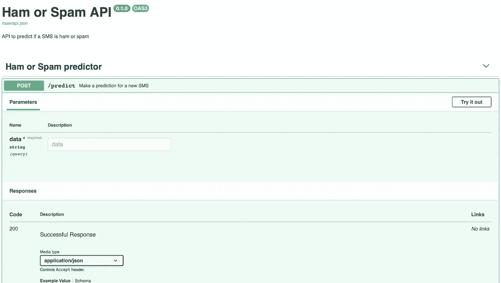
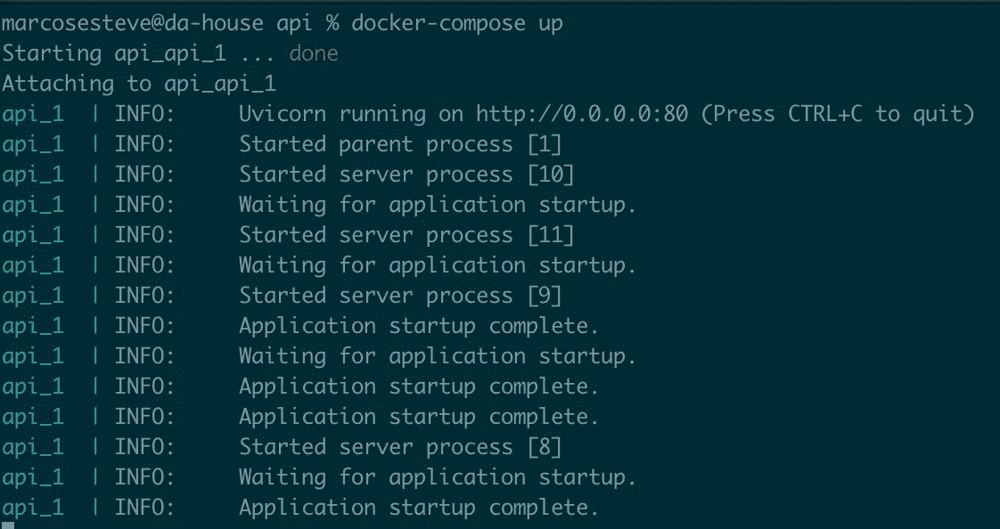

# 使用 Docker 和 FastAPI 部署 NLP 模型

> 原文：<https://medium.com/analytics-vidhya/deploying-a-nlp-model-with-docker-and-fastapi-d972779d8008?source=collection_archive---------5----------------------->

格伦·卡斯滕斯-彼得斯在 [Unsplash](https://unsplash.com?utm_source=medium&utm_medium=referral) 上拍摄的照片

作为一名数据科学家，我的工作通常包括为大量不同的任务开发机器学习或深度学习模型。我经常从 Jupyter 笔记本开始，对数据进行探索和实验。当我清楚我将要使用的模型时，我创建一些部署脚本。通常，这些脚本由 API 和 Docker 映像组成，以允许在云中或本地系统中快速部署。

在本文中，我将提供一种简单的方法来为 NLP 任务开发和部署 API。在这种情况下，我将为 Kaggle 竞赛创建一个模型:【https://www.kaggle.com/uciml/sms-spam-collection-dataset/[。该任务包括将一系列 SMS 消息分类为垃圾消息或非垃圾消息(ham)。这个数据集的主要问题是样本很不平衡。我们有 4825 个样本不是垃圾邮件，747 个样本是垃圾邮件。](https://www.kaggle.com/uciml/sms-spam-collection-dataset/)

# 建立⚒模型

垃圾邮件或垃圾邮件检测管道

为了构建这个模型，我将在 scikit 中创建一个简单的管道——学习在哪里使用 [NLTK](https://www.nltk.org) 首先标记文本，然后我将创建一个 [TF-IDF 矢量器](https://scikit-learn.org/stable/modules/generated/sklearn.feature_extraction.text.TfidfVectorizer.html)来表示文本信息。最后我会用 TF-IDF 加权的一袋单词训练一个[支持向量机](https://scikit-learn.org/stable/modules/svm.html)。对于每一步，我将使用[网格搜索](https://scikit-learn.org/stable/modules/generated/sklearn.model_selection.GridSearchCV.html)方法和 10 倍交叉验证评估来探索一些超参数。由于类别不平衡，我将使用 F1 宏来评估模型。带探索的笔记本在[https://github . com/mares cas/spam _ ml/blob/main/notebooks/spam . ipynb](https://github.com/marescas/spam_ml/blob/main/notebooks/spam.ipynb)中。

网格搜索寻找最佳模型

当模型被训练、评估并且结果良好时(测试集中 98%的 F1-宏),下一步是保存模型以允许您的生产脚本使用它。为此，我们可以使用 joblib 库。

保存最佳模型以用于生产

# 构建 API ⚙️

现在我们已经训练并保存了模型。是时候构建我们的 API 来为生产服务了。为此，我将使用 [FastAPI](https://fastapi.tiangolo.com) 。FastAPI 是一个构建在 [Pydantic](https://pydantic-docs.helpmanual.io) 、 [Starlette](https://www.starlette.io) 和 [Swagger](https://swagger.io) 之上的库，允许开发者用 Python 构建快速而健壮的 API。多亏了 Pydantic，现在检查数据类型比不检查更容易了。此外，由于 Swagger，为 API 构建自动交互文档成为可能。

我开发的 API 只有一个端点，用于预测给定新短信的假设类。正如我们在下面的代码片段中看到的，它非常简单😁。

基本上，您需要加载模型，然后用推理逻辑定义端点。在本例中，我想用一个名为“data”的参数作为字符串来定义一个 POST 方法。由于强大的类型化，Pydantic 可以检查输入数据是否是字符串，如果不是，它可以返回一个异常。

此外，正如我所说的，由于 fastAPI 和 Swagger 之间的集成，我们可以自动生成交互式文档。当你需要向其他人解释你的 API 是如何工作的时候，这是非常有用的。

用 Swagger 生成的简单交互式文档

# 使用 Docker 部署🏎

现在，我们有了一个训练有素的模型，可以很好地检测短信是否是垃圾短信。此外，我们有一个用 FastAPI 开发的 API，允许我们为这个模型服务。我们还需要一样东西，一种封装代码并将应用程序移植到不同平台的方法。为此，我将使用 [Docker](https://www.docker.com) 和 [Docker-compose](https://docs.docker.com/compose/) 。基本上，Docker 允许将代码封装在容器中，并以一种简单的方式移植应用程序。

Dockerfile 文件

正如我们在前面的脚本中看到的，我们的 API 使用[uvicon](https://www.uvicorn.org)运行。Uvicorn 是一个 ASGI 服务器实现，使用 [uvloop](https://github.com/MagicStack/uvloop) 和 [httptools](https://github.com/MagicStack/httptools) 。多亏了 uvicorn，我们可以为同一个 API 加载 4 个工人。

docker-compose.yml

此外，由于 Docker-compose，我们可以用声明的方式定义我们的应用程序如何运行。对于本例，定义非常简单，我们只将主机端口 8080 映射到 docker 端口 80。使用 **docker-compose up** 我们可以启动 API😁。这个 API 将在端口 8080 上运行…

使用 docker-compose 部署模型

# 结论📚

在这篇文章中，我们学习了如何构建和部署一个简单的 API 来预测一条短信是否是垃圾短信。为了构建这个 API，我们使用一些工具，如 Scikit-Learn、FastAPI 和 Docker。正如我所说的，这只是一个原型，使用其他技术如 MLflow 也是可能的，但这将是另一篇文章…我希望你发现这篇文章是有帮助的，感谢阅读。该代码可从以下链接获得:

 [## marescas/spam_ml

### 为垃圾邮件检测构建一个功能性的应用程序 GitHub 是 5000 多万开发者的家园，他们共同努力…

github.com](https://github.com/marescas/spam_ml) 

# 关于作者

Marcos Esteve 是 SolverIA 的机器学习工程师。马科斯在工作中为各种各样的任务开发机器和深度学习模型。他对多模态任务和构建数据科学应用非常感兴趣。在 [Linkedin](https://www.linkedin.com/in/marescas/) 或 [Twitter](https://twitter.com/mecprojects) 上联系他