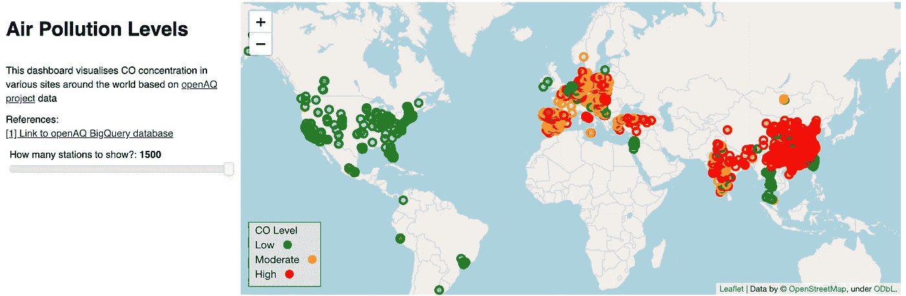

# 用 15 个步骤将 Python 应用程序部署到 Heroku-AtoZ

> 原文：<https://medium.com/analytics-vidhya/deploying-a-python-app-to-heroku-atoz-in-15-steps-8e526f24c76f?source=collection_archive---------17----------------------->

**目标:**在您的本地机器上成功开发了一个 python 应用程序后，您希望将其托管在 web 上，以便通过公共 URL 进行查看/共享。

**背景:**几周前，我制作了一个简单的 python 仪表盘，从 Google BigQuery 上的 OpenAQ 数据集获取实时空气质量数据，并将其可视化在地图上……类似这样:

一氧化碳(CO)污染水平的世界地图，作为 OpenAQ 计划的一部分，在 1500 多个空气质量站进行测量。

该脚本(用 python 版本 3.6.8 编写)使用了来自 *bigquery* 库的模块来访问/查询数据集，*follow*包来制作交互式传单地图，以及 *panel* 库来生成仪表板(我将在另一篇文章中详细讨论该脚本)。在您的计算机上生成这个仪表板很容易:您下载 python 脚本(或者从 GitHub 存储库中克隆它)，安装所需的库和依赖项，然后运行脚本…瞧！控制面板显示在本地主机的浏览器窗口中(例如， [http://localhost:5000/](http://localhost:5000/) )。现在，假设您想从另一台计算机远程查看这个仪表板，或者向朋友展示它。听起来很简单，对吧？！嗯……不太好。如果你是一个 R 用户，你可能会遇到 RStudio team 的 Shiny，这是一个简单易用的软件包，用于直接从 R 创建交互式 web 应用程序。然而，对于像我这样的生态系统新手来说，python 中的过程并不那么简单。

> 您需要的是一种在 web 上托管您的 python 代码并获得一个公共 URL 的方法，使您能够查看/共享您的工作。如果你不知道如何去做，你和我当时的处境一样，这篇文章就是为你写的！

有许多平台可以托管 python 脚本，Heroku 就是其中之一。Salesforce 拥有的 Heroku 是一个云平台即服务(PaaS ),支持许多编程语言(包括 python ),并且对于我们在这里要做的事情(即实验)是免费的。

下面是我按照本文中的步骤创建的 web 应用程序的链接:[https://frozen-journey-90261.herokuapp.com/](https://frozen-journey-90261.herokuapp.com/)

# 按照以下步骤将您的 python 应用程序部署到 Heroku:

**先决条件:**确保 *Git* 已经安装在您的计算机上，并且您已经对从您的命令 shell(也就是 mac 上的终端)使用 *Git* 有了基本的了解。我已经在 mac 电脑上测试了这些步骤，但我认为这个过程对 pc 用户来说是相似的。

1.  [Heroku](https://devcenter.heroku.com/articles/getting-started-with-python)入门:创建一个免费的 Heroku 账户并设置 Postgress(如果你打算在本地运行该应用，这是必需的——推荐！).
2.  安装 Heroku 命令行界面(CLI)。对于 macOS 用户，您只需下载并运行[安装程序](https://cli-assets.heroku.com/heroku.pkg)。一旦安装完毕，您就可以从您的命令 shell 中使用`heroku`命令。
3.  打开命令 shell 并使用`heroku login`命令登录 Heroku CLI。该命令打开您的 web 浏览器，进入 Heroku 登录页面。如果您的浏览器已经登录 Heroku，只需点击页面上显示的 ***登录*** 按钮。为了使`heroku`和`git`命令正常工作，这种认证是必需的。
4.  为您的应用程序创建一个新目录(这将是您的应用程序的根目录)。
5.  在 Heroku `heroku create`上创建一个应用程序，让 Heroku 准备好接收你的源代码。这提供了一个随机生成的应用程序名称和 URL，以及一个与您的项目相关联的 git remote。
6.  初始化 git repo `git init`，并将 Heroku git repo 添加到遥控器`heroku git:remote -a <app name>`
7.  创建一个虚拟环境* `python -m venv venv/`
    *这是一个很重要的步骤，但有时人们会忽略它！当您编写代码时，您需要许多模块/库来运行它。当您在本地运行应用程序时，这是可以的，但当您在服务器上部署 python 应用程序时，您需要确保包含所有依赖项，否则您的代码将无法运行(通常是由于缺少或过期的模块/库)。创建一个虚拟环境可以防止这样的问题，并为您节省大量时间，我将在下面解释原因。
8.  不要忘记激活虚拟环境`source venv/bin/activate`，现在提示将以 *(venv) …* 开始
9.  包括 python 脚本(。py 或者。ipynb 文件扩展名)和目录中的其他必需文件(如凭证 json 文件)。
10.  安装您的代码运行`pip install <python library>`
    所需的所有库因为您在虚拟环境中，所以您需要安装您的代码所需的所有*库。这确保您包含了所有正确版本的内容。*
11.  *确保应用程序与安装在 *venv* 中的库一起工作，并且没有遗漏任何依赖项。现在，运行下面的代码，它在应用程序`pip freeze > requirements.txt`的根目录下的一个新文件 **requirements.txt** 中捕获所有需要的库*
12.  *(可选)Heroku 设置可以接受额外的信息，如凭据。例如，在我的脚本中，我需要 google 凭证来访问 BigQuery 数据集，因此要将它包含在部署中:
    `heroku config:set GOOGLE_APPLICATION_CREDENTIALS=’<filename.json>’`*
13.  *执行最后一次本地测试，以确保应用程序顺利运行；为此，首先需要将一个 **Procfile** 添加到应用程序**的根目录中。**一个 **Procfile** 是一个文本文件(虽然没有扩展名！)在应用程序的根目录中，显式声明应该执行什么命令来启动应用程序。该命令(Procfile 中的一行文本)通常依赖于应用程序，例如面板:`web: panel serve --address=”0.0.0.0" --port=$PORT <script>.ipynb`
    …然后运行`heroku local`*
14.  *现在我们有了一个防错代码，为服务器部署做准备:首先修改 **Procfile** 以包含一个指向 Heroku URL 的指针，指向应用
    `web: panel serve --address=”0.0.0.0" --port=$PORT <script>.ipynb —-allow-websocket-origin=<app name>.herokuapp.com`
    …然后更新 git:
    `git add .
    git commit -m “<message>”
    git push heroku master`*
15.  *最后，运行应用程序`heroku open`
    这将在浏览器窗口中打开该应用程序，其网址为应用程序名称生成的 URL，即“https:// <应用程序名称> .herokuapp.com/”*

*提示:完成后，使用[日志命令](https://devcenter.heroku.com/articles/logging)、`heroku logs --tail`之一来查看关于正在运行的应用程序的信息是很有用的，在出现问题时，您也可以使用这些命令来进行诊断。*

***总结:**虽然 R 用户拥有出色的工具，但是 python 用户需要更多的工具来创建交互式 web 应用。在这里，我使用了面板库、follous 包和 Heroku 平台的组合来创建一个全球空气污染的交互式地图。可以按照本文介绍的步骤在 Heroku 云平台上部署任何 python web app。*

# ***参考文献***

*   *OpenAQ 网站:[https://openaq.org/](https://openaq.org/)*
*   *Google Cloud 上的 OpenAQ 数据集:
    [https://console . Cloud . Google . com/market place/details/open AQ/real-time-air-quality](https://console.cloud.google.com/marketplace/details/openaq/real-time-air-quality)*
*   *Heroku 云平台:[https://www.heroku.com/](https://www.heroku.com/)*
*   *https://postgresapp.com/*
*   *链接到 python BigQuery 客户端库:[https://cloud . Google . com/big query/docs/reference/libraries # client-libraries-install-python](https://cloud.google.com/bigquery/docs/reference/libraries#client-libraries-install-python)*
*   *链接到叶子:[https://python-visualization.github.io/folium/](https://python-visualization.github.io/folium/)*
*   *链接到面板:[https://panel.pyviz.org/](https://panel.pyviz.org/)*
*   *链接到 RStudio 闪亮:[https://shiny.rstudio.com/](https://shiny.rstudio.com/)*
*   *一个类似的空气质量数据的互动地图由闪亮在 R:[https://edanesh.shinyapps.io/my_openaq/](https://edanesh.shinyapps.io/my_openaq/)*