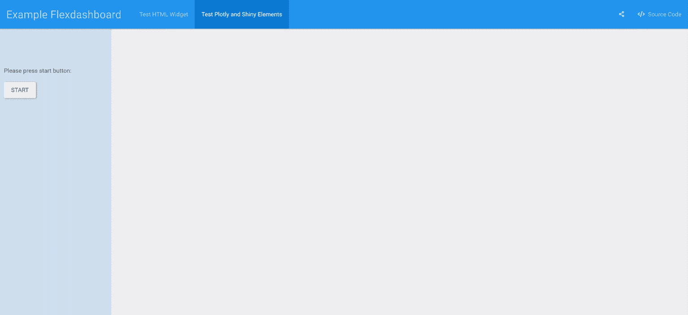

# 使用 Docker 部署闪亮的 Flexdashboard

> 原文：<https://medium.com/analytics-vidhya/deploying-a-shiny-flexdashboard-with-docker-cca338a10d12?source=collection_archive---------2----------------------->

## 漂亮仪表板的稳健部署。

Flexdashboard 示例。从 [shinyapps.io](https://walkerke.shinyapps.io/neighborhood_diversity/)

*这是关于微服务数据报告的系列文章的第二部分。要构建这个仪表盘，请参见第一部分，* [***闪亮仪表盘与 Flexdashboard***](/analytics-vidhya/shiny-dashboards-with-flexdashboard-e66aaafac1f2) *。关于使用闪亮的代理服务器在生产中大规模部署仪表板，请参见第三部分。*

*这篇文章也发表在*[*https://www.r-bloggers.com/*](https://www.r-bloggers.com/)*上。*

Dashboard 是一种快速、清晰、一致地提供数据洞察的绝佳方式。除了设计美观和有用的仪表板，一个主要的挑战是部署。在大多数业务中，除了数据分析师和各种技术之外，还有几个人参与其中。这导致了缓慢的部署过程和耗时的依赖性管理。在本文中，我们将学习如何使用 Docker 将以前的[build](/analytics-vidhya/shiny-dashboards-with-flexdashboard-e66aaafac1f2)[**R flex dashboard**](https://timosch.shinyapps.io/dashboard_example/)**封装成一个更易于复制、部署、扩展和管理的 web 应用程序。**

# 为什么是 Docker？

[来源](https://ertan-toker.de/docker-container-mongodb/)

[Docker](https://www.docker.com/why-docker) 是目前发展最快的开源技术之一。Docker 容器是运行应用程序的沙箱环境。不是模拟整个机器，而是只模拟一个 Linux OS plus 库。这种容器比虚拟机更轻量级，运行容器化的应用程序有很多优点。只使用分配给容器的资源，应用程序的环境总是相同的，不管它部署在哪个主机上。这使得 Docker 成为许多公司部署可复制的安全应用程序的首选工具。如果一个应用程序在一个容器中独立运行，并定义了与其他容器和主机的连接，那么它的管理和调试效率会更高。此外，由于减少了依赖性问题，软件安装速度更快，并且易于扩展。此外，标准化的构建、测试和部署环境支持软件开发的快速和健壮的 CI/CD 周期。各种服务和应用可以通过容器编排工具进行管理和负载平衡，例如 [Docker Swarm](https://docs.docker.com/engine/swarm/key-concepts/) 或 [Kubernetes](https://kubernetes.io/de/) 。

# 构建 Docker 容器

## 开始

容器是由 Dockerfile 文件中的指令定义的映像构建的。对于每条指令，构建一个中间映像，并将其用作基础映像。在 [Dockerhub](https://hub.docker.com/) 上已经有很多现成的图片可供下载。你也可以用这些图片作为你自己图片的基础。在[为您的主机系统安装 Docker](https://docs.docker.com/install/) 后，您可以通过终端中的`docker pull`下载公共图像。我们将在 Open Analytics[R Shiny image](https://hub.docker.com/r/openanalytics/r-shiny)的基础上构建 Shiny Flexdashboard 的容器。这个映像包含基本的 R、必要的 linux 库以及 Shiny 和 Rmarkdown R 包。你可以在 GitHub 上看到他们[对应的 Dockerfile。您可以通过`docker pull openanalytics/r-shiny`下载图像。](https://github.com/openanalytics/r-shiny/blob/master/Dockerfile)

## 文档文件

你可以在我的 [**GitHub repo**](https://github.com/timosch29/Dockerized-Shiny-Proxy-Server/tree/master/example_dashboard) 中查看这个 docker 文件和闪亮 Flexdashboard 的文件。

Dockerfile 文件指定了映像是如何构建的以及以什么顺序构建的。`FROM openanalytics/r-shiny`指定基本容器图像，后面的说明用注释解释。您可以在 [Docker 文档](https://docs.docker.com/engine/reference/builder/)或本[备忘单](https://kapeli.com/cheat_sheets/Dockerfile.docset/Contents/Resources/Documents/index)上获得 Docker 文件说明的概述。如果您没有 Flexdashboard Rmd 文件，并且想要部署一个闪亮的应用程序，那么您必须在最后修改`CMD`指令，就像[这个](https://github.com/TelethonKids/deploy_shiny_app/blob/master/webapp/Dockerfile)或者在这篇[中型文章](/@suomynonascitylana/getting-started-with-docker-to-do-data-science-and-deploy-a-shiny-app-46803f8a0a69)中描述的那样。

## 建立形象

使用命令`docker build`从 Dockerfile 文件构建一个映像。如果你已经克隆了我的 GitHub repo，在 Dockerfile `**docker build -t example_dashboard .**`的目录下运行下面的命令，这将从 Dockerfile 构建镜像并将其命名为 *example_dashboard* 。第一次下载和安装依赖项时，构建过程将运行几分钟。好的一面是，一旦您完成了一个步骤，它就会被缓存，当您更改 Docker 文件中的其他步骤时，您不必完全运行它，或者您甚至可以对另一个 Docker 映像使用相同的缓存步骤。您可以使用`docker image ls`查看主机上所有可用的图像。

码头形象建筑的终端输出

## 运行容器

使用命令`docker create`从图像制作容器，并使用带有图像名称的命令`docker start`启动容器。方便的是，有一个命令将两者结合成一个，我们将在这里使用，`docker run`。如果在您的主机上找不到图像名称，该命令甚至会尝试从 [Docker Hub](https://hub.docker.com/) 中提取图像。

我们用`**docker run --name=example_dashboard_container --rm -p 3838:3838 example_dashboard**`旋转容器。这将来自 Docker 容器的(先前展示的)端口 3838 映射到主机的相同端口 3838。参数`--rm`表示如果容器被停止，我们希望它被移除，我们用`--name=`指定容器名称(这不是必需的)。如果您希望能够进一步使用您的终端，请设置参数`-d`以在分离模式下运行。您仍然可以通过`docker logs example_dashboard_container`查看容器输出。

然后，您可以通过导航到[**http://localhost:3838**](http://localhost:3838)来访问浏览器呈现的 Docker 容器中闪亮的 Flexdashboard。瞧，您会看到本地部署的 Flexdashboard 具有闪亮的元素，无论它部署在哪台计算机上，都将始终给出相同的结果，并且无需管理依赖项和版本。

已部署的示例仪表板。在 [Shinyapps.io](https://timosch.shinyapps.io/dashboard_example/) 上试用一下

## 部署容器

为了使用 Flexdashboard 部署容器，您可以在安装了 Docker 的服务器上从 Docker 文件中再次构建映像。更方便的方法是通过`docker save -o ~/example_dashboard.tar example_dashboard`保存图像并将文件复制到服务器。然后通过`docker load -i example_dashboard.tar`加载图像并从中运行容器。您可以使用服务器的 IP 地址而不是浏览器中的本地主机来访问仪表板。如果您有域，也可以添加它，以便可以通过它访问您的仪表板。

你可以设置一个类似 **nginx** 的反向代理，根据子域将流量路由到不同的容器。是的，也有一个码头工人的形象。

如何将 Docker 容器部署到云提供商是有据可查的，你可以在网上找到说明和社区示例，例如针对**[**谷歌云**](https://blog.machinebox.io/deploy-docker-containers-in-google-cloud-platform-4b921c77476b) 和 [**数字海洋**](https://blog.machinebox.io/deploy-machine-box-in-digital-ocean-385265fbeafd) 。要在 Heroku free tier 上部署您的闪亮应用，请参见本文:[https://medium . com/analytics-vid hya/deploying-an-r-Shiny-app-on-Heroku-free-tier-b 31003858 b 68](/analytics-vidhya/deploying-an-r-shiny-app-on-heroku-free-tier-b31003858b68)。如果你想在专业环境中部署一个闪亮的应用/Flexdashboard，一个有价值的开源工具是 OpenAnalytics 的 [Shinyproxy](https://www.shinyproxy.io/) 服务器。关于使用 Shinyproxy 部署应用程序，请参阅本系列的第三部分。**