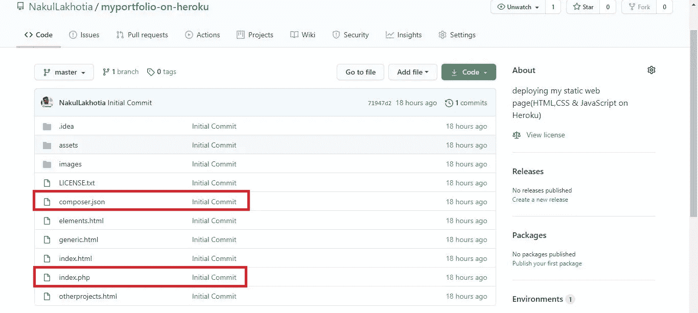
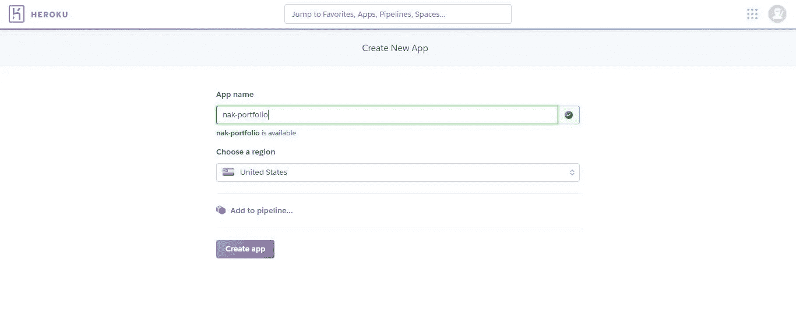
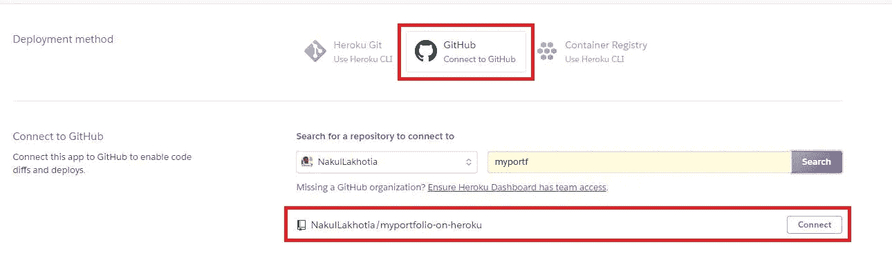
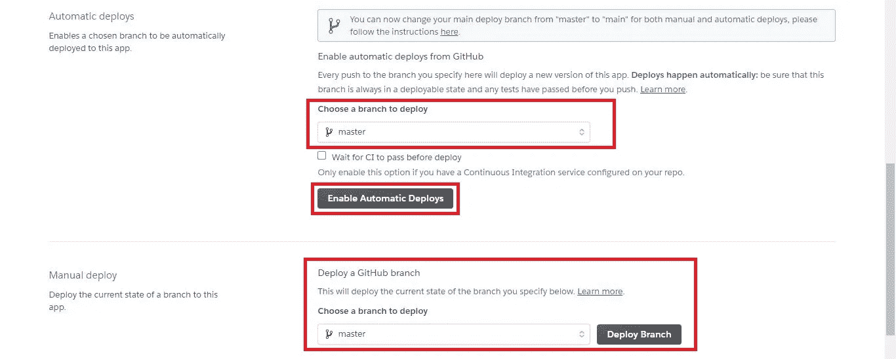

# 将静态 Web 应用程序部署到 Heroku

> 原文：<https://medium.com/analytics-vidhya/deploying-a-static-web-application-to-heroku-3f21e07e58a?source=collection_archive---------8----------------------->

## 将您的 HTML、CSS 和 JavaScript 应用程序部署到 Heroku


来源: [Unsplash](https://unsplash.com?utm_source=medium&utm_medium=referral)

因此，您已经创建了一个漂亮的 web 应用程序，它就在您的计算机中。它在那里做什么？难道你不想让别人看到你的创作，你的技艺吗？如何向世界展示你的应用？

**在线主持吧！！**

当你决定在网上托管你的 web 应用程序后，你必须决定在互联网的什么地方托管你的应用程序。最好的办法就是把它托管在云平台上。有许多云平台允许你在线托管你的应用程序，比如 AWS、Google Cloud、Microsoft Azure 等等。不过这里我们重点介绍一下 [**Heroku**](https://www.heroku.com/) 。

开始之前，让我们弄清楚什么是什么。

## 什么是 Heroku？

> Heroku 是一个基于容器的云平台即服务(PaaS)。开发人员使用 Heroku 来部署、管理和扩展现代应用。它支持 Java、Node.js、Scala、Clojure、Python、PHP 和 Go。

## **什么是静态 Web 应用？**

> 静态 web 应用程序是可以直接交付给最终用户的浏览器的任何 Web 应用程序，不需要在服务器端对 HTML、CSS 或 JavaScript 内容进行任何修改。简单地说，基于 HTML、CSS 和 JavaScript 的应用程序是静态的 web 应用程序。

假设您已经创建了一个 web 应用程序，那么您必须按照这些步骤在 Heroku 上部署您的应用程序。****以下步骤适用于在 Heroku** 上托管所有静态网络应用。作为一个例子，我将使用我的投资组合并将其部署到 Heroku。**

1.  **创建一个 GitHub 存储库并上传您的应用程序文件**
2.  **在 Heroku 上创建一个帐户**
3.  **连接 Heroku 上的 GitHub 库并部署**

## **1.创建一个 GitHub 存储库并上传您的应用程序文件**

**要了解如何创建新的存储库，[单击此处](https://docs.github.com/en/enterprise/2.15/user/articles/create-a-repo)。如果你想知道如何上传文件到你的仓库，你可以从这里得到帮助。所有文件上传后，您的存储库看起来应该有点像这样。**

****

**上传文件到你的 GitHub 库**

*****注意，在上图中，我在我的“index.html”文件所在的同一个目录下又创建了两个文件。*****

**但是为什么需要创建一个 PHP 文件呢？**

**因为 Heroku 不会识别一个纯粹基于 HTML、CSS 和 JavaScript 的静态 web 应用程序。部署时，它会显示以下错误消息:**

```
!     No default language could be detected for this app.
HINT: This occurs when **Heroku cannot detect the buildpack** to use for this application automatically.
See https://devcenter.heroku.com/articles/buildpacks!     
Push failed
```

**什么是 Heroku Builpacks？**

> **Heroku Buildpacks 决定了一个应用程序的构建过程，以及哪些资产和运行时应该在运行时对您的代码可用。**

**所以您的应用程序需要转换成一个 **PHP 应用程序**。请遵循以下步骤:**

**a)在“index.html”文件所在的同一目录下创建“index.php”文件。在 php 文件中添加一行代码。要了解 include_once 语句，请点击[此处](https://www.php.net/manual/en/function.include-once.php)。**

```
<?php include_once("index.html"); ?>
```

**b)在“index.html”文件所在的同一目录下创建“composer.json”文件。该文件描述了项目的依赖项，也可能包含其他元数据。将下面一行添加到 json 文件中。(空的花括号)**

```
{}
```

**c)提交并上传这些附加文件到你的 GitHub 库，如上图所示。**

**现在，我们的 GitHub 库已经准备好了。**

## **2.在 Heroku 上创建一个帐户**

**如果您是新用户，请访问 [Heroku](https://www.heroku.com/) 并注册一个新帐户或登录您的帐户。要创建新应用程序，请单击页面右上角的“新建”按钮，然后选择“创建新应用程序”。接下来的页面打开，你需要命名你的应用，然后点击“创建应用”按钮。**

****

**在 Heroku 创建新应用程序**

## **3.连接 Heroku 上的 GitHub 库并部署**

**点击“创建应用”按钮后，将打开以下页面:**

****

**连接到 Heroku 上的 GitHub 库**

**首次选择 GitHub 作为您的部署方式时，您需要登录您的 GitHub 帐户。一旦你的 GitHub 被连接，你将被要求选择一个包含你的网络应用的库。点击“连接”按钮。这将为您提供以下选项。**

****

**部署您的 GitHub 分支**

**选择存储库所在的分支。最后，单击 Deploy Branch 按钮，在 Heroku 上部署您的应用程序。如果部署成功，将显示消息"**您的应用已成功部署**出现在页面底部。点击消息下方的“查看”按钮，在 Heroku 上查看您的申请。**

****就这样！！**您的应用已经托管在 Heroku 云平台上。您可以与您的朋友和家人分享应用程序链接，向他们展示您所创建的内容。任何能够访问互联网和您的应用程序的人都可以使用您的应用程序。好激动:)**

**[](https://www.buymeacoffee.com/nakullakhotia)

如果你喜欢读这篇文章，请支持我。点击上图。谢谢你** 

**我在 Heroku 上的投资组合:[https://nakul-portfolio.herokuapp.com/](https://nakul-portfolio.herokuapp.com/)**

*****注*** *:你需要的所有入门资源都已经提到，它们的链接也在本文中提供。希望你好好利用:)***

**我希望这篇文章能帮助您使用 Heroku 在线托管您的应用程序。如果你喜欢读这篇文章，不要忘记点击下面的“拍手”图标。谢谢你的时间。**