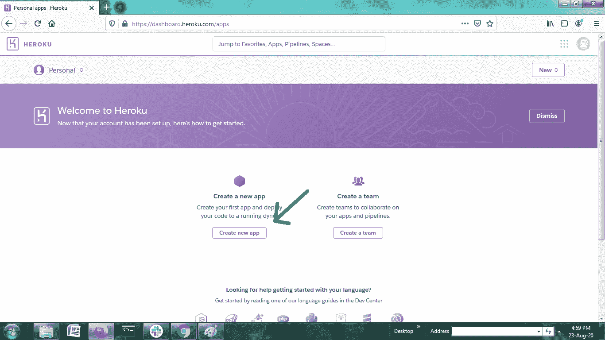
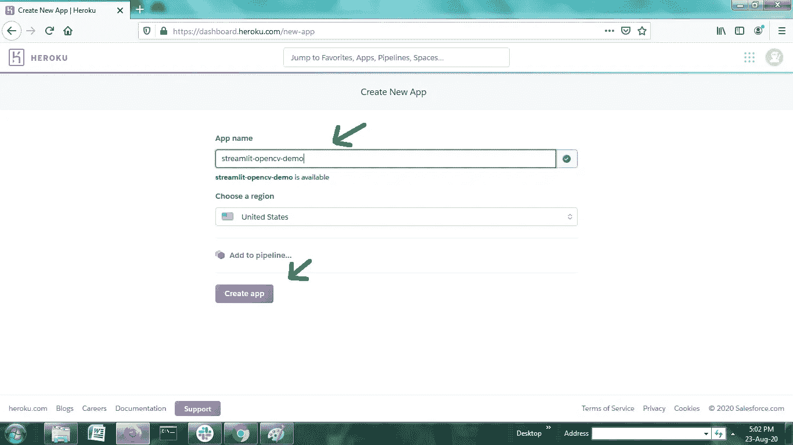
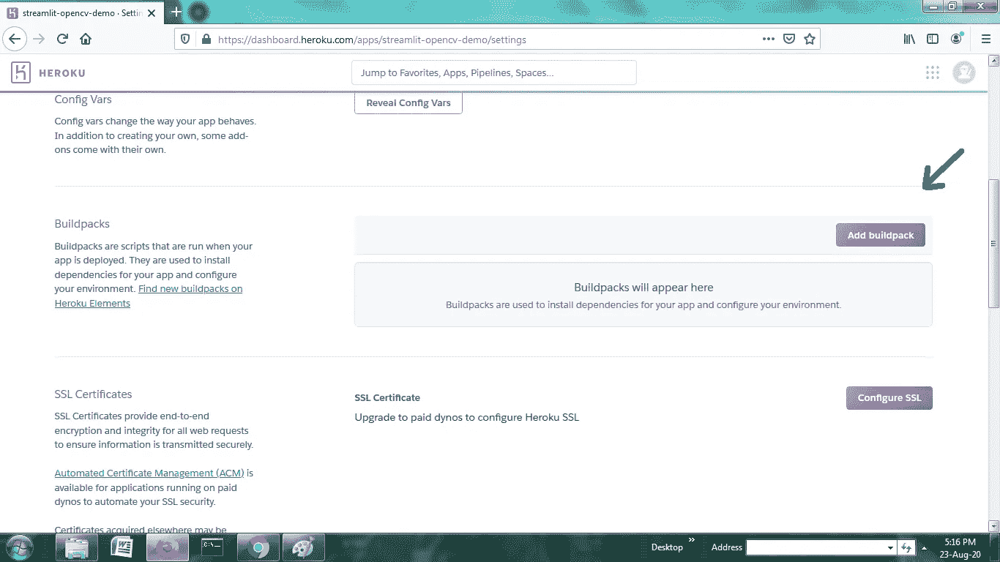
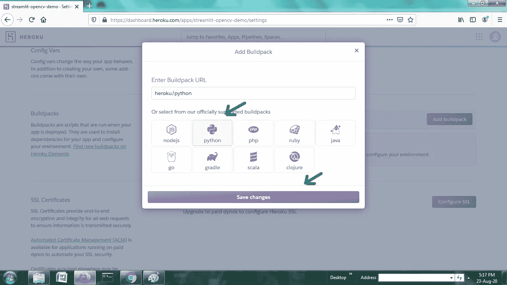
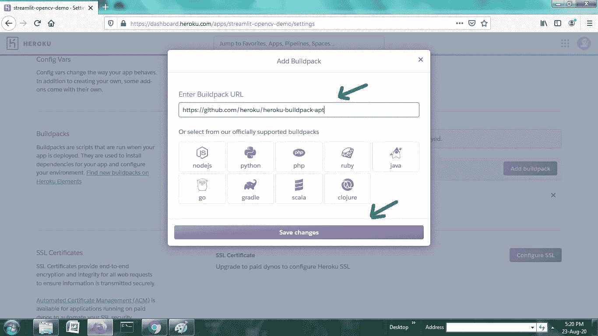
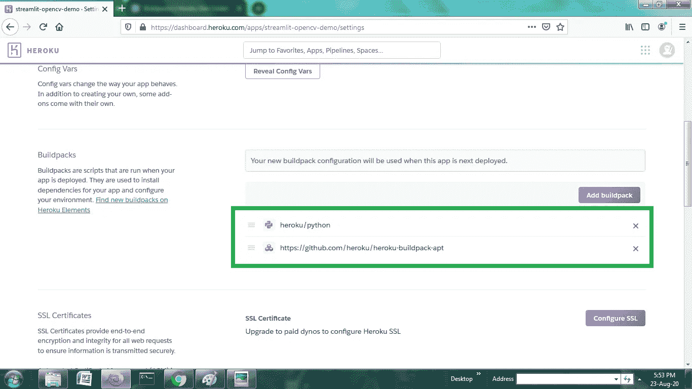
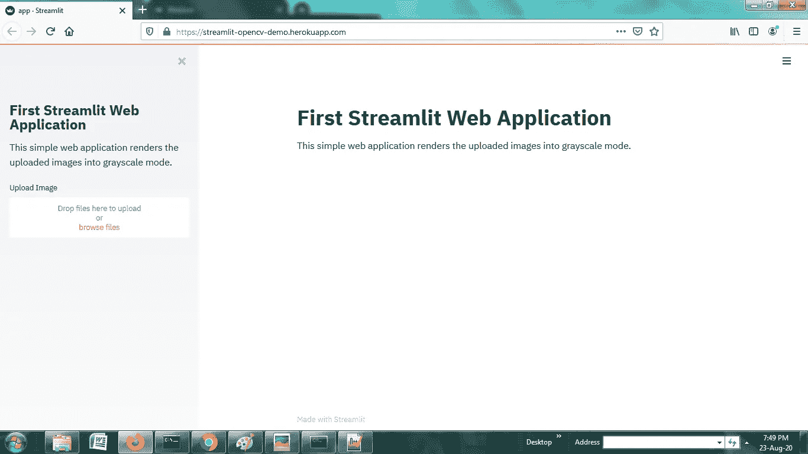

# 将基于 Streamlit 和 OpenCV 的 web 应用程序部署到 Heroku

> 原文：<https://medium.com/analytics-vidhya/deploying-a-streamlit-and-opencv-based-web-application-to-heroku-456691d28c41?source=collection_archive---------4----------------------->

## 如何使用 OpenCV 将 web 应用程序正确部署到 Heroku


由 [Unsplash](https://unsplash.com?utm_source=medium&utm_medium=referral) 上的 [v2osk](https://unsplash.com/@v2osk?utm_source=medium&utm_medium=referral) 拍摄的照片

本文将带您通过使用 python、opencv 和 streamlit 构建一个简单的 web 应用程序，并将其部署到 heroku 平台。我写这篇文章是因为在使用 opencv 将应用程序部署到 heroku 时存在一些技术问题。因此，尽管使用了 opencv，本文还是会清晰地引导您将应用程序部署到 heroku。

## 本文分为两个部分。

> 1.使用 streamlit 创建 web 应用程序。
> 
> 2.将 web 应用程序部署到 heroku。

# 第 1 部分:创建基本的 web 应用程序

> 在这一部分中，我将快速让您使用 opencv 和 streamlit 启动并运行一个简单的 web 应用程序，它可以将任何上传的图像转换为灰度图像。我选择了一个相当简单的应用程序来快速演示如何使用 opencv 向 heroku 正确部署应用程序，完全相同的过程也可以用于任何其他高级 web 应用程序**。**

## **流线型**

Streamlit 让你用看似简单的 Python 脚本为你的机器学习项目创建应用。它非常快速，直观，非常非常容易理解。

本文假设读者非常熟悉 streamlit 的基础知识，我将在这里重点介绍如何快速构建一个 streamlit 应用程序。如果有人需要复习 streamlit，可以参考以下资源:

[](https://docs.streamlit.io/en/stable/) [## 欢迎使用 Streamlit - Streamlit 0.63.1 文档

### 要使用它，只需导入它，写几行代码，然后用。Streamlit 监视…

docs.streamlit.io](https://docs.streamlit.io/en/stable/) [](https://www.coursera.org/projects/data-science-streamlit-python) [## 使用 Streamlit 和 Python 构建数据科学 Web 应用程序

### 由 Coursera 项目网提供。欢迎参加这个动手项目，用…构建您的第一个数据科学 web 应用程序

www.coursera.org](https://www.coursera.org/projects/data-science-streamlit-python) 

现在，我将通过 5 个简单易行的步骤快速介绍一个简单 web 应用程序的开发部分。

1.  进行必要的进口。

```
import cv2
import streamlit as st
import numpy as np
```

**2。向 web 应用程序添加标题和降价。**

```
st.title("First Streamlit Web Application")
st.markdown("This simple web application renders \
the uploaded images into grayscale mode.")
```

**3。添加侧边栏并为其添加标题。(可选)**

```
st.sidebar.title("First Streamlit Web Application")
st.sidebar.markdown("This simple web application renders \
the uploaded images into grayscale mode.")
```

**4。在侧边栏上创建一个文件上传器部件。**

```
uploaded_file=st.sidebar.file_uploader(label="Upload Image",\
type=["jpg","jpeg","png"],key="i")
```

**5。打开上传的图像，将其转换为灰度并呈现在 web 应用程序上。**

```
if uploaded_file is not None:
    file_bytes = np.asarray(bytearray(uploaded_file.read()),\
    dtype=np.uint8)
    image = cv2.imdecode(file_bytes, 1)
    st.subheader("Grayscale Image")
    st.image(image=cv2.cvtColor(image,cv2.COLOR_RGB2GRAY),width=400)
```

现在，使用合适的文件名快速保存该文件，比如“app.py ”,并在本地浏览器上运行它，切换到包含该文件的目录并运行命令:

```
streamlit run app.py
```

如果出现关于禁止访问套接字的错误，那么只需显式指定任何更高的端口号，比如 8502 或 5000。

```
streamlit run app.py --server.port 8502
```

这就创建了一个可以在本地机器上完美运行的基本 web 应用程序，现在它必须被部署到 heroku。

# 第 2 部分:将应用程序部署到 heroku

> 在这一部分中，我将带您一步步完成将应用程序部署到 heroku 的过程。

Heroku 是一个平台即服务(PaaS)，使开发人员能够完全在云中构建、运行和操作应用程序，并支持多种语言，如 Java、Node.js、Scala、Clojure、Python、PHP 和 Go。

**部署部分可以分为以下 3 个步骤:**

*   **在 heroku 上创建一个应用程序并安装 buildpacks。**
*   **设置部署所需的文件**
*   **将应用推送到 heroku。**

## 步骤 1:在 heroku 上创建一个应用程序，并设置 buildpacks。

1.  在 heroku 上创建一个帐户并登录。

[](https://www.heroku.com/) [## 云应用平台| Heroku

### 无论您是在构建简单的原型还是关键业务产品，Heroku 的全托管平台都能为您提供…

www.heroku.com](https://www.heroku.com/) 

**2。创建一个新的应用程序，并为该应用程序选择一个合适的名称和位置。**

> **注意:**如果您希望将应用程序放在您的个人资料中，请尝试为您的应用程序指定一个有意义的名称，因为应用程序名称将是最终部署的应用程序的 URL 的一部分。



在 heroku 创建新的应用程序。



给应用程序起一个合适的名字并创建应用程序。

**3。添加构建包**

Heroku Buildpacks 是一组开源脚本，用于在 Heroku 上编译应用程序。它们构成了 Heroku 多语言平台的主干。构建包使您能够扩展 Heroku 的构建系统，以支持您的语言或定制，或者使特定的二进制包可用于运行时。

有关构建包的更多信息，请参考:

[](https://devcenter.heroku.com/articles/buildpacks) [## 构建包

### Buildpacks 负责将部署的代码转换成 slug，然后可以在 dyno 上执行。构建包…

devcenter.heroku.com](https://devcenter.heroku.com/articles/buildpacks) [](https://www.heroku.com/elements/buildpacks) [## Heroku Buildpacks | Heroku

### Heroku Buildpacks 是一组开源脚本，用于在 Heroku 上编译应用程序。他们构成了…的支柱

www.heroku.com](https://www.heroku.com/elements/buildpacks) 

转到新创建的 heroku 应用程序的设置菜单，向下滚动到添加 Buildpack 选项，将 build pack 添加到您的应用程序中。对于这个应用程序，我将添加两个 buildpack，第一个是官方支持的，第二个是第三方 build pack。

*   **heroku/python**
*   [**https://github.com/heroku/heroku-buildpack-apt**](https://github.com/heroku/heroku-buildpack-apt)

第二个构建包使我们能够正确安装 opencv 的附加依赖项。



添加构建包。



选择 python buildpack，然后单击保存更改。



添加 buildpack URL 并单击 Save changes。



最后，应用程序应该包含这两个构建包。

## 步骤 2:设置部署所需的文件

应用程序的主目录中应该包含以下文件以及 python 代码。

应该注意遵循这些文件的确切命名约定，如下所示。

1.  **requirements.txt**

该文件列出了所有需要的 python 库及其特定版本，以便在 heroku 平台上轻松安装所有依赖项。对于这个应用程序，文件应该如下所示:

```
numpy==1.18.5
streamlit==0.61.0
opencv-python==4.2.0.34
```

通过创建 requirements.txt 文件，可以使用以下命令一次性轻松安装所有依赖项:

```
pip install -r requirements.txt
```

**2。setup.sh**

就像 requirements.txt 一样，这个文件帮助设置所需的环境，以便在 heroku 环境上正确运行应用程序。对于使用 streamlit 的应用程序，该文件的内容可以保持原样，不需要修改。

```
mkdir -p ~/.streamlit/echo "\
[server]\n\
headless = true\n\
port = $PORT\n\
enableCORS = false\n\
\n\
" > ~/.streamlit/config.toml
```

**3。过程文件**

> **注意:**这个文件应该被命名为“Procfile ”,并且不应该有任何扩展名。文本文件（textfile）

Procfile 包含启动应用程序要执行的命令。内容如下:

```
web: sh setup.sh && streamlit run app.py
```

文件的内容有两部分。

第一部分声明一个进程类型`web`，以及运行它所需的命令，第二部分包含运行应用程序的命令。

> 注意:确保在这里输入正确的 python 程序名和扩展名。巴拉圭

**4。Aptfile**

> **注意:**该文件应命名为“Aptfile ”,并且不应有任何扩展名。文本文件（textfile）

这个文件在部署到 heroku 时是可选的，只有当要部署的应用程序使用 opencv 时才需要。这是必需的，因为 opencv 有一些额外的依赖项，这些依赖项默认情况下不会安装在 heroku 上，需要手动安装。这些依赖项可以通过使用 linux 命令 **sudo apt get install** 或 **sudo apt install 来安装。**因此，一个附加的 Aptfile(包含这些依赖项的名称)对此有所帮助，它告诉 heroku 使用创建 app 时添加的 apt buildpack 来安装这些依赖项。

以下是将在 Aptfile 中列出的依赖项:

```
libsm6
libxrender1
libfontconfig1
libice6
```

**5。runtime.txt**

该文件包含您希望安装在 heroku 平台上的特定 python 版本。它是完全可选的，因为通常 python 版本之间没有太大的区别。

如果有人希望使用它，那么可以指定一个特定的 python 版本，如下所示:

```
python-3.6.8
```

最后，主应用程序目录应该包含以下文件:

*   app.py(主 python 文件和其他必需文件)
*   requirements.txt
*   setup.sh
*   Procfile
*   Aptfile(仅当使用 opencv 时)
*   runtime.txt(可选)

第三步:将应用程序推送到 heroku。

1.  **装置**

为了执行接下来的步骤，应该在本地机器上安装 heroku CLI 工具和 Git。请参考以下资源来安装它们。

[](https://git-scm.com/book/en/v2/Getting-Started-Installing-Git) [## Git -安装 Git

### 在开始使用 Git 之前，您必须让它在您的计算机上可用。即使已经安装了，也是…

git-scm.com](https://git-scm.com/book/en/v2/Getting-Started-Installing-Git) [](https://devcenter.heroku.com/articles/heroku-cli) [## Heroku CLI

### Heroku 命令行界面(CLI)使得直接从终端创建和管理您的 Heroku 应用程序变得非常容易…

devcenter.heroku.com](https://devcenter.heroku.com/articles/heroku-cli) 

**2。将文件夹初始化为 git 存储库。**

这可以通过终端执行以下命令来完成。

```
git init
```

**3。登录 Heroku**

执行以下命令，并根据提示登录 heroku。

```
heroku login
```

**4。将 heroku 应用程序配置为用于推送文件的远程存储库。**

```
heroku git:remote -a <your app name>
```

对于这个应用程序，在 heroku 中创建的应用程序的名称是 **streamlit-opencv-demo。**所以命令应该是这样的:

```
heroku git:remote -a streamlit-opencv-demo
```

**5。将代码提交到存储库。**

```
git add .
git commit -am "commit message"
```

**6。将代码部署到 heroku。**

```
git push heroku master
```

这将开始安装所有依赖项并创建环境，然后部署应用程序。查看此步骤中生成的日志以了解部署过程中发生的事情总是很有趣的。

**7。按比例增加 dynos，以确保应用程序的平稳运行。**

```
heroku ps:scale web=1
```

有关 dynos 的更多信息，请参考以下链接:

[](https://www.heroku.com/dynos) [## 赫罗库·达诺斯

### 应用程序开发人员依靠软件抽象来简化开发和提高工作效率。说到跑步…

www.heroku.com](https://www.heroku.com/dynos) 

8。打开应用程序。

```
heroku open
```

这将在浏览器中打开应用程序，它应该如下所示:



该应用程序的完整代码以及所有其他文件都可以在 my github 上找到。

[https://github.com/RaviBansal7717/streamlit-opencv-demo](https://github.com/RaviBansal7717/streamlit-opencv-demo)

## **参考文献:**

[](https://devcenter.heroku.com/articles/getting-started-with-python) [## 使用 Python 开始使用 Heroku

### 本教程将让你在几分钟内部署一个 Python 应用程序(一个简单的 Django 应用程序)。再坚持几分钟…

devcenter.heroku.com](https://devcenter.heroku.com/articles/getting-started-with-python) 

## 这就对了。希望该应用程序应该运行正常，用户准备就绪。试着玩这个，也试着部署你自己的令人兴奋和有趣的应用程序。