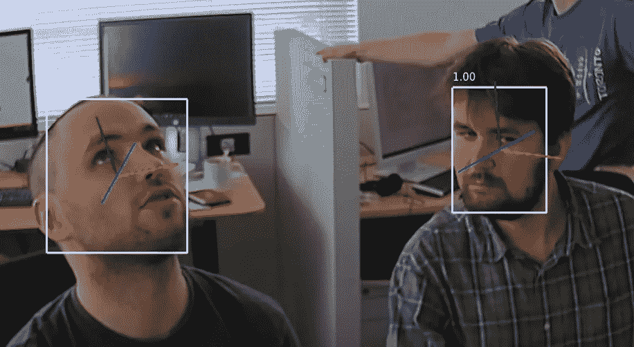
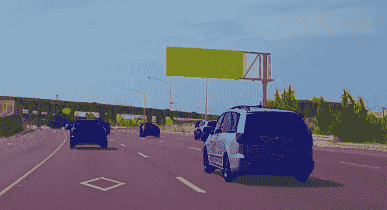
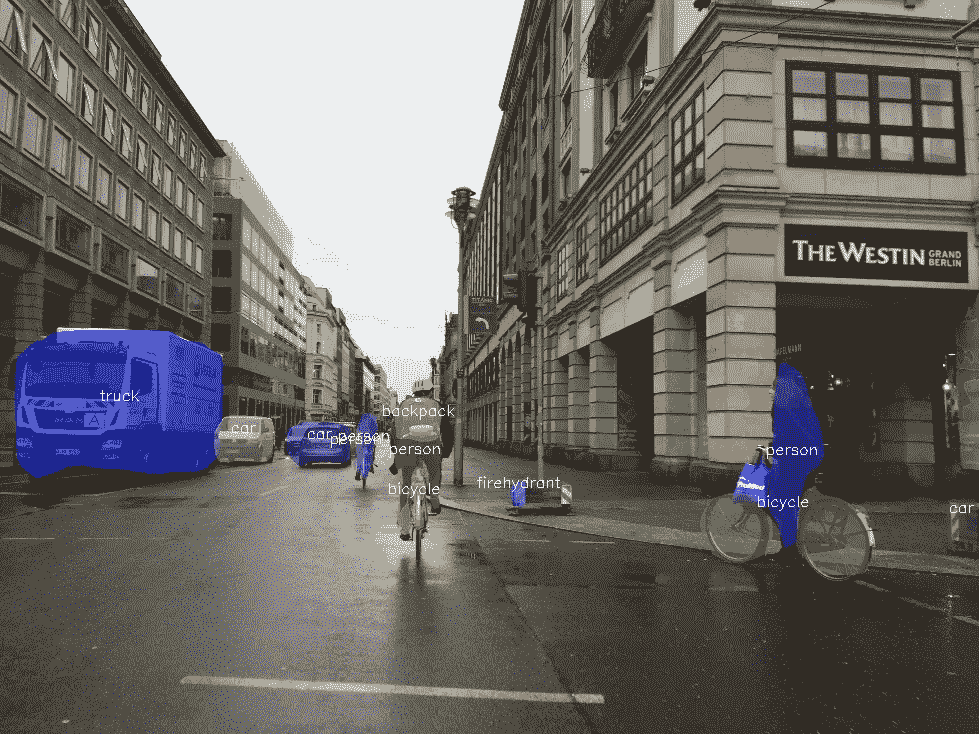
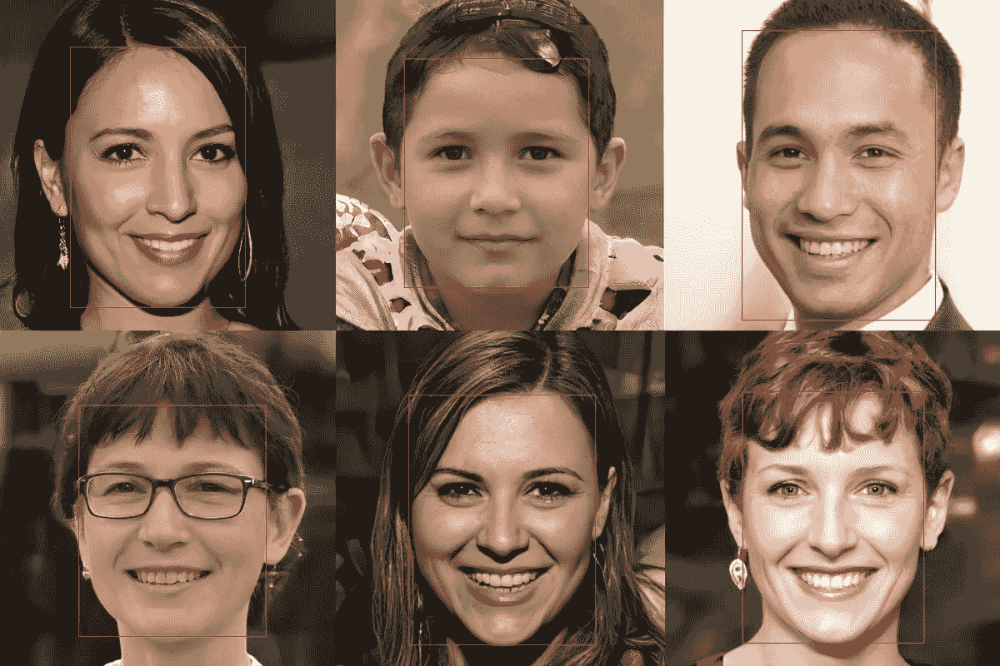

# 利用英特尔 OpenVINO 在边缘部署人工智能-第 1 部分

> 原文：<https://medium.com/analytics-vidhya/deploying-ai-at-the-edge-with-intel-openvino-part-1-51a09752fb4e?source=collection_archive---------7----------------------->

在我的[上一篇博客](/@ahsan.shihab2/ai-at-the-edge-an-introduction-to-intel-openvino-toolkit-a0c0594a731c)中，我简单谈了一下 AI 在 edge 应用，并介绍了 Intel OpenVINO toolkit。在这篇文章中，我将讨论如何从 OpenVINO 的模型动物园中获得一个预训练的模型，以及如何在您的应用程序中利用它。这篇文章将涉及的主题是，

*   不同的计算机视觉模型类型
*   软件中可用的预训练模型
*   使用模型下载器下载预先训练的模型
*   使用预先训练的模型部署基本应用程序

# 不同的计算机视觉模型

有几种类型的计算机视觉模型服务于不同的目的。分类、目标检测、分割是计算机视觉模型的三种主要类型。

分类模型简单地将图像分类到某个类别下。它可能是二元分类，如是或否，也可能是成千上万的分类，如狗、猫、汽车、飞机、轮船等。


分类模型将整个图像的类别检测为猫，但不检测猫在图像中的位置

对象检测模型检测图像中对象的类别，并且还检测图像中该对象存在的位置。它返回围绕对象的矩形边界框。例如，当你用智能手机拍照时，你会看到一个矩形框围绕着你的拍摄对象的脸，相机聚焦在那里。这是人脸(物体)检测模型的一个应用。



对象检测，给出包围检测到的对象(面)的边界框

分割问题预测每个像素所属的类别。它不像物体检测模型那样，只是在物体周围给出一个矩形框，而是逐个像素地屏蔽物体。在切分类型模型下，有两种半类型:语义切分和实例切分。语义分割将同一类图像中的所有对象视为一个单独的对象。实例分割将同一图像中同一类的不同对象视为不同对象。例如，同一图像中的两只猫在语义分割中将被掩盖为相同的，但是在实例分割中，它们将被视为两个不同的对象。



语义分段，将所有汽车作为一个整体进行标记，因此所有汽车都用相同的颜色进行遮盖

还有几种其他类型的模型，如文本检测、姿态检测、人脸映射等。计算机视觉也有不同的模型架构。其中一些是 SSD，ResNet，YOLO，MobileNet，更快的 R-CNN 等等。模型的文档也提到了特定模型中使用的架构。



实例分割，将同一类别的不同对象标记为不同的对象(两个人被两种不同的阴影所掩盖)

# OpenVINO 模型动物园中的预训练模型

预训练模型是指已经以高精度训练的模型。训练深度学习模型需要大量的数据和大量的处理能力。您还需要调整您的模型参数，以找到获得最高精度的最佳选择。这需要长时间的工作。是的，从头开始创建你自己的模型并训练它，看着它成长到更高的精度是令人兴奋的。但如果你想建立一个应用程序，而人工智能的功能只是其中的一部分，那么你把所有的时间都用来建立模型和训练它可能不太实际。比起训练人工智能，你更想专注于应用程序的开发。此外，让您的模型达到最佳精度性能并非易事。因此，利用模型动物园中可用的预训练模型，这提供了尖端的准确性，是在更短的时间内构建更好的应用程序的好方法，并且不需要大量数据。

此[链接](https://docs.openvinotoolkit.org/latest/trained_models.html)包含 OpenVINO 中可用型号的文档。您将看到两个类别-公共模型集和自由模型集。公共模型集训练了模型，但没有转换成中间表示。所以您需要 OpenVINO 的模型优化器在推理引擎中使用它之前先转换它们。[第 2 部分](/@ahsan.shihab2/deploying-ai-at-the-edge-with-intel-openvino-part-2-1f1a9faa514b)将详细介绍如何使用 OpenVINO 的模型优化器。如果需要，您也可以通过进一步培训自行修改模型。

另一方面，自由模型集拥有已经被优化器转换的模型，因此您可以在推理引擎中直接使用它。但是由于原始模型不可用，您不能进一步优化该模型。

当您单击其中一个模型时，您将看到该特定模型的附加文档，其中包含有关架构、输入、输出、示例等信息。

# 如何获得模型

此[链接](https://docs.openvinotoolkit.org/latest/_models_intel_index.html)列出了所有型号及其全名和附加信息。您可以使用 OpenVINO 的模型下载器将您想要的模型下载到您的机器中。您可以在以下路径中找到下载程序。

```
<OPENVINO_INSTALL_DIR>/deployment_tools/open_model_zoo/tools/downloader
```

下载器 python 文件需要一些参数。在您的终端/命令提示符下(在 windows 中)，运行带有'-h '的下载器 python 文件，以查看如下所有参数(在 linux 或 mac 中使用'/'而不是' \ ')。在我的例子中，命令如下所示。

```
python "C:\Program Files(x86)\Intel\openvino_2021\deployment_tools\open_model_zoo\tools\downloader\downloader.py" -h
```

要下载特定的模型，请使用- name <model_name>参数。并且指定您想要保存下载模型的位置，使用-o <download_location>参数。还可以使用- precisions 参数指定所需的精度。</download_location></model_name>

例如，我想下载[人脸检测-adas-0001](https://docs.openvinotoolkit.org/latest/_models_intel_face_detection_adas_0001_description_face_detection_adas_0001.html) 模型，FP32 precision，将其保存在“预训练模型”文件夹中。下面是我将在命令提示符下运行的代码，

```
python "C:\Program Files (x86)\Intel\openvino_2021\deployment_tools\open_model_zoo\tools\downloader\downloader.py" --name face-detection-adas-0001 -o model --precisions FP32
```

您将在终端中看到下载进度。下载完成后，将在您指定的输出文件夹中创建一个名为“intel”的新文件夹。在英特尔文件夹中，您会找到下载的模型。

# 预处理输入

不同的模型期望不同的输入。每个型号都不一样。因此，您需要正确地检查模型的文档，以了解您的模型期望什么样的输入，并相应地预处理输入图像。例如，我在上一节中下载的模型期望 shape [1x3x384x672]的输入，这里第一个数字 1 是批量大小，3 是颜色通道，384 和 672 分别是图像的高度和宽度。还要注意颜色通道顺序是 BGR(蓝绿色红色)。有些型号可能使用 RGB(红绿蓝)。所以你需要小心你的模型的期望，以及你如何提供你的输入。

我们将使用 openCV 来读取和处理图像。OpenVINO 安装 openCV 库，所以我们不需要做任何安装，即使我们以前没有它。

我们将在项目目录中创建两个 python 文件，一个名为 *app.py* ，另一个名为 *inference.py* 。我们将在*推论. py* 文件中保留所有与 OpenVINO 相关的代码，所有与我们 app 相关的代码将在 *app.py* 中。

1 首先，我们需要在我们的 *app.py* 文件和 *inference.py* 文件中导入 openCV。所以在这两个文件中写下下面一行。

```
import cv2
```

2 然后我们将在我们的*推论. py* 文件中定义一个名为*“预处理”*的函数。它需要三个参数:输入图像、期望的高度和宽度。所以把函数定义如下。

```
def preprocessing(input_image, height, width):
    # Code here
```

3 要调整图像大小，该功能将使用 openCV 中的“resize”功能。**注意**在 resize 函数中，我们需要先输入宽度，再输入高度。

```
# resize
    image = cv2.resize(input_image, (width, height))
```

还要注意，我们正在使用的模型首先需要颜色通道，然后是图像的尺寸。但是 openCV 读取的图像以颜色通道作为最后一个轴。因此，我们将使用转置方法首先带来颜色通道。

```
# Fix color channel
    image = image.transpose((2,0,1))
```

然后我们需要做一个整形函数来增加批量大小 1。

```
# Adding batch size
    image = image.reshape(1, 3, height, width)
```

6 最后该函数将返回图像。

```
# Returning the processed image
    return image
```

7 现在，在我们的 app 文件中导入这个函数。

```
from inference import preprocessing
```

8 我们将使用 openCV 中的*“imread”*函数和*“预处理”*函数在我们的应用程序中加载图像，我们将为我们的模型准备图像。在我们的 app 文件中定义一个名为*“main”*的函数。在这个函数中，我们将首先加载我们的图像并进行处理。

```
def main():
    image= "location/to/our/image"
    image = cv2.imread(image)
    width = 672
    height = 384
    preprocessed_image = preprocessing(image, height, width)

    ### Code for inference result here (from part 4) ###
```

现在，我们已经对宽度和高度进行了硬编码。稍后当我们在第 3 部分中讨论推理机时，我们将使用一个函数来获得模型期望的输入形状，而不用硬编码。我们的输入预处理现在已经完成。

# 使用模型进行推理

我们工作流程的第二步是使用推理引擎应用推理。推理过程需要单独发帖讨论。所以我不打算详细说明如何应用这个推论。这将在[第 3 部分](/@ahsan.shihab2/deploying-ai-at-the-edge-with-intel-openvino-part-3-final-part-664b92c75fde)中讨论，请查看。

在完成推理之后，您将从您的模型中获得一个输出，它需要像输入一样进行一些处理。因此，让我们定义另一个函数来处理输出，假设我们已经从推理中得到结果。(如果你愿意，你可以查看我上传完整文件的 github 库。这可能对你做实验有帮助。)

# 处理输出

就像我们讨论的不同模型的不同输入需求一样，每个模型都会产生不同的输出。一些模型可能有一个输出，另一些可能有多个输出。所以你需要根据你的需要适当的提取输出。例如，“[车辆-属性-识别-障碍-0039](https://docs.openvinotoolkit.org/latest/_models_intel_vehicle_attributes_recognition_barrier_0039_description_vehicle_attributes_recognition_barrier_0039.html) ”模型输出两个斑点，一个用于车辆类型，另一个用于颜色。

您将如何处理输出取决于您希望您的应用程序做什么。在我们的示例应用程序中，我们只想在给定图像中的一张或多张人脸周围绘制一个边界框。我们在这篇文章中使用的模型有一个形状为:[1，1，N，7]的输出斑点，其中 N 是检测到的盒子的数量。下面是我如何处理输出以获得图像中的边界框的步骤。

*(我们假设，我们已经将来自推理机的结果存储在“结果”变量中)*

模型的输出 blob 在 python 的一个“字典”对象中，所以它被分配给一个键。文档没有提到密钥是什么。所以首先你需要打印出密钥来知道它是什么。

```
# Continue inside the "main" function, after getting inference result
    print(result.keys())
```

对于我们的人脸检测模型，如果您运行该文件，您将得到以下打印行，

```
>dict_keys(['detection_out'])
```

所以，*‘探 _ 出’*是我们的关键。现在，您可以从代码中删除 print 语句，或者将其注释掉，因为您不再需要它了。我们将从字典中提取输出的数组。

```
# Extracting the ndarray from the dictionary object
    result = result['detection_out']
```

(我在这里硬编码了密钥。稍后，我们将通过编程来实现)

现在我们将定义一个新的函数来处理输出。由于输出处理根据应用程序的需要而变化，我将在 *app.py* 文件中编写这个函数。因此，定义一个名为*“output _ processing”*(当然在我们的主函数之外)的新函数，它将接受三个参数，结果、原始图像和阈值，我们将默认设置为 0.5。我们稍后会解释这是什么。

```
def output_processing(result, image, threshold = 0.5):
    # Code here
```

3 我们的应用程序将在人脸周围绘制一个边界框。我们将首先设置边界框的颜色。你也可以用它作为函数的一个参数。但是现在，我只想把它修好。然后，我们将原始图像的宽度和高度提取到相应的变量中以备后用。所以，在函数内部，添加这三行。

```
# Setting bounding box color, image height and width
    color = (0,0,255)
    height = image.shape[0]
    width = image.shape[1]
```

4 记住，输出形状是 1x1xNx7 其中 N 是盒子的数量。因此，我们将首先通过前两个轴对输出进行切片，以得到盒子。切片输出的长度将是网络检测到的箱子数量。也就是说*“结果[0][0][I]”*会给出第 I 个盒子。每个盒子有 7 个数字，第 3 个(根据 python 索引，其索引为 2)是置信度。第 4、第 5、第 6 和第 7(分别索引为 3、4、5、6)分别是边界框的 *xmin、ymin、xmax、ymax* 值。这两个对角点的位置足以让我们画出矩形。

现在，小心这里。并不是所有的预测框都是真的。我们，甚至是人类，有时会错误地以随机的模式找到面孔，例如，我们在天空的云层中看到面孔。而计算机视觉还处于原始阶段。我使用了我自己的一张图片，所以我期望只有一个边界框。猜猜看，输出包含 200 个边界框。但是不用担心。它会以很高的可信度识别出预期盒子的正确位置。至于其余的盒子，置信值将非常低。所以，我们需要设定一个信心的门槛。只有高于这个阈值的边界框才会被接受。我把阈值设为 0.5。

我们将迭代检测到的框，找到置信度高于阈值的框，对于这些框，我们将使用 openCV 中的 *"rectangle"* 函数绘制边界框。

```
# Drawing the box/boxes    
    for i in range(len(result[0][0])):
        box = result[0][0][i]    # i-th box
        confidence = box[2]
        if confidence>0.5:
            xmin = int(box[3] * width)
            ymin = int(box[4] * height)
            xmax = int(box[5] * width)
            ymax = int(box[6] * height)

            # Drawing the box in the image
            cv2.rectangle(image, (xmin, ymin), (xmax, ymax), color, 1)
```

4 然后，该函数将返回图像。

```
# Returning the image with the drawn boxes
    return image
```

5 现在回到我们 app 文件里的*【main】*函数里面使用的是新定义的*【output _ processing】*函数。

```
# inside the main function
    output = output_processing(result, image)
    cv2.imwrite("output.png", output)
```

openCV 的 *"imwrite"* 函数将输出图像保存到硬盘上，没有定义名称 *"output.png"* 。你想怎么改都行。

## 运行文件

在 *app.py* 文件的底部，添加这两行代码，保存文件。

```
if __name__ == "__main__":
    main()
```

打开命令提示符，首先运行*“setup vars”*。如果不先运行这个文件，openVINO 就无法工作。激活虚拟环境也可以在隔离的沙箱中工作。为此，在命令提示符下将您的目录更改为您创建虚拟环境的位置(如第一部分中所讨论的),然后运行命令。

```
openvinoenv\Scripts\activateC:\"Program Files (x86)"\IntelSWTools\openvino_2021\bin\setupvars.bat
```

更改保存 app.py 文件的目录(使用“cd”命令)。运行下面的命令来运行文件(您还没有实现推理引擎，所以您不能运行您的文件，因为在您的文件中没有“结果”。但是如果您注释掉了需要推理的部分，您现在可以通过运行该文件来执行“预处理”步骤。希望在第 3 部分之后，您能够运行整个应用程序。同时，如果你需要推理结果，你也可以从我的 [github 库](https://github.com/AhsanShihab/openvino-basic-app.git)下载我的代码。

```
python app.py
```

这是我的输出。



原始样本图像(没有边框，来自我的代码)是由 ThisPersonDoesNotExist.com 创建的，所有的脸都是由人工智能组成的，他们不是真人

# 下一步是什么

我们使用了一个已经为 OpenVINO toolkit 优化的模型。我们不需要对模型做任何预处理。但如果你想使用你自己的模型，你可能已经使用 tensorflow 或 Pytorch 或其他一些深度学习库创建了，你需要使用“模型优化器”将模型转换成中间表示。我将在第二部分中讲述模型优化器，然后我们将在第三部分中讲述如何使用推理机。在那里见。

(*链接到所有部分:* [*第 0 部分*](/@ahsan.shihab2/ai-at-the-edge-an-introduction-to-intel-openvino-toolkit-a0c0594a731c) *>* [*第 1 部分*](/@ahsan.shihab2/deploying-ai-at-the-edge-with-intel-openvino-part-1-51a09752fb4e)*>*[*第 2 部分*](/@ahsan.shihab2/deploying-ai-at-the-edge-with-intel-openvino-part-2-1f1a9faa514b)*>*[*第 3 部分*](/@ahsan.shihab2/deploying-ai-at-the-edge-with-intel-openvino-part-3-final-part-664b92c75fde) *)*