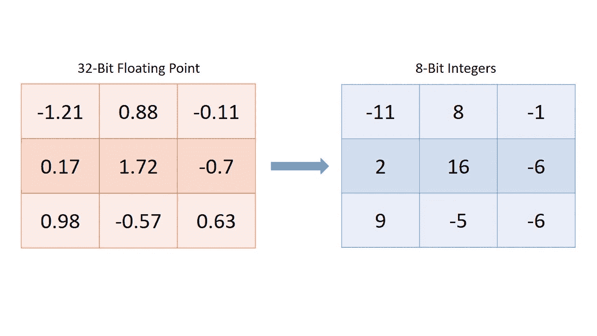
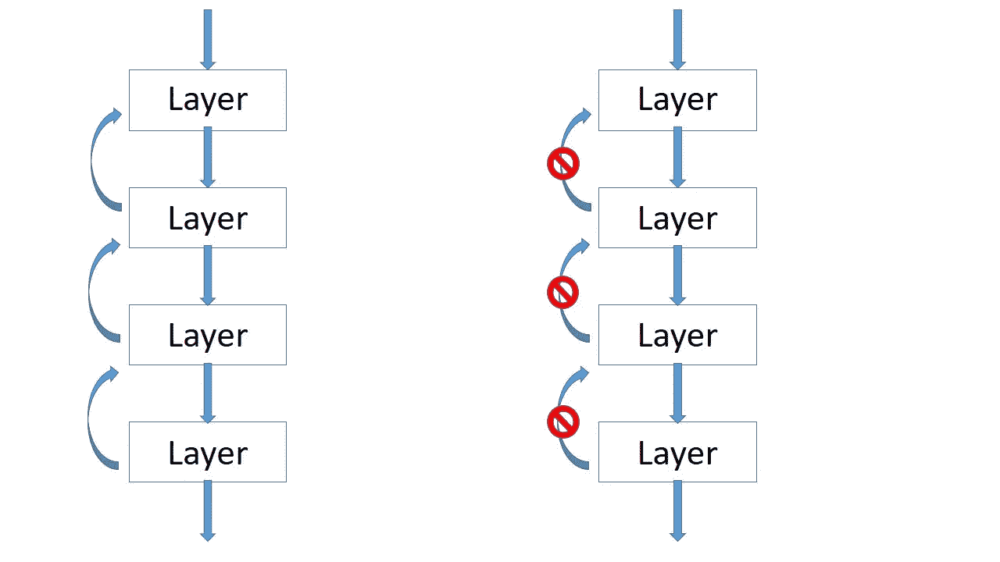
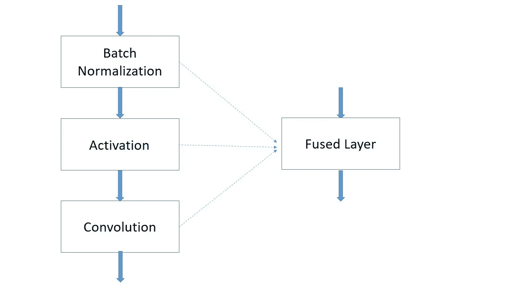

# 利用英特尔 OpenVINO 在边缘部署人工智能-第 2 部分

> 原文：<https://medium.com/analytics-vidhya/deploying-ai-at-the-edge-with-intel-openvino-part-2-1f1a9faa514b?source=collection_archive---------5----------------------->


照片由[德鲁·帕特里克·米勒](https://unsplash.com/@drewpatrickmiller?utm_source=unsplash&utm_medium=referral&utm_content=creditCopyText)在 [Unsplash](https://unsplash.com/s/photos/control-board?utm_source=unsplash&utm_medium=referral&utm_content=creditCopyText) 上拍摄

在[第 1 部分](/@ahsan.shihab2/deploying-ai-at-the-edge-with-intel-openvino-part-1-51a09752fb4e)中，我谈到了如何下载一个已经为在 openVINO toolkit 中使用而优化的预训练模型。在这一部分中，我们将看到如何通过模型优化器来优化一个未优化的模型。这篇文章涉及的主题有:

*   优化技术
*   支持的框架
*   中间表示
*   转换 ONNX 模型
*   转换 Caffe 模型
*   转换张量流模型

# 优化是如何完成的

Model optimizer 是一个命令行工具，它将使用受支持的框架制作的模型转换为可在推理引擎中使用的中间表示形式。模型优化器是一个名为 *"mo.py"* 的 python 文件，可以在以下位置找到它:

> *<安装 _ 目录>\部署 _ 工具\模型\优化器\*

在转换过程中，它会稍微修改模型的性能。那么，模型优化器到底要做些什么来使模型在 edge 应用中使用起来更轻便呢？它可以做几件事。其中一些是量子化，冻结和融合。

## 量化

模型优化器可以将权重和偏差的精度从浮点值降低到整数或更低精度的浮点值。非常高的精度值对于训练是有用的，但是在推理中，精度可以降低到较低的精度，即从 FP32 到 FP16 或 INT8，而不会显著损害模型的精度。这减少了计算时间和大小，但精度损失很小。这个过程叫做量子化。openVINO 中的型号通常默认为 FP32。在预训练模型中，int8 和 fp16 精度可用。但是模型优化器本身目前不支持 int8。



将权重从 32 位浮点减少到 8 位整数

## 极冷的

训练神经网络中的术语冻结意味着随机冻结一些层，使其不被训练，以便其他层可以被微调。在 model optimizer 中，冻结意味着删除一些元数据和操作，这些元数据和操作只对训练网络有用，对推理没有用。冻结仅专门用于张量流模型。例如，反向传播仅用于训练，但它在预测中没有用处。因此，在转换到中间表示的过程中，可以从模型中删除用于反向传播的步骤。



左:训练中的模型，右:冷冻后的模型

## 融合

融合意味着将几层结合成一层。例如，批量标准化层、激活层和卷积层可以合并成一个单层。几个操作可能发生在独立的 GPU 内核中，但一个 fussed 层将在一个内核上运行，这消除了从一个内核切换到另一个内核的开销。



将多个层组合成一个单层

# 支持的框架

模型优化器支持各种流行的深度学习框架。以下是受支持的深度学习框架列表

> [张量流](https://www.tensorflow.org/)
> 
> [咖啡馆](https://caffe.berkeleyvision.org/)
> 
> [MXNet](https://mxnet.apache.org/)
> 
> [ONNX](https://onnx.ai/) (包括 PyTorch 和 Apple ML)
> 
> 卡尔迪

基于所使用的框架，在如何处理模型方面存在一些差异。但是大部分工作对于所有的模型都是相似的。我将在文章的后半部分讨论不同模型的转换。

# 中间表示

那么我们谈论了这么久，并试图将不同的模型转换成的这个中间表示是什么呢？这是神经网络的一种常见方言。那是什么意思！不同的框架对相同类型的操作使用不同的名称。例如，张量流中的“Conv2D”、caffe 中的“卷积”和 ONNX 中的“Conv”在普通语言中被称为“卷积”，用于中间表示。如果你感兴趣，openVINO 文档有所有不同图层名称的列表。当我们在前面的章节中谈到的不同的优化方法被应用到一个模型中时，这种名称的转换也会发生。IR 可以被直接馈送到推理机中，然后推理机可以使用该模型来执行推理。这个表示由两个文件组成，一个 **。xml* 文件和一个 **。bin* 文件。 **。xml* 文件携带模型的架构和 **。bin* 文件携带模型的权重和偏差。

# 我们来转换一个模型吧！

我们将从最简单的 ONNX 模型开始。然后，我们将了解如何转换 Caffe 模型，最后，我们将使用一个有点复杂的张量流模型。(确保您已经按照第 0 部分中提到的步骤 8 到 14 配置了您的模型优化器，并激活我们创建的虚拟环境。)

```
openvinoenv\Scripts\activate
```

## 转换 ONNX 模型

ONNX 用于转换不同框架的模型格式。由于 OpenVINO 不直接支持 PyTorch，因此可以首先将 PyTorch 模型转换为 ONNX 格式，然后使用模型优化器将转换后的模型非常容易地优化为 IR 格式。OpenVINO 的[文档](https://docs.openvinotoolkit.org/2018_R5/_docs_MO_DG_prepare_model_convert_model_Convert_Model_From_ONNX.html)中有 ONNX 型号列表。让我们试试第一个模型， [bvlc_alexnet](https://s3.amazonaws.com/download.onnx/models/opset_8/bvlc_alexnet.tar.gz) 。

*   打开命令提示符(windows)/终端(Linux，Mac)，将当前目录更改为保存 *"model.onnx"* 文件的位置。
*   运行以下命令。

```
python "C:\Program Files (x86)\IntelSWTools\openvino\deployment_tools\model_optimizer\mo.py" --input_model model.onnx
```

*-input _ model "*参数是用于指示我们想要转换哪个模型的参数。(示例命令在 windows 中运行，并使用缺省安装目录 OpenVINO。如果您的安装位置不同，请使用适当的路径指向 *"mo.py"* ， *" <安装目录>\ open vino \ deployment _ tools \ model _ optimizer \ mo . py "*)

*   您将得到一个打印行，告诉您创建的 **的位置。xml* 和 **。bin* 文件，这是我们期望的 IR 文件。

## 转换 Caffe 模型

将 Caffe 模型转换成 IR 也非常简单。ONNX 模型优化的不同之处在于，在 Caffe 的情况下，模型优化器可以接受一些特定于 Caffe 模型的附加参数。您可以在相关的[文档](https://docs.openvinotoolkit.org/2018_R5/_docs_MO_DG_prepare_model_convert_model_Convert_Model_From_Caffe.html)中找到关于它们的详细信息。我会让事情变得简单。

让我们首先下载一个示例模型来使用。我们将以这个 [SqueezeNet](https://github.com/forresti/SqueezeNet.git) 型号为例。下载完成后，在保存*“SqueezeNet_v1.1 . caffemodel”*文件的“SqueezeNet _ v 1.1”文件夹中更改你当前的目录。运行以下命令(示例适用于 windows。针对您情况使用适当的位置和符号)，

```
python "C:\Program Files (x86)\IntelSWTools\openvino\deployment_tools\model_optimizer\mo.py" --input_model squeezenet_v1.1.caffemodel --input_proto deploy.prototxt
```

我们使用了一个额外的参数*-input _ proto "*。如果 **这个论证是必要的。prototxt* 与 **名称不同。caffemodel* 文件或者文件保存在不同的目录下。如果文件名为 **。caffemodel* 和 **。prototxt* 是相同的，这个论点是没有必要的。

您将得到一个输出，通知您新创建的 **的目录。xml* 和 **。bin* 文件。

## 转换张量流模型

OpenVINO 中的 TF 模型动物园甚至可以进一步扩展预训练模型的范围。TF 模型有冰冻和非冰冻两种类型，在模型动物园都有。根据您正在处理的对象，无论是冻结的还是解冻的，程序都会稍有变化。用于转换 TF 模型的专用[文档](https://docs.openvinotoolkit.org/latest/_docs_MO_DG_prepare_model_convert_model_Convert_Model_From_TensorFlow.html#freeze-the-tensorflow-model)页面解释了不同的步骤。

如果您正在使用非冻结模型，则首先将其转换为冻结模型。这是在 python 中使用 TensorFlow 完成的。下面是冻结模型的代码。

```
import tensorflow as tf
from tensorflow.python.framework import graph_iofrozen = tf.graph_util.convert_variables_to_constants(sess, sess.graph_def, ["name_of_the_output_node"])graph_io.write_graph(frozen, '<where/to/save/>', '<name_of_the_generated_graph>.pb', as_text=False)
```

*“sess”*是定义网络拓扑的 TensorFlow 会话对象的实例。 *["输出节点名称"]* 是图形中输出节点名称的列表。冻结图将只包括原始 *"sees.graph_def"* 中直接或间接用于计算给定输出节点的那些节点。

或者，您可以按照文档中的特定说明，在模型优化器中直接使用非冻结模型。

作为一个例子，我将使用一个来自模型动物园的冻结图。我将在这里使用的型号是 *SSD MobileNet V2 COCO* 。[如果你想自己按照步骤操作，下载](http://download.tensorflow.org/models/object_detection/ssd_mobilenet_v2_coco_2018_03_29.tar.gz)模型。

首先，将当前目录更改为保存*“freezed _ inference _ graph . Pb”*文件的位置。

然后，在命令行中运行以下命令，

```
python "C:\Program Files (x86)\IntelSWTools\openvino\deployment_tools\model_optimizer\mo.py" --input_model frozen_inference_graph.pb --tensorflow_object_detection_api_pipeline_config pipeline.config --reverse_input_channels --tensorflow_use_custom_operations_config "C:\Program Files (x86)\IntelSWTools\openvino\deployment_tools\model_optimizer\extensions\front\tfssd_v2_support.json"
```

我们来分解一下。

和往常一样，我们运行 python 文件“mo.py ”,它有几个参数，其中一些是特定于 TF 的。

*   **- input_model:** 获取我们正在转换的模型名称。在我们的例子中，它是*freezed _ inference _ graph . Pb*文件。
*   **-tensor flow _ object _ detection _ API _ pipeline _ config:**这需要一个管道配置文件。
*   **-reverse _ input _ channels:**tensor flow 模型采用 RGB(红绿蓝)颜色通道格式训练。OpenCV 使用 BGR(蓝绿色红色)格式。如果我们想使用 BGR 格式，这个参数是必要的。
*   **-tensor flow _ use _ custom _ operations _ config:**在某些情况下，由于存在模型优化器无法识别的自定义操作，模型优化器可能无法转换模型。或者模型优化器和模型使用的张量布局可能不匹配。在那些情况下，一个 **。json* 文件以优化器可识别的方式向模型优化器提供关于定制层的提示。

如果一切顺利，您将得到一个输出，显示新创建的 **的位置。xml* 和 **。bin* 文件。

# 下一步是什么

我们手里有一个经过训练的模型，要么直接从 OpenVINO model zoo 下载 IR 格式，要么使用模型优化器转换成 IR 格式。现在，下一步是在推理机中使用这个模型来执行实际的推理并得到结果。在[第 3 部分](/@ahsan.shihab2/deploying-ai-at-the-edge-with-intel-openvino-part-3-final-part-664b92c75fde)中，我们将使用推理机。那么，让我们进入下一部分。

(*链接到所有零件:* [*零件 0*](/@ahsan.shihab2/ai-at-the-edge-an-introduction-to-intel-openvino-toolkit-a0c0594a731c)*>*[*零件 1*](/@ahsan.shihab2/deploying-ai-at-the-edge-with-intel-openvino-part-1-51a09752fb4e)*>*[*零件 2*](/@ahsan.shihab2/deploying-ai-at-the-edge-with-intel-openvino-part-2-1f1a9faa514b)*>*[*零件 3*](/@ahsan.shihab2/deploying-ai-at-the-edge-with-intel-openvino-part-3-final-part-664b92c75fde) *)*