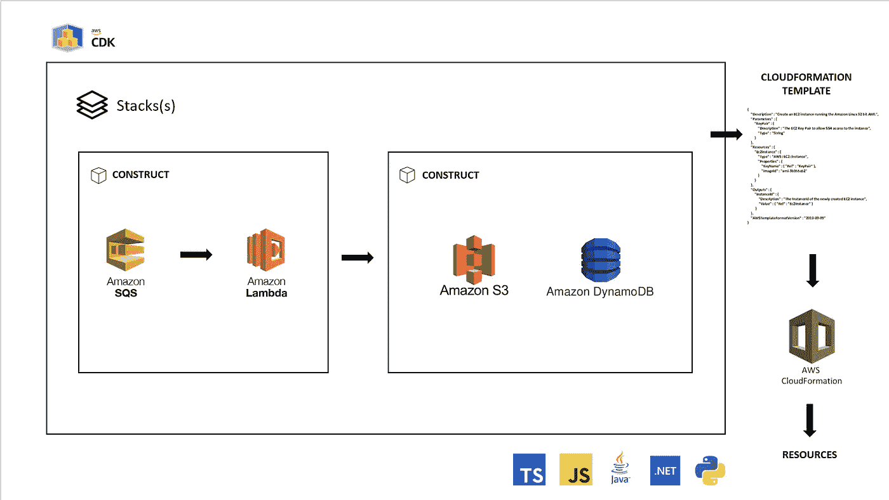

# 使用 AWS CDK Python 部署 Lambda 函数

> 原文：<https://medium.com/analytics-vidhya/deploying-awlambda-functions-with-aws-cdk-python-92f42d66d5f7?source=collection_archive---------4----------------------->

## 就是这条路！

AWS 云开发工具包(图片由作者提供)

基础设施即代码(IaC)通过机器可读的定义文件实现基础设施的管理和配置。IaC 通过将文件作为描述性模型作为真实的单一来源来提供一致性。

对于 AWS 等云提供商来说，CloudFormation 是 IaC 的推动者。CloudFormation 通过以下方式帮助建模资源…