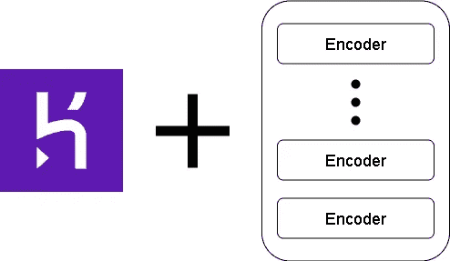
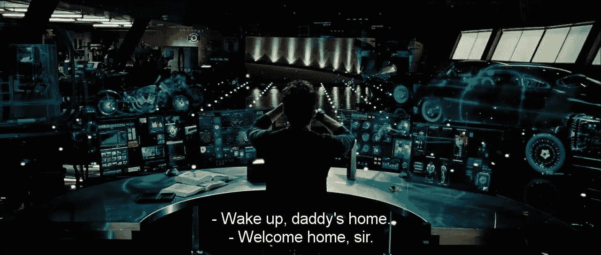
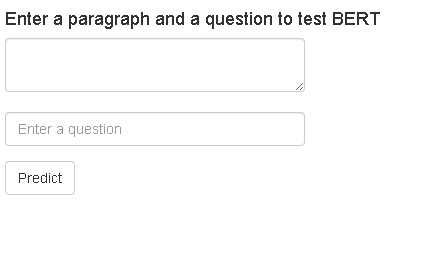
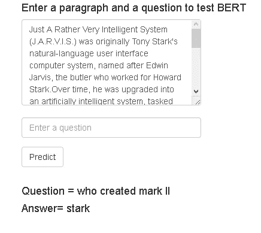

# 在 Heroku 部署 BERT

> 原文：<https://medium.com/analytics-vidhya/deploying-bert-on-heroku-7df1d23f9c43?source=collection_archive---------2----------------------->



我一直是自然语言处理的忠实粉丝。因为我喜欢机器，所以我也总是想办法和我的机器交流。

你问你的机器一些事情，它会回答你，这不是很酷吗？😍



图片来源——钢铁侠

> BERT(来自变压器的双向编码器表示)可以用于一个这样的应用，即问答。你给深度学习模型一段阅读，然后你问一个与此相关的问题。在许多这样的应用中，BERT 在 NLP(更准确地说是自然语言理解)方面已经被证明足够强大。BERT 的概念是在 2018 年提出的。从那时起，伯特的变体就出现了，如艾伯特、罗伯塔、莫比尔伯特等。你可以在这里阅读原论文[。](https://arxiv.org/pdf/1810.04805.pdf)

我们将使用由 [huggingface](http://huggingface.co) 在问答数据集上训练的 BERT，即 Stanford**Qu**estion**A**nswering**D**ataset(SQuAD ),并将优化后的模型部署在 Heroku 上进行实时推理。你可以在我的 [github repo](https://github.com/horizons-ml/heroku-bert-deployment) 上找到相同的所有材料。

现在，让我们开始编码..

# 注意

请确保遵循以下文件夹结构:

```
/web-app
|--templates
|----index.html
|--app.py
|--requirements.txt
|--Procfile
```

## 第一步

因为这必须部署在 Heroku 上，所以让我们确保 Heroku 安装了运行程序所需的所有库。

创建一个名为“requirements.txt”的文件，并将以下库放入该文件中:

```
https://download.pytorch.org/whl/cpu/torch-1.3.1%2Bcpu-cp36-cp36m-linux_x86_64.whl
transformers==3.0.2
numpy==1.19.1
flask
joblib==0.16.0
sentencepiece==0.1.91
urllib3==1.25.10
```

## 第二步

创建一个名为“app.py”的文件，并放入以下代码:

```
import os
from flask import Flask, render_template
from flask import request

import torch
from transformers import AutoTokenizer, AutoModelForQuestionAnswering

name = "mrm8488/bert-small-finetuned-squadv2"

tokenizer = AutoTokenizer.from_pretrained(name,)

model = AutoModelForQuestionAnswering.from_pretrained(name)

def answer_question(question, answer_text):
    '''
    Takes a `question` string and an `answer` string and tries to identify 
    the words within the `answer` that can answer the question. Prints them out.
    '''

    # tokenize the input text and get the corresponding indices
    token_indices = tokenizer.encode(question, answer_text)

    # Search the input_indices for the first instance of the `[SEP]` token.
    sep_index = token_indices.index(tokenizer.sep_token_id)

    seg_one = sep_index + 1

    # The remainders lie in the second segment.
    seg_two = len(token_indices) - seg_one

    # Construct the list of 0s and 1s.
    segment_ids = [0]*seg_one + [1]*seg_two

    # get the answer for the question
    start_scores, end_scores = model(torch.tensor([token_indices]), # The tokens representing our input combining question and answer.
                                    token_type_ids=torch.tensor([segment_ids])) # The segment IDs to differentiate question from answer

    # Find the tokens with the highest `start` and `end` scores.
    answer_begin = torch.argmax(start_scores)
    answer_end = torch.argmax(end_scores)

    # Get the string versions of the input tokens.
    indices_tokens = tokenizer.convert_ids_to_tokens(token_indices)

    answer = indices_tokens[answer_begin:answer_end+1]
    #remove special tokens
    answer = [word.replace("▁","") if word.startswith("▁") else word for word in answer] #use this when using model "twmkn9/albert-base-v2-squad2"
    answer = " ".join(answer).replace("[CLS]","").replace("[SEP]","").replace(" ##","")

    return answer

app = Flask(__name__)

@app.route('/', methods=['GET', 'POST'])
def index():

    if request.method == 'POST':
      form = request.form
      result = []
      bert_abstract = form['paragraph']
      question = form['question']
      result.append(form['question'])
      result.append(answer_question(question, bert_abstract))
      result.append(form['paragraph'])

      return render_template("index.html",result = result)

    return render_template("index.html")

if __name__ == '__main__':
    port = int(os.environ.get("PORT", 5000))
    app.run(host='0.0.0.0', port=port)
```

这将获得 BERT 模型和模型所需的标记器。我们使用 huggingface 的“MRM 8488/bert-small-fine tuned-squad v2 ”,因为它比其他 BERT 型号相对较小，并且我们在 Heroku 自由层帐户上有 512 MBs 的有限空间。接下来，我们创建一个 flask 服务器来接收段落和问题形式的输入。

现在，创建一个名为“templates”的文件夹，并在其中创建一个名为“index.html”的文件。将以下代码放入文件中:

```
<!DOCTYPE html>
<html>
  <head>
    <title>Bert Question Answering</title>
    <meta name="viewport" content="width=device-width, initial-scale=1.0">
    <link href="//netdna.bootstrapcdn.com/bootstrap/3.3.6/css/bootstrap.min.css" rel="stylesheet" media="screen">
    <style>
      .container {
        max-width: 1000px;
      }
    </style>
  </head>
  <body>
    <div class="container">
      <div class="row-sm-5 row-sm-offset-1">
          <h4>Enter a paragraph and a question to test BERT</h4>
            <form role="form" method='POST' action='/'>
              <div class="form-group">
                <textarea name="paragraph" class="form-control" id="url-box" placeholder="Enter a paragraph" style="max-width: 300px;" autofocus required>
			
          			{{ result[2] }}
		        
		</textarea>
                 <br>
                <input type="text" name="question" class="form-control" id="url-box" placeholder="Enter a question" style="max-width: 300px;" autofocus required>
              </div>
              <button type="submit" class="btn btn-default">Predict</button>
            </form>
          <br>
      </div>

      <div class="row-sm-5 row-sm-offset-1">
          
          <h4>Question = {{ result[0] }}</h4>
          <h4>Answer= {{ result[1] }}</h4>
          
      </div>

    </div>

  </body>
</html>
```

使用上面的代码，我们创建了一个接收输入的表单。

## 第三步

创建一个文件，将其命名为“Procfile ”,不带任何扩展名。并放入以下代码:

```
web: python app.py
```

这将告诉 Heroku 一旦应用程序被部署后该做什么。

## 第四步

我们已经准备好代码了。现在让我们和赫罗库谈谈。确保你已经安装了 Heroku CLI 和 git。

完成后，在命令终端中键入以下命令:

```
heroku login
```

这将连接您与 Heroku CLI

接下来，键入以下内容创建 heroku 应用程序:

```
heroku create your_app_name
```

您的应用程序名称可以是任何唯一的名称。

然后键入以下命令将您的应用程序部署到 Heroku:

```
git init
git add .
git commit -m 'initial commit'
git push heroku master
```

万岁！您的应用已部署！让我们看看它的表现如何。

打开浏览器窗口，键入以下网址:

```
https://your_app_name.herokuapp.com
```

您应该会看到这样一个网页:



伯特问答页面

既然我是钢铁侠的超级粉丝，我就用下面这段来自[的话](https://marvelcinematicuniverse.fandom.com/wiki/J.A.R.V.I.S.):

> 只是一个非常智能的系统(J.A.R.V.I.S .)最初是托尼·斯塔克的自然语言用户界面计算机系统，以霍华德·史塔克的管家埃德温·贾维斯命名。随着时间的推移，他被升级为一个人工智能系统，负责管理斯塔克工业的业务以及托尼·斯塔克大厦和斯塔克大厦的安全。在创造了马克 2 号盔甲之后，Stark 将 J.A.R.V.I.S .上传到钢铁侠的所有盔甲中，并允许他与其他复仇者互动，在战斗中给他们提供有价值的信息。

让我们问伯特“谁创造了马克 2 号”



伯特推理结果

如果你想试试的话，我已经在这里部署了我的 BERT 应用[。](https://bertqna.herokuapp.com/)

这就是目前在 Heroku 部署 BERT 的原因。感谢您的阅读！😄