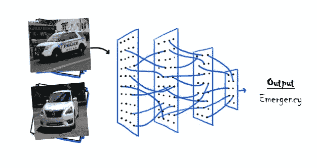
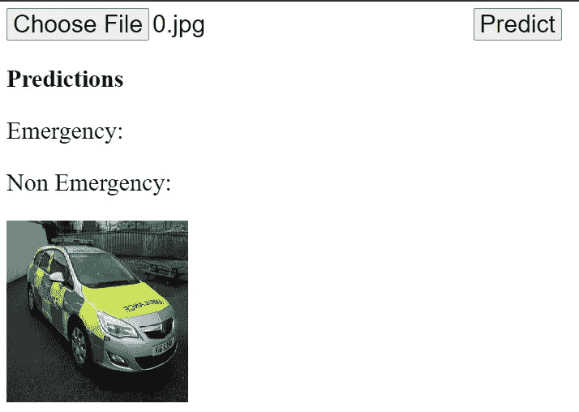

# 使用 Flask 部署分类模型

> 原文：<https://medium.com/analytics-vidhya/deploying-classification-model-using-flask-5b92fbe1def5?source=collection_archive---------16----------------------->



在我的[上一篇文章](/analytics-vidhya/image-classification-using-fast-ai-a67078f6954e)中，我已经描述了使用 Fast.ai 构建图像分类模型的过程，在这篇文章中，让我们看看如何将它部署在由 Flask 制成的 web 应用程序上。


[来源](https://www.google.com/search?q=flask+logo+hd&tbm=isch&ved=2ahUKEwjpmIuDvobtAhVQoUsFHQ8zBj8Q2-cCegQIABAA&oq=flask+logo+hd&gs_lcp=CgNpbWcQAzIECCMQJ1CSFFiSFGDOF2gAcAB4AIABmwGIAZsBkgEDMC4xmAEAoAEBqgELZ3dzLXdpei1pbWfAAQE&sclient=img&ei=mCKyX-nsG9DCrtoPj-aY-AM&bih=694&biw=1517&rlz=1C1CHBD_enIN891IN892#imgrc=oNEF6tJFZ2ARHM)

我们建立的模型的小背景——将车辆分为紧急和非紧急两类。现在模型建立了，下一步呢？你想如何使用你训练好的模型？一个简单的答案是构建一个 web 应用程序，您可以在其中传递图像并请求预测。web 开发有两个基于 python 的选项:Flask 和 Django。我选择 Flask 是因为与 Django 相比它是轻量级的，还因为我的部署将只基于文本形式的请求/响应。Django 有很多我的 webapp 可能不需要的东西，也可以在 Flask 中做任何在 Django 中可以做的事情。

所以这篇文章从上一篇文章结束的地方开始，也就是在得到。pkl "文件的模型。我们构建了 webapp，它在后端运行训练好的模型来获得预测。所以让我们开始吧…

**web 应用中的两个关键文件是**

1.  **predict_app.py** —包含后端 flask 服务器代码和使用训练好的模型预测结果的逻辑
2.  **predict.html**—包含在网页上查看结果的前端 html 代码

**如果您的环境中没有安装 Flask，您可以使用“pip install flask”进行安装

**以下代码来自 predict_app.py**

```
# -*- coding: utf-8 -*-
"""
Created on Sun Nov  1 05:03:08 2020[@author](http://twitter.com/author): manohar
"""import base64
import numpy as np
import io
from PIL import Image
from flask import request
from flask import jsonify
from flask import Flask
import json
from pathlib import Path
from skimage import transformimport fastai
from fastai import *
from fastai.utils import *
from fastai.vision import *
from fastai.callbacks import *app = Flask(__name__)def get_model():
    learn = load_learner('.', file = 'av_cv.pkl')
    print(" * Model loaded!")

print(" * Loading keras model...")
get_model()[@app](http://twitter.com/app).route("/predict", methods=["POST"])
def predict():
    message = request.get_json(force=True)
    encoded = message['image']
    decoded = base64.b64decode(encoded)
    img = Image.open(io.BytesIO(decoded))

    #     img = np.array(img).astype('float')/255
    #     img = transform.resize(img,(512,512,3))
    #     img = img.resize((512,512))
    #     img = img_to_array(img)
    #     print(img.shape)
    #     img = np.expand_dims(img, axis=0)
    #     print(img.shape)

    #     tf.keras.backend.set_session(sess)
    #     prediction = model.predict(img)

    prediction = learn.predict(img)
    print(prediction)

    response = {
            'prediction': {
                'Emergency': str(1-prediction[0][0]),
                'Non_Emergency': str(prediction[0][0])
            }
        }
    return jsonify(response)[@app](http://twitter.com/app).route("/predict", methods=["POST"])
def predict():
    message = request.get_json(force=True)
    encoded = message['image']
    decoded = base64.b64decode(encoded)
    img = Image.open(io.BytesIO(decoded))

    #     img = np.array(img).astype('float')/255
    #     img = transform.resize(img,(512,512,3))
    ##     img = img.resize((512,512))
    ##     img = img_to_array(img)
    #     print(img.shape)
    #     img = np.expand_dims(img, axis=0)
    #     print(img.shape)

    #     tf.keras.backend.set_session(sess)
    #     prediction = model.predict(img)

    prediction = np.array(learn.predict(img)[-1])
    print(prediction)

    response = {
            'prediction': {
                'Emergency': str(prediction[0]),
                'Non_Emergency': str(prediction[1])
            }
        }
    return jsonify(response)
```

上面的代码适用于构建在 Fast.ai 上的模型，尽管同样的代码也可以用于构建在 keras 上的模型。您只需要导入所需的库，并使用注释代码进行推理，给出正确的图像大小。你可能也需要开始一个疗程-

```
sess = tf.Session()
tf.keras.backend.set_session(sess)
graph = tf.get_default_graph()
```

然后将预测函数的全部代码放入图表中，如下所示

```
def predict():
    global sess
    global graph
    with graph.as_default():
        message = request.get_json(force=True)
```

**以下代码来自 predict.html**

```
<!DOCTYPE html>
<html>
<head>
    <title>deeplizard predict image app</title>
    <style>
        * {
            font-size:30px;
        }
    </style>
</head><body>    
    <input id="image-selector" type="file">    
    <button id="predict-button">Predict</button>
    <p style="font-weight:bold">Predictions</p>    
    <p>Emergency: <span id="emergency-prediction"></span></p>
    <p>Non Emergency: <span id="non_emergency-prediction"></span></p>
    

 <script src="[https://code.jquery.com/jquery-3.3.1.min.js](https://code.jquery.com/jquery-3.3.1.min.js)"></script>

 <script>
  let base64Image;
  $("#image-selector").change(function() {
   let reader = new FileReader();
   reader.onload = function(e) {
    let dataURL = reader.result;
    $('#selected-image').attr("src", dataURL);
    base64Image = dataURL.replace(/^data:image\/[a-z]+;base64,/, "");
    console.log(base64Image);
   }
   reader.readAsDataURL($("#image-selector")[0].files[0]);
   $("#emergency-prediction").text("");
   $("#non_emergency-prediction").text("");
  });$("#predict-button").click(function(event){
   let message = {
    image: base64Image
   }
   console.log(message);
   $.post("[http://localhost:5000/predict](http://localhost:5000/predict)", JSON.stringify(message), function(response){
    $("#emergency-prediction").text(response.prediction.Emergency);
    $("#non_emergency-prediction").text(response.prediction.Non_Emergency);
    console.log(response);
   });
  });       
 </script>
</body>
</html>
```

**让应用程序运行起来**

一旦这两个文件准备好了，把它们放在一个文件夹里。我通常将 html 文件放在主文件夹中名为“static”的文件夹中。通过您的终端，将 cd 放入文件夹并输入以下命令来导出 flask 应用程序

```
export FLASK_APP=predict_app.py
```

**对于 windows，请使用 set 而不是 export

然后输入以下代码来运行该应用程序

```
flask run --host=0.0.0.0
```

在 web 浏览器中输入以下 url 来访问该应用程序

```
[http://localhost:5000/static/predict.html](http://localhost:5000/static/predict.html)
```

** localhost —如果它在您的本地计算机上，ip_address —如果它在服务器上

**最终的应用程序看起来像这样**



你只需要浏览你想要预测的图像，点击“预测”。

嘣！！显示车辆紧急或非紧急的概率分数。

这就是如何使用 Flask 执行模型部署！