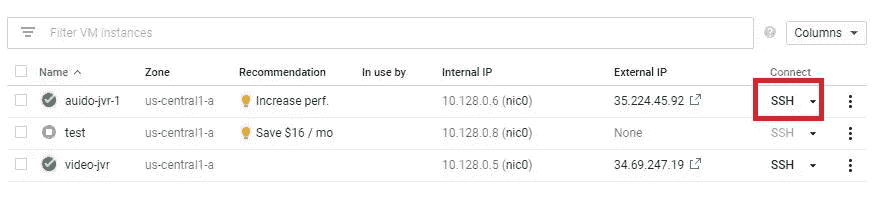

# 将深度学习 Django 应用部署到谷歌云平台

> 原文：<https://medium.com/analytics-vidhya/deploying-deep-learning-django-app-to-google-cloud-platform-70bab374704c?source=collection_archive---------8----------------------->


在一个公开(免费)的托管网站上部署一个简单的 Django 应用程序似乎很容易，这在某种程度上是正确的。然而，当你在处理基于深度学习的应用程序时，斗争就开始了。我已经在免费托管网站(Heroku)上部署了多个模型，但我不得不熬了一个通宵，终于明白，由于 slug 大小(500 MB -上传大小/压缩文件大小)的限制，不可能在这些免费托管网站上托管基于 TensorFlow ( **而不是 lite one**)的模型。因此，我决定写一篇关于如何使用几个简单的步骤将基于 Tensorflow 的应用托管到 Google 云平台的帖子。

链接到我所面临的废料浆大小的问题及其可能的解决方案可以在[这里](https://stackoverflow.com/questions/62114302/compiled-slug-size-578-1m-is-too-large-max-is-500m?noredirect=1#comment109902541_62114302)找到。

这是将 Django 应用程序托管到 GCP 的技术之一(可能是最简单的)。

# **第一步:**

**在谷歌云平台上创建虚拟机**

1.  假设您没有 Google Cloud 帐户，这里的[是创建一个帐户的链接。](https://cloud.google.com/)
2.  一旦你准备好账户，点击“去控制台”。
3.  使用现有项目(名为-我的第一个项目)或创建一个新项目。
4.  现在你会看到一个左边的导航栏，里面有很多可用的选项。将鼠标悬停在“计算引擎”上以查看所有可用选项，然后单击“虚拟机实例”。
5.  点击“创建实例”。
6.  在**名称**字段中为您的实例提供一个名称，并保持其余字段不变(即**区域、区域、机器配置**和**容器**)。
7.  下一个重要步骤是选择**启动盘**。(每当你在使用深度学习模型时，请记住谷歌云平台上有一个深度学习支持工具，这是其中最好的东西之一)。选择**操作系统**为“Linux 上的深度学习”**版本**为“Debian GNU/Linux 10 Buster+TF 2–1”，因为我用的是**tensor flow 2 . 1 . 0 版本**。如果你愿意，可以增加**磁盘大小**，但是 10 GB 绰绰有余。
8.  在**防火墙**部分，允许 https 和 https 流量，最后点击“创建”**。**


# 第二步:

**安装必要的软件包(Python3、pip、wget 等)**

1.  创建实例后，下一步是单击“SSH”。



1.  现在，我们将安装所有的软件包。要记住的一个非常重要的步骤是版本兼容性。使用 Tensorflow 2.1.0 时，最好使用 Python 3.6(推荐版本- Python 3.6.10)。否则你很有可能会遇到张量/图形/其他不必要的问题。
2.  安装 **Python3.6** 如下

```
$ **apt** update && **apt** upgrade -y
```

1.  在 Linux/Ubuntu 机器上安装新的 Python 需要我们安装一些必备的库作为依赖项的一部分。老实说，我不确定其中一半是做什么的，但是是的，因为没有这些库，我面临了很多问题。因此，相信我，你不会后悔这么做的。

```
$ **sudo** **apt-get** **install** build-essential checkinstall
$ **sudo** **apt-get** **install** libreadline-gplv2-dev libncursesw5-dev libssl-dev libsqlite3-dev tk-dev libgdbm-dev libc6-dev libbz2-dev libffi-dev zlib1g-dev
```

1.  通过从*源*下载并构建所需版本来安装你的 **Python** 版本，而不是使用“ **apt-get install** 来安装，因为这样做很容易。

```
$ cd /opt
$ **sudo** **wget** https://www.python.org/ftp/python/3.6.10/Python-3.6.10.tgz
$ **sudo** **tar** xzf Python-3.6.10.tgz$ cd Python-3.6.10
$ **sudo** ./configure --enable-optimizations
$ **sudo** **make** altinstall
```

***【make altinstall】****将帮助我们在我们的操作系统上安装额外版本的 Python。*

2.检查版本是否安装正确。

```
$ python3 --version
Python **3.6**.10
```

3.将 Python 版本设置为 Python 3.6.10，优先级为 1，如下所示:

```
$ update-alternatives --install /usr/bin/python python /usr/bin/python3.6 **1**
```

*有时，您的 Python 版本可能会安装在不同的文件夹中(大多数时候是在/usr/local/lib 目录中)。要从该目录将当前 python 版本设置为 Python 3.6，请使用以下命令。*

```
$ update-alternatives --install /usr/bin/python python /usr/local/lib/python3.6 **1**
```

4.将 Python 3.6.10 设置为自动模式，以将其用作默认 Python 版本

```
$ update-alternatives --config pythonThere are **2** choices **for** the alternative python (providing /usr/bin/python).

  Selection    Path                      Priority   Status
------------------------------------------------------------
* **0**            /usr/local/bin/python3.7   **2**         auto mode
  **1**            /usr/bin/python3.6         **1**         manual mode
  **2**            /usr/local/bin/python3.7   **2**         manual mode

Press <enter> to keep the current choice[*], or type selection number:
```

*输入* ***选择*** *为 1，将 3.6 设为默认 Python 版本。*

5.现在安装 **pip** 和 **wget** 如下:

```
$ **sudo apt** **install** python-pip
$ **sudo apt** **install** wget OR **sudo apt-get install** wget
```

*如果需要，升级 pip，否则您也可以使用默认安装的版本。*

# 第三步:

**准备 Django 应用程序进行托管**

1.  导航到您的 Django 项目，找到 **settings.py** 文件，将您的 VM 实例的外部 IP 添加到您的允许主机(ALLOWED_HOST = [xxx.xxx.xxx.xxx])，或者将“*”添加到您的允许主机(ALLOWED _ HOST =[' *])以允许所有类型的流量。


1.  将 requirements.txt(如果还没有的话)添加到 Django 项目中，其中包含运行项目所需的所有库/依赖项。确保 requirements.txt 在根目录下，而不是子目录下，否则 cloud 将无法读取和安装它。
2.  现在将您的项目推送到 Github，或者创建一个新的存储库，并将您的所有文件复制粘贴到 Github 中的项目。
3.  一旦您在 Github 上准备好了项目，下一步就是将它克隆到您的 VM 实例。

```
$ **sudo** git clonehttps://github.com/name_of_your_repository.git
```

4.将您的目录更改为克隆的项目

```
$ cd name_of_your_repository
```

5.现在，从您的项目中安装 requirements.txt

```
$ **sudo** pip install -r requirements.txt
```

*安装所有依赖项需要一些时间(主要是 Tensorflow==2.1.0 (421 MB)* 😛*耐心是关键伙计* ✌️ *。*

6.最后，在实例上运行服务器，如下所示:

```
$**sudo nohup** python manage.py runserver 0.0.0.0:80 |tee &
```

***nohup*** *命令将帮助您保持服务器运行，即使您关闭了终端，而****| tee&****将* *保持服务器在后台运行* *同时断开与 stdout 的连接。因此，不会产生任何不必要的输出，这会占用您的空间。但是，如果您遇到任何问题，并且想要检查错误，请使用以下命令:*

```
$**sudo** python manage.py runserver 0.0.0.0:80
```

*这会将所有错误打印到您的终端上。*

恭喜你！您已经成功地将基于深度学习的 Django 项目部署到 GCP。

如果你想访问你的网站，那么可以使用你的虚拟机实例的外部 IP 地址。比如你在用[**Postman**](https://www.postman.com/)**测试你的网站，把下面的作为 URL—[**http://x**](http://35.226.121.118/)**xx . XXX . xxxx . XXX**(XXX 是你的外部 IP)。如果你的网址有扩展名，你可以使用—[**http://x**](http://35.226.121.118/)**xx.xxx.xxxx.xxx/extension.****

****一些额外的参考消息****

1.  **如果您面临类似“ ***端口已被使用*** ”的问题，请尝试以下方法:**

```
$netstat -tulnap
$ kill -9 **portpid**
```

*****portpid*** *是分配给 http (80)端口的唯一编号(23/234/4567/12446)，可以从 netstat 命令中算出。***

**2.如果您面临与安装 Tensorflow 或任何其他大型库相关的问题，因为所有安装都是首次在缓存级别完成。用这个:**

```
$sudo pip install --no-cache-dir tensorflow==2.1.0
```

**3.如果您想检查虚拟机的大小指标，请使用:**

```
$df -h
```

**这将帮助你跟踪磁盘空间(已用的和可用的)、缓存和其他与内存相关的东西。**

**这是我第一次在这里发帖。如果有任何问题，请告诉我。或者你是否正面临任何关于深度学习模型/ ML 模型的问题。你可以通过 [LinkedIn](https://www.linkedin.com/in/akhil-haridasan-0640a1b4/) 或[脸书](https://www.facebook.com/akhil.haridasan/)联系我。或者在这里评论，反馈总是一个改进的好方法。**

**我将很快发布如何用简单的步骤开发 Django 应用程序。在那之前享受编码吧！！**👍****