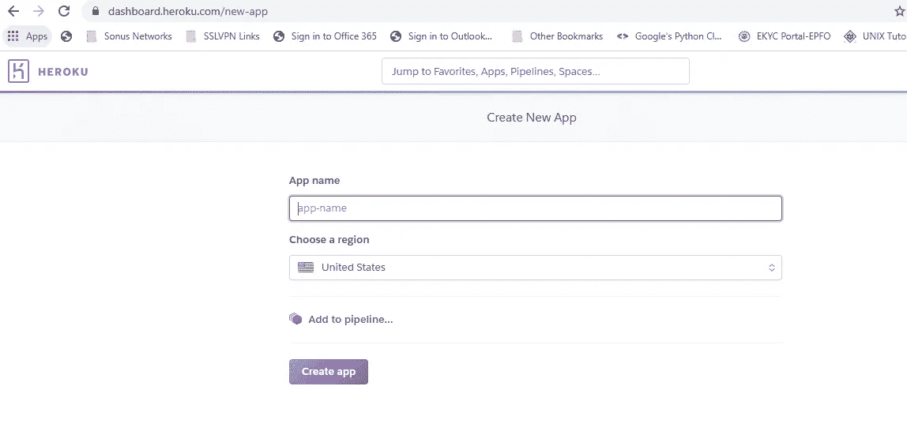
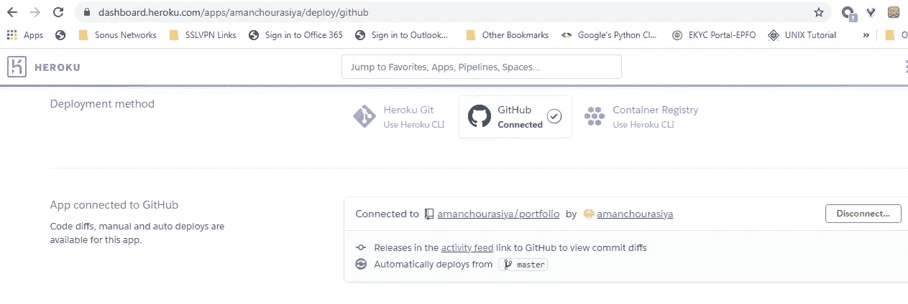

# 从 Github 仓库在 Heroku 上部署 Django 应用程序

> 原文：<https://medium.com/analytics-vidhya/deploying-django-app-on-heroku-from-github-repository-ae9b472613c7?source=collection_archive---------21----------------------->

在 Heroku cloud 上实现自动化部署的简单易行的指南


在 Heroku 云平台上部署 Django 应用程序从未像现在这样简单。Heroku 为部署 web 应用程序提供了无缝体验。Heroku 做了一件事，而且做得很好，那就是用更少的步骤部署 web 应用程序。

让我们看看 Heroku 如何部署我们的应用程序，它为我们提供了一个连接 GitHub 库的选项，然后它会自动触发构建，并在每次代码签入时部署我们的应用程序，这样它为我们的开发流程提供了一个最小的 CI/CD 管道。

在 Heroku 上部署您的应用时，应该遵循以下一些关键步骤。

# 1.在 Heroku 上创建新的应用程序



第一步是在 Heroku 上创建一个账户，并为你的 [Django](https://www.djangoproject.com/) 应用创建一个应用。

在 Heroku dashboard 上创建应用程序后，我们可以开始配置我们的应用程序。

# 2.将 GitHub 存储库连接到 Heroku。



转到部署选项卡，将您的 GitHub 存储库与此应用程序连接，Heroku 将通过查看一些特定文件来自动检测我们的应用程序。

# 3.生成特定于 Heroku 部署的文件。

在上图中，我们可以看到[我的 GitHub 库](https://github.com/amanchourasiya/portfolio)与这个应用程序连接。Heroku 在我们的存储库根目录中查找两个文件。

1.  requirements . txt——这是我们的项目在部署之前需要的所有需求和外部依赖项的列表。
2.  proc file——这是一个特定于 Heroku 的特殊文件，它有自己的命令，Heroku 需要这些命令来确定运行什么命令来启动我们的应用程序。

```
requirements.txt
=============================
asgiref==3.2.10
dj-database-url==0.5.0
Django==3.0.8
gunicorn==20.0.4
psycopg2==2.8.5
psycopg2-binary==2.8.5
pytz==2020.1
sqlparse==0.3.1
whitenoise==5.1.0
boto3==1.14.16
django-heroku==0.3.1
Pillow==7.2.0Procfile
=======================
release: python3 portfolio/manage.py migrate
web: python3 scripts/start_server.py prod
```

首先，Heroku 将安装 requirements.txt 中的所有依赖项，然后转移到 Procfile。

在 [Procfile](https://github.com/amanchourasiya/portfolio/blob/master/Procfile) 中，release 下的命令将在每次部署前运行，因为我们需要在每次部署前迁移数据库，因此该命令是必要的。

web 下的命令是应该启动我们的应用程序并将接收 web 流量的命令。因为 Heroku 将我们的应用程序部署在一个用 Heroku 的术语来说叫做 dyno 的容器中，所以有必要注意我们的数据不会跨部署持久化。

# 4.测试我们的应用。

Heroku 提供了一个日志控制台，显示所有与部署相关的日志，我们应该仔细查看这些日志，以确认我们的应用程序已成功部署，我们可以访问 Heroku 提供的 URL 来测试我们的应用程序是否正常工作。

如需更多澄清，请查看我的 GitHub repo 以检查 Heroku 部署的目录结构和其他更改。

该网站目前部署在 Heroku 云平台上。

*最初发表于*[T5【https://www.amanchourasiya.com】](https://www.amanchourasiya.com/blog/deploying-django-app-on-heroku-from-github-repository/)*。*