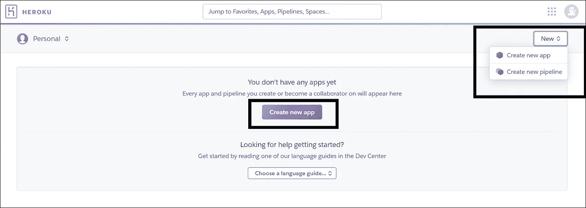
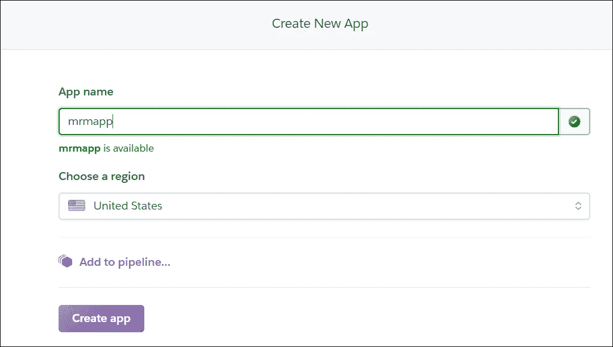
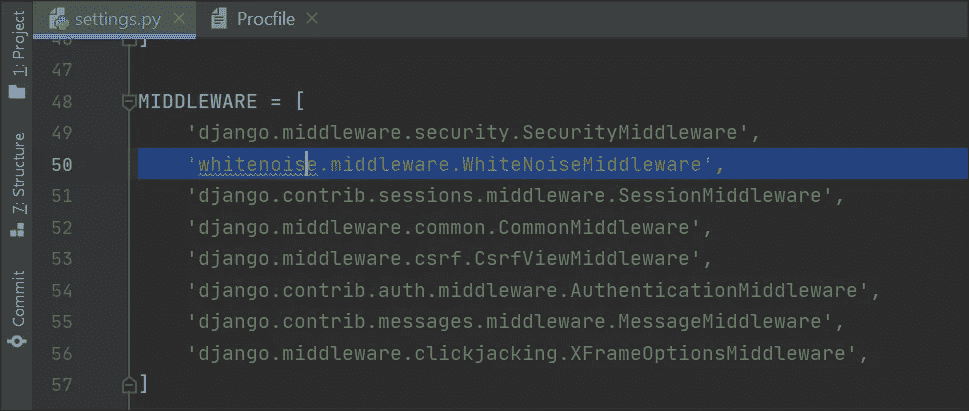
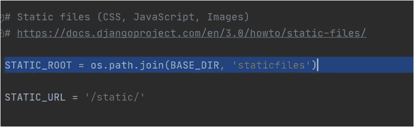
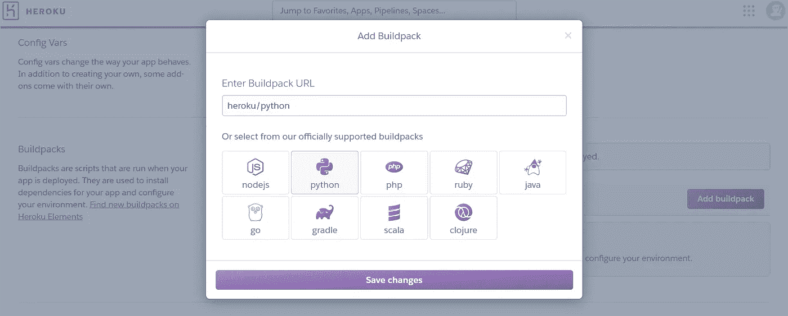
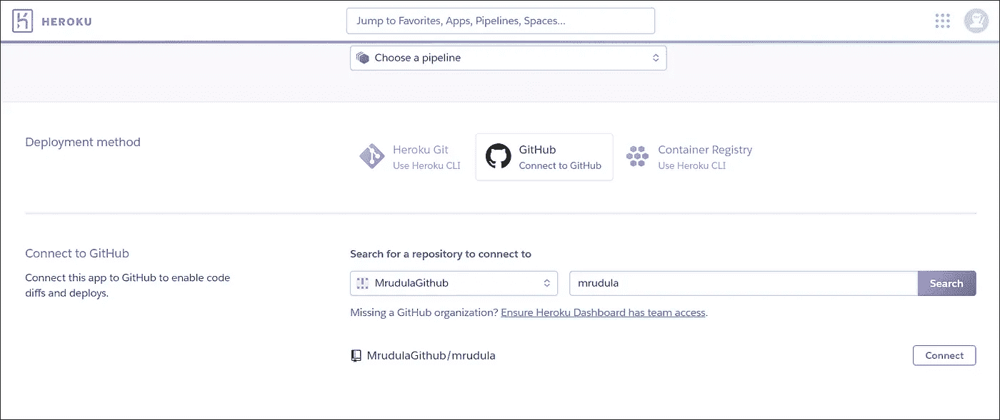

# 使用 GitHub 在 Heroku 上部署 Django 应用程序

> 原文：<https://medium.com/analytics-vidhya/deploying-django-app-on-heroku-with-github-fb3e3aaaa633?source=collection_archive---------3----------------------->


Heroku 提供了许多强大的特性，可以在实时服务器上部署项目，以便从世界上的任何地方访问它。最简单的方法是将其与 GitHub 集成，并在 GitHub 上部署代码。Heroku 可以自动构建并发布(如果构建成功)pushes 到指定的 GitHub 存储库。

***先决条件*** : GitHub 账号和 Django App。

这是我们要做的事情的清单-

*   *在 Heroku 上创建应用*
*   *准备部署应用*
*   *将代码推送到 GitHub*
*   *部署在 Heroku*

我们开始吧！

## 1.在 Heroku 上注册并创建一个应用

在此输入您的详细信息[注册一个免费的 heroku 帐户](https://signup.heroku.com/)。

登录您的帐户，点击新建>**创建新应用**。



输入唯一的应用名称。(有时可能需要尝试几次才能看到可用的内容)。检查地区并点击创建应用程序。



## 2.正在为部署准备 Django 应用程序

为部署准备 Django App 包括向项目根目录添加几个文件、安装几个包以及为 heroku 部署配置 settings.py 文件。一头扎进去，跟着步骤走-

在 Django settings.py 中，将调试值设置为 False，并在 **ALLOWED_HOSTS** 中，输入我们刚刚在上面创建的 heroku 应用程序域名。

```
DEBUG = FalseALLOWED_HOSTS = ['mrmapp.herokuapp.com']
```

现在，安装 **django-heroku** 包。这将自动配置您的 Django 应用程序在 Heroku 上工作。

```
pip install django-heroku
```

在 settings.py 文件`**import django_heroku**`的顶部，并在文件底部添加以下语句。

```
# Activate Django-Heroku.
django_heroku.settings(locals())
```

接下来，安装以下软件包-

```
pip install gunicorn
pip install whitenoise
```

**Gunicorn** 是一个用于 WSGI 应用程序的 Python-HTTP 服务器，而**whiten noise**允许我们的 web 应用程序提供自己的静态文件。现在在你的项目 settings.py 中添加**' whiten noise . MIDDLEWARE . whitenoisemiddleware '，**在中间件部分如下图所示-



由于 Heroku 不提供静态文件，我们需要在我们的项目 settings.py 文件中配置 **STATIC_ROOT** ,方法是在我们的 static_url 上面添加下面一行



接下来，在应用程序的根目录(包含 manage.py)中创建一个名为“ **Procfile** ”的文件，不包含任何文件扩展名。它指定了应用程序在启动时执行的命令。这里，我们通过在文件中添加下面一行来指定流程类型

```
web: gunicorn projectname.wsgi --log-file -
```

注意:项目名称应该是包含 wsgi 文件 settings.py 文件的文件夹的名称

接下来，在 django 项目根目录(manage.py 文件所在的位置)中创建一个文件 **runtime.txt** 。这告诉 Heroku 我们正在使用哪个版本的 python。输入您在文件中使用的 python 版本。


现在，在终端中运行以下命令

```
pip freeze > requirements.txt
```

这将在根目录中创建一个 **requirements.txt** 文件(与包含 manage.py 文件的文件相同),该文件包含项目运行所需的所有包及其版本的列表。文件中指定的所有依赖项都会在 heroku 中的应用程序启动之前自动安装。(如果您安装新的软件包并运行相同的命令，它将更新现有的文件)

项目设置到此结束，接下来我们将把代码推送到 GitHub 并部署它。

## 3.把代码推给 GitHub

我使用 PyCharm IDE 并创建了一个私有存储库，然后将我的代码推送到 GitHub。为此，在菜单栏中导航到 VCS >导入到版本控制>在 GitHub 上共享项目。输入存储库名称，选中私有和共享。查看详情[此处](https://www.jetbrains.com/help/pycharm/manage-projects-hosted-on-github.html#share-on-GitHub)。

另一种方法是，在您的 GitHub 帐户中创建一个空的私有存储库。将文件(离开虚拟环境 ENV 文件夹)从项目文件夹直接拖放到 repo，并将它们提交到主分支。

如果您有一个现有的 repo，那么推送最新的代码并将其合并到主分支，因为我们将部署主分支本身。

## 4.在 Heroku 的部署

在 Heroku 中，导航至您的应用程序>设置。向下滚动并点击**添加 build pack**选择 Python >保存更改



导航到部署选项卡，在部署方法下>点击 GitHub。点击下面的**连接到 GitHub** 按钮。出现一个弹出窗口，要求授权连接到您的 GitHub 帐户。点击授权 Heroku。在 Connect to GitHub 部分，搜索您的存储库。点击连接。



连接后，您可以选择手动或自动部署它。通过手动部署，您可以从连接的存储库中创建任何分支的即时部署。如果要控制何时将更改部署到 Heroku，请使用手动部署。

如果希望在每次对主服务器进行新的推送时进行部署，可以使用自动部署。当您为分支启用自动部署时，Heroku 会自动构建并部署对该分支的所有推送。

选择分支(主)并点击**部署分支**。这将启动构建过程，一旦完成，将显示一条成功消息。

点击**查看**按钮。这应该会在浏览器中启动您的应用程序，您的应用程序现在已经启动，可以在世界任何地方访问，祝贺您！

页（page 的缩写）如果你想在 AWS 上托管你的数据库并连接到 heroku，你可以关注我的博客[这里](/swlh/creating-a-postgresql-db-on-aws-and-connecting-it-to-heroku-django-app-29603df20c2a)。快乐阅读！


本·科尔德在 [Unsplash](https://unsplash.com?utm_source=medium&utm_medium=referral) 上的照片