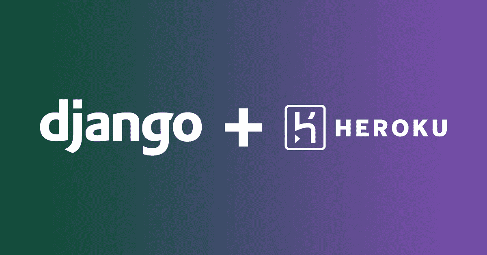

# 在 Heroku 上部署 Django 应用程序

> 原文：<https://medium.com/analytics-vidhya/deploying-django-application-on-heroku-e9e98e3b29eb?source=collection_archive---------25----------------------->

Django 在 Heroku 的部署

Heroku 是一个云平台即服务(PaaS ),支持多种编程语言，用作 web 应用部署模型。Heroku 是首批云平台之一，自 2007 年 6 月以来一直在开发中，当时它只支持 Ruby 编程语言，但支持 Java、Node.js、Scala、Clojure、Python、PHP 和 Go