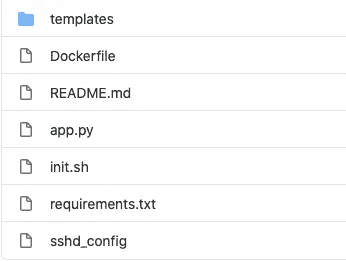
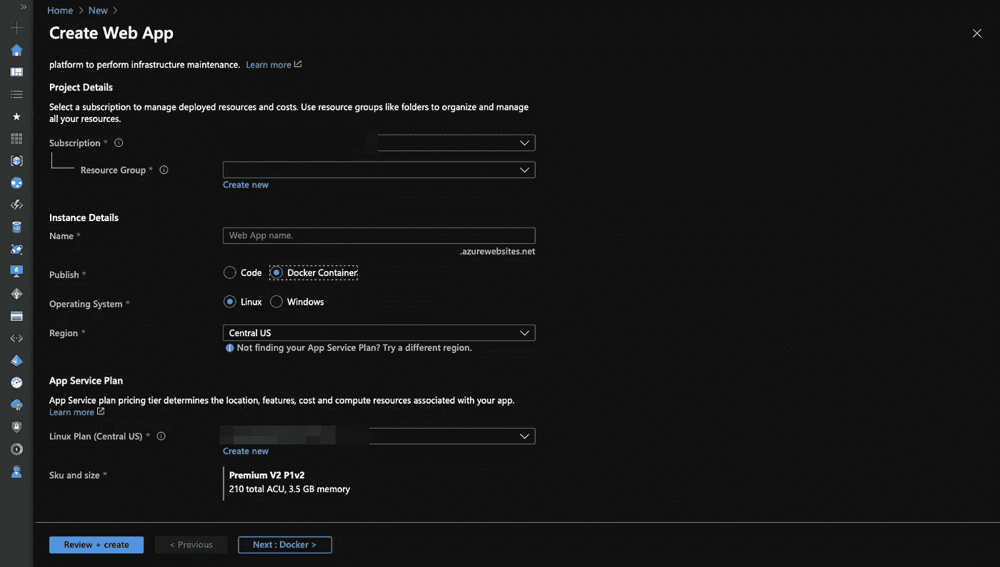
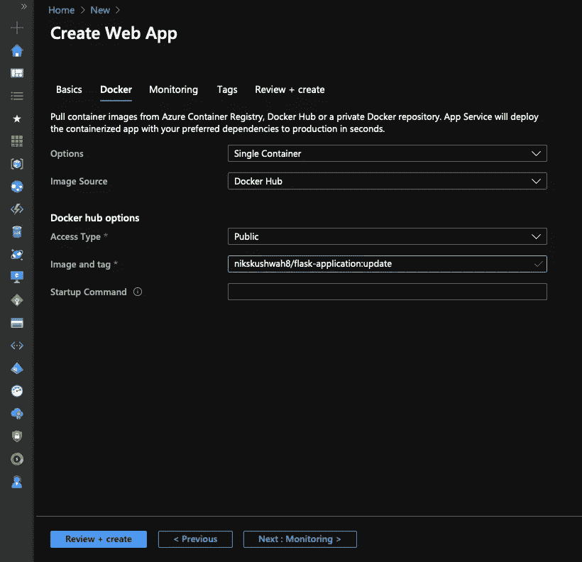

# 在 Azure 上使用 Docker 部署 Flask web 应用程序

> 原文：<https://medium.com/analytics-vidhya/deploying-flask-webapp-with-docker-on-azure-c48bee72ba0d?source=collection_archive---------16----------------------->


在本文中，我们将浏览 docker 的基本解释，创建一个 flask web 应用程序，然后使用 docker 在 azure 上部署该 web 应用程序。

# 什么是 Docker

软件开发中的每个人都听说过 docker(或者你可能听说过容器)。在 docker 之前，软件开发中的每个新人都要经历相同的过程——下载、提取、安装、重复。然后是 DOCKER，它简化了整个系统依赖过程。最好的部分是，如果它在本地工作，它将在生产中工作。让我们看看 docker 是什么意思:

根据维基百科

[**Docker** 是一套平台即服务(PaaS)产品，使用操作系统级虚拟化来交付称为容器的软件包中的软件。](https://en.wikipedia.org/wiki/Docker_%28software%29)

现在你知道 docker 了..对吗？？:P

Docker 让您创建一个特定的环境，您的代码可以在其中运行。您可以多次创建相同的环境，因为它允许构建副本。

现在你对 docker 有了一个概念，让我们来谈谈容器和图像。

## 容器

Docker 容器就像一个虚拟的运行时环境，它封装了所有的代码和依赖项。它可以是面向操作系统的容器或面向应用程序的容器。

## 图像

Docker 映像是一个不可变的文件，由多个层组成。该映像是使用 dockerfile 文件中提到的所有指令构建的。每个 dockerfile 指令创建一个新层。

# 创建 Flask Web 应用程序

让我们从创建一个简单的 flask web 应用程序开始。你可以复制粘贴下面的代码，也可以从我的 [GitHub](https://github.com/nikskushwah/azure_flask_docker) 中克隆 web 应用。这些是创建 web 应用程序的步骤。

## 要求

Python，Flask，GitHub，Docker，Azure

1)使用您的 IDE 选择创建一个空 python 文件(或者您可以使用可视代码)。

2)这是一个示例 app.py

3)使用以下代码创建一个 index.html，并将其保存在 templates 文件夹中。

4)现在你可以将你正在使用的所有包保存在 requirements.txt 中，当你试图在 azure 上部署 web 应用时，在你的项目文件夹中有一个 requirements.txt 是非常重要的。

`pip freeze > requirements.txt`

上面提到的命令将获取所有已安装的包，并将它们存储在 requirements.txt 中。更好的方法是固定您的依赖项，这意味着它应该有一个包含包名的版本。

5)尝试通过运行命令在本地运行它

```
python app.py
```

6)它应该是这样的:


## **使用 Docker 在本地运行 web 应用**

要在本地运行 docker，你必须首先从[这里](https://www.docker.com/products/docker-desktop)安装 docker-desktop。

我们将通过各种步骤来创建 docker 文件，并了解一些关于 docker 命令的信息。

打开 IDE 并创建一个新文件。

你可以在下面找到 web 应用程序的 docker 文件。

将其保存为扩展名为 on 的 Dockerfile。

让我们看看 dockerfile 中的这些指令是什么意思。记住，每个指令创建一个层。

**FROM** :该指令将从 python 3.6.1 图像创建一个层。

**运行**:你知道它会做什么，它会运行命令。您可以在 dockerfile 文件中执行多个运行指令。

**工作目录**:工作目录会改变你正在工作的目录。因此，WORKDIR 之后的任何指令都将只在该特定目录中执行。

**添加**:它可以让你将文件复制到 docker 镜像中。

**EXPOSE** :该指令将公开 docker 文件中提到的端口号。

**ENV** :您可以使用该指令设置环境变量。

# Docker 命令

我们将使用一些 docker 命令来测试我们的 web 应用程序是否在本地工作。您可以按此顺序运行这些命令，在最后一个命令之后，您将成功地将 docker 映像推送到 docker hub 注册表。

**码头工人建造。**

此命令允许您从 dockerfile 文件构建映像。文件必须存在于当前目录中(这就是点号所指的)。如果你想给你的图像命名，你可以在命令中添加-t(例如:- docker build -t flask-app。)

**docker 运行<image _ name>**

您可以通过运行上述命令来运行 docker 构建的映像。

**docker ps**

该命令将列出所有运行的容器及其名称和标签。

**docker 标签<image _ name>user _ name>/<image _ name>:<标签>**

此命令将用新的名称和标签标记图像。

**码头工人登录**

现在你需要登录到你的 docker 账户。运行此命令后，您需要输入您的 docker id 和密码。

**docker 推送<用户名> / <图片名> : <标签>**

它会将构建的映像推送到 docker hub。我们这样做是为了让 azure 可以从 docker hub 访问图像。

# 在 Azure 上部署

为了在 azure 上部署这个 web 应用程序，我们需要在我们的项目文件夹中添加一些文件，并将其推送到 docker hub。

首先，我们将添加一个名为 *sshd_config* 的文件。这个文件启用 ssh，然后客户机可以与容器建立安全连接。

接下来，是 docker 容器的启动脚本，我们将在其中启动 ssh 服务器。

添加完所有这些文件后，我们的项目结构如下所示



项目结构

现在，我们准备在 azure 上部署带有 docker 的 flask web 应用程序。

转到您的 azure 门户，然后单击创建资源。

接下来，您将看到一个类似的窗口，如下所示，您需要在其中输入有关 web 应用程序和 azure 帐户的详细信息(您可以选择 SKU 和大小中的免费层)。



记住在发布选项中选择 Docker 容器，然后单击下一步。

然后，一个带有选项的页面将会出现，azure 必须从那里提取容器图像。因为您已经将 docker 映像推送到中心，所以选择 Docker Hub 作为您的映像源。然后，输入正确的图像和标签(例如:-nikskushwah 8/flask-application:update)。



点击审核+创建，就这样。你已经在 azure 上用 docker 部署了一个全功能的 web 应用。

# 结论

在本文中，我们了解了如何使用 docker 在 azure 上创建一个简单的 web 应用程序。我们还在 docker 容器上启用了 ssh。在下一篇博文中，我们将看到如何使用 docker 在 azure 上部署一个简单的 CRUD 应用程序。感谢所有反馈和建议。您可以在我的 [GitHub](https://github.com/nikskushwah/azure_flask_docker) 上查看本文中使用的完整代码。