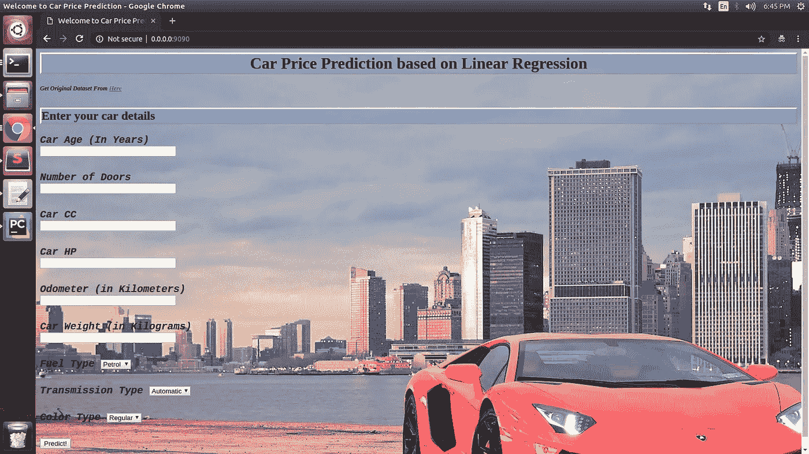
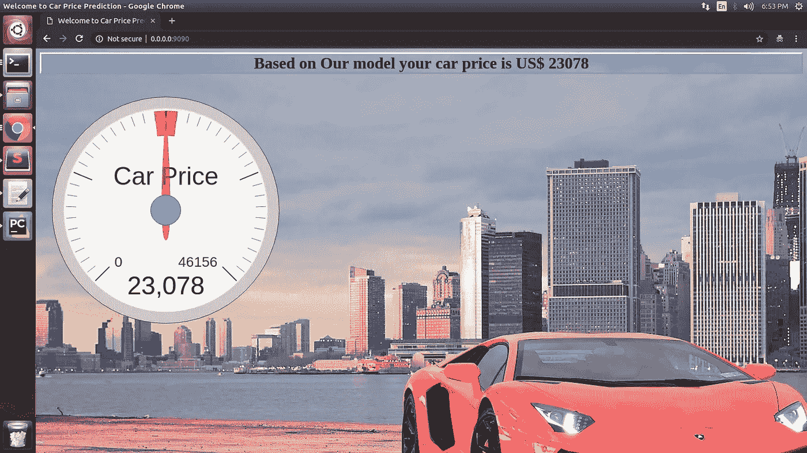

# 在 Docker 上将线性回归 ML 模型部署为 Web 应用程序

> 原文：<https://medium.com/analytics-vidhya/deploying-linear-regression-ml-model-as-web-application-on-docker-3409f9464a27?source=collection_archive---------5----------------------->


线性回归算法是基本的[监督机器学习](https://en.wikipedia.org/wiki/Supervised_learning)算法之一。这是一种简单但最常用的机器学习技术之一。有很多关于线性回归的文章。我发现[这个](https://towardsdatascience.com/linear-regression-detailed-view-ea73175f6e86)是理解线性回归的有用资源。

在这篇文章中，我将解释如何在 docker container 上部署经过训练的线性回归机器学习模型作为轻量级 web 应用程序。Docker 是一个*高度* *可扩展的开源环境*，在应用开发公司中最受欢迎。

因为大部分机器学习的高级库都可以在 python 中使用，所以我也将使用 python 来开发 web 应用程序，以避免任何跨语言的依赖性。这篇文章有三个简单的步骤

# 第一步:训练/完成/保存你的机器学习模型。

举一些线性回归实际应用的例子。比方说，我们想建立一些汽车的价格预测网络应用程序，预测你的汽车价格的基础上，你的汽车的特点，如汽车的发动机类型，汽车的发动机马力，汽车的颜色，汽车的年龄等。我们需要一些数据来训练和评估我们的 ML 模型。Kaggle 是获取数据集的好地方。对于这个应用程序，我选择[这个](https://www.kaggle.com/gunishj/carpricepred/downloads/carpricepred.zip/1)数据集来训练我的 ML 模型。

图 1:汽车预测模型代码。

在上面的代码中，请注意，我们得到的 RMSE 是 1250 美元，这是合理的。您可以继续对模型进行微调(通过选择最优特性)，但是这超出了本文的范围，所以我不打算这样做。在模型训练之后，你可以看到我正在以文件名“car_price_prediction.pkl”保存模型。这是一个经过训练的模型文件，可以部署在 web、移动或任何其他平台或应用程序上。

# 步骤 2:创建应用程序(Web/Mobile)。

现在让我们创建一个 web 应用程序，使用我们训练好的模型来预测新车销售价格。我用的是[砂箱](https://palletsprojects.com/p/flask/)框架和它的[金甲 2](https://palletsprojects.com/p/jinja/) 模板。Flask 是一个用于开发 web 应用程序的轻量级 web 框架。你可以从 [**点击**](https://github.com/jinesh90/CarPricePrediction) 查看网络应用的全部代码。你可能注意到我已经创建了一个名为“ *mlmodel* 的文件夹。在这个文件夹中，我放置了名为*“car _ price _ prediction . pkl”的线性回归模型。*

你可以很容易地在 web 应用程序中使用训练好的模型。pkl 文件。下面是代码示例。

```
@app.route("/", methods=["POST"])
def result():
    try:
        form = request.form
        model = joblib.load("mlmodel/car_price_prediction.pkl")
        if int(form['car_fuel']) == 1:
            fuel = 1
        else:
            fuel = 0
        if int(form['car_transmission']) == 1:
            car_transmission = 1
        else:
            car_transmission = 0
        if int(form['car_color']) == 1:
            car_color = 0
        else:
            car_color = 1
        new_car = np.array(
            [int(form['car_odometer']), fuel, int(form['car_doors']), car_transmission,
             int(form['car_horsepower']), car_color, int(form['car_cc']), int(form['car_weight']),
             int(form['car_age'])]).reshape(1, -1)
        predicted_price = model.predict(new_car)
        if predicted_price < 0:
            predicted_price = 0
        return render_template("result.html", price=int(predicted_price))
    except ValueError:
        return render_template("error.html")
```

注意这里，

```
model = joblib.load("mlmodel/car_price_prediction.pkl")
```

上面的代码将线性回归模型加载到您的应用程序中。

# 步骤 3:部署线性回归应用程序。

第三也是最后一部分是关于部署。我正在使用 [docker 容器](https://www.docker.com/resources/what-container)来部署我们汽车的价格预测应用程序。Docker 只需要两个基本文件进行部署。1)docker file 2)docker-compose . yml。

DockerFile 文件

```
**FROM** python:3
**WORKDIR /**usr**/**src**/**app
**COPY** requirements.txt .
**RUN** pip install **--**no-cache-dir **-**r requirements.txt
**COPY** . .
**COPY** src**/** .
**CMD** ["python", "app.py"]
```

docker-compose.yml

```
**version:** '3'

**services:
  web:
    build:** ./web
    **ports:** - "9090:9090"
```

将 DockerFile 和 docker-compose.yml 文件放入源代码后，用户需要执行两个简单的命令:

```
sudo docker-compose build
sudo docker-compose up
```

您将在控制台中看到此输出。

```
web_1_2c1857cc6429 |   warnings.warn(msg, category=DeprecationWarning)
web_1_2c1857cc6429 |  * Running on [http://0.0.0.0:9090/](http://0.0.0.0:9090/) (Press CTRL+C to quit)
web_1_2c1857cc6429 |  * Restarting with stat
```

恭喜你！！您的汽车价格预测应用程序已经启动并运行。现在点击链接或进入浏览器。您将看到输入汽车数据的用户界面。



图 2: Web 应用程序 UI。

一旦用户填写了所有输入，并点击“预测”后端服务器将饲料输入值模型，并获得预测的汽车价格。



图 3:基于线性回归模型预测的汽车价格

这个机器学习应用程序具有高度可扩展性，因为它与真实模型学习(高度计算繁重的操作)相分离。每个计算都是离线的。如果用户想更改车型，只需替换“car_price_prediction.pkl”文件，通过执行上面提到的两条命令重新构建/重启 docker app 即可。

# 最终结论:

训练机器学习模型是一项计算量很大的操作。应用程序(移动/web)应该从模型训练/测试/调整中分离出来。像 docker 这样的部署工具为您的机器学习应用程序提供了可伸缩性和易部署性。你也可以部署另一种机器学习算法，如 SVM、KNN、决策树，作为高度可扩展的 web、移动应用程序。