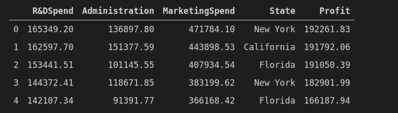

# 在 Azure 上部署机器学习模型作为 Web 应用

> 原文：<https://medium.com/analytics-vidhya/deploying-machine-learning-model-as-a-web-application-on-azure-9f4e1cd331d0?source=collection_archive---------5----------------------->

## 通过对接 Flask 应用程序将机器学习模型部署为 Web 应用程序的详细指南


使用 imgflip.com 设计

机器学习工程师的角色不仅仅是构建模型，还要使模型可部署，这在后面的阶段由 DevOps 团队集成。

在本文中，我将介绍:

1.  使用 Docker 容器化使机器学习模型可部署。
2.  **使用 Azure App services 将模型部署为 Web 应用程序。**


来源:[https://docs . Microsoft . com/en-us/azure/machine-learning/overview-what-is-azure-ml](https://docs.microsoft.com/en-us/azure/machine-learning/overview-what-is-azure-ml)

> **Azure App Service** 是一个完全托管的“平台即服务**”(PaaS)，用于构建 web 应用、移动后端和 RESTful APIs。**
> 
> **(来源:Azure 文档)**

# **步骤 0:让我们开始吧**

**开始之前，让我们看看模型和烧瓶应用。在这里，我们创建 flask 服务器，并将我们的 ML 模型带到本地主机生产中。**

****

**使用 Canva 设计**

**这里我们关注的是部署，而不是构建模型。让我们对数据集和模型有一个概述。我取了 50_Startups 的数据，建立了一个线性回归模型。**

****

**数据集概述**

**机器学习模型的目的是 ***根据初创公司的研发支出、管理、营销支出以及初创公司所处的状态来预测*** **利润**。**

**Pickle 模型(Pickle 文件存储模型的参数和层次)。**

```
import pickle
pickle.dump(model, open('model.pkl', 'wb')) 
```

**如需完整的数据集和模型，请点击[此处](https://github.com/tharun435/DeployMachineLearningModels/tree/master/DeployFlaskAzure)。**

## **1.创建简单的网页**

**为了预测利润，我们需要听取用户的意见。为了实现这一点，开发了一个 html 文件来请求输入，使用我们的 ml 模型预测输出并在网页中显示结果。**

****

**网络应用概述(作者提供照片)**

**你可以在这里找到代号为 index.html 的代号**

## **2.烧瓶应用程序**

**Flask 是一个用于在 Python 中构建 web 应用的框架。为了托管我们的网页(index.html)，我们需要创建一个 Flask web 应用程序。**

**烧瓶应用程序**

**确保 *app.py* ，模板和 *model.pkl* 在同一个文件夹中。现在运行 Flask 应用程序。**

```
python app.py
```

****

**通过 Flask 应用程序提供 Html 页面**

**转到本地主机:5000。您可以看到 Web 应用程序正在成功运行。**

****

**本地主机上部署的应用程序**

**要在其他人的计算机上运行相同的应用程序，需要设置环境。为了方便起见，我们使用码头集装箱。**

> **容器是软件的标准单元，它包含代码包及其所有依赖项，因此应用程序可以快速可靠地从一个计算环境运行到另一个计算环境。Docker 容器映像是一个轻量级的、独立的、可执行的软件包，包括运行应用程序所需的一切:代码、运行时、系统工具、系统库和设置。**

****

**虚拟机与容器化(使用 canva 设计)**

# **步骤 1:将 Flask 应用程序归档**

**首先，我们需要为我们的应用生成依赖关系(requirements.txt)。要生成 requirements.txt，请转到该文件夹并在命令提示符下运行 *pipreqs* 。**

```
pipreqs
```

****注意:**请用主机替换端口，因为当我们在 Azure 上部署时，会创建一个新的虚拟机。我们需要通过主机中的端口运行应用程序。我们在 Dockerfile 中公开我们的端口来运行应用程序。**

## **1.创建 Dockerfile 文件**

```
FROM python:3.7-slim

WORKDIR /app

ADD . /app

RUN pip install --trusted-host pypi.python.org -r requirements.txt

EXPOSE 5000

ENV NAME OpentoAll

CMD ["python","app.py"]
```

*   **为了将应用程序容器化，我们需要创建 docker 图像。一个 **Docker 映像**是一个包含多层的文件，用于执行 **Docker** 容器中的代码。**

> **注意:要构建 docker 映像，请确保这些 Flask 应用程序(app.py)、网页(index.html)、docker 文件和 pickle 文件在同一个文件夹中。**

****

**文件夹结构(作者照片)**

## **2.建立码头形象**

```
docker buid -t azuremlr:latest ./
```

*   **要检查 Docker 映像是否构建成功，请执行以下命令。**

```
docker images
```

*   **它显示您的计算机上所有可用的 docker 图像。**

## **3.在本地机器(你的计算机)上测试你的 Docker 容器**

```
docker run -p 5000:5000 azuremlr:latest
```

*   **该命令在本地主机 5000 上运行 flask 应用程序。一旦启动，Docker 容器就开始在本地机器上成功运行，并准备好在任何地方托管或部署容器，没有任何麻烦。**

> **Docker 容器是图像的运行时实例。简而言之，Docker Image 是制作食谱的一套指令，docker container 是使用该食谱准备的菜肴。**

## **ML 开发人员将这个 Docker 映像交给 Devops 团队，以便与其他应用程序集成或部署到生产环境中。**

# **第二步:让我们尝试使用 Azure 应用服务将 Docker 映像投入生产**

****

**使用 apps.diagrams.net 设计**

## **1.将图像推送到 Docker Hub**

****注意** : *在将映像推送到 docker hub 之前，在您的 docker hub 帐户中创建一个 repo。***

**将上面的图像推送到 dockerhub，这样就可以从任何地方访问它。 *Docker Hub* 是创建、管理和交付团队容器应用程序的最简单方式之一。**

## **2.标记您的 Docker 图片并推送至 Docker Hub**

**docker 标记[机器中的图像名] [dockerhub 用户名]/[repo:tagname]**

```
docker tag azuremlr tharun435/myrepo:1.0
```

**如需了解将 docker 图像推送到 docker hub 的更多信息，请点击[此处](https://www.pluralsight.com/guides/create-docker-images-docker-hub)。**

```
docker push tharun435/myrepo:1.0
```

# **将 ML 模型部署为 Web 应用程序**

****1。**进入 azure 门户的应用服务，点击*新建*。在发布中选择 Docker 容器&点击下一步。**

****

**创建新的 Web 应用程序(给出合适的名称)**

****2。**选择图像源作为 Docker Hub，并将您推送的图像命名为 Docker Hub。提供带有标签的图像。在我的例子中，它是 tharun435/myrepo:1.0**

****

**作者照片**

****3。**接下来，点击*监控*并转到标签，给出端口和值。**

****

**给出标签和值(作者提供照片)**

****4。**点击评审&上的*创建。***

****

**作者照片**

**现在，Web 应用程序已成功创建，将会生成一个类似于[**https://deploymodel.azurewebsites.net/**](https://deploymodel.azurewebsites.net/)的链接**

# **结论**

**我们已经成功地使用 Docker 和 Azure 将我们的机器学习模型部署为 Web 应用程序。完整的代码和详细的解释可以在我的 [GithubRepo](https://github.com/developers-cosmos/DeployMachineLearningModels/tree/master/DeployFlaskAzure) 上找到。**

****

**使用 imgflip.com 设计**

# **取得联系**

**希望你觉得这篇文章很有见地。我很乐意听到你的反馈，以即兴发挥，使之更好！如果你想联系，**在**[**LinkedIn**](https://www.linkedin.com/in/findtharun/)上联系我。感谢阅读！**