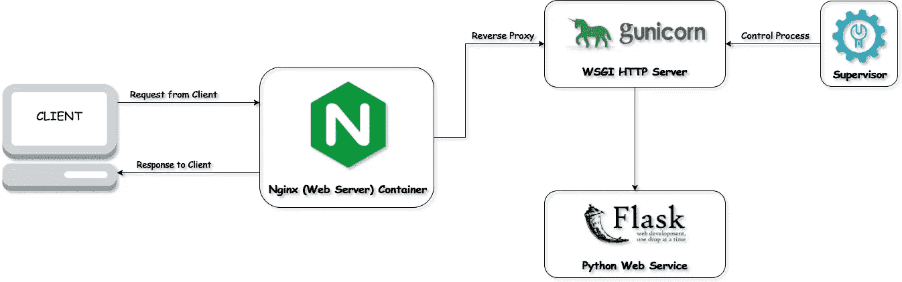
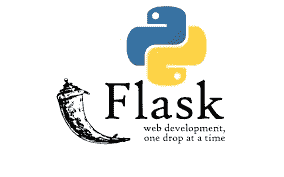
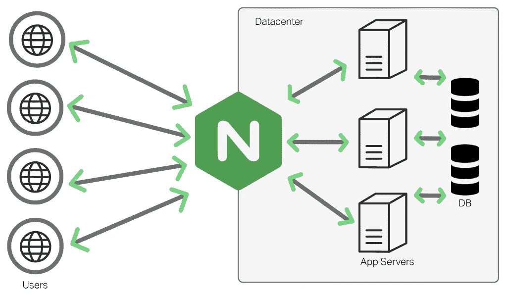
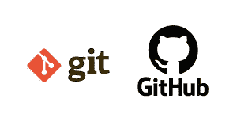

# 部署机器学习模型

> 原文：<https://medium.com/analytics-vidhya/deploying-machine-learning-model-f3af52068c1b?source=collection_archive---------5----------------------->

## 在 linux 机器上部署您的模型并保持它工作。

作为一个数据科学爱好者，它总是让我想知道如何与世界分享我的工作；而不是仅仅将我的代码放在 Github 中，或者在文章中介绍它们。所以像我一样，许多人想知道如何部署我们的 ML 模型。

**先决条件:**
1。对 Linux 命令的基本理解将是一个额外的好处。
2。使用 Git 的经验，最好使用 GitHub 创建一个存储库。
3。Python3，pip，虚拟环境的基础知识。

不要担心所有的代码都会被解释，如果你以前没有使用过 Git，Pip，Virtual environment 和 Github，链接会让你对它们有充分的了解。

写这篇文章的想法是打破常规，在现有信息的基础上分享一些额外的信息。文章以问答的形式撰写，涵盖了所有相关的话题以及关于这个话题的常见问题。



完成部署在 Linux 机器上的 ML 模型的工作。

将 Python web 应用程序部署到生产环境中的三个常见构造块是:

*   web 服务器(如 nginx)
*   WSGI 应用服务器(如 Gunicorn)
*   您的实际应用程序(使用开发人员友好的框架编写，如 Flask)

现在不要担心，我们会向您详细解释所有术语。

任何模型，无论是分类模型还是回归模型，都可以借助 Flask 进行部署。

**问:什么是烧瓶？**

A.根据维基；Flask 是一个用 Python 编写的微型 web 框架。它被归类为微框架，因为它不需要特殊的工具或库。它没有数据库抽象层、表单验证或任何其他组件，而现有的第三方库提供了通用功能。



瓶

还有许多其他 web 框架，如 Django、Web2py、CherryPy 等。 **Web** 框架提供了一种构建和部署 **web** 应用程序的标准方式。所以 Flask 帮助我们部署 Python Web 应用程序。

**问:Nginx 是什么？NGINX** 是一个免费的、开源的、高性能的 HTTP web 服务器，它也可以用作反向代理、负载均衡器、邮件代理和 HTTP 缓存。您可以使用自己的 Linux 服务器，或者将其部署在 Heroku、PythonAnyWhere 等。



NGINX

还有许多其他的服务器，如 Apache，Docker，Redis 等。我选择 Nginx 的原因是因为它提供了低内存使用和高并发性，因此 Nginx 没有为每个 web 请求创建新的进程，而是使用一种异步的、事件驱动的方法，在单线程中处理请求。因此，要部署我们的模型，我们需要一个由 Nginx 提供的服务器。

**问:什么是 Gunicorn？
A.** 绿色独角兽，通常简称为“ **Gunicorn** ”，是一个 Web 服务器网关接口(WSGI)服务器实现，通常**用于**运行 Python web 应用。


格尼科恩

但是我们为什么需要一个 Gunicorn 呢？
Gunicorn 负责 **web 服务器**和 **web** 应用程序之间发生的一切。如果您没有 Gunicorn，那么在创建 web 应用程序后，我们需要:

*   宿主静态文件
*   处理 https 连接
*   从崩溃中恢复
*   确保您的应用程序可以向上扩展(通过框架或您自己的代码)。
    这些都是 Gunicorn 做的。

**那么什么是 WSGI 呢？
WSGI** 出现是因为 Web 服务器**需要**与 Web 应用程序通信。 **WSGI** 规定了**需要**由 Web 应用程序端和 Web 服务器端实现的规则，以便它们可以相互交互。

**问:在第一张图中，我们展示了 ML 模型设置的所有部分，其中有一个主管。这个主管是什么，它做什么？监督者监视和控制 gunicorn 过程。Supervisor 将负责 Gunicorn 进程，并确保它们在出现任何问题时重新启动，或者确保这些进程在引导时启动。当你想要编辑模型或者给模型添加新的特性时，这将会很有帮助；您不必每次都手动启动和重启您的应用程序。主管会帮你做的。**

问:什么是 Git？我们为什么需要 Github？
A. *Git* 是一个分布式版本控制系统，用于在软件开发过程中跟踪源代码的变化。它是为协调程序员之间的工作而设计的，但也可以用来跟踪任何一组文件中的变化。所以基本上，git 确保所有代码变更的版本控制都会被跟踪。例如:您现有模型*(微调模型以增加其准确性)*的任何新功能都将作为新版本进行跟踪。



Git 和 Github

GitHub 是一个 Git 存储库托管服务，但是它增加了许多自己的特性。Git 是一个命令行工具， **GitHub** 提供了一个基于 Web 的图形界面。它还提供了访问控制和几个协作功能，例如 wikis 和每个项目的基本任务管理工具。
至于我们为什么需要它；因为它让我们的工作展现在公众面前。此外，它**是**周围最大的编码社区之一，所以使用它可以为你的项目和你自己提供广泛的曝光。

如有任何疑问，请在 Git 和 Github 上观看[这个](https://youtu.be/3RjQznt-8kE?list=PL4cUxeGkcC9goXbgTDQ0n_4TBzOO0ocPR)视频系列；这些视频会给你足够的信息。

# 第 1 部分:设置服务器及其所需的依赖项。

如果你使用的是 Linux 服务器，你很可能会使用亚马逊、微软、谷歌、Linode 等公司的虚拟机。在本文中，我们将使用**亚马逊的 AWS EC2 实例。**

在本文中，我们将讨论如何使用 AWS EC2 实例。
***注意:*** 对于所有亚马逊用户来说，如果你以前没有使用过 AWS 服务，你可以免费使用一年的服务器、数据库等等，这对你的机器学习(ML)模型来说已经足够了。

要创建自己的 EC2 实例，请遵循[这个](https://docs.aws.amazon.com/AWSEC2/latest/UserGuide/get-set-up-for-amazon-ec2.html)页面，如果您喜欢视频教程，请观看[这个](https://youtu.be/ZISa3K5v7X8)。
因此，如果您遵循 AWS 教程或阅读该页面；您现在有了一个 Linux 服务器。现在很简单了。

# 从 Ubuntu 库安装组件

```
$ sudo apt update
$ sudo apt install python3-pip python3-dev build-essential libssl-dev libffi-dev python3-setuptools
(pip is the package manager for python; for more information visit [this](https://realpython.com/what-is-pip/) page)
$ pip install Flask
$ pip install nginx
```

Nginx 和 Gunicorn 协同工作，Nginx 充当 web 服务器，处理所有静态文件的请求，并让 Gunicorn 处理所有 python 代码。所以 Nginx 处理所有的 Javascripts、HTML、CSS、图片等，Gunicorn 处理 Python 文件。

```
$ mkdir flaskProject
$ cd flaskProject$ sudo apt install python3-venv
(python3-venv helps you create a virtual environment. If you don’t know what virtual environment is then visit [this](https://www.geeksforgeeks.org/python-virtual-environment/) page.)$ python -m venv flaskProject/venv
(this command creates a virtual environment for us .Now we need to activate the virtual environment.)$ source venv/bin/activate
$ pip install gunicorn
$ sudo apt install supervisor
```

**NGINX 配置:**
安装 NGINX 后，运行以下命令:

```
$ sudo rm /etc/nginx/sites-enabled/default
$ sudo nano /etc/nginx/sites-enabled/flaskProject
```

默认 nginx 配置由 **rm** 命令删除，新配置由 **nano** 命令添加。键入 nano 命令后，将打开一个新文件；只需复制下面的代码，并确保用户名和项目名被正确复制。

```
server {
    listen 80;
    server_name YOUR_IP_OR_DOMAIN;

    location /static {
        alias /home/YOUR_USER/flaskProject/YOUR_PROJECT/templates;
    }

    location / {
        proxy_pass http://localhost:8000;
        include /etc/nginx/proxy_params;
        proxy_redirect off;
    }
}
```

**主管配置:**

安装 supervisor 后，运行以下命令:

```
$ sudo nano /etc/supervisor/conf.d/flaskProject.conf
```

键入 nano 命令后，将打开一个新文件；简单地复制下面的代码。

```
[program:flaskProject]
directory=/home/YOUR_USER/flaskProject/YOUR_PROJECT
command=/home/YOUR_USER/YOUR_PROJECT/venv/bin/gunicorn — bind 0.0.0.0:8000 app:app
user=YOUR_USER
autostart=true
autorestart=true
stopasgroup=true
killasgroup=true
stderr_logfile=/var/log/flaskProject/flaskProject.err.log
stdout_logfile=/var/log/flaskProject/flaskProject.out.log
```

stderr_logfile 和 stdout_logfile 路径尚未创建，因此在退出管理程序文件后；键入以下命令

```
$ sudo mkdir -p /var/log/flaskProject
$ sudo touch /var/log/flaskProject/flaskProject.err.log
$ sudo touch /var/log/flaskProject/flaskProject.out.log
```

您可以使用 touch 或 nano 来创建新的日志文件。

所有对如何进行部署以及部署的各个方面更感兴趣的人。看看科里·斯查费在 YouTube 上的视频。

如何在 [Windows](https://youtu.be/xzgwDbe7foQ)
上运行 Linux/Bash 基于 SSH 密钥的认证[教程](https://youtu.be/vpk_1gldOAE)SSH 密钥在 [Windows](https://www.youtube.com/redirect?redir_token=Vgz4FUPIB6FjaIKyYULhFlKZdEZ8MTU3OTExNDA1OUAxNTc5MDI3NjU5&event=video_description&v=goToXTC96Co&q=https%3A%2F%2Fwww.linode.com%2Fdocs%2Fsecurity%2Fauthentication%2Fuse-public-key-authentication-with-ssh%2F%23windows) 上运行。
Python Django 教程:部署您的应用程序(选项# 1)——部署到 Linux [服务器](https://youtu.be/Sa_kQheCnds)。

# 第 2 部分:创建 Github 存储库

**您的 GitHub 资源库的文件夹结构:** *(不强制遵循此顺序)。
1。app.py(针对烧瓶 app)
2。model.py(你的 Ml 模型文件)
3.template/index.html(处理任何 html，css 等文件的文件夹)*

**问:从哪里可以获得完整的代码？有运行在 Linux 服务器上的 python web 应用程序的实例吗？
答:**你可以在[这个](https://github.com/AjayJohnAlex/Keyword-Extraction) Github 库中获得关键词提取模型的完整代码。为一个工作演示检查[这个](http://18.188.94.47/index)了。

***万一没有 GitHub 库，想在部署自己的模型*** 之前测试一下；在您的 **flaskProject 文件夹**中使用下面的命令将这个 repo 克隆到您的 linux 机器上。

```
$ git clone [https://github.com/*THE-USERNAME*/THE*-REPOSITORY*](https://github.com/YOUR-USERNAME/YOUR-REPOSITORY) *(format example)*$ git clone [https://github.com/AjayJohnAlex/Keyword-Extraction.git](https://github.com/AjayJohnAlex/Keyword-Extraction.git)
```

您可以通过这种方式克隆任何存储库。所以也可以随意探索其他存储库。

## app.py:

这包含 Flask APIs，它通过 GUI 或 API 调用接收数据，根据我们的模型计算预测值并返回它。

```
import pandas
import numpy
import spacy
from flask import Flask, request, jsonify, render_template, json
import model as md
# import pickle

app = Flask(__name__)

@app.route('/')
def home():
    return render_template('index.html')

@app.route('/predict',methods=['POST'])
def predict():
    '''
    For rendering results on HTML GUI
    '''
    int_features = str(request.form.get("description"))

    vocab_dict , arr = md.textProcessing(int_features)

    tf = md.computeTF(vocab_dict,arr)
    idf = md.computeIDF([vocab_dict])
    tfidf = md.computeTfidf(tf,idf)

    return jsonify(tfidf)

if __name__ == "__main__":
    app.run(debug=True)
```

**template/index.html :**

```
<!DOCTYPE html>
<html >

<head>
  <meta charset="UTF-8">
  <title>ML API</title>

</head>

<body>
 <div class="login">
	<h1>Predict Keyword Analysis</h1>

     <!-- Main Input For Receiving Query to our ML -->
    <form action="{{ url_for('predict')}}"method="post">
    	<textarea rows = "30" cols = "100" name = "description" placeholder="Description" required="required" ></textarea>

        <button type="submit" class="btn btn-primary btn-block btn-large">Predict</button>
    </form>

   <br>
   <br>

 </div>

</body>
</html>
```

**model.py:** 这包含机器学习模型预测所需输出的代码。如果您没有克隆存储库，这将与您的不同，但是对于任何澄清检查[这个](https://github.com/AjayJohnAlex/Keyword-Extraction/blob/master/model.py)。

现在你有了自己的 Linux 服务器和所有必要的依赖项，并且有了运行你的 web 应用程序所需的所有代码。

> 问:但是这些文件是如何工作的呢？他们是如何相互依赖的？好吧，让我们来分解所有代码行的工作原理:
> 
> **在 index.html 文件-
> 这里主要关注的是表单，所以表单执行动作:**
> 
> form action =**" { { URL _ for(' predict ')} } " method = " post "**
> 
> 然后它有一个文本区和一个提交按钮。
> 
> 因此，单击 submit 按钮，数据将被发送到名为 predict 的 API，并在该 API 中发布数据。这个预测 API 是在 app.py 文件中定义的。
> 
> **在 app.py 文件-**
> 中我们有 render_template 来渲染输出或者 HTML 文件，jsonify 来获取 JSON 响应。
> 现在，app = Flask(__name__)确保 flask app 已初始化。
> 
> 并且这个初始化的 flask 对象“**app”**现在可以用于创建路由/API，并且每个路由包括 API 名称和方法(POST/GET)。
> 在一个已定义的 API 中，我们有一个被调用的 python 方法或一个呈现的 HTML 页面。
> 
> 所以我通常保持我的 API 名和其中的方法名相同。因此，当一个 API 被调用时，它执行其中的方法，然后运行我的机器学习模型，该模型在 **model.py 文件**中定义，并呈现输出。

```
if __name__ == "__main__":
    app.run(debug=True)This line of code ensures that you can debug your Flask app if you run into any errors.
```

要深入了解烧瓶的所有可能方法，请查看[本页](https://flask.palletsprojects.com/en/1.1.x/quickstart/)。
现在您已经了解了 Flask 如何部署 ML 模型，只需运行以下代码就可以成功运行您的应用程序。您可以手动对 ML 代码进行更多的修改。

```
$ sudo systemctl restart nginx
$ sudo systemctl
$ sudo supervisorctl reload
```

您的 ML 模型现在已经启动并运行了。

如果对这篇文章有任何疑问，请在评论区添加。我很乐意尽快回答他们。我也会相应地对文章进行充分的修改。