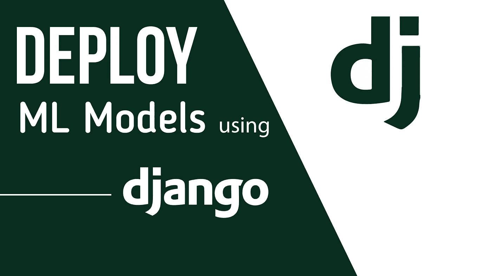

# 使用 Django 部署机器学习模型

> 原文：<https://medium.com/analytics-vidhya/deploying-machine-learning-models-using-django-c461582a9f1e?source=collection_archive---------11----------------------->

## 人力资源分析

**先决条件:**

理解使用 Python 的机器学习(sklearn)

Django 基础知识

HTML、CSS 的基础知识

在本文中，您将学习如何使用 Django 部署机器学习(ML)模型。我们还将讨论 ML 问题陈述，这是人力资源…