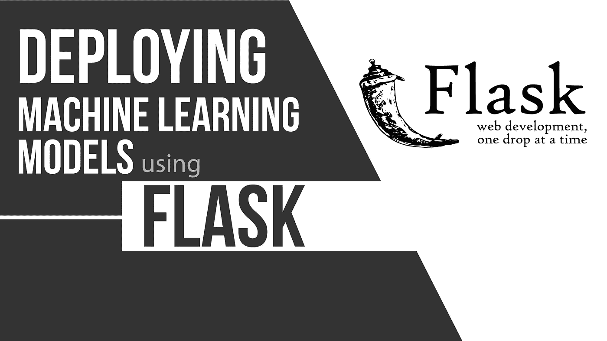
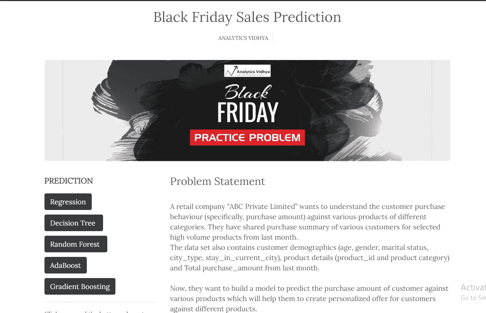
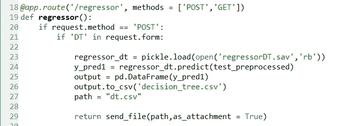

# 在你的网站上使用 Flask 部署机器学习模型

> 原文：<https://medium.com/analytics-vidhya/deploying-machine-learning-models-using-flask-on-your-website-9e68aeea8e45?source=collection_archive---------17----------------------->

## 黑色星期五销售预测



**先决条件:**

理解使用 Python 的机器学习(sklearn)

烧瓶基础

HTML、CSS 的基础知识

仅仅知道如何用 python 编写机器学习问题的代码是不够的。部署 ML 模型是另一项非常重要的技能。如果你有一个运行你自己的 ML 模型的网站，这对用户来说是多么有用。用户可以与其交互并选择他们想要使用的模型。

这正是这篇文章的内容。所以我做了一个网站，可以让你下载 5 个不同模型的预测文件。我已经用 Flask 做到了。

在我们继续之前，看一下网站:【https://blackfriday-sales.herokuapp.com/

正如你在网站上看到的，我从[分析 Vidhya](https://datahack.analyticsvidhya.com/contest/black-friday/#ProblemStatement) 那里拿了一个问题，是黑色星期五销售预测问题。您可以下载数据集并查看其他详细信息。

现在让我们看看编码部分。

在 html 文件中——我制作了 5 个按钮，并根据模型对它们进行了命名(参见代码中突出显示的部分),表单操作被设置为函数/回归变量，当我们单击这些按钮时就会触发该函数/回归变量。

```
<form action=”/regressor”, method=”post”>
 <button class=”btn btn-dark” **name=”reg”** type=”submit” value=”reg”>Regression</button> 
 <br>

 <button class=”btn btn-dark” **name=”DT”** type=”submit” value=”DT” style=”margin-top:10px;”>Decision Tree&nbsp;</button> 
 <br>

 <button class=”btn btn-dark” **name=”Rf”** type=”submit” style=”margin-top:10px;” >Random Forest&nbsp;</button> 
 <br>
 <button class=”btn btn-dark” **name=”Ada”** type=”submit” style=”margin-top:10px;” >AdaBoost</button> 

 <button class=”btn btn-dark” **name=”Gb”** type=”submit” style=”margin-top:10px;” >Gradient Boosting</button> 

 </form>
```

这些按钮是你将在网站上看到的。



当用户点击这些按钮时，它将在后端运行一个 ML 模型并下载预测文件。这就是弗拉斯克出现的原因。现在让我们看看烧瓶部分

我将向您展示一个按钮的功能。其他按钮也是如此。

> 【T6*@ app**。route('/')
> def index():
> return render _ template(' index . html ')*

上述路线将显示您在上面的图像中看到的网站主页。



现在，当你点击名为“DT”的按钮时，回归函数被触发。为了知道哪个按钮被点击，我们在第 21 行有 if 条件。然后，我们加载 ML 模型(这里是决策树),并使用 predict 函数进行预测。

我们希望下载 csv 格式的文件，因此我们将 numpy 数组转换为 dataframe，然后使用 to_csv()函数创建 csv 文件。

flask 的 send_file()函数下载 csv 文件。你需要为其他 4 个按钮做同样的事情。

**就是这样！！**

你刚刚在你的网站上部署了你的 ML 模型。您可以下载预测文件，并在您的 Analytics Vidhya 帐户上提交。

你会在我的 Github 上找到完整的代码。我们还在 youtube 上制作了一个视频。你可以自由地做出改变，让 web 应用程序变得更好。

下面是链接:[黑色星期五销量预测 Github](https://github.com/aniketwattamwar/Black-Friday-Sales-Prediction-Web-App)

Youtube 链接:[使用 Flask 部署 ML 模型](https://www.youtube.com/watch?v=4PX2NfS4M6g)

特别感谢分析 Vidhya 提供了惊人的实践问题。

谢谢大家！我希望这篇文章是有帮助的。