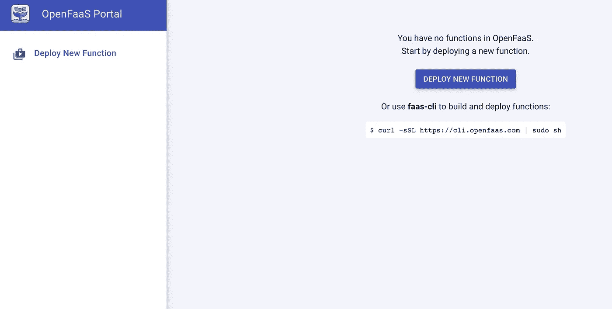

# 使用 OpenFaas 部署机器学习模型[使用热启动]

> 原文：<https://medium.com/analytics-vidhya/deploying-machine-learning-models-with-openfaas-857f1ba0e9c2?source=collection_archive---------2----------------------->


## 使用 Docker Swarm 或 Kubernetes 在几分钟内部署无服务器机器学习模型。

有各种行业标准的工具可用于模型部署，但是，对于这个博客，我们将坚持使用 OpenFaas。我很想听听关于 OpenFaas 的意见

以下是我试图用 OpenFaas 解决的问题:

1.  版本控制——当它在`Kubernete`或`Docker`上工作时，它为版本控制提供了一个健壮的框架
2.  独立于包——因为每个模型都有自己的基本 docker 文件，所以您不需要编写通用的 docker 命令层，它可以根据模型的不同进行修改。因此提供了代码重用并加速了模型部署。在当今的数据科学领域，数据科学家拥有不同的技能来训练模型。例如，我可以用`PyTorch`训练一个模型，而另一个数据科学家可以用不同的`numpy`和`pandas`版本的`Tensorflow`训练一个模型，在软件工程团队最少的支持下支持快速的模型部署。
3.  可扩展— Kubernetes 和 Docker Swarm 有助于扩展。
4.  热启动—当模型大到每次预测都要加载到内存中时，这就变得很麻烦。使用 OpenFaas，您可以在系统启动时将模型加载到内存中，并使用`curl`命令来查询模型。
5.  多模型部署——当有大量模型，并且您一次训练所有模型时，使用 OpenFaas，您只需一个命令就可以部署所有模型。
6.  没有单点故障—每个模型都是相互独立的，一个模型故障不会影响其他模型。
7.  Grafana 仪表板—现成的监控服务。

**按照这个博客的结构:**

1.  安装 OpenFaas
2.  构建房价模型环境
3.  列车张量流模型
4.  部署张量流模型
5.  使用用户界面进行预测
6.  使用旋度进行预测

**以上所有步骤都是在我本地机器的 MAC OS 上执行的。将它扩展到云资源应该相当简单

1.  **安装 OpenFaas**

学习 openfaas 的最佳途径是:[https://github.com/openfaas/workshop](https://github.com/openfaas/workshop)

有两种方法可以设置 openfaas，要么是`Kubernetes`要么是`Docker`。为了简单起见，我们将坚持使用`Docker`

要求:

1.  Docker CE Mac OS
2.  Docker Hub 帐户[如果您想在另一个系统上使用 Docker 映像]

***第一步:安装 OpenFaas CLI***

OpenFaas CLI 用于使用 OpenFaas 创建、构建和部署 docker 映像。打开终端并执行以下操作

```
curl -sL cli.openfaas.com | sudo sh
```

通过执行以下操作测试 CLI

`faas-cli -version`

预期产出:


OpenFaas CLI 版本检查

***第二步:克隆 OpenFaas***

```
git clone https://github.com/openfaas/faas
```

***第三步:初始化 Docker Swarm***

```
docker swarm init
```


Docker 群初始化输出

***第四步:部署默认堆栈***

```
./deploy_stack.sh
```


OpenFaas 默认堆栈部署

> 确保你记录了密码。这是我们第一次部署堆栈时显示。

***第五步:登录 openfaas 服务***

`faas-cli login --password aa 353768bbda945980755258381fe7181fedc902da412e116b743ca796c71de3`

> *确保您输入了上述步骤中的密码*


faas cli 登录服务

现在您可以打开浏览器，导航到 [http://127.0.0.1:8080](http://127.0.0.1:8080) ，输入`username` = `admin`，密码与上一步相同。您应该能够看到以下页面:



部署后打开 Faas 第一页

***第六步:查看可用服务***

`docker service ls`


OpenFaas 默认服务

**2。构建房价模型环境**

***第一步:创建预测服务目录***

因为我们已经安装了 openfaas，所以我们可以在文件系统的任何地方构建模型。我将在`faas`目录外创建一个名为`prediction_service`的目录

`mkdir prediction_service`

`ls -latr`


预测服务目录

***第二步:下载预定义的语言模板***

OpenFaas 提供了不同语言的基本模板。我们可以使用它们或者定义我们自己。首先，让我们下载那些模板

```
faas-cli template pull
faas-cli new --list
```


OpenFaas 默认模板

每种语言都包含自己的 Docker 文件，Template.yml，requirements.txt，index.py。

***第三步:修改 Python docker 文件以满足我们的 tensorflow 需求***

将以下内容复制并粘贴到 DockerFile 文件中

`template/python/Dockerfile`

```
FROM openfaas/classic-watchdog:0.13.4 as watchdogFROM ubuntu:16.04RUN apt-get -q update -y && \
 apt-get -q install -y \
 apt-transport-https \
 apt-utils \
 build-essential \
 cron \
 curl \
 dsyslog \
 g++ \
 git \
 gcc \
 language-pack-id \
 libcairo2-dev \
 libexpat1 \
 libffi-dev \
 libssl-dev \
 libx11-dev \
 libxml2-dev \
 libxslt1-dev \
 libxss1 \
 nano \
 netcat \
 pango1.0-tests \
 psmisc \
 python \
 python-pip \
 python-dev \
 python-setuptools \
 ssl-cert \
 vim \
 zlib1g \
 zlib1g-dev# Allows you to add additional packages via build-arg
ARG ADDITIONAL_PACKAGECOPY — from=watchdog /fwatchdog /usr/bin/fwatchdog
RUN chmod +x /usr/bin/fwatchdog# Add non root userWORKDIR /home/app/COPY index.py .
COPY requirements.txt .ENV PATH=$PATH:/home/app/.local/bin:/home/app/python/bin/
ENV PYTHONPATH=$PYTHONPATH:/home/app/python:/home/app/functionRUN pip install -r requirements.txtRUN mkdir -p function
RUN touch ./function/__init__.pyWORKDIR /home/app/function/
COPY function/requirements.txt .RUN pip install -r requirements.txtWORKDIR /home/app/COPY function functionENV fprocess=”python index.py”
EXPOSE 8080HEALTHCHECK — interval=3s CMD [ -e /tmp/.lock ] || exit 1CMD [“fwatchdog”]
```

** *您可能不需要添加上述所有依赖项，但我还是做了，作为 POC 的一部分*

不下载模板我们也能做到，我太懒了！！！

***第四步:新建房价模型函数***

因为我们在这个练习中使用的是 python 2.7，所以我将使用与我们操作`Dockerfile`相同的`python`

```
faas-cli new --lang python house-price-model
```


房价模型函数[环境]

我们刚刚用 python 目录中定义的`base`docker 文件创建了一个函数。现在`house-price-model`有了自己的`house-price-model/handler/requirements.txt`和`house-price-model.yml`。所以你可以想象当我们有多个模型时，我们有多个这样的模型。

***第五步:安装 Tensorflow 等依赖***

由于 Tensorflow 有 PyPi 包，我们可以用`pip`安装它们，因此将它们放在`house-price-model/handler/requirements.txt`中是有意义的。

将以下内容复制到`house-price-model/handler/requirements.txt`

```
h5py==2.9.0 # Tensorflow dependency for large-scale computing using numpy
numpy==1.16.3
pandas==0.22.0
tensorflow==1.14.0
scipy==0.14.1
dill==0.2.7.1
scikit-learn==0.18.1
```

***第六步:构建函数***

```
faas-cli build -f ./house-price-model.yml
```

这将建立一个码头工人的形象

***第七步:部署到 OpenFaas 服务***

```
faas-cli deploy -f ./house-price-model.yml
```


由于我们是在本地做这件事，我不会把它推到 Docker hub 并立即部署。这将创建一个新函数，您可以在 [http://127.0.0.1:8080](http://127.0.0.1:8080) 查看它


OpenFaas 中部署的新功能[房价模型]

阅读仪表板相当容易。注意，左上角提到的`Status`应该一直是`Ready`模式。`python index.py`是作为要调用的函数的入口点的文件。

***步骤 8:用随机数发生器*** 测试函数

让我们看看这是如何工作的，以及它是否真的达到了预期的效果。

打开`house-price-model/handler.py`并粘贴以下内容:

```
import numpy as npdef handle(req):
    """handle a request to the function
    Args:
        req (str): request body
    """ return {"Price" : np.random.randint(100000,500000,size=1)}
```

这将产生 10 万到 50 万之间的`random`价格。

现在重新构建并重新部署该功能。

```
faas-cli build -f ./house-price-model.yml
faas-cli deploy -f ./house-price-model.yml
```

现在打开 [http://127.0.0.1:8080](http://127.0.0.1:8080) ，确认`Status`处于`ready`状态。

单击 Invoke，您应该会看到一个输出


测试模型的输出

**3。训练一个张量流模型**

***第一步:生成假数据***

在`house-price-model/`内的`fake_data.py`内创建一个文件，并粘贴以下内容

```
import numpy as np
import pandas as pdN = 4000
sqft = np.random.randint(300,3000,size=N)
garden_area = np.random.randint(300,8000,size=N)
white_noise = np.random.normal(loc=0.,scale=1.,size=N)
price = 40*sqft + \
  60*garden_area + \
  white_noise/10.data = pd.DataFrame({"price" : price, "sqft" : sqft, "garden_area" : garden_area})
print data.describe()train = data.sample(frac=0.8)
test = data[~data.index.isin(train.index)]train.to_csv("train.csv")
test.to_csv("test.csv")
```

`python fake_data.py`将创建训练和测试数据

***第二步:用 Tensorflow*** 训练模型

在`house-price-model`目录下创建一个新文件`train.py`

```
touch train.py
```


并将以下内容复制到文件中

```
import os
import pandas as pd
import pickle as pkl
import numpy as np
import tensorflow as tf
from tensorflow import keras
from tensorflow.keras import layers
from sklearn.preprocessing import StandardScaler
from sklearn.pipeline import Pipeline
from sklearn.feature_extraction import DictVectorizertrain = pd.read_csv("train.csv")
y_train = np.log(train.pop("price"))
test = pd.read_csv("test.csv")
y_test = np.log(test.pop("price"))f_ex = Pipeline([('dict vectorizer', DictVectorizer(sparse=False)),
                  ('std scaler', StandardScaler())])f_ex = f_ex.fit(train.to_dict(orient="row"))
normed_train_data = f_ex.transform(train.to_dict(orient="row"))
normed_test_data = f_ex.transform(test.to_dict(orient="row"))def build_model():
  model = keras.Sequential([
    layers.Dense(30, activation=tf.nn.relu, input_shape=[len(train.keys())]),
    layers.Dense(20, activation=tf.nn.relu),
    layers.Dense(1)
  ])optimizer = tf.keras.optimizers.RMSprop(0.001)model.compile(loss='mean_squared_error',
                optimizer=optimizer,
                metrics=['mean_absolute_error', 'mean_squared_error'])
  return modelmodel = build_model()# Display training progress by printing a single dot for each completed epoch
class PrintDot(keras.callbacks.Callback):
  def on_epoch_end(self, epoch, logs):
    if epoch % 50 == 0:
      print("Epoch: {}\tMSE: {}\tMAE: {}".format(epoch, logs["mean_squared_error"], logs["mean_absolute_error"]))EPOCHS = 500
model = build_model()# The patience parameter is the amount of epochs to check for improvement
early_stop = keras.callbacks.EarlyStopping(monitor='val_loss', patience=100)history = model.fit(normed_train_data, y_train, epochs=EPOCHS,
                    validation_split = 0.2, verbose=0, callbacks=[PrintDot()])loss, mae, mse = model.evaluate(normed_test_data, y_test, verbose=0)print("Test MSE: {}, MAE: {}, LOSS: {}".format(mse, mae, loss))
print model.summary()if not os.path.exists('model'):
    os.makedirs('model')
model.save('model/model.model')
pkl.dump(f_ex, open('model/model.f_ex',"w"))
```

`python train.py`

这将训练一个模型来估计原木房价，并将模型保存到磁盘。


使用 Tensorflow 训练模型并保存到磁盘

现在我们需要用这个模型进行预测。

**4。部署型号**

***第一步:用模型*** 建立图像

我们将建立一个模型的形象。对于版本控制，我们将在`house-price-model.yml`中按型号版本设置标签，并设置

```
image: house-price-model:rel-0.0.1
```


通过图像标记模型

***第二步:将模型连接到 handler.py 进行预测***

因为我们有了模型，所以我们将在 handler.py 中编写一个函数来加载模型并进行预测。一个处理程序接受 JSON 字符串类型的`req`。让我们继续使用 String，将其转换为 JSON 并传递给模型。

将以下内容复制粘贴到`house-price-model`内一个名为`models_loader.py`的新文件中


model_loaders.py

```
import numpy as np
import pickle as pkl
from tensorflow import kerasmodel = keras.models.load_model('/home/app/function/model/model.model')
f_ex = pkl.load(open('/home/app/function/model/model.f_ex'))
```

这将在启动时加载 TF 模型。

现在将以下内容复制粘贴到`handler.py`中

```
import models_loader
import numpy as np
import jsondef handle(req):
    """handle a request to the function
    Args:
        req (str): request body
    """
    transform_data = models_loader.f_ex.transform(json.loads(req))
    return {"median_price" : float(np.exp(models_loader.model.predict(transform_data))[0][0])}
```

使用以下命令构建和部署容器

```
faas-cli build -f ./house-price-model.yml
faas-cli deploy -f ./house-price-model.yml
```

***第三步:从 UI 中查询模型***

导航到[http://127 . 0 . 0 . 1:8080/ui/](http://127.0.0.1:8080/ui/)

我们想对房价进行预测

```
{“sqft”:1000,”garden_area”:1000}
```

点击文本，进入上面的字典。`handler.py`将字符串转换成字典。你也可以在 UI 里面提到字典，但是 String 在我们需要做`curl`的时候很有用

您应该会看到类似这样的内容


预测功能的第一次调用

如果你看到，这是非常缓慢的，大约需要 2 秒钟。这是预期的行为。函数即服务在每次函数调用时加载模型，因此缺少`WARM`开始。我们将使用 python 客户机-服务器编程对此进行调整。

我们将把`handler.py`作为客户端，把`models_loader.py`作为服务器

```
touch run.sh
```


创建 run.sh

将以下内容复制到 run.sh 中

```
#!/bin/bashpython /home/app/function/models_loader.py &
fwatchdog
```

将以下内容复制到`models_loader.py`

```
import numpy as np
import pickle as pkl
from tensorflow import keras
import socket
import jsonmodel = keras.models.load_model('/home/app/function/model/model.model')
f_ex = pkl.load(open('/home/app/function/model/model.f_ex'))def predict(data):
 transform_data = f_ex.transform(data)
 return {"median_price" : float(np.exp(model.predict(transform_data))[0][0])}server = socket.socket()
port = 12345
server.bind(('', port))
server.listen(5)
while True:
   client, addr = server.accept()
   client.send(json.dumps(predict(json.loads(client.recv(1024)))))
   client.close()
```

将以下内容复制到`handler.py`

```
import socketclient = socket.socket()
port = 12345
client.connect(('', port))def handle(req):
    """handle a request to the function
    Args:
        req (str):
        request body
    """
    client.send(req)
    return client.recv(1024)
```

现在将下面两行复制到位于`house-price-model`外部和`template/python/Dockerfile`内部的 DockerFile 的末尾

```
RUN chmod +x /home/app/function/run.sh
CMD ["/bin/bash", "/home/app/function/run.sh"]
```

现在重新构建并重新部署该功能

```
faas-cli build -f house-price-model.yml
faas-cli deploy -f house-price-model.yml
```

***5。用 UI* 预测 T3**

重复**步骤 4.3*。*** *现在预测正在飞速进行！！！*


用户界面中的快速预测

***6。带旋度的预测***

在您的终端中执行以下代码行:

```
curl -X POST -H "Content-Type: application/json"  -d '{"sqft":100, "garden_area":100}'  http://127.0.0.1:8080/function/house-price-model
```


卷曲输出

**结论:**

上述方法还可以做很多改进，但作为概念验证，这是将模型生产为微服务的最快方法。我很想听听关于这个应用程序的想法和意见。

上述代码可在:
[https://github.com/dwipam/MLAAS](https://github.com/dwipam/MLAAS)找到

Kuberflow 的博客文章即将发布！！

**参考文献:**

 [## 回归:预测燃油效率|张量流核心|张量流

### 面向移动和嵌入式设备的 TensorFlow Lite

www.tensorflow.org](https://www.tensorflow.org/tutorials/keras/basic_regression)  [## 使用 TensorFlow Keras 保存和序列化模型| TensorFlow Core | TensorFlow

### 本指南的第一部分介绍了顺序模型和使用构建的模型的保存和序列化

www.tensorflow.org](https://www.tensorflow.org/beta/guide/keras/saving_and_serializing) [](https://github.com/openfaas/workshop) [## openfaas/workshop

### 这是一个自定进度的研讨会，学习如何使用 OpenFaaS 构建、部署和运行无服务器功能。在这个…

github.com](https://github.com/openfaas/workshop)