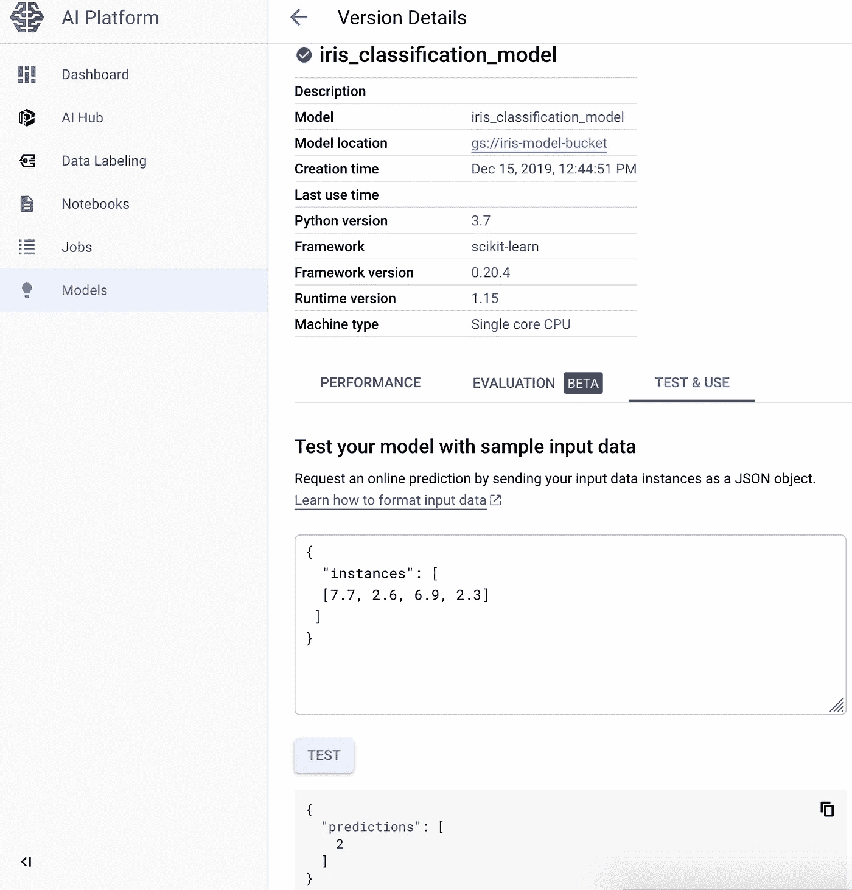

# 将 ML 模型部署到 GCP

> 原文：<https://medium.com/analytics-vidhya/deploying-ml-model-to-gcp-a3bc52c75e6a?source=collection_archive---------11----------------------->

传统的 ml 模型部署是使用 Flask 完成的，但谷歌的 AI 平台使它更加容易。

# 创建云项目

首先，在 Google 云平台上创建项目并启用计费。如果您不熟悉谷歌云平台，请点击以下两个链接，否则请跳到下一部分

[https://cloud . Google . com/resource-manager/docs/creating-managing-projects](https://cloud.google.com/resource-manager/docs/creating-managing-projects)

https://cloud.google.com/billing/docs/how-to/modify-project

# 设置人工智能平台

接下来，在您的项目中，转到——产品——人工智能平台——模型。在这里，我们将部署我们的模型

选择创建模型-为模型命名，并选择您选择的区域


选择运行时间等的默认值和最新值。每个模型都需要存储在云桶中。


接下来，创建新的铲斗，为了最大限度地降低成本，我使用单一位置、标准和有限控制。选择一个名字。此名称是调用预测 API 所必需的


去你的桶—【https://console.cloud.google.com/storage】T4 上传 model.pkl 或者 model.joblib 文件(Google API 只找这两个名字，其他名字无效)


# 测试您的模型

点击您的模型，使用“测试和使用”下的样本 json 结构



# 创建访问凭据

差不多完成了，创建访问凭证以使用预测 API。这里，我已经创建了凭证文件，还有其他可能的方法。

转到[https://console.cloud.google.com/apis/credentials](https://console.cloud.google.com/apis/credentials)，创建一个新的服务帐户密钥，并将密钥保存为 json 文件


# 使用云模型进行预测

我正在使用谷歌客户端 python apis 访问部署在 GCP 的模型，并获得无服务器的预测结果—[https://gist . github . com/anmolmore/e 8 AAC 6967 cc 66190 a4 d 1991 AC 914 A8 de](https://gist.github.com/anmolmore/e8aac6967cc66190a4d1991ac914a8de)

```
import googleapiclient.discoveryproject = ‘iris-dataset-project’
model = ‘iris_classification_model’os.environ[‘GOOGLE_APPLICATION_CREDENTIALS’] = ‘iris-dataset-project-65397816041d.json’
service = googleapiclient.discovery.build(‘ml’, ‘v1’)
name = ‘projects/{}/models/{}’.format(project, model)data = [[7.7, 2.6, 6.9, 2.3]] 
response = service.projects().predict(
 name=name,
 body={‘instances’: data}
).execute()if ‘error’ in response:
 raise RuntimeError(response[‘error’])print(int(response[‘predictions’][0]))
```