# 将电影评论情感模型部署到 Ubuntu EC2 实例

> 原文：<https://medium.com/analytics-vidhya/deploying-movie-review-sentiment-model-to-ubuntu-ec2-instance-5a1198f997cd?source=collection_archive---------21----------------------->

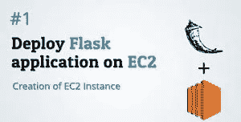

在我之前的 [**博客**](/@sarthak3398/deploying-sentiment-analysis-model-to-ec2-instance-c3e8ad900e98) 中，我已经将电影评论情感分析模型部署到 Windows EC2 实例，但现在我将把我的模型部署到 Ubuntu EC2 实例。

所以让我们开始吧…..

# 安装

在 github 中可以找到[笔记本](https://github.com/sarthak-sriw/DisttilBERT-App/blob/master/distilbert.ipynb)和[数据集](https://github.com/sarthak-sriw/IMDB-Movie-Reviews-Large-Dataset-50k)链接。克隆 [github 仓库](https://github.com/sarthak-sriw/DisttilBERT-App)并将该文件夹的所有内容存储在一个新文件夹**distilbert-App**中。复制**distilbert-App**来驱动并打开 colab 中的 **distilbert.ipynb** 并执行单元格，最后我们将保存模型的权重以备将来使用。将砝码下载到本地主机系统的文件夹 **distilbert 中。**复制 distilbert-App 里面的 distilbert。在所有的步骤之后，你的**distilbert-App**文件夹将会是这样的。

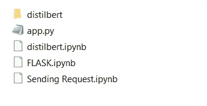

**distilbert-App**文件夹

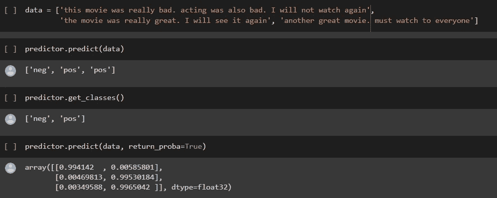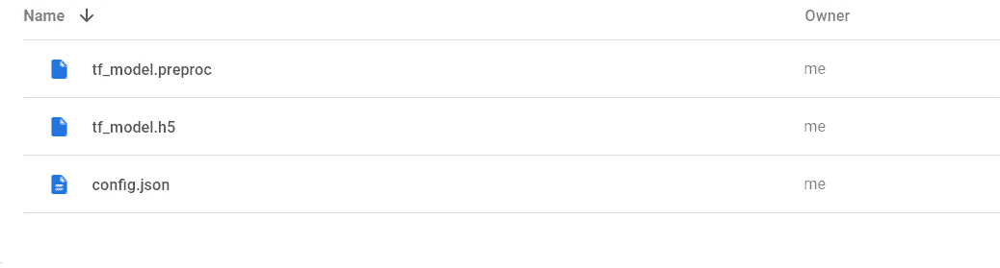

**蒸馏器文件夹**

# 注意

一定要下载[**Cmder**](https://cmder.net/)**和 [**Winscp**](https://winscp.net/eng/download.php) **。****

# **设置您的 AWS 帐户**

**1.你可以通过[亚马逊网络服务门户](https://aws.amazon.com/)创建一个账户，点击“登录控制台”。在那里，您可以使用现有的 Amazon 帐户登录或创建一个新帐户。**

**2.您需要提供您的详细信息以及亚马逊可以收取费用的有效信用卡。如果你已经是亚马逊的顾客，并且有你的信用卡记录，这个过程会快很多。**

# **启动您的 AWS 实例**

1.  **登录到您的 [AWS 控制台](https://console.aws.amazon.com/console/home)并搜索 EC2。**
2.  **单击 EC2 启动新的虚拟服务器。**
3.  **搜索 **ubuntu** 并点击选择，同时确保从右上角的下拉列表中选择**美国东部(俄亥俄州)**。**

**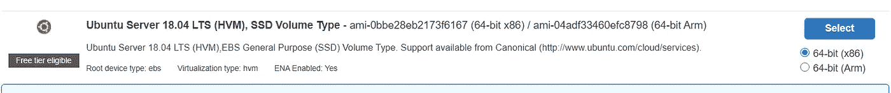**

**4.选择您想要启动的 EC2 实例的类型 **t2.micro** 是首选，然后单击 next。**

****

**5.我们将把存储从 **8GB** 增加到 **16GB** ，然后单击“下一步”。**

**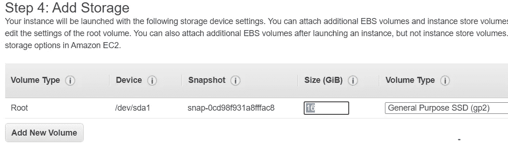**

**6.接下来，我们将配置实例细节，并将**类型**更改为**所有流量****

**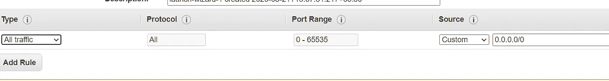**

**7.单击下一步，然后单击启动。然后在弹出菜单中点击**创建新的密钥对**并输入任意**密钥对名称**并点击**下载密钥对**。这将下载一个. pem 文件。复制。pem 文件并将其放入文件夹 **AWS** 中。**

**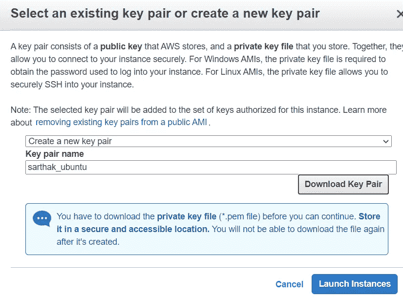**

**7.安装需要时间，安装后请单击查看实例。您可以看到它提供了我们将发送请求的公共 IP。**

**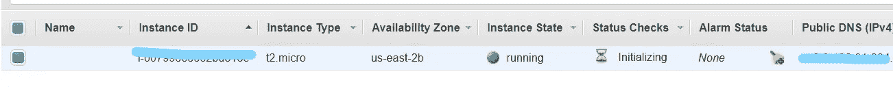**

**8.点击连接并打开 **cmder** 终端，导航到 **AWS** 文件夹并执行弹出菜单中提到的以下命令。**

```
chmod 400 sarthak_ubuntu.pem
ssh -i "sarthak_ubuntu.pem" [ubuntu@ec2–X–X–X–X.us-east-2.compute.amazonaws.com](mailto:ubuntu@ec2-3-128-91-204.us-east-2.compute.amazonaws.com)where X will be your IP
```

**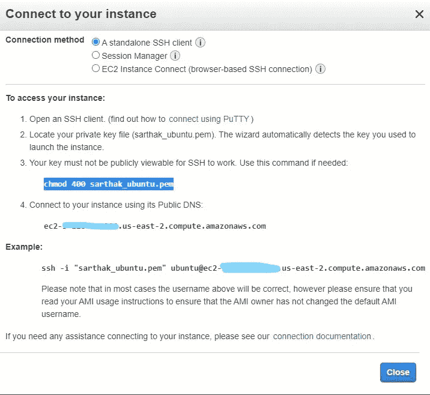****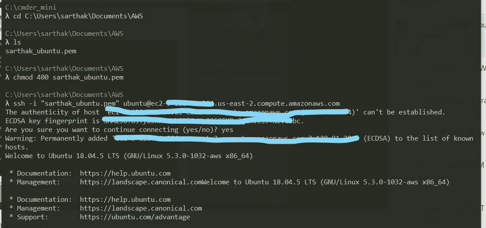**

**9.现在运行以下命令来安装所有的库**

```
sudo apt install python3-pip
pip install ktrain — no-cache-dir
```

**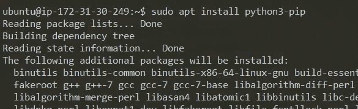****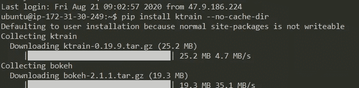**

**11.现在我们需要将文件从主机传输到 ubuntu 实例。所以我们将使用 Wincp。输入**主机 IP** 和**用户名**并点击**前进**然后点击**认证**并上传。 **pem** 文件，该文件位于 **aws** 文件夹中，然后按 OK。只需将**distilbert-App**从左窗格拖放到右窗格**

**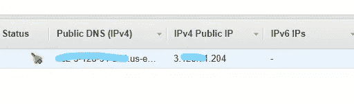****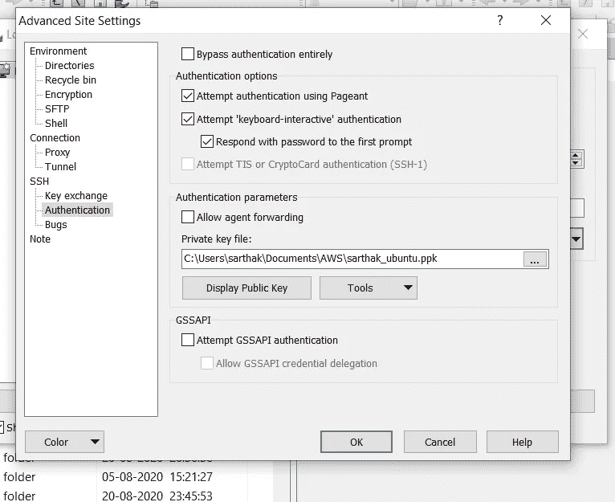****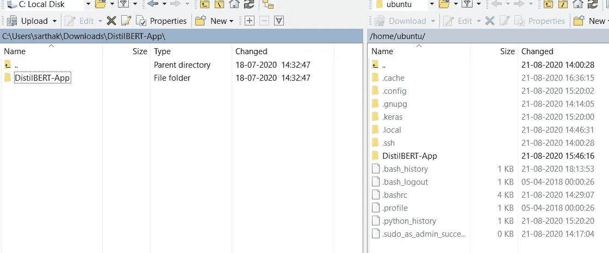**

**在运行我们的服务器之前，我们需要运行几个命令，因为我们提供了 16GB 的存储和 1GB 的 RAM，其中提供的 Ram 不够用。因此，我们将创建 2GB 的交换内存**

```
sudo fallocate -l 2G /swapfile
sudo chmod 600 /swapfile
sudo mkswap /swapfile 
```

**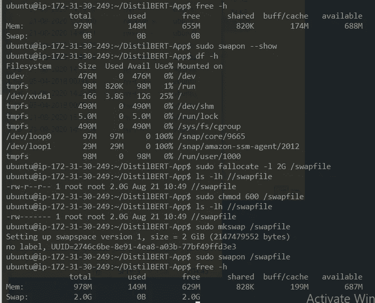**

**然后执行 **sudo nano /etc/fstab** ，当 nano 编辑器打开时，添加以下行**

```
nano /etc/fstab
/swapfile none swap sw 0 0
```

**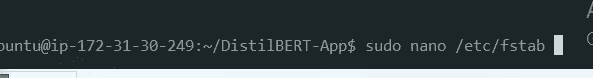****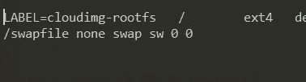**

**12.在**distilbert-App**文件夹中导航并运行**

```
cd DisttilBERT-App/
python app.py
```

**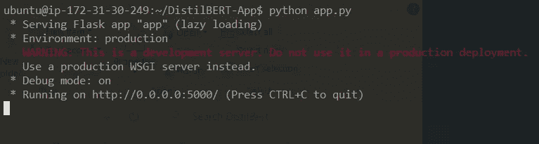**

**13.转到浏览器并键入公共 IP **3。X.X.204:5000****

**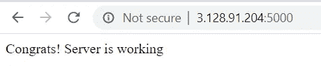**

**14.现在，我们可以从世界上的任何地方，从您的本地主机 jupyter 笔记本、colab 等向 EC2 发送请求。**

**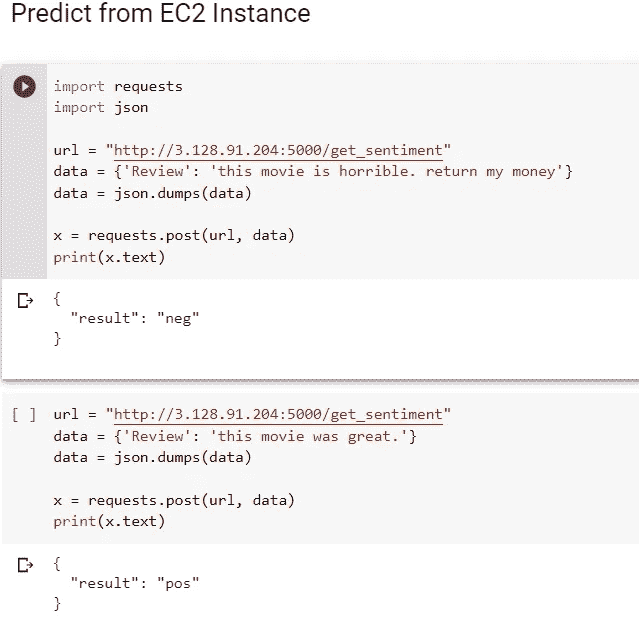**

# **结论**

**我们已经成功地将我们的电影评论情感分析模型部署到 EC2 实例…..**