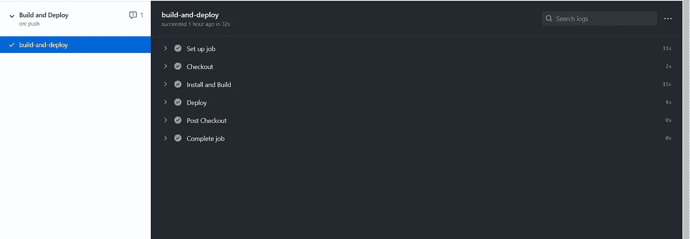
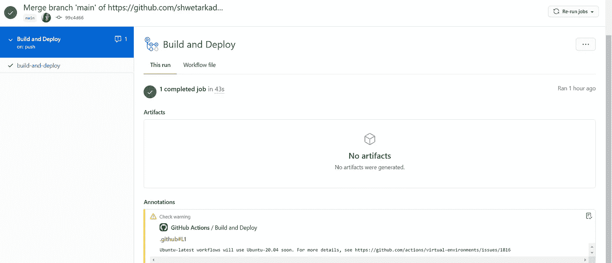

# 使用 Github 操作在 Github 页面上部署我的作品集网站。

> 原文：<https://medium.com/analytics-vidhya/deploying-my-portfolio-website-on-github-pages-using-github-actions-2d1ae175321b?source=collection_archive---------12----------------------->



我最近部署了[我的投资组合网站](https://shwetarkadam.github.io/portfolio/)，想尝试一下 github 的动作，这是我自动化部署的经验。

本文更侧重于如何使用 GitHub 动作，以及将您的代码部署到 GitHub 页面而不是 portfolio 站点代码有多容易。因此，每次您更新或构建您的网站时，这些更改都会自动反映出来，这种自动化的部署过程使工作速度更快。

GitHub action 的工作方式是通过创建一个或多个 yaml 文件在存储库中创建操作，这些被称为工作流。工作流现在可以处理像 CI CD 这样的构建任务。这意味着当主分支发生变化时，您使用该操作来测试您的代码，并将站点推送到所需的托管平台(在本例中是 GitHub 页面)。

假设您有一个 GitHub 帐户，第一步是创建一个包含您的网站代码的存储库。现在我有一个引导网站，但在未来，我确实计划添加节点 JS，所以我已经添加了 package.json。

首先在根文件夹中运行以下命令，验证所有更改是否正确:

```
npm install 
```

安装节点模块后，运行命令:

```
run npm start
```

因此，您应该在本地主机中得到类似这样的输出


既然您已经确保了项目在您的本地机器上正确运行，那么就可以将它部署到 GitHub 页面了。您只需要将您的更改提交并推送到 repo 的主分支，并确保设置指向正确的分支，以显示相应的站点。

现在，执行此操作的文件是 deploy.yml 文件，我们将使用它来创建工作流。

工作流程

现在这个 yaml 文件可以在本地找到`.github/workflows/deploy.yml`文件，你可以随意重命名这个文件。它告诉 github actions 安装项目依赖项，运行构建脚本，将所需文件放在名为 dist 的输出文件夹中，并将 dist 文件夹的内容上传到 gh-pages 分支，如果该分支不存在，它将创建该分支。将站点部署到 github-pages 的工作流程你可以从 [James Ives 的 GitHub pages 部署动作中找到。](https://github.com/JamesIves/github-pages-deploy-action)

如果您有任何现有的网站或代码，并且您想要发布它以获得页面，您只需要将此文件添加到您的项目中。

您可以转到 github repo Actions 选项卡= >创建简单的工作流，并将上述内容复制粘贴到 yaml 文件中。

一旦您为 GitHub 页面准备好了一个站点，并且您的项目包含了`.github/workflows/deploy.yml`文件，您只需要将您的更改提交并推送到您的存储库的主分支。您可以通过转至 Actions= > build and deploy 来查看正在进行的工作流。此外，这也是您可以在工作流失败的情况下调试错误的地方。



GitHub 操作运行后，确保设置指向正确的分支，以显示您的站点。

转到您的存储库的设置，并确保 GitHub 页面的源使用正确的分支。它靠近主设置页面的底部。


在浏览器中加载需要一些时间，但是一旦可用，你可以点击上面绿色栏中的链接。

现在，每次您对主分支进行推送时，更改都会反映在主站点中。

我的投资组合网站:[点击这里！](https://shwetarkadam.github.io/portfolio/)

这是所有的乡亲。

***快乐学习。***