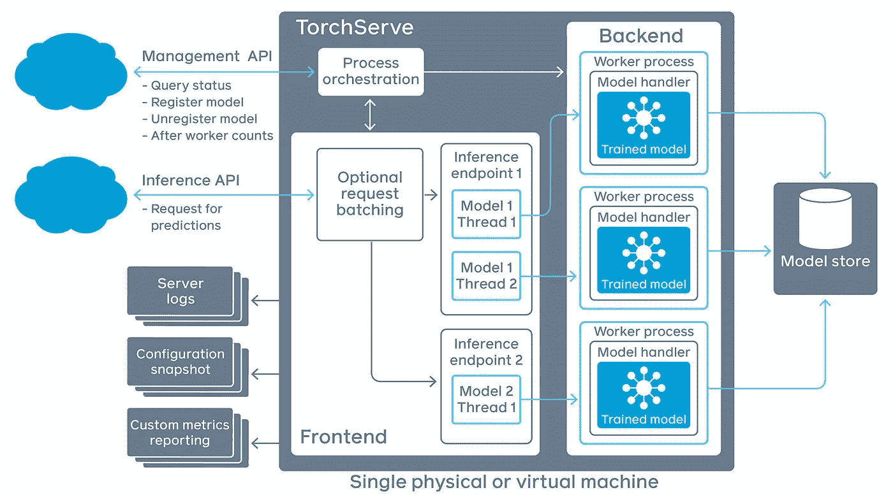
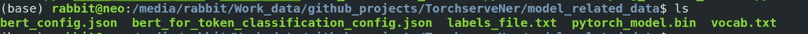
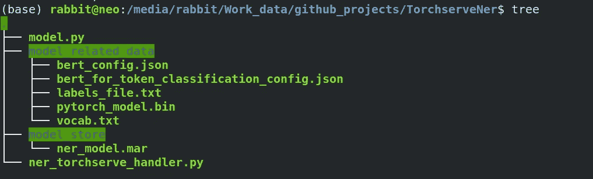

# 使用 TorchServe 将命名实体识别模型部署到生产中

> 原文：<https://medium.com/analytics-vidhya/deploying-named-entity-recognition-model-to-production-using-torchserve-fd8cf5cff02f?source=collection_archive---------6----------------------->



# 介绍

TorchServe 是一个新的令人敬畏的框架，为生产中的 ptorch 模型提供服务。它使得在生产环境中大规模部署 PyTorch 模型变得容易，并且提供低延迟的轻量级服务，即高性能推理。它有一些强大的特性，比如多模型服务、A/B 测试的模型版本化、监控的指标和应用集成的 RESTful 端点，您可以快速地将您的模型从研究阶段投入生产。按照 [TorchServe github 页面](https://github.com/pytorch/serve)给出的安装步骤，你可以很容易地在任何机器上安装它。

虽然 TorchServe 为最常见的应用程序(如对象检测和文本分类)提供了默认的处理程序，因此您不必编写自定义代码来部署您的模型，但您也可以为任何深度学习应用程序编写自己的自定义处理程序。

这篇文章将帮助你使用 torchserve 服务你的自定义 NLP 模型。我将带您看一个为命名实体识别(NER)任务训练的令牌分类模型的例子，并使用 TorchServe 为它服务。

> 使用 torchserve 的模型服务所需的组件:
> a)模型类定义文件
> 
> b)可序列化的训练模型文件(对于 **BERT** 模型，我们将有一个. bin 文件、一个 vocab 文件和一个配置文件)
> 
> c)具有预处理、推理和后处理三个主要方法的处理程序文件

## NER 模型

[*hugging face/transformers*](https://github.com/huggingface/transformers)*I*是文本深度学习的最先进框架，其中集成了大量基于 transformer 的架构。它还提供了在自然语言处理中根据不同类型的数据集微调给定的基于 transformer 的架构的例子。

在这篇文章中，我将假设我们已经在 [JNLPBA(一个生物医学 ner 数据集，由蛋白质、细胞系、RNA、DNA 和细胞类型等实体组成)数据](https://github.com/allenai/scibert/tree/master/data/ner/JNLPBA)上为令牌分类模型微调了 **BERT** 。用于培训的标签如下所示:

如果你没有微调过的模型，你可以使用 huggingface 库中给出的[例子，或者你可以使用](https://github.com/huggingface/transformers) [my github 库在任何给定的 NER 数据](https://github.com/kuldeep7688/BioMedicalBertNer)上微调 scibert。

我为令牌分类定制的模型类是这样的(这个模型类可以是任何模型，比如令牌分类的 **BERTCRF** 等等。):

为了正确保存和加载你微调过的模型，请通过这个[链接](https://huggingface.co/transformers/master/serialization.html)。

现在让我们继续，假设我们有一个 *pytorch_model.bin、*一个 *config.json* 和一个 *vocab.txt* 来加载我们的模型。正如你在模型类中看到的，还有几个参数*class ification _ layer _ size 和 num_labels* ，它们将在另一个配置文件中定义。

保存的文件存储在 *model_related_data* 文件夹中，如下所示:



***BERT _ config . JSON***:config 用于初始化模型的 **BERT** 层

***BERT _ for _ token _ classification _ config . JSON***:config 用于初始化模型除 **BERT** 层以外的其他参数，如 c*classification _ layer _ sizes*。

***labels _ file . txt***:包含训练 ner 模型时使用的标签的文件

***py torch _ model . bin***:训练好的模型权重

***vocab.txt*** :用于为模型初始化 **BERT** 标记器的文件

## 为火炬之夜定义 NER 处理程序类

首先我将向您展示代码，然后带您了解每个类和方法是做什么的。

这两个类都非常标准，用于将数据准备成一种格式，这种格式可以作为我们的 **BERT** ner 模型的输入。

***list _ classes _ from _ module***:帮助在处理程序脚本中导入模型类定义

***_ is _ white space***:帮助将给定文本正确地标记成单词

***get_labels*** :帮助读取 labels_file.txt 并准备标签列表

现在，在定义了这些助手函数和类之后，我们可以浏览 ner 模型的主处理程序类。

代码有点长，因为我也在 handler 类本身中处理所有的预处理和后处理。让我们来看看这些方法。

handler 类的主要方法有:

> ***初始化*** :初始化*模型*和其他属性，如 *bert_tokenizer* ， *ber_config* ， *model_config_dict* ， *max_sequence_length* 和 *num_special_tokens，labels* 。*注意*list _ classes _ from _ module*是如何用于在处理程序*中加载模型定义的。*在这里，您可以初始化运行数据模型所需的所有文件名。*
> 
> ***预处理*** : *处理给定句子并为模型准备输入格式的方法。*
> 
> ***推理*** : *负责从模型中获取预测的方法。*
> 
> ***后处理*** : *模型的输出将只是句子的每个标记的 label_id，所以在这个方法中，我负责通过 bert_tokenizer 拆分单词，并对齐每个单词的标签，然后提取实体。*

下面是在上面提到的 handler 类的 main 方法中调用的 helper 方法:

> ***convert _ sentence _ to _ example***:用于将输入的句子转换成范例对象。
> 
> ***【convert _ sentence _ to _ example】***:用于从示例对象创建特征对象。
> 
> ***align _ out _ label _ with _ original _ sentence _ tokens***:此方法将 ner 标签与句子中的每个单词对齐。
> 
> ***【convert _ to _ ents _ dict***:该方法获取 ner 标签和单词，并在句子中为每个被识别的实体准备一个带有 start_span 和 end_span 的 dict 对象。

我们将 handler 类和所有辅助函数放在一个脚本中，这将是***ner _ torch serve _ handler . py***脚本，并将在 torch 模型归档器中使用。

**将训练好的关卡转换成火炬服务器 MAR 文件**

TorchServe 使用一种叫做 [MAR(模型存档)](https://pytorch.org/serve/model-archiver.html)的格式来打包模型，并在其模型存储中对它们进行版本化。为了从 TorchServe 访问它，我们需要将我们训练过的 **BERT** 检查点转换成这种格式，并在上面附加我们的处理程序。

为了存储. mar 文件，我们创建了一个名为 model_store 的目录。

```
mkdir model_store
```

下面给出了存档 ner 模型的命令:

```
torch-model-archiver --model-name ner_model --version 1.0 --model-file model.py --serialized-file model_related_data/pytorch_model.bin --export-path model_store/ --extra-files "model_related_data/bert_config.json,model_related_data/bert_for_token_classification_config.json,model_related_data/vocab.txt,model_related_data/labels_file.txt" --handler ner_torchserve_handler.py
```

-model-name:您要为您的模型指定的名称，这将在向模式发送请求时使用

—模型文件:定义模型类的文件的路径

-序列化文件:模型权重的路径

—导出路径:要保存的目录。标记文件

-额外文件:添加模型初始化所需的所有额外文件

—处理程序:处理程序脚本的路径

文件夹内容将如下所示:



在归档模型之后，我们运行下面的命令，使用 torch serve 来服务我们的模型。

```
torchserve --start --ncs --model-store model_store/ --models ner_model.mar
```

现在，您可以通过下面给出的 url 与您的模型进行交互[http://127 . 0 . 0 . 1:8080/predictions/ner _ model](http://127.0.0.1:8080/predictions/ner_model)

## 显示了一个输出示例

TorchServe 的[管理 API](https://pytorch.org/serve/management_api.html#list-models) 中有许多额外的有趣功能，例如，我们可以轻松获得所有注册模型的列表，注册新模型或新模型版本，并动态切换每个模型的服务模型版本。

在接下来的文章中，我将介绍其他特性，比如 torch serve 中的批量推理。

你可以通过下面给出的 github repo 来查看完整的代码库。

[](https://github.com/kuldeep7688/TorchserveNer) [## 库尔迪普 7688/火炬服务器

### 使用 TorchServe 部署微调的 NER 模型。通过创建一个……

github.com](https://github.com/kuldeep7688/TorchserveNer) 

# 资源

[](https://aws.amazon.com/blogs/machine-learning/deploying-pytorch-models-for-inference-at-scale-using-torchserve/) [## 使用 TorchServe | Amazon Web Services 部署 PyTorch 模型进行大规模推理

### 今天你所交互的许多服务都依赖于机器学习(ML)。从在线搜索和产品推荐到…

aws.amazon.com](https://aws.amazon.com/blogs/machine-learning/deploying-pytorch-models-for-inference-at-scale-using-torchserve/) [](/the-artificial-impostor/deploying-efficientnet-model-using-torchserve-9f5f811aa447) [## 使用 TorchServe 部署 EfficientNet 模型

### 案例研究

medium.com](/the-artificial-impostor/deploying-efficientnet-model-using-torchserve-9f5f811aa447) [](/analytics-vidhya/deploy-huggingface-s-bert-to-production-with-pytorch-serve-27b068026d18) [## 使用 pytorch/serve 将 huggingface 的 BERT 部署到生产中

### NLP 模型部署和服务的未来一瞥。

medium.com](/analytics-vidhya/deploy-huggingface-s-bert-to-production-with-pytorch-serve-27b068026d18) [](https://github.com/pytorch/serve) [## py torch/发球

### TorchServe 是一个灵活易用的工具，用于服务 PyTorch 模型。有关完整的文档，请参见…

github.com](https://github.com/pytorch/serve)