# 在弹性 Kubernetes 服务和 Efs 上部署 Nextcloud 和 MySQL

> 原文：<https://medium.com/analytics-vidhya/deploying-nextcloud-and-mysql-on-elastic-kubernetes-service-efs-ae3d23e8c2ff?source=collection_archive---------21----------------------->

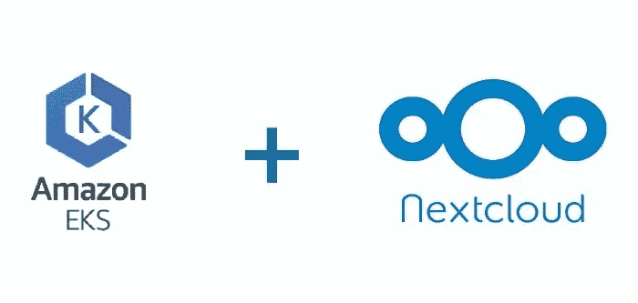

# **亚马逊 EKS**

亚马逊弹性 Kubernetes 服务(亚马逊 EKS)是一项托管服务，使您可以轻松地在 AWS 上运行 Kubernetes，而无需建立或维护自己的 Kubernetes 控制面板。Kubernetes 是一个开源系统，用于自动化容器化应用程序的部署、扩展和管理。由于其安全性、可靠性和可扩展性，英特尔、Snap、Intuit、GoDaddy 和 Autodesk 等客户信任 EKS 来运行他们最敏感和最关键的应用程序。为了更多的理解

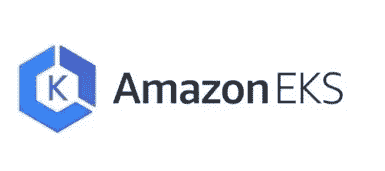

亚马逊 EKS

# **EKS 的好处**

AWS 平台的规模、可靠性和可用性，以及与 AWS 网络和安全服务的集成，例如用于负载分配的应用负载平衡器、用于基于角色的访问控制的身份访问管理器(IAM)

在 EKS 的顶部，我们已经开发了 NextCloud 并使用 MySql 作为数据库**，那么什么是 Next Cloud** ？

# **NextCloud**

Nextcloud 是一套用于创建和使用文件托管服务的客户端-服务器软件。Nextcloud 是免费和开源的，这意味着任何人都可以在自己的私人服务器设备上安装和操作它。Nextcloud 应用程序在功能上类似于 Dropbox、Office 365 或 Google Drive，但可以用于家庭本地计算机或异地文件存储托管。

# **MYSQL**

MySQL 是一个关系数据库，通常用于存储与 PHP 协同工作的网站的数据。关系意味着数据库的不同表可以相互交叉引用。SQL 代表“结构化查询语言”，它是用于与数据库交互的标准语言

# **我们在这里咕……**

**本次部署的前提条件**

**1-aws cli**

**2-库贝克特尔**

3-eksctl

首先，我们将**创建一个 IAM 用户**来通过命令行访问 AWS EKS

> 点击添加用户

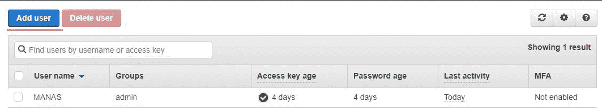

[https://console.aws.amazon.com/iam](https://console.aws.amazon.com/iam)

> 给**用户名**、**编程访问**，这样用户将获得**访问密钥和密钥**

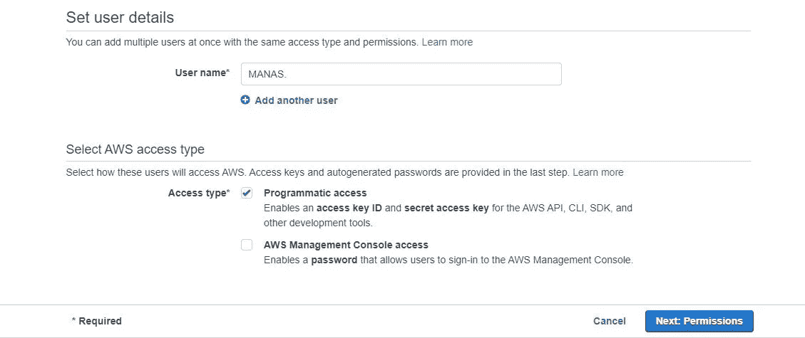

[https://console.aws.amazon.com/iam](https://console.aws.amazon.com/iam)

> 点击**附加现有策略**并选择**管理员访问**，然后选择**下一个标签**

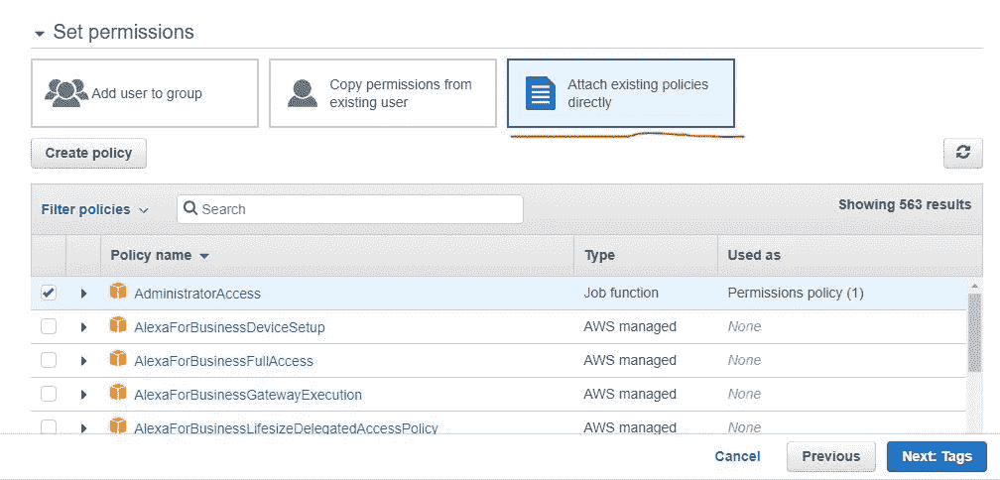

[https://console.aws.amazon.com/iam](https://console.aws.amazon.com/iam)

> 添加标签，如果你想继续，然后**下一步**和**创建用户**
> 
> 点击**创建用户后，下载密钥**

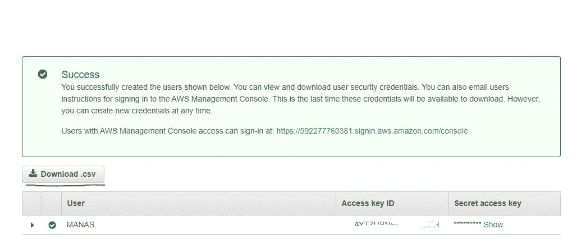

[https://console.aws.amazon.com/iam](https://console.aws.amazon.com/iam)

> 配置**访问密钥&秘密密钥**

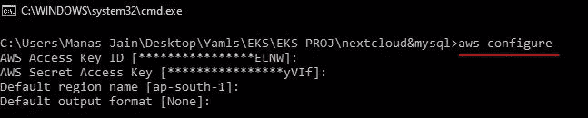

Windows CMD

现在 **EKS 的角色进场了**

> **在此之前创建 SSH 公钥**

首先，我们将创建 YAML 格式的集群配置文件

在这个文件中，我们必须选择我们需要哪种类型的实例和其他东西

**我建议最后运行所有文件**

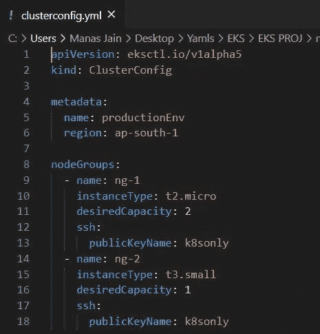

> ***eksctl 创建集群-f cluster config . yml****#运行此命令创建集群*

一旦运行这个命令，您将看到类似这样的输出。然后**等待最小值。20 分钟后**集群将自动创建

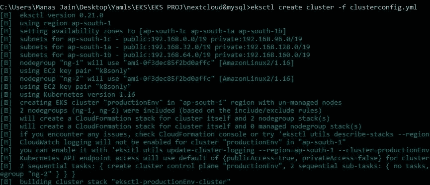

创建后，您可以在 AWS EKS 中看到集群

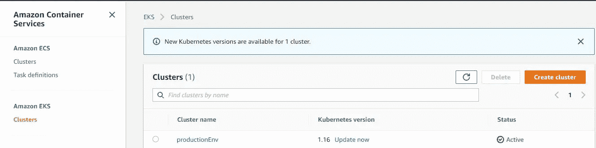

console.aws.amazon.com

使用 EC2 作为主节点和从节点的幕后 AWS EKS 集群

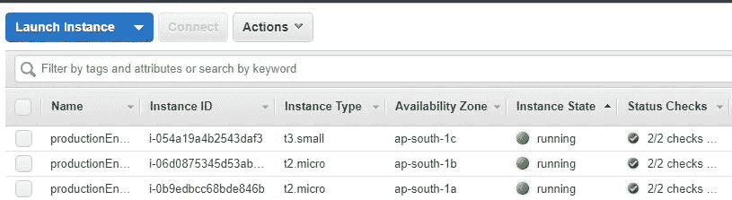

console.aws.amazon.com

EKSCTL 在后台向 Cloudformation 发送请求，因此它也创建 Cloudformation 堆栈

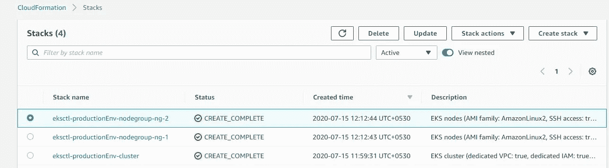

console.aws.amazon.com/cloudformation

# 从您当地的管理 Kubernetes

我们的 Kubernetes 集群运行在云上，因此我们可以从世界上的任何地方发送命令，为此我们只需要 Kubernetes 配置文件来管理它

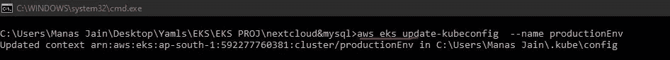

> **AWS eks update-kube config—name production env**#运行此命令在您的 pc 中设置 Kubernetes 配置，并且不要忘记给出您的集群名称

所以现在我们的 Kubernetes 正在全力工作。我们可以用 **Kubectl get pods** 命令检查

**EFS 弹性文件系统**

**什么是 EFS**

亚马逊弹性文件系统(亚马逊 **EFS** )提供了一个简单、可伸缩、完全托管的弹性 NFS 文件系统，用于 **AWS** 云服务和内部资源

我们必须创建一个集中式存储，这样我们的所有节点都可以在那里装载数据

进入 EFS 然后点击**创建文件系统**

选择您的 **VPC，**在创建集群时，它还会创建自己的虚拟专用网络，因此我们必须**选择那个**，一旦我们选择它，就会自动选择所有与 VPC 连接的节点

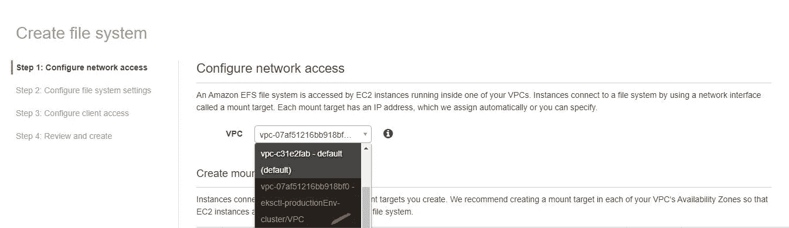

然后，我们必须选择相同的安全组。所以它们是可以互相连接的

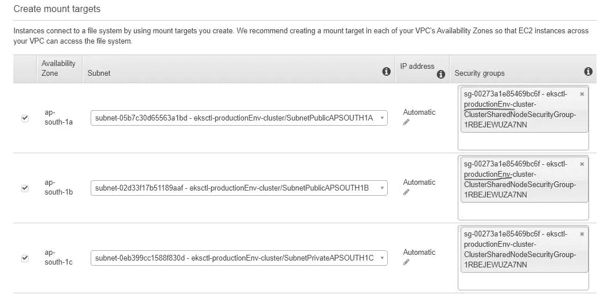

然后下一步，下一步，下一步，创建文件系统

在这之后，我们必须在所有的**三个实例**中安装 **amazon-efs-utils** 。使用 ssh，所以这里我们必须使用在配置集群时输入的 SSH 密钥

> ***sudo yum 安装 Amazon-EFS-utils-y****#运行并在所有节点安装这个*

# 现在开始我们今天的主要部署 NextCloud 和 MySql

首先，我们必须创建 EFS 置备程序

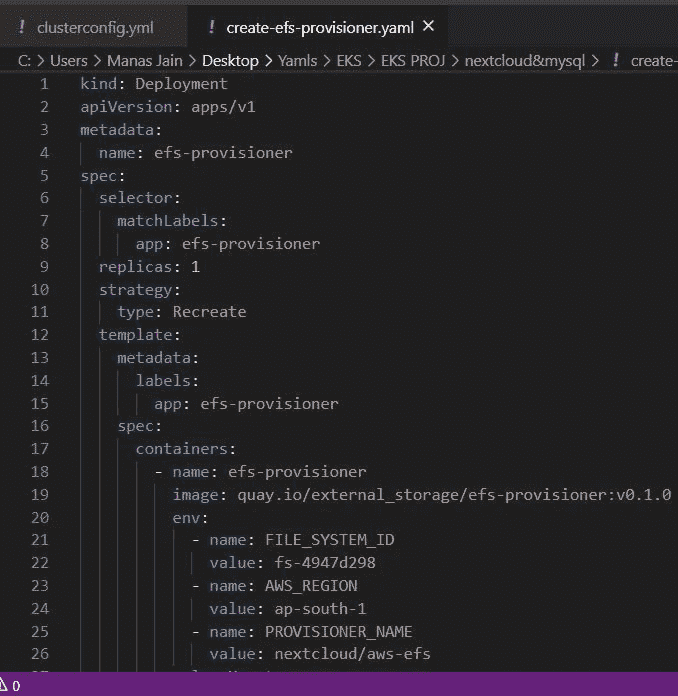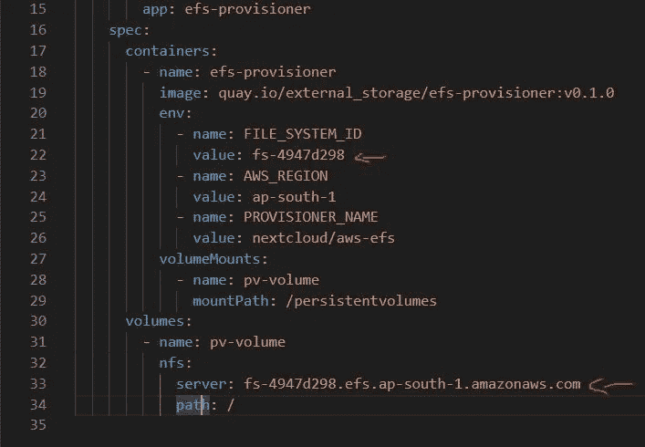

在这个 yml 文件中，我们只给出了值为的 **efs id 和 efs** 的**服务器名称**

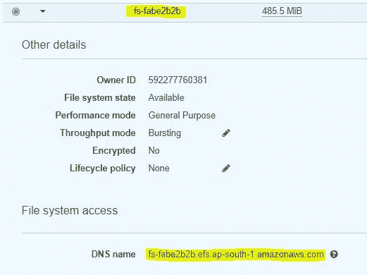

它在内部创建了一个 efs 部署，要使用 efs 存储，我们需要设置 EFS 资源调配器

现在我们创建**集群角色绑定**

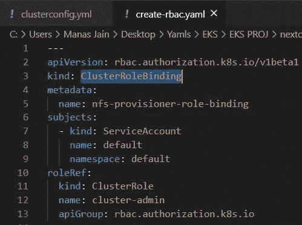

为了跨整个集群授予权限，我们可以使用一个 **ClusterRoleBinding** 。下面的 **ClusterRoleBinding** 允许组“manager”中的任何用户读取任何名称空间中的机密

现在我们创建**存储类**

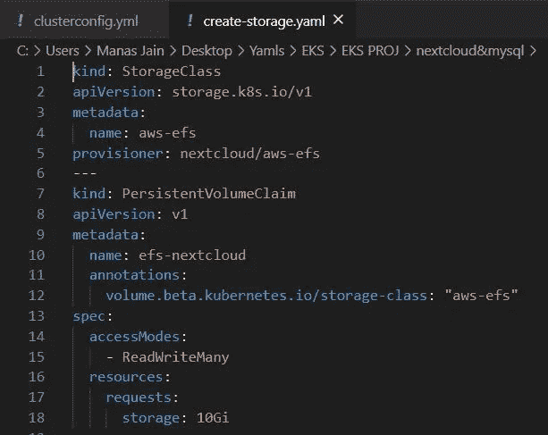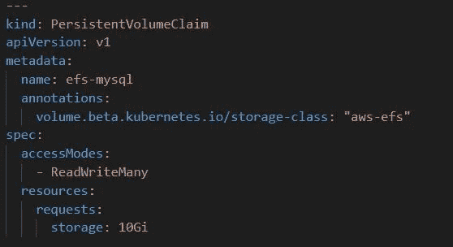

这将向 EFS 发送 Pvc 请求，并从那里获取存储，然后为其创建 PVC。现在，我们的 PVC 已创建，并与一个集中式存储相连，因此，现在我们可以在一个集中式位置将 pods 数据装载到其中

现在我们创建 **deploy-mysql.yml**

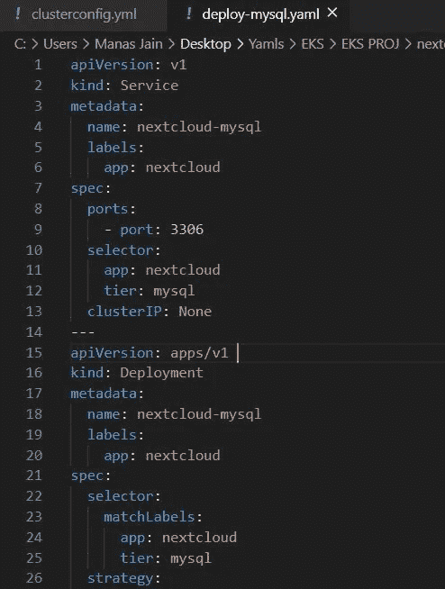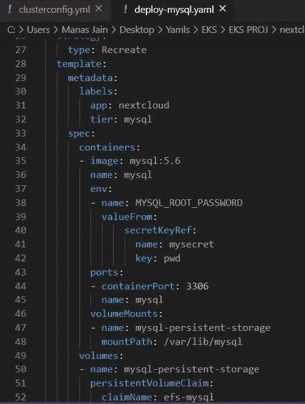

MySql 存储我们的数据，这些数据是由 NextCloud 生成的，在这里，我们使用一个秘密来隐藏数据，不让其他团队成员看到。这不是用来保护数据的，只是为了隐藏数据，不让人们看到，所以我们秘密地以 BASE64 编码存储数据

现在我们创建 **deploy-nextcloud.yml**

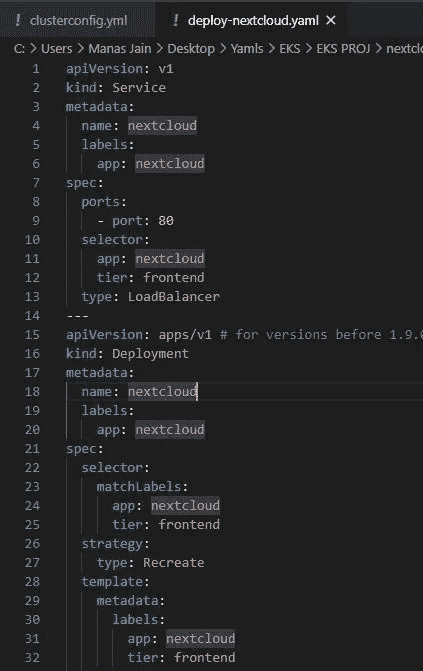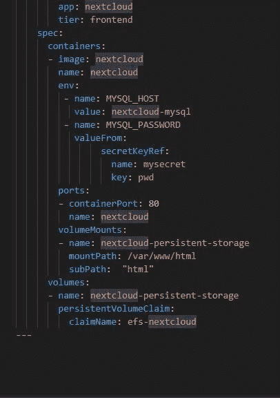

在 NextCloud 中，它只是为了保护我们私人世界中的数据，所以没有人可以通过互联网访问它，所以我们可以通过 nextcloud 实现它

之后，按顺序运行以下所有命令

**1-ku bectl apply-f create-EFS-provisioner . YAML**

**2-ku bectl apply-f create-RBAC . YAML**

**3-ku bectl apply-f create-storage . YAML**

**4-ku bectl apply-f secret . yml**

**5-kubectl apply-f deploy-MySQL . YAML**

**6-ku bectl apply-f deploy-next cloud . YAML**

运行所有这些之后，负载平衡器将自动在 AWS 中启动，并提供公共 DNS 来访问网站

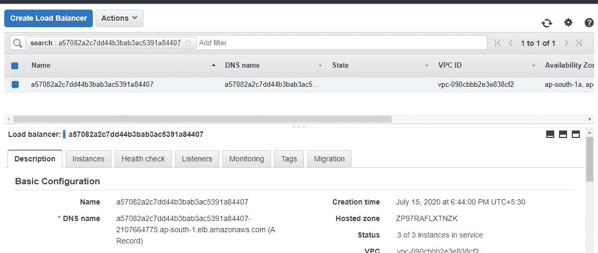

NextCloud 在 EKS 成功部署

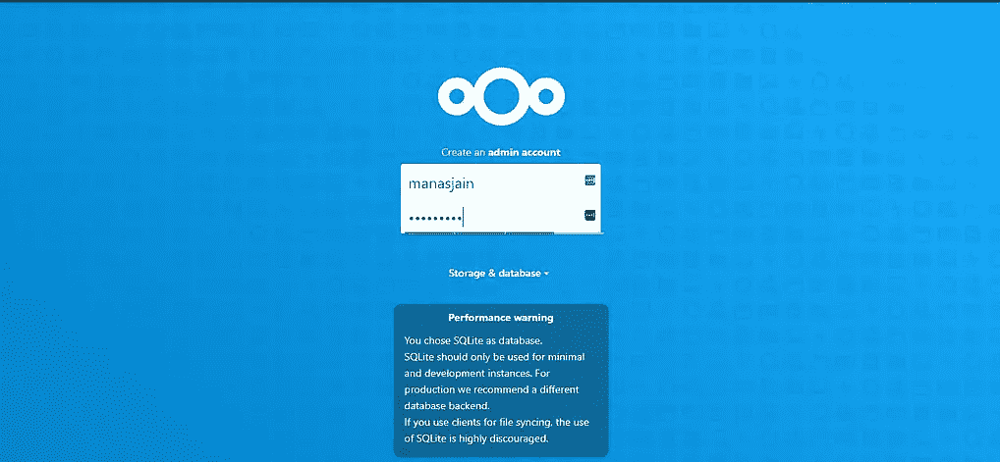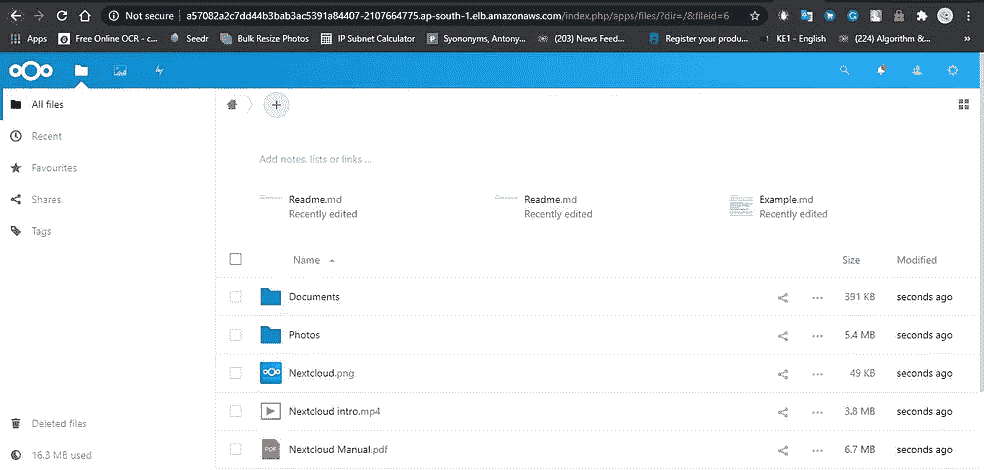

# 现在，我们可以删除集群了

> ***eksctl 删除 cluster-f cluster config . yml***

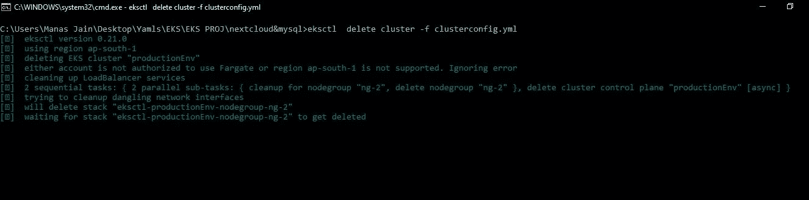 [## mj Manas 0699/EKS-next cloud-MYSQL

### 在 GitHub 上创建一个帐户，为 mjmanas 0699/EKS-next cloud-MYSQL 开发做出贡献。

github.com](https://github.com/mjmanas0699/EKS-NEXTCLOUD-MYSQL)