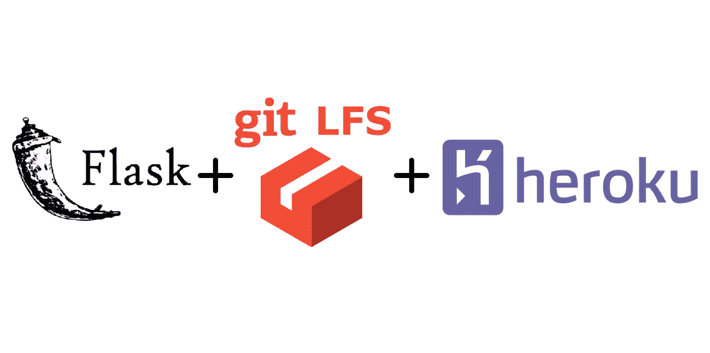
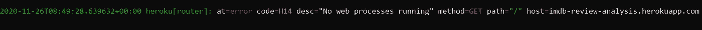
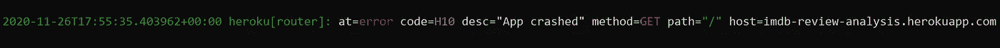
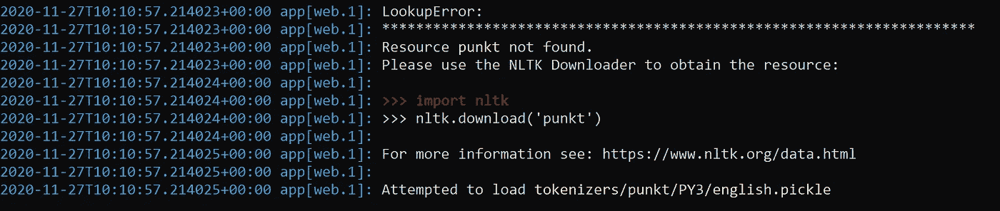
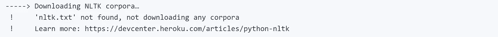
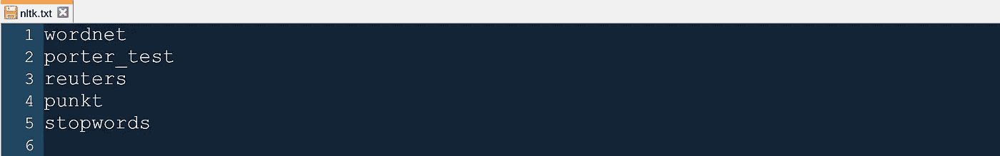
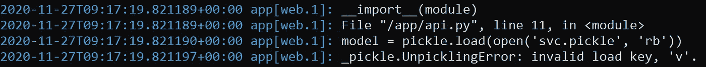
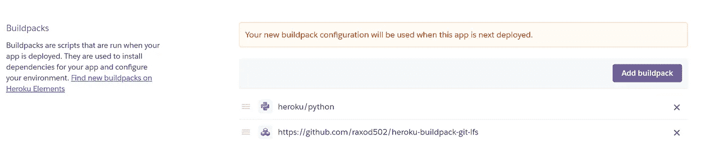
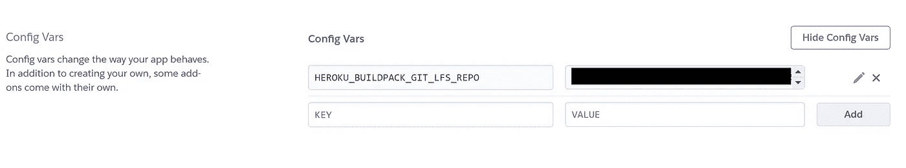

# 使用 Flask、NLTK 和 Git-LFS 在 Heroku 上部署 NLP 模型

> 原文：<https://medium.com/analytics-vidhya/deploying-nlp-model-on-heroku-using-flask-nltk-and-git-lfs-eed7d1b22b11?source=collection_archive---------1----------------------->



烧瓶应用程序+ Git-LFS + Heroku

我试图在 Heroku 上为 Imdb 评论部署我的 NLP 模型，遇到了很多问题，并且不得不为每个错误单独引用大量资源。

本文是在 Heroku 上部署 NLP 模型时可能遇到的调试错误的快速指南。因此，如果您遇到以下任何问题，只需按照步骤操作，您就可以轻松应对了。

# **A)先决条件:**

✔️ **工作瓶应用程序—** 你应该有一个工作瓶应用程序。您可以通过在本地运行来检查您的应用程序是否正常工作(127.0.0.1)。

✔️ **Heroku CLI** —你需要安装 Heroku CLI 来查看错误。从 [**这里**](https://devcenter.heroku.com/articles/heroku-cli) 下载安装程序并安装。打开 cmd，输入`**heroku login**`。它会将你重定向到一个网页。登录后，您需要在 cmd 中输入以下查询来查看日志。

```
**heroku logs --tail --app <your_heroku_app_name>**
```

✔️ **GIT-LFS(可选)** —只有当你有大于 100MB 的大文件时才使用 GIT-LFS。我在我的项目中使用它，因为我的 word2vec pickle 文件大于 100MB。点击 从 [**下载设置。在本地 repo 目录中打开 git bash，并按照步骤操作。这个例子是为了。泡菜文件。您可以对任何文件或文件类型执行此操作。**](https://git-lfs.github.com/)

```
#.gitattributes file will be generated when you initialize git-lfs **git lfs install
git lfs track "*.pickle"****git add .
git commit -m "Add lfs support for .pickle files"
git push origin master**
```

# **B)错误&解决方案:**

*注意:您可以在 Heroku CLI 的日志中看到所有这些错误。*

**1。**❗**at =错误码=H14 desc=** " **无 web 进程运行" method=GET path="/"** :当您的 repo 中没有 *Procfile* ，或者您使用类似于" *Procfile.txt* "的某个扩展名保存它，或者您在 *Procfile* 中有错误的数据，如错误的 python Flask 应用程序文件名，或者您没有运行该应用程序的 dynos 时，就会出现此错误



H14 错误

**解决方案**:

*   检查您的远程 repo 中是否有不带扩展名的 *Procfile* 。
*   检查*过程文件*中的数据是否正确。在下面的示例中， **api.py** 是 python 文件的名称，该文件包含名为 **app** 的 flask 应用程序(app = Flask(_ _ name _ _)in file API . py)**。**

```
**web: gunicorn api:app**
```

*   在 cmd 中运行以下命令，为您的应用程序分配 dyno。

```
**heroku ps:scale web=1 --app <your_heroku_app_name>**
```

**2。**❗**at =错误码=H10 desc=** " **App 崩溃" method=GET path="/":** 当你在 *Procfile* 中指定了错误的 App 名称，就会出现这个错误。



H10 错误

**解决方案**:

*   检查项目中烧瓶名称和 Procfile 中的 app 名称是否相同。

```
#for e.g. if you have -> app = Flask(__name__) with api.py as main Flask file then Procfile should look like: **web: gunicorn api:app**
```

**3。** ❗ **NLTK LookupError:** 当您忘记将 *nltk.txt* 文件添加到 repo 时，会出现此错误。这个文件保存了 NLTK 资源的名称，Heroku 将下载这些资源以保证应用程序的正常运行。



NLTK LookupError

您还可以查看 Heroku 部署日志来了解这一点。



**解决方案**:

*   将 nltk.txt 与您在应用程序中使用的 nltk 资源一起添加到 repo 中 flask 应用程序的相同根目录位置。



nltk.txt

**4。** ❗ **Git-LFS 错误:**我在用 Git-LFS 推送。把文件放到我的远程仓库里。但是，可悲的是 Heroku 中没有对 Git-LFS 的本地支持。因为它，我得到了下面的错误:

*_ 泡菜。UnpicklingError:无效的加载键，“v”。*



*拆线错误*

**解决方案**:

你需要做 3 件事来整合 Git-LFS 和 Heroku

为你的 Github 帐户创建一个“个人访问令牌”。转到您的 Github 个人资料➜设置➜开发者设置➜个人访问令牌➜生成新令牌。将这个令牌安全地保存在某个地方。

为 Git-LFS 添加 Heroku buildpack:您可以使用 Heroku CLI 或 Heroku dashboard 添加所需的构建。

> 对于 CLI 方法:在 cmd 中运行以下命令。

```
**heroku buildpacks:add \** [**https://github.com/raxod502/heroku-buildpack-git-lfs**](https://github.com/raxod502/heroku-buildpack-git-lfs) **\
-a <your_heroku_app_name>**
```

> 对于 Heroku dashboard:转到 Heroku dashboard 中的设置➜构建包➜添加构建包➜在 URL 字段中输入“[https://github.com/raxod502/heroku-buildpack-git-lfs](https://github.com/raxod502/heroku-buildpack-git-lfs)”➜保存更改。

现在您可以看到构建包被添加到了构建包列表中。



Heroku 设置:构建包

将配置变量添加到 Heroku 应用程序中。该步骤也可以通过 Heroku CLI 或 Heroku dashboard 完成。键是`HEROKU_BUILDPACK_GIT_LFS_REPO`,值是您想要下载 Git LFS 资产的 Github 远程回购的 URL。有关语法的详细信息，请参见此处的。URL 应该是这样的:

```
**https://<token_generated_in_first_step>@github.com/<user_name>/ <remote_repo_name>.git**
```

> 对于 CLI 方法:在 cmd 中运行以下命令。

```
**heroku config:set** **HEROKU_BUILDPACK_GIT_LFS_REPO****=<URL_stated_above>  -app <your_heroku_app_name>**
```

> 对于 Heroku dashboard:转到 Heroku dashboard 中的设置➜配置变量➜显示配置变量➜在关键字字段中输入`**HEROKU_BUILDPACK_GIT_LFS_REPO**`并在值字段中输入 url 单击添加。

您现在可以看到刚刚添加的配置变量。



Heroku 设置:配置变量

> 注意:免费的 Github 账户只能给你 1GB/月的 Git-LFS 文件带宽。每次你用 LFS 资产在 Heroku 上部署你的应用，它们将被计入你的配额。因此，请务必明智地使用它，否则在您升级数据计划之前，Git-LFS 将对您的帐户禁用。我是吃了苦头才知道的😬😅

# 参考资料:

[](https://github.com/pulkitrathi17/heroku_imdb_review) [## pulkitrathi 17/heroku _ IMDB _ review

### 这个 Flask 应用程序读取 Imdb 电影评论，并判断评论的情绪是“积极”还是“消极”。

github.com](https://github.com/pulkitrathi17/heroku_imdb_review) [](https://github.com/raxod502/heroku-buildpack-git-lfs) [## raxod 502/heroku-build pack-git-lfs

### 这是一个 Heroku buildpack，它安装 Git LFS 并在部署过程中下载您的 Git LFS 资产

github.com](https://github.com/raxod502/heroku-buildpack-git-lfs) [](https://stackoverflow.com/a/50193010/7089287) [## 运行“git clone git@remote.git”时如何提供用户名和密码？

### 在@Bassetassen 回答的评论中，@plosco 提到可以使用 git 克隆 https://…

stackoverflow.com](https://stackoverflow.com/a/50193010/7089287) [](/@aakashgoel12/my-first-simple-nlp-based-heroku-app-5-easy-steps-to-deploy-flask-application-on-heroku-bed53ebcbc6e) [## 我的第一个简单的基于 NLP 的 Heroku 应用程序:在 Heroku 上部署 Flask 应用程序的 5 个简单步骤

### 1.目标

medium.com](/@aakashgoel12/my-first-simple-nlp-based-heroku-app-5-easy-steps-to-deploy-flask-application-on-heroku-bed53ebcbc6e) 

> *都是乡亲们！如果你喜欢这篇文章，请评论和分享。*
> 
> *部署愉快！！*

# 别忘了给你的👏！