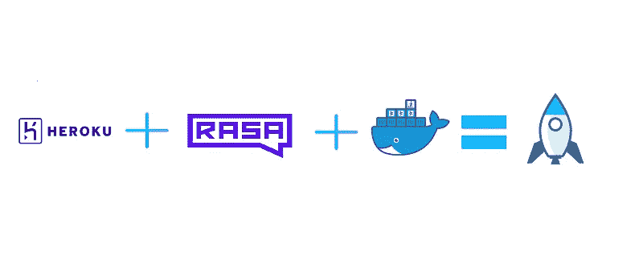

# 使用 Docker 在 Heroku 上部署 Rasa 聊天机器人

> 原文：<https://medium.com/analytics-vidhya/deploying-rasa-chatbot-on-heroku-using-docker-7199bf16c219?source=collection_archive---------1----------------------->

部署

欢迎来到我的第一篇博客的续篇，在这篇博客中，我谈到了将 Rasa 聊天机器人与 Django 相结合。

当我试图部署我的 Rasa 聊天机器人时，我发现有很多挑战，而且现有教程的不足并没有让我更容易。Heroku 是许多开发项目的首选，尤其是在 python 应用程序中，因为它易于使用。Heroku 还提供了一个…