# 在 GCP 部署星爆 Trino，带有蜂巢，存储器和 Postgres 连接器。

> 原文：<https://medium.com/analytics-vidhya/deploying-starburst-enterprise-presto-on-googles-kubernetes-engine-with-storage-and-postgres-72483b10ab62?source=collection_archive---------15----------------------->

今天，我们将享受一些运营/大数据乐趣，而不是通常的普通 Python。这是为什么呢？[没有介质就链接。](https://grski.pl/starburst-k8s.html)

在过去的一年半时间里，我一直沉浸在与设计/实现 API 相关的工作中，同时还有一些产品所有权/管理/指导。我参与的项目/产品中的挑战主要是理解业务环境和面向客户的需求工作。从技术上讲，通常没什么先进的，或者我应该说:没什么有趣的。普通的老姜戈+ DRF，这两个都很棒，但是你知道。事情会变得无聊，尤其是在小范围内。因此，虽然我在经理/产品负责人知识方面有所进步，但我的技术技能却停滞不前。

我注意到了这一点，并决定改变这一点，这样这些东西就不再那么无聊了。你正在阅读的这篇文章就是这样的结果——我尝试新的东西，学习完全超出我通常的专业/舒适区的东西。事不宜迟，让我们继续讨论技术问题，但首先让我在这里做一个小小的说明:本文中展示的解决方案可能并不完美，几乎可以肯定。我是这个题目的新手，今天刚坐下来，开始做事。这不应该成为任何与生产相关的东西的灵感。此外，我简化了一些内容，因为这篇文章的目标是像我一样的新手，甚至是非技术人员，所以请原谅我。

# 数据是 monnies

那么这个星爆企业 Trino 是什么东西？为什么重要？

如今我们基本上喜欢在数据时代。数据=金钱往往。我们大多数人都想要更多的钱，对吗？全球所有不同的公司也是如此。公司通常有大量不知道如何使用的数据。好吧，数据==钱，但只是卖它，是傻瓜的方式。有时候，更好的方法是对这些数据进行一些数字处理，进行一些分析，收集见解，然后采取行动。这就是赚钱的潜力所在，这就是奇迹发生的地方。比如影响美国选举，投票淘汰某些人，预测疫情的爆发或它将如何传播。是什么把这些东西联系在一起？数据。

好的，现在我们知道数据非常重要，对吗？没错。太好了。现在想一想——所有这些数据都必须存储在某个地方，事实也的确如此。通常在某种数据库中。

# 崔诺在这方面有什么作用？

业内事实上的处理数据、理解数据、运行一些查询的标准是 SQL。这是一种你可以说的语言，一种数据库可以理解的语言，告诉他们如何处理我们拥有的数据。数据世界中的几乎每个人都知道它，它并没有那么难，它已经伴随我们很多年了，所以它是久经考验的。太壮观了。到目前为止，一切都很好，很简单。

然而繁荣来了。SQL 和关系数据库不是唯一的，也不应该是唯一的。它们在某些用例中很好，在其他用例中就不那么好了。让我们称这些为我们的`other data sources`。在一些应用程序中，您会发现许多这样的数据源类型，其中一些根本不理解 SQL，这使得将它们与传统的数据库数据一起处理、收集见解等变得更加困难。

不过，这个崔诺的东西来了。啊，顺便说一下——它最初是由脸书开发的。这是什么？Trinois 是统一所有这些数据源的抽象层。它允许您在几乎任何类型的数据源上使用 SQL/查询。这让开发人员少了很多麻烦，让事情变得更简单。它在设计时还考虑了可扩展性，这意味着处理大量数据不成问题。`loads`是多少，基本上是 Pb 或 EB。这已经很多了。很多很多。现在，感谢 Trino，您可以使用 SQL 查询所有这些不同的数据源，并扩展您的应用程序以满足您的需求，无论您需要查询千兆字节、兆兆兆字节还是千兆字节，所有这些都是轻而易举的事情。

# 还有星爆？

关于 Trinois 的部分清楚了，[星爆](https://www.starburstdata.com/)呢？嗯，基本上是一家专门提供 Trino engine 解决方案的公司，力求做到最好。他们还提供了一个同名的产品，有点像 Trino 的酷`packages`的集合，新数据源的更多`connectors`，现有数据源的改进，更好的性能。简单来说，这个产品是类固醇，例如支持，如果你需要它。他们有这个软件的几个不同的“版本”，在这篇文章中，我们将通过[星爆企业](https://www.starburstdata.com/presto-enterprise/)版本设置。

# Kubernetes？

这个你可以自己去谷歌一下。

# 让我们把手弄脏吧

那么，让我们开始吧。我们将从建立 GCP 项目开始。

只是我们不会。我不会用如何下载 cli、在 GCP 注册和初始化 CLI 的细节来烦你。谷歌有很多关于这方面的文档，所以请自便。我希望你能:

1.  在您的 google 云平台控制台中创建的项目。
2.  已安装 CLI
3.  Kubectl 添加到 gcloud
4.  在 cli 的配置中设置的项目 id
5.  cli 中设置的区域
6.  在谷歌云中启用适当的服务。

现在，一旦您完成了所有这些工作，我们就可以使用我们的集群了。为此，您需要:


创建群集可能需要几分钟时间。完成后，您可以看到部署了什么，例如使用

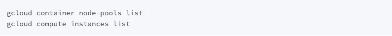

第一个命令将列出您所有的节点池，就像您将拥有的机器的一个`group`。这是一个非常简单的描述，但请耐心听我说，或者学习 k8s。至于第二个，它列出了所有的`instances`，也就是您的集群将运行的`machines/computers`。

好的，我们的集群差不多在运行。现在该怎么办？前往[starbrust 的文档](https://docs.starburstdata.com/latest/kubernetes/deployment.html)并下载链接页面开头列出的文件。之后，导航到您拥有这些文件的位置，并将这些配置应用到我们的 k8s 集群。怎么会？

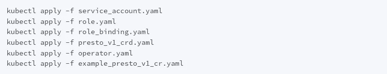

完成所有这些后，尝试:


这样你就能拿到所有的豆荚了。

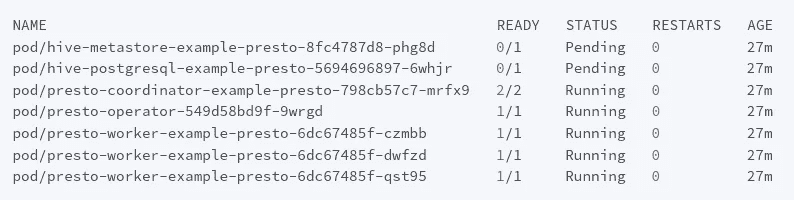

您应该看到几个 pod 正在运行，其中一些可能处于`PENDING`状态。目前来说，一切都很好。

# 世界是你的了

所以我们的 Trino 集群差不多在运行。不过，能接触到还是不错的，对吧？一个 UI 界面与 Starburst Enterprise 打包在一起，它在 8080 端口暴露自己，因此我们所要做的就是将其暴露给世界。怎么做呢？那么，k8s 有一个解决方案——像负载平衡器和入口这样的东西？

它们到底是什么？这是调用面向世界的服务并将请求路由到适当资源的聪明方法。或多或少。应该怎么做？ [K8s 医生告诉我们如何](https://kubernetes.io/docs/tasks/access-application-cluster/create-external-load-balancer/)。考虑到我的 k8s 知识首先非常非常浅薄，其次生疏得要命，因为我上一次接触它是在 1.5 年前，我试着用简单的方法创建一个名为`lb.yml`的文件，放在我的其他部署文件所在的目录中，内容如下:

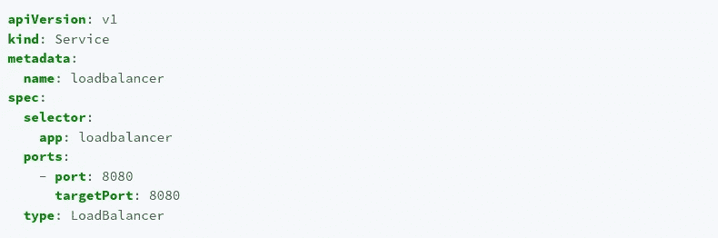

如果你稍微了解 k8s，你就应该明白这种方法有什么问题。总之。我已经应用了这个部署，负载平衡器服务正常运行，到目前为止一切顺利。我用以下方法检查了它:


您需要等待，直到您的 LB 被分配了`external ip`列。您在那里看到的 IP 是您应该尝试连接的 IP。我已经试过了，试着在我的浏览器中连接到`<external ip of my lb>:8080`。那没用。我马上得到一个错误。奇怪。让我们尝试只连接 ip 而不连接端口。表现不一样。怎么会？连接已建立，但它只是挂起，直到超时。有意思。这让我觉得 LB 总体上工作正常，但是配置是错误的——服务试图将我们的请求映射到一个不存在的资源。有`selector.app: loadbalancer`的那部分是错的。我必须知道我需要指向的资源的名称。但是选哪个呢？我已经有几个豆荚了。嗯。让我们放聪明点，做:


这将列出我们所有的资源，在我的例子中:

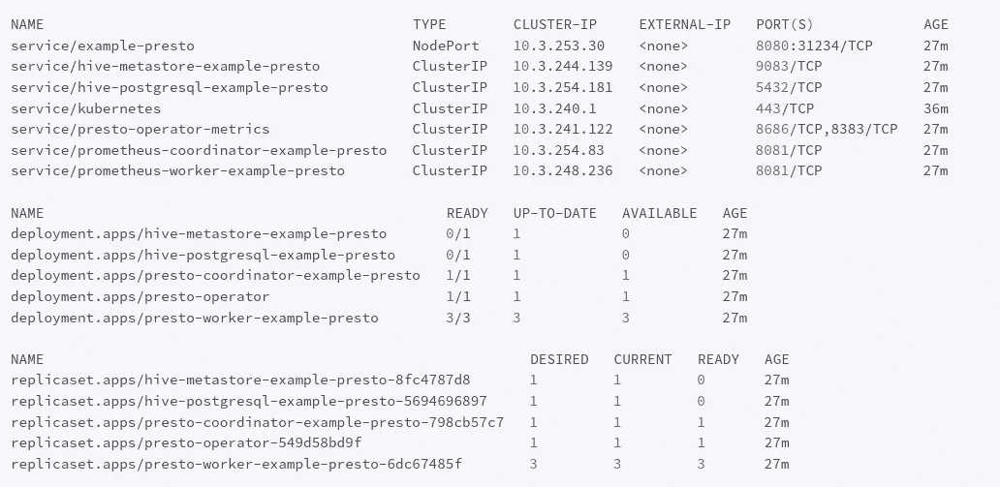

嗯嗯。UI 应该暴露端口 8080，riiight？如果您仔细查看这个输出，您会得到:

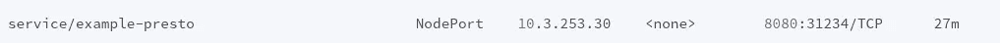

明白了。我现在知道了我需要引用的资源的正确名称，是时候解决这个问题了，同时也去掉了保存配置的文件——只需使用一个命令就可以部署 lb。为什么？去尝试另一种方式，学习更多的基本知识！

但是在我这样做之前，也许你想试着取消/删除我们以前的负载均衡服务？如果名称匹配，理论上不需要这样做，但还是要试一试。怎么会？这次谷歌一下。无论如何，要调出适当的 LB，请这样做:


现在，如果你去`<external ip of my lb>:8080`魔法就会发生。

# 让我们做一些查询

好了，我们的崔诺星团已经完全暴露了，一切都很好。让我们连接到集群，也许创建一些表或查询配置单元。我们走吧。怎么做呢？安装 Trino CLI。怎么会？为 Starburst Enterprise 安装 CLI

我不会深入讨论这个问题，因为文件已经足够了。现在，让我们运行:


我们看到:


成功！现在做什么？让我们来查一下蜂房吧。只是为了检查它是否正常工作。让我们从在 Trino 控制台中键入以下命令开始:

`USE hive.default;`

在我的情况下，它导致了一个错误。如果您查看 Trino 的 UI 包装器，并过滤`failed`查询，您将能够获得关于失败原因的更多细节。在我的情况下，它是`connectivity`错误。好像连不上或者没什么可连接的。百米...还记得我们使用`kubectl get pods`后得到的`PENDING`状态吗？这就是问题所在。hive 的`metastore`和它的内部`postgres`仍然处于待定状态。有点不对劲。

用`kubectl get logs <pod name>`获取日志不会起作用，因为 pod 甚至还没有启动，所以它不会返回任何有见地的东西，但是描述 pod 应该会。这两者有何不同？`kubectl get logs`是专注于 pod 运行时输出的东西。`kubectl describe pod`另一方面会告诉我们更多关于吊舱的配置之类的东西。那我们就这么做吧。


它返回了什么？大致如下的东西:

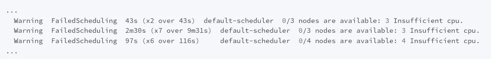

一切都清楚了。

# 明智地规划你的资源

如你所见，我们的`hive`和`postgres`舱无法获得足够的资源，因此无法启动。怎么办？我最初的想法是添加更多的机器/扩展节点数量。怎么做呢？你可以在谷歌云文档中读到相关内容。我把节点数增加到了 5 个，以防万一。默认情况下，我有 3 个。

让我们现在看看。`kubectl get pods` - >砰！配置单元 metastore 启动正常，但 postgres...尽管理论上节点池仍有大量空闲资源，但仍处于待定状态。做什么？再用`kubectl describe pod <name of the pod with postgres for hive>`来挖吧。

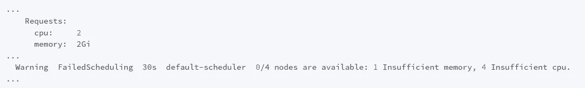

这部分配置引起了我的注意。为什么？因为我检查了运行我们节点的机器。它们属于`n1-standard-1`类型，这意味着它们都有 1 个 vCPU 和 1gb RAM。现在，在只有 1 个 vcpu 和 1 GB RAM 的机器上运行需要 2 个 vcpu 和 2 GB RAM 的 pod 可能会非常困难。我们该如何应对？我们需要调整实例的大小。我不知道是否有更复杂的方法来做到这一点，但我满足于删除旧的节点池，并用更大的机器创建一个新的节点池。

首先—获取节点池的名称


然后删除旧的，同时创建一个新的:

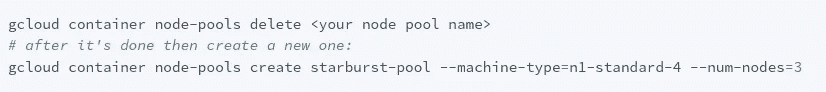

这将创建一个名为`starburst-pool`的节点池，运行在类型为`n1-standard-4`的机器上，有 3 个节点，因此大约有 3 台机器。对于示例部署，您也可以只部署 2 个节点以节省资金，但我更愿意部署 3 个节点。现在让我们看看我们的 pod 是否运行正常。

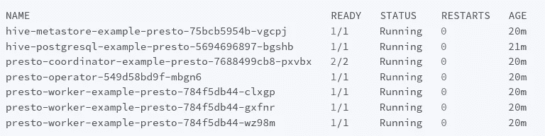

一切正常，耶！

尝试我们不久前进行的初始查询。现在应该可以了。如果是的话，恭喜你。您的配置单元及其内部 postgres 运行正常。

# 外部数据来源

好吧。我们终于建立了集群。一切都很完美。除了一件事。我们没有运行查询的数据。这很可悲。让我们装一些。为什么不呢？

我们如何做到这一点？有很多方法，但是让我们用一种非常常见的方法:从对象存储服务中读取 ORC 文件。这是什么？ORC 基本上是为大数据开发的这种格式。性能原因之类的——你没必要为此那么麻烦自己。对象存储服务类似于亚马逊的 AWS S3 或谷歌云平台的谷歌云存储，这基本上是一种奇特的说法，它是一种硬盘驱动器，但在云中。

我决定采用 GCP 的解决方案，把所有东西都放在一个地方，再加上我已经了解 S3，所以让我们尝试一些新的东西。

如何创建一个桶？很简单，谷歌一下。然后对如何创建服务密钥的信息进行同样的操作。请注意不要创建公共存储桶，因为这样你所有的文件都可以在互联网上找到。也可以尝试限制您对服务密钥的访问。自己多研究一下这两个话题。

生成服务密钥后，下载它的。json 文件。你有吗？太好了。我们继续吧。

# 对象存储服务— GCS

你记得我们之前下载的这个文件`example_presto_v1_cr.yaml`吗？在某种文本编辑器/IDE 中打开它，找到`hive`部分。在我的例子中，它看起来是这样的:

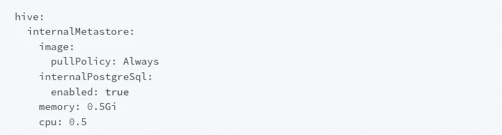

这里我们需要做的是允许 hive 以某种方式向 GCP 授权。怎么会？记住。我们下载的 json 服务文件？好，把它移到和`example_presto_v1_cr.yaml`同一个目录下，命名为`gcs-key.json`。然后编辑部署，如下所示:

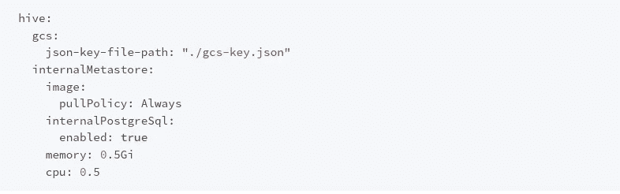

之后:


本，搞定。现在，如果您已经正确设置了服务访问，hive 将能够正确地进行身份验证，我想您已经设置了。但是等一下。如果我们想读入一些数据，我们需要这些数据，但是我们没有。

这里有两个解决方案:在互联网上找到一些示例 ORC 文件并使用它，或者准备您自己的随机测试数据集。我们要做什么？当然是后者！怎么会？用 Python。让我们首先安装我们将需要的这个软件包:

```
pip install pyorc
```

想用 virtualenv 就用吧，我没有。

现在，一个简单的脚本就可以了:

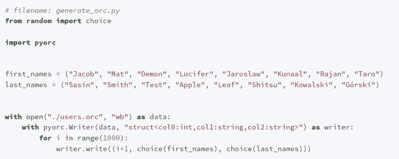

这将生成一个 1000 个用户的列表，包括名字、姓氏和 id。这是一个非常简单的例子，但也可以。现在运行它:

```
python generate_orc.py
```

然后砰。我们走吧。你应该在你的目录中看到一个名为`users.orc`的新文件。现在转到您的 bucket，在那里创建一个名为`import`的目录，并将文件上传到那里。现在为了导入这个文件，我们需要再次输入 Trino shell。如果你以前退出过，这里有一个小提示，告诉你如何到达那里:

```
trino --server <external ip of my lb>:8080 --user test
```

一旦你到了那里:

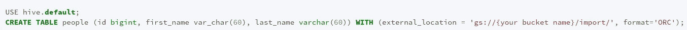

这将使 Hive 转到那个桶位置并处理那里的所有文件，导入它们并填充新创建的表`people`。

完成了。现在试试:


打印出前 10 行。有用吗？如果是这样，恭喜你。

很好。我们现在可以从存储在对象存储服务中的 ORC 文件中查询东西。从一个更流行的数据源获取数据怎么样，比如一个数据库，比如 postgres？就这么办吧。

# Postgres

我们如何从 trino 集群内部查询 postgres？首先，我们需要有这样一个 db。出于本文的目的，您可以在 GCP 上配置一个托管数据库。怎么做呢？再谷歌一下。只要记住授权您的集群的 IP 地址访问数据库或使用`0.0.0.0/0`允许任何 IP 访问它。下一步是什么？返回到用于添加配置单元 gcs 连接器的同一个文件。现在打开它，尝试找到带有`additionalCatalogs`的部分。大致像这样配置它:

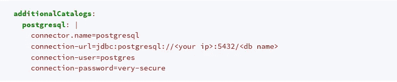

现在—这里的第一个问题是:密码存储在明文 OMG OMG 中。通常，我会使用秘密来管理它，因为 k8s 有一个机制，但这不是没有生产设置指南。另外，如果有人可以访问带有您的部署代码的 repo，通常对安全性来说已经太晚了，但是我理解您的担心。在实际应用中不应该这样做。

好吧。你补充说，现在怎么办？用你在 Hive 中应用的同样的命令来应用这些改变，就像`kubectl apply`一样。

打开您的 trino 控制台，尝试做一些事情，例如列出可用的模式:


如果这对你有用，你就正式完成了。你现在可以查询所有你想要的。你的问题会很好地总结在用户界面上，你可以看到那里的细节。

# 摘要

嗯，我们差不多完成了。对我来说，这是一次有趣的探索，因为我对崔诺、星爆和 GCP 都没有任何经验。总体来说过得很愉快，这很好，尤其是在这个令人生畏的时期。总之。

我们已经浅尝了 trino 能做的事情，但是还有更多要尝试的。

这就是今天这一集的格斯基漫谈！