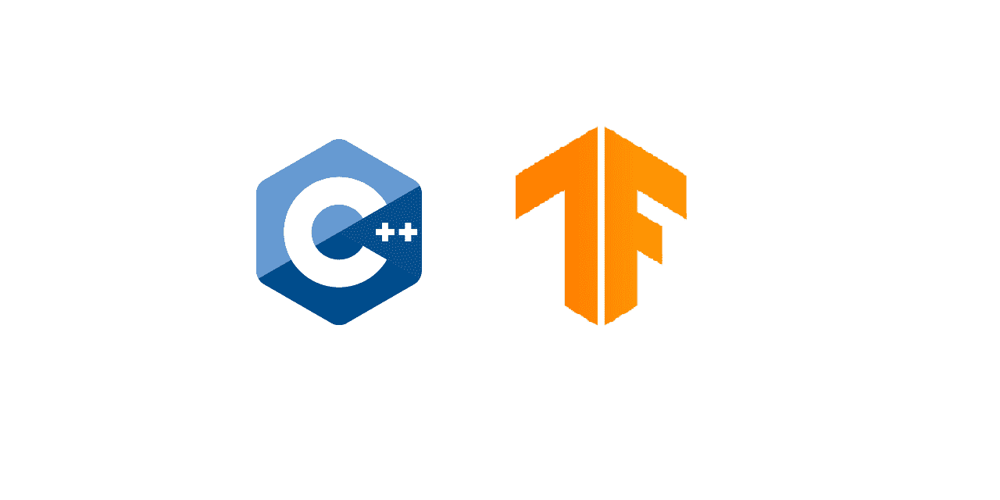

# 将 Tensorflow 2.1 部署为 C/C++可执行文件

> 原文：<https://medium.com/analytics-vidhya/deploying-tensorflow-2-1-as-c-c-executable-1d090845055c?source=collection_archive---------0----------------------->

这里有一个用例，我相信一些非数据工程师/数据科学家正在面对。

**我如何交付我用 python 训练的 Tensorflow 模型，但在客户端用纯 C/C++代码部署它，而不用在客户端设置 Python 环境，而且所有文件都必须是二进制文件？？**