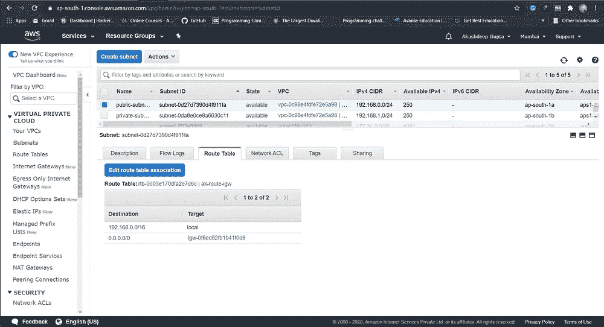
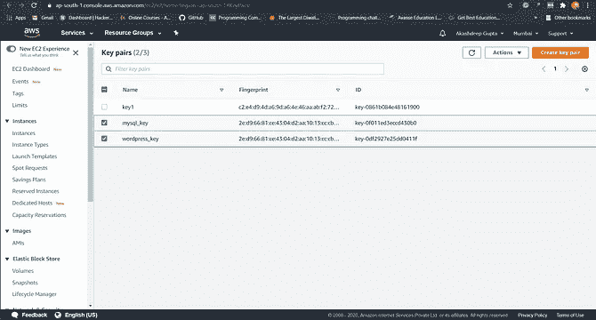

# 在 VPC 部署 WordPress 和 MySql 服务器

> 原文：<https://medium.com/analytics-vidhya/deploying-wordpress-and-mysql-server-in-our-own-vpc-59d5d4a2fedd?source=collection_archive---------22----------------------->


## *我们会做什么？

1)使用 Terraform 将基础架构编写为代码，这会自动创建 VPC。

2)创建一个面向公众的互联网网关，将我们的 VPC/网络连接到互联网世界，并将此网关连接到我们的 VPC。

3)在 VPC 中，我们必须创建 2 个子网:

a)公共子网[公共世界可访问！]

b)私有子网[仅限公共领域！].

4)为 Internet gateway 创建一个路由表，以便实例可以连接到外部世界，更新并将其与公共子网相关联。

5)启动一个 ec2 实例，它的 WordPress 设置已经有了允许端口 80 的安全组，这样我们的客户就可以连接到我们的 WordPress 站点。

此外，将密钥附加到实例，以便进一步登录。

6)启动一个 ec2 实例，该实例已经用安全组设置了 MYSQL，允许在私有子网中使用端口 3306，这样我们的 WordPress VM 就可以连接相同的端口。

此外，将密钥与相同的。

注意:WordPress 实例必须是公共子网的一部分，这样我们的客户才能连接我们的站点。

MySQL 实例必须是私有子网的一部分，这样外界就不能连接到它。

不要忘记添加要启用的自动 IP 分配和自动 DNS 名称分配选项。

## *在进入解决方案部分之前，我们先来看看本任务中的一些主要术语

*   ***什么是 aws？***

Amazon web service 是一个平台，提供灵活、可靠、可扩展、易于使用且经济高效的云计算解决方案。

AWS 是亚马逊提供的一个全面、易于使用的计算平台。该平台结合了基础设施即服务(IaaS)、平台即服务(PaaS)和打包软件即服务(SaaS)产品。

*   ***AWS(亚马逊网络服务)的 7 大好处***

1.  全面的
2.  性价比高
3.  适合的
4.  安全性
5.  创新ˌ革新
6.  全球领导者
7.  提高生产力

*   ***该发球了***

> VPC

VI virtual Private Cloud(亚马逊 VPC)允许您提供 AWS 云的逻辑隔离部分，您可以在您定义的虚拟网络中启动 AWS 资源。您可以完全控制虚拟网络环境，包括选择自己的 IP 地址范围、创建子网以及配置路由表和网络网关。您可以在您的 VPC 中同时使用 IPv4 和 IPv6，以便安全轻松地访问资源和应用程序。

> ***以下是 VPCs 的关键概念:***

*   **虚拟私有云(VPC)** —专用于您的 AWS 帐户的虚拟网络。
*   **子网**—VPC 中的一系列 IP 地址。
*   **路由表** —一组称为路由的规则，用于确定网络流量的流向。
*   **互联网网关** —连接到 VPC 的网关，用于实现 VPC 中的资源与互联网之间的通信。

> *子网*

T4 的子网是一个网络内部的网络。子网使网络更加高效。通过子网划分，网络流量可以传输更短的距离，而无需通过不必要的路由器到达目的地。

互联网上的每台计算机或主机都至少有一个 IP 地址作为唯一标识符。组织将使用子网将大型网络细分为更小、更高效的子网。子网的一个目标是将一个大型网络分成一组较小的互连网络，以帮助减少流量。

> 路由表

R oute *表*包含一组规则，称为*路由*，用于确定来自子网或网关的网络流量被定向到哪里。

> 互联网网关

互联网网关是一个水平扩展的、冗余的、高度可用的 VPC 组件，它允许您的 VPC 与互联网之间的通信。

internet 网关有两个用途:在 VPC 路由表中为可路由到 internet 的流量提供一个目标，并为已经分配了公共 IPv4 地址的实例执行网络地址转换(NAT)。

互联网网关支持 IPv4 和 IPv6 流量。它不会对您的网络流量造成可用性风险或带宽限制。

> *EC2*

EElastic Block Store(EBS)是一种易于使用的高性能块存储服务，旨在与亚马逊弹性计算云(EC2)配合使用，用于任何规模的吞吐量和事务密集型工作负载。各种各样的工作负载，如关系和非关系数据库、企业应用程序、容器化应用程序、大数据分析引擎、文件系统和媒体工作流，都广泛部署在 Amazon EBS 上。

> *密钥对和安全组*

由一个私钥和一个公钥组成的密钥对是一组安全凭证，用于在连接到实例时证明您的身份。Amazon EC2 存储公钥，您存储私钥。您使用私钥而不是密码来安全地访问您的实例。

安全组充当 EC2 实例的虚拟防火墙，控制传入和传出流量。入站规则控制您的实例的传入流量，出站规则控制您的实例的传出流量。…如果没有指定安全组，Amazon EC2 会使用默认的安全组。

*   ***什么是 terraform？***

erraform 是一个安全有效地构建、更改和版本控制基础设施的工具。Terraform 可以管理现有的和受欢迎的服务提供商以及定制的内部解决方案。

配置文件描述了运行单个应用程序或整个数据中心所需组件的平台化。Terraform 生成一个执行计划，描述它将做什么来达到期望的状态，然后执行它来构建所描述的基础设施。随着配置的变化，Terraform 能够确定发生了什么变化，并创建可以应用的增量执行计划。

Terraform 可以管理的基础设施包括低级组件，如计算实例、存储和网络，以及高级组件，如 DNS 条目、SaaS 功能等。

> ***terra form 的关键特性有***

1.  执行计划
2.  基础设施作为代码
3.  变革自动化
4.  资源图表

## *解决方案

1.  创造了 VPC。

```
# — Creating vpcresource “aws_vpc” “ak-vpc” {
 cidr_block = “192.168.0.0/16”
 instance_tenancy = “default”
 enable_dns_hostnames = “true”tags = {
 Name = “ak-vpc”
 }
}
```

**192.168.0.0/16** :范围在 192.168.0.0 和 192.168.255.255 之间，有 65，534 个可能的主机。这意味着在这个 vpc 下可以启动将近 65，520 个实例。


VPC

2.创建一个面向公众的互联网网关，将我们的 VPC/网络连接到互联网世界，并将此网关连接到此 VPC。

```
# — Creating internet-gatewayresource “aws_internet_gateway” “ak-igw” {
 vpc_id = “${aws_vpc.ak-vpc.id}”tags = {
 Name = “ak-igw”
 }
}
```

而且，没什么好解释的。


互联网网关

3.在此 VPC 中，创建了 2 个子网:

a)公共子网[公共世界可访问！]

b)私有子网[仅限公共领域！].

```
# — Creating subnetdata “aws_availability_zones” “zones” {
 state = “available”
}# — Creating public subnetresource ”aws_subnet” “public-subnet-1a” {
 availability_zone = “${data.aws_availability_zones.zones.names[0]}”
 cidr_block = “192.168.0.0/24”
 vpc_id = “${aws_vpc.ak-vpc.id}”
 map_public_ip_on_launch = “true”

 tags = {
 Name = “public-subnet-1a”
 }
}# — Creating private subnetresource ”aws_subnet” “private-subnet-1b” {
 availability_zone = “${data.aws_availability_zones.zones.names[1]}”
 cidr_block = “192.168.1.0/24”
 vpc_id = “${aws_vpc.ak-vpc.id}”tags = {
 Name = “private-subnet-1b”
 }
}
```

**192.168.0.0/24:** 范围在 192.168.0.0 和 192.168.0.255 之间，有 254 个可能的主机。

在这里，数据“aws_availability_zones”意味着获取我们地区(ap-south-1)下的所有可用区域。因为“0”表示“ap-south-1a”子网，“1”表示“ap-south-1b”子网。



公共和私有子网

4.为 Internet gateway 创建一个路由表，以便该实例可以连接到外部世界，更新并将其与公共子网相关联。

```
# — Create route tableresource “aws_route_table” “ak-route-igw” {
 vpc_id = “${aws_vpc.ak-vpc.id}”route {
 cidr_block = “0.0.0.0/0”
 gateway_id = “${aws_internet_gateway.ak-igw.id}”
 }

 tags = {
 Name = “ak-route-igw”
 }
}
```

就像剪指甲一样简单。

现在，将其更新到公共子网。

```
# — Subnet Associationresource “aws_route_table_association” “subnet-1a-asso” {
 subnet_id = “${aws_subnet.public-subnet-1a.id}”
 route_table_id = “${aws_route_table.ak-route-igw.id}”
}
```


路由表

5.启动一个 ec2 实例，它已经用安全组设置了 MYSQL，允许在私有子网中使用端口 3306，这样我们的 WordPress VM 就可以连接到相同的端口。

此外，将密钥与相同的。

*   创建密钥对。

```
# — Creating Key Pairs for mySqlresource “tls_private_key” “key4” {
 algorithm = “RSA”
 rsa_bits = 4096
}resource “local_file” “key5” {
 content = “${tls_private_key.key4.private_key_pem}”
 filename = “mysql_key.pem”
 file_permission = 0400
}resource “aws_key_pair” “key6” {
 key_name = “mysql_key”
 public_key = “${tls_private_key.key4.public_key_openssh}”
}
```

*   创建安全组。

```
# — Creating Security Groups for mySqlresource “aws_security_group” “sg-db” {
 depends_on = [
 aws_security_group.sg-wp,
 ]
 name = “mySql-sg”
 description = “Allow TLS inbound traffic”
 vpc_id = “${aws_vpc.ak-vpc.id}”ingress {
 description = “MYSQL/Aurora”
 from_port = 3306
 to_port = 3306
 protocol = “tcp”
 security_groups = [ “${aws_security_group.sg-wp.id}” ]
 }egress {
 from_port = 0
 to_port = 0
 protocol = “-1”
 cidr_blocks = [“0.0.0.0/0”]
 }tags = {
 Name = “mySql-sg”
 }
}
```

在这里，security _ groups =[" $ { AWS _ security _ group . SG-WP . id } "]表示 MySql 的安全组将只允许 Wordpress 实例在私有空间中安全连接。

只允许 MySql 端口 3306 和 ssh 22。

*   正在启动实例。

```
# — Creatig Ec2 instance for mySqlresource “aws_instance” “database_server” {
 ami = “ami-08706cb5f68222d09”
 subnet_id = “${aws_subnet.private-subnet-1b.id}”
 availability_zone = “${data.aws_availability_zones.zones.names[1]}”
 instance_type = “t2.micro”
 root_block_device {
 volume_type = “gp2”
 delete_on_termination = true
 }
 key_name = “${aws_key_pair.key6.key_name}”
 vpc_security_group_ids = [ “${aws_security_group.sg-db.id}” ]

 tags = {
 Name = “MySql”
 }
}
```

成功地在没有任何公共 IP 和 DNS 主机名的私有子网中启动 MySql 实例。



关系型数据库

6.启动一个 ec2 实例，它的 WordPress 设置已经有了允许端口 80 的安全组，这样我们的客户端就可以连接到我们的 WordPress 站点。

此外，将密钥附加到实例，以便进一步登录。

*   创建密钥对。

```
# — Creating Key Pairs for wordpressresource “tls_private_key” “key1” {
 algorithm = “RSA”
 rsa_bits = 4096
}resource “local_file” “key2” {
 content = “${tls_private_key.key1.private_key_pem}”
 filename = “wordpress_key.pem”
 file_permission = 0400
}resource “aws_key_pair” “key3” {
 key_name = “wordpress_key”
 public_key = “${tls_private_key.key1.public_key_openssh}”
}
```

*   创建安全组。

```
# — Creating Security Groups for wordpressresource “aws_security_group” “sg-wp” {
 name = “wordpress-sg”
 description = “Allow TLS inbound traffic”
 vpc_id = “${aws_vpc.ak-vpc.id}”ingress {
 description = “SSH”
 from_port = 22
 to_port = 22
 protocol = “tcp”
 cidr_blocks = [ “0.0.0.0/0” ]
 }ingress {
 description = “HTTP”
 from_port = 80
 to_port = 80
 protocol = “tcp”
 cidr_blocks = [ “0.0.0.0/0” ]
 }egress {
 from_port = 0
 to_port = 0
 protocol = “-1”
 cidr_blocks = [“0.0.0.0/0”]
 }tags = {
 Name = “wordpress-sg”
 }
}
```

仅允许端口 80 和 ssh 端口 22。

*   正在启动实例。

```
# — Creating Ec2 instance for wordpressresource “aws_instance” “web_server” {
 depends_on = [
 aws_instance.database_server,
 ]

 ami = “ami-004a955bfb611bf13”
 subnet_id = “${aws_subnet.public-subnet-1a.id}”
 availability_zone = “${data.aws_availability_zones.zones.names[0]}”
 instance_type = “t2.micro”
 root_block_device {
 volume_type = “gp2”
 delete_on_termination = true
 }
 key_name = “${aws_key_pair.key3.key_name}”
 vpc_security_group_ids = [ “${aws_security_group.sg-wp.id}” ]
 associate_public_ip_address = true

 tags = {
 Name = “Wordpress”
 }
}
```

成功，在具有公共 IP 和 DNS 主机名的公共子网上启动。


wordpress 软件

## *用于运行所有上述命令或运行任何所需的设置

```
terraform init
# to install desired plugins for that provider used.
***Note/- Use the above command only once after creating the code***terraform validate 
# to check any error in the code.terraform plan 
# to see what you are going to create.terraform apply
# to run the code or whole infrastructure at once.terraform destroy
# to destroy whole infrastructure at once.
```

## *最终结果


WordPress 网站

> 完整代码请参考我的 Github

[](https://github.com/Akashdeep-47/cloud_task3.git) [## Akashdeep-47/cloud_task3

### 在我们自己的 VPC 亚马逊网络服务下，在公共和私有子网中启动 Wordpress 和 MySql 是一个…

github.com](https://github.com/Akashdeep-47/cloud_task3.git) 

## 感谢阅读！！

热烈欢迎掌声和建议。