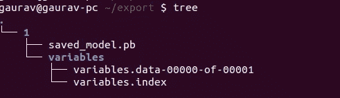
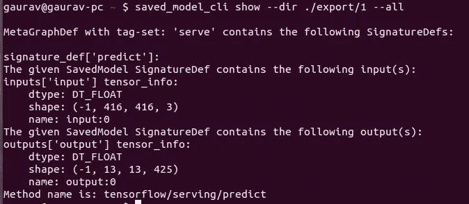
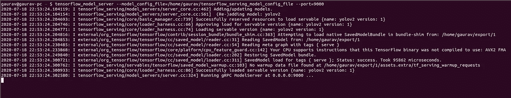

# 在 Tensorflow 服务器上部署 Yolo:第 1 部分

> 原文：<https://medium.com/analytics-vidhya/deploying-yolo-on-tensorflow-serving-part-1-4586f97f0dd9?source=collection_archive---------11----------------------->


**我是如何开始 Tensorflow 服务的。**

我是一名[机器学习工程师](https://www.linkedin.com/in/gaurav-gola96/)，我一直在开发一系列机器学习产品，如[**Android**](https://play.google.com/store/apps/details?id=com.fynd.ficto&hl=en)**和 web 上的 [**虚拟化妆**](http://glamar.io) **，** [**图像属性分类**](http://witi.fynd.com) **，机器翻译，移动设备的实时 DL 模型优化，以及与 Kubernetes 的部署管道设置等**。创建这些模型只是我的问题的一部分，我的下一个挑战是在生产中服务这些模型。模型服务系统应该能够承受大流量。**

任何系统的关键要求:

*   水平可扩展性
*   与 TensorFlow 新版本兼容
*   预测时的低延迟

**小概述:Tensorflow 发球**

Tensorflow Serving 是用 C++写的，支持机器学习模型的服务。现成的 Tensorflow 服务安装支持:

*   张量流模型的服务
*   从本地文件系统扫描和加载张量流模型

TensorFlow 服务将每个模型视为可服务的对象。它定期扫描本地文件系统，根据文件系统的状态和模型版本化策略加载和卸载模型。这允许在 Tensorflow 服务继续运行的同时，通过将导出的模型复制到指定的文件路径来轻松热部署已训练的模型。

**为什么 YOLOv2**

一个显而易见的原因是我一直在研究它😅。对于 Yolov2，也没有适当的教程介绍如何导出 TF 服务的模型以及 TF 服务输出结果的后处理，如果你不熟悉 yolov2 算法，这有一点小技巧。我在一年前的 [**部署了这个模型**，](https://github.com/thtrieu/darkflow/issues/824)部署包括导出模型用于 TF 服务，并写下**后处理脚本**，这是更棘手的部分。

**本地机器设置**

在研究机器学习的许多用例时，我遇到了一个问题，我必须训练一个[****yolov 2****](https://github.com/thtrieu/darkflow)**并将其部署到 TensorFlow 服务上。在这篇博客中，我将讲述如何在 Tensorflow 服务器上部署 Yolov2。**

**要在本地机器上设置 TensorFlow 服务，只需按照 TensorFlow [**安装**](https://www.tensorflow.org/tfx/serving/setup) 设置即可，非常简单。为了训练你自己的 yolov2，你可以跟随 [Github repo](https://github.com/thtrieu/darkflow/blob/master/README.md) 。**

****保存您的模型****

**要将我们训练的模型加载到 TensorFlow 服务中，我们首先需要将其保存为 [SavedModel](https://www.tensorflow.org/versions/r1.15/api_docs/python/tf/saved_model) 格式。这将在一个定义明确的目录层次结构中创建一个 protobuf 文件，并将包含一个版本号。 [TensorFlow Serving](https://www.tensorflow.org/tfx/guide/serving) 允许我们选择模型的哪个版本，或者当我们做出推理请求时我们想要使用的“可服务的”。每个版本将被导出到给定路径下的不同子目录中。**

**下面是将 yolov2 模型导出为 TF 服务格式的脚本**

****检查您保存的模型****

****

**导出的模型目录结构**

**命令行实用程序`saved_model_cli`查看我们的 SavedModel 中的[元图定义](https://www.tensorflow.org/versions/r1.15/api_docs/python/tf/MetaGraphDef)(模型)和[签名定义](https://www.tensorflow.org/tfx/tutorials/signature_defs)(可以调用的方法)。**

```
export export_path=./export/1
saved_model_cli show --dir $export_path --all
```

****

**保存的模型输入/输出形状**

****启动本地服务器:****

**创建 TensorFlow 服务配置，您可以在其中添加模型及其各自基础的列表。**

**使用以下命令在特定端口上启动您的服务器**

```
tensorflow_model_server --model_config_file=/home/gaurav/tensorflow_serving_model_config_file --port=9000
```

****

**9000 端口上版本 1 的服务模型**

****结论****

**在这一部分中，我们介绍了如何将保存的微型 yolov2 模型导出为 Tensorflow 服务格式，检查您的模型，并在本地启动服务器。**如果你分析*检查你保存的模型*部分，你会发现输出是张量的一种形式，尽管你需要一个类名称，就像我们在分类模型中得到的一样**。这将在后处理你的输出张量 post TF 服务的下一部分中涉及，并在本博客的 [**第二部分**](/@gauravgola/deploying-yolo-on-tensorflow-serving-part-2-4ecd5edbe776) 中围绕服务的模型创建一个小 API。**

> **在 [**Linkedin**](https://www.linkedin.com/in/gaurav-gola96/) **和**[**Youtube**](https://www.youtube.com/channel/UC3zK1Iuw2Rufxu8TKeyj4GQ)**上和我连线。****
> 
> **本项目 github:[**链接**](https://github.com/gauravgola96/Yolo_deployment)**