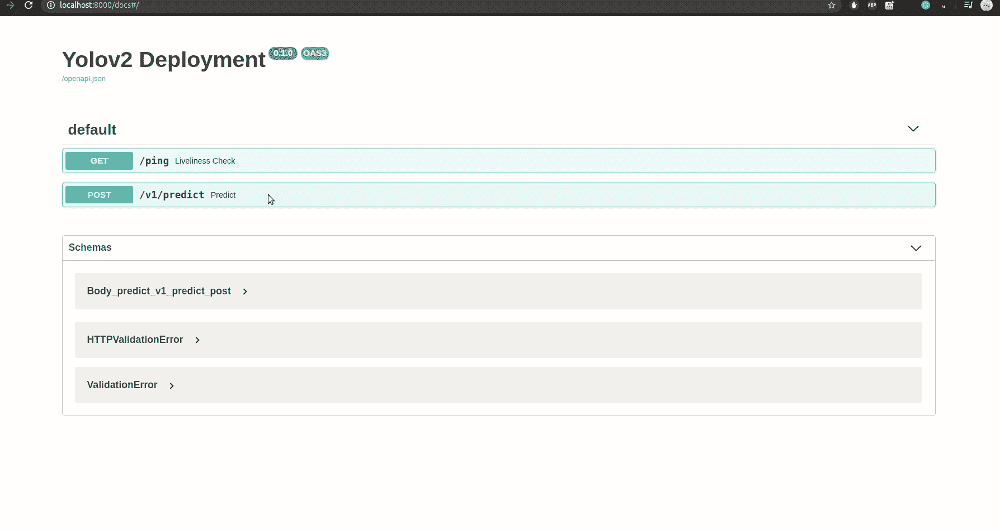

# 在 Tensorflow 服务器上部署 Yolo:第 2 部分

> 原文：<https://medium.com/analytics-vidhya/deploying-yolo-on-tensorflow-serving-part-2-4ecd5edbe776?source=collection_archive---------14----------------------->

在 [**第 1 部分**](/@gauravgola/deploying-yolo-on-tensorflow-serving-part-1-4586f97f0dd9) **，**中，我们实际学习了如何将 Yolo 权重导出为 TF serving 保存的模型格式，检查保存的模型，并在本地机器上启动服务器。我们还观察到托管 TF 服务的输出是一种特殊形状的张量，不能直接在服务器上使用，因此我们需要在它上面添加一个后处理脚本。

**代码概述**

通过详细分析 [**暗流**](https://github.com/thtrieu/darkflow) **的代码库。**我发现当我们从[代码](https://github.com/thtrieu/darkflow/blob/master/darkflow/net/flow.py)中调用 **return_predict()** 时，它实际上是从 [cython 模块](https://github.com/thtrieu/darkflow/blob/master/darkflow/cython_utils/cy_yolo2_findboxes.pyx)中调用 **cython** 帮助函数。

这个代码其实在核心算**非最大抑制。** *YOLO 使用非最大抑制(NMS)只保留最佳包围盒。NMS 的第一步是移除所有检测概率小于给定 NMS 阈值的预测边界框。并且在得到具有超过某个阈值的盒子之后，它计算所有预测的盒子* ***的* ***交集并(IOU)*** *。*** [***后置处理代码***](https://gist.github.com/gauravgola96/06ab080e11bd0048843dc4f3cf004326)

```
def box_contructor(meta,out,threshold ):
    *'''
    :param meta: meta file .cfg
    :param out: Image tensor from tf serving
    :param threshold: Threshold for prediction (present in models.py)
    :return: boxes of obejct detected
    '''* H, W, _ = meta['out_size']
    C = meta['classes']
    B = meta['num']
    net_out = out.reshape([H, W, B, int(out.shape[2] / B)])

    Classes = net_out[:, :, :, 5:]

    Bbox_pred = net_out[:, :, :, :5]
    probs = np.zeros((H, W, B, C), dtype=np.float32)

    anchors = np.asarray(meta['anchors'])

    for row in range(H):
        for col in range(W):
            for box_loop in range(B):
                arr_max = 0
                sum = 0;
                Bbox_pred[row, col, box_loop, 4] = expit(Bbox_pred[row, col, box_loop, 4])
                Bbox_pred[row, col, box_loop, 0] = (col + expit(Bbox_pred[row, col, box_loop, 0])) / W
                Bbox_pred[row, col, box_loop, 1] = (row + expit(Bbox_pred[row, col, box_loop, 1])) / H
                Bbox_pred[row, col, box_loop, 2] = exp(Bbox_pred[row, col, box_loop, 2]) * anchors[2 * box_loop + 0] / W
                Bbox_pred[row, col, box_loop, 3] = exp(Bbox_pred[row, col, box_loop, 3]) * anchors[2 * box_loop + 1] / H
                # SOFTMAX BLOCK, no more pointer juggling

                for class_loop in range(C):
                    arr_max = max(arr_max, Classes[row, col, box_loop, class_loop])

                for class_loop in range(C):
                    Classes[row, col, box_loop, class_loop] = exp(Classes[row, col, box_loop, class_loop] - arr_max)
                    sum += Classes[row, col, box_loop, class_loop]

                for class_loop in range(C):
                    tempc = Classes[row, col, box_loop, class_loop] * Bbox_pred[row, col, box_loop, 4] / sum

                    if (tempc > threshold):
                        probs[row, col, box_loop, class_loop] = tempc

    return NMS(np.ascontiguousarray(probs).reshape(H * W * B, C), np.ascontiguousarray(Bbox_pred).reshape(H * B * W, 5))
```

**Yolo 助手类**

为 Yolo TF 服务的预处理、预测和后处理编写助手类。这个类将帮助处理来自服务器的输入图像，从 TF 服务器获得预测，并返回输出标签作为响应

**API :**

一个小 API，用于调用我在上一节中编写的 TF serving hosted model 和 YoloHelperClass。使用 Fastapi 作为 web 框架，因为它的快速性能和异步支持可以帮助您在未来扩展您的服务。

```
app = FastAPI(title="Yolov2 Deployment")

@app.get("/ping", status_code=200, summary=" Liveliness Check ")
async def ping():
    return {"ping": "pong"}

@app.post("/v1/predict", status_code=200)
async def predict(image: UploadFile = File(...)):
    img_read = image.file._file.read()
    img = cv2.imdecode(np.fromstring(img_read, np.uint8), cv2.COLOR_RGB2BGR)
    pre_img = yolohelper.preprocess(img)
    predict_img = yolohelper.predict(pre_img)
    return predict_img 
```

**结果:**这个 API 的响应将是一个概率最大的类。您可以在 **YoloHelperClass 中更改响应的性质。**



Fastapi swagger

**结论**

从两篇系列博客中，我们看到了如何将您的 TF 模型导出到 TF serving 保存的模型，并在 TF serving 上托管它。我们编写了一个小的 API 和 helper 类来对 TF 服务输出执行后处理，并以最大概率获得预测的类。

**第一部分** : [环节](/@gauravgola/deploying-yolo-on-tensorflow-serving-part-1-4586f97f0dd9)

> 在 [**Linkedin**](https://www.linkedin.com/in/gaurav-gola96/) **和**[**Youtube**](https://www.youtube.com/channel/UC3zK1Iuw2Rufxu8TKeyj4GQ)**上跟我连线。**
> 
> 本项目 github:[**链接**](https://github.com/gauravgola96/Yolo_deployment)