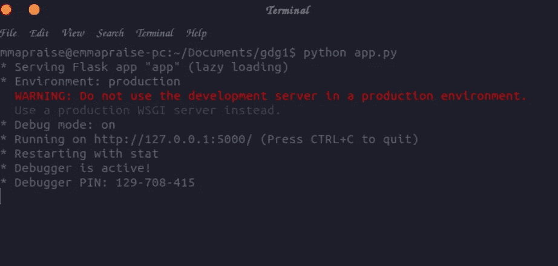
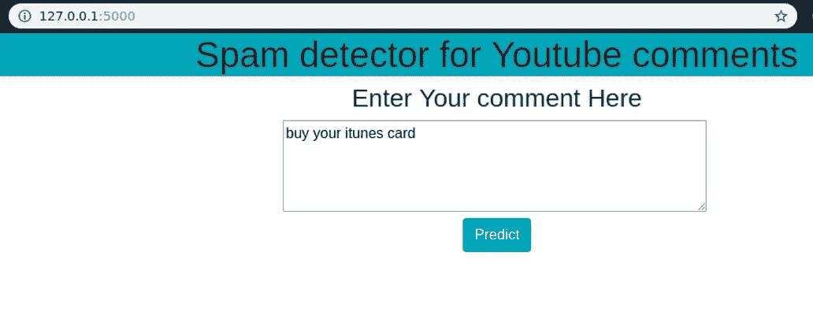
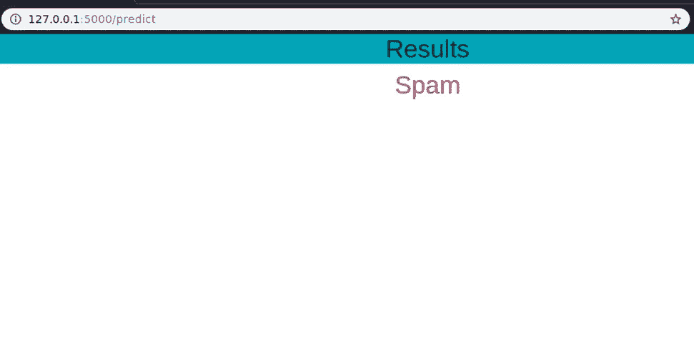

# 使用 Flask 将机器学习模型部署为 REST API

> 原文：<https://medium.com/analytics-vidhya/deploying-your-machine-learning-model-as-a-rest-api-using-flask-c2e6a0b574f5?source=collection_archive---------0----------------------->


克里斯里德在 [Unsplash](https://unsplash.com?utm_source=medium&utm_medium=referral) 上的照片

有成千上万的在线课程教你如何建立和训练机器学习模型或深度神经网络，许多这些教程最终只会让你独自训练和建立模型。然而，这将导致您在本地计算机上拥有一个模型文件，这还不是故事的结尾:模型需要被部署，以便被客户端或最终用户使用。

作为一名 web 开发人员和数据科学家，我渴望构建 Web 应用程序来展示我的工作。尽管我很喜欢设计前端，但同时学习机器学习和 web 开发变得非常困难。因此，我必须找到一种解决方案，能够轻松地将我的机器学习模型与其他开发人员集成，这些开发人员能够比我更好地构建一个健壮的 web 应用程序。

通过为我的模型构建 REST API，我可以将我的代码与其他开发人员分开。这里有明确的分工，这有利于定义责任，并防止我直接阻止不参与项目机器学习方面的队友。另一个优点是，我的模型可以被在不同平台上工作的多个开发人员使用，比如 web 或 mobile。

# 关于烧瓶

[Flask](http://flask.pocoo.org) 是一个用于 Python 的微型 web 框架。它被称为微框架，因为它不需要特殊的工具或库。虽然看它的(简单的)概览页面你不会猜到这一点，但它是 Pinterest 的主要 API 技术。您可以使用 Flask web 服务来创建一个 API 调用，它可以由前端使用，甚至是一个完整的 web 应用程序。

一个非常简单的 flask 应用程序应该是这样的:

在本文中，我将构建一个简单的 Scikit-Learn 模型，并使用 [Flask RESTful](https://flask-restful.readthedocs.io/en/latest/) 将其部署为 REST API。本文特别面向没有广泛计算机科学背景的数据科学家。

它可以使用 pip 与终端一起安装

```
pip install flask
```

# 获取数据集

在这篇文章中，我使用了一个 [YouTube 垃圾邮件收集数据集](https://archive.ics.uci.edu/ml/datasets/YouTube+Spam+Collection)，它是一个公共的垃圾邮件研究评论数据集。它有五个数据集，由从五个视频中提取的 1，956 条真实消息组成，这五个视频是在收集期间观看次数最多的 10 个视频之一。我将只使用五个数据集之一，即 Youtube01-Psy.csv

# Setting up your environment

I created a new file and save it as **app.py**

I then created two folders (**templates** and **static** )alongside the file app.py

Then inside the folder static created I created another folder called CSS, which houses all our CSS files (**style.css**).

a little overview of the file structure:

```
├── app.py  **# Flask REST API script**
└── data/
    └── Youtube01-Psy.csv**# data from UCI Machine learning Repository** 
├── templates
      ├── home.html
      └── result.html
└── static
    └── CSS
         └── style.css
```

# Import Libraries

The code below contains our necessary libraries needed for the task

```
from flask import Flask, render_template,url_for,request
import pandas as pd
import pickle
from sklearn.feature_extraction.text import CountVectorizer
from sklearn.naive_bayes import MultinomialNB
from sklearn.externals import joblib
```

# Initialize The App

```
app = Flask(__name__)#Machine Learning code goes hereif __name__ == '__main__':
 app.run(debug=True)
```

Building the App

Creating the homepage

We need to create an HTML file in the templates folder, this is will be our homepage. I save mine as **home.html**

Then I also update **app.py**

```
 [@app](http://twitter.com/app).route('/')
def home():
 return render_template('home.html')
```

Creating the Result Web Page

I created an HTML file which is going to display the answer to the prediction if it a spam or not. I saved it with **result.html**

I then updated **app.py** with another function decorator having the model inside.

```
[@app](http://twitter.com/app).route('/predict', methods = ['POST'])
def predict():
 df = pd.read_csv("data/Youtube01-Psy.csv")
 df_data = df[['CONTENT', 'CLASS']]
 # Features and Labels
 df_x = df_data['CONTENT']
 df_y = df_data.CLASS
 #Extract the features with countVectorizer
 corpus = df_x
 cv = CountVectorizer()
 X = cv.fit_transform(corpus)
 from sklearn.model_selection import train_test_splitX_train, X_test, y_train, y_test = train_test_split(X, df_y, test_size = 0.33, random_state = 42)#Navie Bayes
 clf = MultinomialNB()
 clf.fit(X_train, y_train)
 clf.score(X_test, y_test)#Save Model
 joblib.dump(clf, 'model.pkl')
 print("Model dumped!")#ytb_model = open('spam_model.pkl', 'rb')
 clf = joblib.load('model.pkl')if request.method == 'POST':
  comment = request.form['comment']
  data = [comment]
  vect = cv.transform(data).toarray()
  my_prediction = clf.predict(vect)return render_template('result.html', prediction = my_prediction)
```

Here is the full code

**App.py**

Run App.py



Our flask server is running on [http://127.0.0.1:500/](http://127.0.0.1:500/)

This is how it looks on a web browser:



Below is the result of the comment entered into it



Get the full code [here](https://github.com/emmapraise/deploying-ml-model-using-flask)