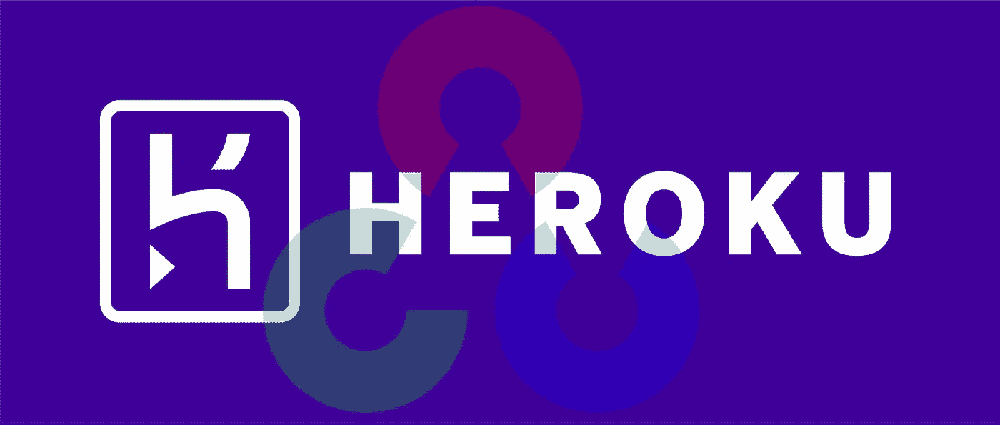

# 在 Heroku 上部署您的第一个 Opencv Flask Web 应用程序

> 原文：<https://medium.com/analytics-vidhya/deploying-your-opencv-flask-web-application-on-heroku-c23efcceb1e8?source=collection_archive---------4----------------------->

作者图片

您是否曾经想要在 web 上部署您的 opencv web 应用程序并向全世界展示它？这是你开始的好地方！

在本文中，我将带您在 Heroku 上部署 opencv web 应用程序。我们将首先使用 Flask 构建一个 MobileNet SSD 对象检测器，然后将其部署在 Heroku 上。这个项目的代码可以在[这里](https://github.com/jideilori/mobilenetssd)找到。